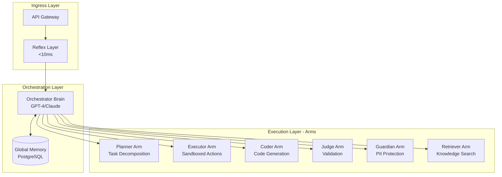

# OctoLLM

**Distributed AI Architecture for Offensive Security and Developer Tooling**

[](LICENSE)
[](https://www.python.org/)
[](https://www.rust-lang.org/)
[](infrastructure/docker-compose/)
[](docs/)
[-yellow.svg)](to-dos/MASTER-TODO.md)
[](CONTRIBUTING.md)

## What is OctoLLM?

OctoLLM is a distributed AI system inspired by octopus neurobiology, where:
- **Central Brain (Orchestrator)**: Strategic planning and coordination using frontier LLMs (GPT-4, Claude Opus)
- **Autonomous Arms (Specialists)**: Domain-specific execution with local decision-making
- **Reflex Layer**: Fast preprocessing for common patterns without LLM involvement
- **Distributed Memory**: Global semantic memory + local episodic stores per arm

### The Octopus Advantage

Biological octopuses have:
- **40M neurons in brain** → Strategic planning (Orchestrator)
- **350M neurons in arms** → Local intelligence (6 specialized arms)
- **Direct arm-to-arm communication** → Inter-component messaging without orchestrator bottleneck
- **Fast reflexes** → Preprocessing layer for common patterns (<10ms latency)

OctoLLM applies these principles to build a distributed AI system that is **more efficient, robust, and specialized** than monolithic LLM architectures.

## Architecture Overview



## Key Features

### 1. Distributed Intelligence
- **Swarm Decision-Making**: Multiple arms work in parallel for high-stakes decisions
- **Autonomous Execution**: Arms make local decisions without constant orchestrator involvement
- **Conflict Resolution**: Judge arm arbitrates disagreements between proposals

### 2. Performance Optimization
- **Reflex Cache**: 60%+ cache hit rate for common queries (<10ms latency)
- **Hierarchical Processing**: Simple tasks use cheap models, complex tasks use GPT-4
- **Cost Efficiency**: 50% cost reduction vs monolithic LLM systems

### 3. Security First
- **Capability Isolation**: Time-limited JWT tokens, sandboxed execution (gVisor)
- **PII Protection**: Multi-layer redaction (regex, NLP, embedding-based)
- **Prompt Injection Defense**: Pattern matching at reflex layer
- **Compliance Ready**: SOC 2 Type II, ISO 27001, GDPR/CCPA

### 4. Production Ready
- **Kubernetes Deployment**: Horizontal Pod Autoscaling, multi-zone HA
- **Comprehensive Monitoring**: Prometheus + Grafana + Loki + Jaeger
- **Disaster Recovery**: 15-minute RPO, 1-hour RTO with automated backups
- **Cost Optimization**: Spot instances, model selection, aggressive caching

## Project Status

**Current Phase**: Phase 0 - Project Setup & Infrastructure
**Completed Sprints**: Sprint 0.1 (Repository Setup) ✅ | Sprint 0.2 (Dev Environment) ✅
**Next Sprint**: Sprint 0.3 - CI/CD Pipeline (3 days)
**Overall Progress**: 20% (2/10 sprints in Phase 0 complete)

### Recent Updates

- **2025-11-10**: Sprint 0.2 complete - Docker development environment ready with 13 services
- **2025-11-10**: Sprint 0.1 complete - Repository structure and Git workflow established
- **2025-11-10**: Repository created with comprehensive documentation (79,485 lines across 57 files)

### Development Status by Component

| Component | Status | Implementation |
|-----------|--------|----------------|
| **Orchestrator** | 🟡 Planning | Docker ready, code pending |
| **Reflex Layer** | 🟡 Planning | Docker ready, code pending |
| **Planner Arm** | 🟡 Planning | Docker ready, code pending |
| **Executor Arm** | 🟡 Planning | Docker ready, code pending |
| **Retriever Arm** | 🟡 Planning | Docker ready, code pending |
| **Coder Arm** | 🟡 Planning | Docker ready, code pending |
| **Judge Arm** | 🟡 Planning | Docker ready, code pending |
| **Safety Guardian** | 🟡 Planning | Docker ready, code pending |
| **Infrastructure** | 🟢 Partial | Docker Compose ✅, K8s pending |
| **Documentation** | 🟢 Complete | 57 files, 79,485 lines |

**Legend**: 🟢 Complete | 🟡 In Progress | 🔴 Not Started

### Documentation Inventory

- **Architecture**: 3 files, 5,550 lines (system overview, data flow, swarm decision-making)
- **Components**: 11 files (orchestrator, reflex layer, 6 arms + 2 infrastructure)
- **Implementation**: 7 files (getting started, dev environment, custom arms, memory systems)
- **Security**: 6 files, 22,394 lines (threat model, PII protection, compliance)
- **Operations**: 9 files (deployment, monitoring, DR, scaling, troubleshooting)
- **Engineering**: 5 files, 3,360 lines (coding standards, error handling, logging)
- **API**: 3 files (component contracts, schemas, endpoints)
- **ADR**: 6 files (architecture decisions)
- **TODOs**: 12 files (MASTER-TODO + phase-specific + checklists)

## Quick Start (Development)

### Prerequisites

- Docker 24+ and Docker Compose
- Python 3.11+ (for local development)
- Rust 1.75+ (for Rust services)
- OpenAI API key (for LLM functionality)

### Start Local Environment

```bash
# Clone repository
git clone https://github.com/doublegate/OctoLLM.git
cd OctoLLM

# Configure environment
cp infrastructure/docker-compose/.env.example infrastructure/docker-compose/.env
# Edit .env and add your OPENAI_API_KEY

# Start all services
docker-compose -f infrastructure/docker-compose/docker-compose.dev.yml up -d

# Verify services are running
docker-compose -f infrastructure/docker-compose/docker-compose.dev.yml ps

# View logs
docker-compose -f infrastructure/docker-compose/docker-compose.dev.yml logs -f orchestrator
```

### Access Services

- **Orchestrator**: http://localhost:8000
- **Reflex Layer**: http://localhost:8080
- **Planner Arm**: http://localhost:8001
- **Retriever Arm**: http://localhost:8002
- **Coder Arm**: http://localhost:8003
- **Judge Arm**: http://localhost:8004
- **Safety Guardian**: http://localhost:8005
- **Executor Arm**: http://localhost:8006
- **Grafana**: http://localhost:3000
- **Prometheus**: http://localhost:9090

See [Local Development Guide](docs/development/local-setup.md) for detailed instructions.

## Use Cases

### 1. Offensive Security Operations
- **Vulnerability Assessment**: Swarm of arms analyzes code from multiple perspectives (OWASP, STRIDE, pentesting)
- **Exploit Development**: Coder arm generates exploits, Judge arm validates, Guardian ensures ethical boundaries
- **Reconnaissance**: Retriever arm aggregates OSINT from multiple sources

### 2. Developer Tooling
- **Code Review**: 4-arm swarm checks style, performance, security, test coverage
- **Documentation Generation**: Coder arm writes docs, Judge validates accuracy
- **Debugging Assistance**: Retriever finds similar issues, Planner suggests fix strategies

### 3. Research & Analysis
- **Literature Review**: Retriever arm queries arXiv, Google Scholar, GitHub
- **Comparative Analysis**: Multiple arms research alternatives, Judge synthesizes findings
- **Technical Writing**: Coder drafts content, Judge ensures accuracy

## Roadmap

### Phase 0: Project Setup & Infrastructure (20% Complete)

- ✅ **Sprint 0.1**: Repository Setup & Git Workflow (Complete - 2025-11-10)
  - Repository structure with 8 services
  - Git workflow (PR templates, CODEOWNERS, pre-commit hooks)
  - Documentation (57 files, 79,485 lines)

- ✅ **Sprint 0.2**: Development Environment Setup (Complete - 2025-11-10)
  - Docker development environment (8 Dockerfiles)
  - docker-compose.dev.yml with 13 services
  - VS Code devcontainer
  - Local setup documentation

- 🔵 **Sprint 0.3**: CI/CD Pipeline (Next - 13 hours)
  - GitHub Actions workflows (lint, test, security-scan, build)
  - Code coverage integration (Codecov)
  - Security scanning (Snyk, CodeQL)
  - Docker image builds

- 🔵 **Sprint 0.4**: Infrastructure as Code (18 hours)
  - Terraform modules (VPC, EKS, RDS, ElastiCache, S3)
  - Environment configs (dev, staging, prod)
  - Kubernetes manifests (Helm charts)

- 🔵 **Sprint 0.5**: Secrets Management (8 hours)
  - External Secrets Operator
  - AWS Secrets Manager integration
  - .env.example templates
  - Security documentation

### Phase 1: Proof of Concept (0% Complete)

- Reflex Layer implementation (Rust)
- Orchestrator core (Python)
- Planner Arm (Python)
- Executor Arm (Rust)
- Basic end-to-end workflow

### Phase 2-6: Future Development

See [MASTER-TODO.md](to-dos/MASTER-TODO.md) for complete 7-phase roadmap.

**Timeline**: 12 months estimated
**Budget**: ~$177,900 total (37 sprints, 420+ tasks)

## Technology Stack

### Core Languages

| Language | Version | Usage | Status |
|----------|---------|-------|--------|
| **Python** | 3.11+ | Orchestrator, 5 Arms | Docker ready ✅ |
| **Rust** | 1.75+ | Reflex Layer, Executor | Docker ready ✅ |

### Frameworks

| Framework | Version | Purpose | Status |
|-----------|---------|---------|--------|
| **FastAPI** | 0.109+ | Python web services | Configured ✅ |
| **Axum** | 0.7+ | Rust web services | Configured ✅ |

### Databases

| Database | Version | Purpose | Status |
|----------|---------|---------|--------|
| **PostgreSQL** | 15+ | Global memory | Docker ready ✅ |
| **Redis** | 7+ | Caching | Docker ready ✅ |
| **Qdrant** | 1.7+ | Vector store | Docker ready ✅ |

### Infrastructure

| Tool | Version | Purpose | Status |
|------|---------|---------|--------|
| **Docker** | 24+ | Containerization | ✅ Complete |
| **Docker Compose** | 2.0+ | Dev orchestration | ✅ Complete |
| **Kubernetes** | 1.28+ | Production orchestration | Planned |
| **Terraform** | 1.6+ | IaC | Planned |

### Development Tools

| Tool | Purpose | Status |
|------|---------|--------|
| **Poetry** | Python dependency management | ✅ Configured |
| **Cargo** | Rust build system | ✅ Configured |
| **Pre-commit** | Quality gates (15+ hooks) | ✅ Complete |
| **VS Code Devcontainer** | Unified dev environment | ✅ Complete |

### Monitoring (Planned)

| Tool | Purpose | Status |
|------|---------|--------|
| **Prometheus** | Metrics collection | Docker ready ✅ |
| **Grafana** | Visualization | Docker ready ✅ |
| **Loki** | Log aggregation | Planned |
| **Jaeger** | Distributed tracing | Planned |

## Performance Targets

| Metric | Target | Measurement |
|--------|--------|-------------|
| Reflex Cache Hit Rate | > 60% | `octollm_cache_hits_total / octollm_tasks_total` |
| P50 Latency | < 2s | `histogram_quantile(0.5, octollm_task_duration_seconds)` |
| P95 Latency | < 10s | `histogram_quantile(0.95, octollm_task_duration_seconds)` |
| P99 Latency | < 30s | `histogram_quantile(0.99, octollm_task_duration_seconds)` |
| Task Success Rate | > 95% | `octollm_tasks_total{status="success"} / octollm_tasks_total` |
| Cost per Task | < 50% baseline | Token usage metrics vs monolithic LLM |
| PII Leakage Rate | < 0.1% | Manual evaluation + automated scanning |

## Documentation

### For Developers
- [Getting Started](./docs/implementation/getting-started.md) - 15-minute quick-start
- [Development Environment](./docs/implementation/dev-environment.md) - Docker Compose setup
- [Custom Arms Guide](./docs/implementation/custom-arms.md) - Build your own specialized arms
- [Testing Guide](./docs/implementation/testing-guide.md) - Unit, integration, E2E testing
- [Debugging Guide](./docs/implementation/debugging.md) - Troubleshooting playbooks

### For Architects
- [System Overview](./docs/architecture/system-overview.md) - High-level architecture
- [Data Flow](./docs/architecture/data-flow.md) - Request processing pipeline
- [Swarm Decision-Making](./docs/architecture/swarm-decision-making.md) - Multi-arm consensus
- [ADRs](./docs/adr/) - Architecture Decision Records

### For Operators
- [Deployment Guide](./docs/operations/deployment-guide.md) - Docker Compose + Kubernetes
- [Monitoring & Alerting](./docs/operations/monitoring-alerting.md) - Prometheus + Grafana
- [Disaster Recovery](./docs/operations/disaster-recovery.md) - Backup and restore
- [Performance Tuning](./docs/operations/performance-tuning.md) - Optimization strategies
- [Scaling Guide](./docs/operations/scaling.md) - HPA, VPA, cluster autoscaling

### For Security Teams
- [Security Overview](./docs/security/overview.md) - Defense in depth
- [Threat Model](./docs/security/threat-model.md) - STRIDE analysis (5,106 lines)
- [PII Protection](./docs/security/pii-protection.md) - GDPR/CCPA compliance
- [Security Testing](./docs/security/security-testing.md) - SAST, DAST, penetration testing
- [Compliance](./docs/security/compliance.md) - SOC 2, ISO 27001, HIPAA

### For Project Managers
- [Master TODO](./to-dos/MASTER-TODO.md) - Complete 7-phase roadmap (420+ tasks)
- [Phase 0 TODO](./to-dos/PHASE-0-PROJECT-SETUP.md) - Project setup (45 tasks, 2 weeks)
- [Status & Progress](./to-dos/status/README.md) - Sprint reports and tracking
- [Pre-Phase 0 Readiness Report](./to-dos/status/PRE-PHASE-0-READINESS-REPORT.md) - Documentation audit

## Contributing

We welcome contributions! Please see:
- [CONTRIBUTING.md](./CONTRIBUTING.md) - Contribution guidelines
- [CODE_OF_CONDUCT.md](./CODE_OF_CONDUCT.md) - Community standards
- [SECURITY.md](./SECURITY.md) - Vulnerability disclosure policy

### Development Workflow
1. Fork the repository
2. Create a feature branch (`git checkout -b feature/amazing-feature`)
3. Make your changes (follow [coding standards](./docs/engineering/coding-standards.md))
4. Write tests (target: 85%+ coverage)
5. Run linters and tests locally
6. Commit with conventional commits (`feat:`, `fix:`, `docs:`, `test:`)
7. Push to your fork
8. Open a Pull Request

## Security

### Reporting Vulnerabilities
**DO NOT** open public issues for security vulnerabilities.

Please report security issues to: **security@octollm.org**

We will acknowledge your email within 24 hours and provide a fix timeline within 7 days. We practice coordinated disclosure with a 90-day embargo.

See [SECURITY.md](./SECURITY.md) for full policy.

## License

This project is licensed under the **Apache License 2.0** - see the [LICENSE](./LICENSE) file for details.

### Why Apache 2.0?
- Permissive open-source license
- Patent protection for contributors and users
- Compatible with commercial use
- Requires preservation of copyright and license notices

## Acknowledgments

### Biological Inspiration
- **Octopus vulgaris** research on distributed nervous systems
- Neuroscience studies on autonomous arm control
- Swarm intelligence and consensus algorithms

### Technology Inspiration
- **LangChain** / **LlamaIndex** for LLM orchestration patterns
- **Ray** for distributed Python execution
- **Kubernetes** for container orchestration
- **Prometheus** ecosystem for observability

### Open Source Projects
- OpenAI, Anthropic for LLM APIs
- PostgreSQL, Redis, Qdrant for data persistence
- FastAPI, Axum for web frameworks
- Docker, Kubernetes for deployment

## Contact

- **Project Lead**: TBD
- **Security**: security@octollm.org
- **General Inquiries**: hello@octollm.org
- **GitHub Issues**: [github.com/doublegate/OctoLLM/issues](https://github.com/doublegate/OctoLLM/issues)

## Contributing

We welcome contributions! See [CONTRIBUTING.md](CONTRIBUTING.md) for detailed guidelines.

### Quick Contribution Guide

1. **Fork** the repository
2. **Create** a feature branch (`git checkout -b feature/amazing-feature`)
3. **Develop** with pre-commit hooks enabled (`pre-commit install`)
4. **Test** thoroughly (85% Python coverage, 80% Rust coverage)
5. **Commit** using Conventional Commits format
6. **Push** to your fork
7. **Open** a Pull Request

### Development Setup

```bash
# Install pre-commit hooks
poetry install
pre-commit install

# Run pre-commit checks manually
pre-commit run --all-files

# Run tests
poetry run pytest tests/ -v --cov
cargo test --all
```

### Code Standards

- **Python**: Black (formatting), Ruff (linting), mypy (type checking)
- **Rust**: rustfmt (formatting), clippy (linting)
- **Commits**: Conventional Commits format (`feat:`, `fix:`, `docs:`, etc.)
- **Coverage**: 85% Python, 80% Rust minimum

---

**Last Updated**: 2025-11-10
**Document Version**: 1.1
**Next Review**: After Phase 0 completion

---

*Built with ❤️ and inspired by the intelligence of cephalopods*
