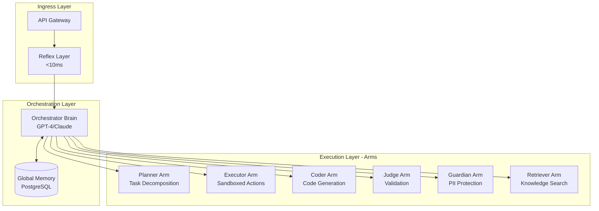

# OctoLLM

**Distributed AI Architecture for Offensive Security and Developer Tooling**


## What is OctoLLM?

OctoLLM is a distributed AI system inspired by octopus neurobiology, where:
- **Central Brain (Orchestrator)**: Strategic planning and coordination using frontier LLMs (GPT-4, Claude Opus)
- **Autonomous Arms (Specialists)**: Domain-specific execution with local decision-making
- **Reflex Layer**: Fast preprocessing for common patterns without LLM involvement
- **Distributed Memory**: Global semantic memory + local episodic stores per arm

### The Octopus Advantage

Biological octopuses have:
- **40M neurons in brain** → Strategic planning (Orchestrator)
- **350M neurons in arms** → Local intelligence (6 specialized arms)
- **Direct arm-to-arm communication** → Inter-component messaging without orchestrator bottleneck
- **Fast reflexes** → Preprocessing layer for common patterns (<10ms latency)

OctoLLM applies these principles to build a distributed AI system that is **more efficient, robust, and specialized** than monolithic LLM architectures.

## Architecture Overview



## Key Features

### 1. Distributed Intelligence
- **Swarm Decision-Making**: Multiple arms work in parallel for high-stakes decisions
- **Autonomous Execution**: Arms make local decisions without constant orchestrator involvement
- **Conflict Resolution**: Judge arm arbitrates disagreements between proposals

### 2. Performance Optimization
- **Reflex Cache**: 60%+ cache hit rate for common queries (<10ms latency)
- **Hierarchical Processing**: Simple tasks use cheap models, complex tasks use GPT-4
- **Cost Efficiency**: 50% cost reduction vs monolithic LLM systems

### 3. Security First
- **Capability Isolation**: Time-limited JWT tokens, sandboxed execution (gVisor)
- **PII Protection**: Multi-layer redaction (regex, NLP, embedding-based)
- **Prompt Injection Defense**: Pattern matching at reflex layer
- **Compliance Ready**: SOC 2 Type II, ISO 27001, GDPR/CCPA

### 4. Production Ready
- **Kubernetes Deployment**: Horizontal Pod Autoscaling, multi-zone HA
- **Comprehensive Monitoring**: Prometheus + Grafana + Loki + Jaeger
- **Disaster Recovery**: 15-minute RPO, 1-hour RTO with automated backups
- **Cost Optimization**: Spot instances, model selection, aggressive caching

## Current Status

**Project Phase**: Pre-Implementation (Documentation Complete)
**Documentation**: 56 files, ~77,300 lines
**Next Milestone**: Phase 0 - Project Setup & Infrastructure (1-2 weeks)

### Documentation Inventory

- **Architecture**: 3 files, 5,550 lines (system overview, data flow, swarm decision-making)
- **Components**: 2 files, 2,074 lines (orchestrator, reflex layer)
- **Implementation**: 8 files, 12,469 lines (getting started, dev environment, custom arms)
- **Security**: 6 files, 22,394 lines (threat model, PII protection, compliance)
- **Operations**: 8 files, 16,991 lines (deployment, monitoring, DR, scaling)
- **Engineering**: 5 files, 3,360 lines (coding standards, error handling, logging)
- **Testing**: 1 file, 1,683 lines (unit, integration, E2E, performance, security)
- **API**: 1 file, 3,028 lines (component contracts, OpenAPI specs)
- **TODOs**: 18 files (MASTER-TODO + phase-specific + checklists)

## Quick Start (Post-Phase 1)

*Note: OctoLLM is currently in pre-implementation. This quick-start will be available after Phase 1 (POC) completion.*

```bash
# Clone repository
git clone https://github.com/doublegate/OctoLLM.git
cd OctoLLM

# Start all services with Docker Compose
docker-compose up -d

# Verify all services are healthy
docker-compose ps

# Access the system
curl http://localhost:8080/health
```

See [`docs/guides/quickstart.md`](./docs/guides/quickstart.md) for detailed setup instructions.

## Use Cases

### 1. Offensive Security Operations
- **Vulnerability Assessment**: Swarm of arms analyzes code from multiple perspectives (OWASP, STRIDE, pentesting)
- **Exploit Development**: Coder arm generates exploits, Judge arm validates, Guardian ensures ethical boundaries
- **Reconnaissance**: Retriever arm aggregates OSINT from multiple sources

### 2. Developer Tooling
- **Code Review**: 4-arm swarm checks style, performance, security, test coverage
- **Documentation Generation**: Coder arm writes docs, Judge validates accuracy
- **Debugging Assistance**: Retriever finds similar issues, Planner suggests fix strategies

### 3. Research & Analysis
- **Literature Review**: Retriever arm queries arXiv, Google Scholar, GitHub
- **Comparative Analysis**: Multiple arms research alternatives, Judge synthesizes findings
- **Technical Writing**: Coder drafts content, Judge ensures accuracy

## Project Roadmap

| Phase | Duration | Focus | Status |
|-------|----------|-------|--------|
| **Phase 0** | 1-2 weeks | Project Setup & Infrastructure | 🔄 Ready to Start |
| **Phase 1** | 4-6 weeks | Proof of Concept (Reflex + Orchestrator + 2 Arms) | ⏳ Planned |
| **Phase 2** | 8-10 weeks | Core Capabilities (All 6 Arms + Swarm) | ⏳ Planned |
| **Phase 3** | 4-6 weeks | Operations & Deployment (Monitoring, DR) | ⏳ Planned |
| **Phase 4** | 3-4 weeks | Engineering & Standards (Parallel w/ Phase 3) | ⏳ Planned |
| **Phase 5** | 6-8 weeks | Security Hardening (SOC 2, ISO 27001) | ⏳ Planned |
| **Phase 6** | 6-8 weeks | Production Optimization (Autoscaling, Compliance) | ⏳ Planned |

**Total Timeline**: 7-10 months (36-48 weeks)
**Estimated Cost**: $177,900 (labor + infrastructure)

## Technology Stack

| Layer | Technologies |
|-------|-------------|
| **Languages** | Python 3.11+ (orchestrator, most arms), Rust 1.75+ (reflex layer, executor arm) |
| **Web Frameworks** | FastAPI (Python), Axum (Rust) |
| **Databases** | PostgreSQL 15+ (global memory), Redis 7+ (cache), Qdrant 1.7+ (vector DB) |
| **LLM Providers** | OpenAI (GPT-4, GPT-3.5-turbo), Anthropic (Claude 3 Opus, Sonnet) |
| **Orchestration** | Kubernetes 1.27+ (production), Docker Compose (development) |
| **Monitoring** | Prometheus, Grafana, Loki (logs), Jaeger (tracing) |
| **IaC** | Terraform (AWS primary, multi-cloud support) |
| **CI/CD** | GitHub Actions |
| **Package Managers** | Poetry (Python), Cargo (Rust) |

## Performance Targets

| Metric | Target | Measurement |
|--------|--------|-------------|
| Reflex Cache Hit Rate | > 60% | `octollm_cache_hits_total / octollm_tasks_total` |
| P50 Latency | < 2s | `histogram_quantile(0.5, octollm_task_duration_seconds)` |
| P95 Latency | < 10s | `histogram_quantile(0.95, octollm_task_duration_seconds)` |
| P99 Latency | < 30s | `histogram_quantile(0.99, octollm_task_duration_seconds)` |
| Task Success Rate | > 95% | `octollm_tasks_total{status="success"} / octollm_tasks_total` |
| Cost per Task | < 50% baseline | Token usage metrics vs monolithic LLM |
| PII Leakage Rate | < 0.1% | Manual evaluation + automated scanning |

## Documentation

### For Developers
- [Getting Started](./docs/implementation/getting-started.md) - 15-minute quick-start
- [Development Environment](./docs/implementation/dev-environment.md) - Docker Compose setup
- [Custom Arms Guide](./docs/implementation/custom-arms.md) - Build your own specialized arms
- [Testing Guide](./docs/implementation/testing-guide.md) - Unit, integration, E2E testing
- [Debugging Guide](./docs/implementation/debugging.md) - Troubleshooting playbooks

### For Architects
- [System Overview](./docs/architecture/system-overview.md) - High-level architecture
- [Data Flow](./docs/architecture/data-flow.md) - Request processing pipeline
- [Swarm Decision-Making](./docs/architecture/swarm-decision-making.md) - Multi-arm consensus
- [ADRs](./docs/adr/) - Architecture Decision Records

### For Operators
- [Deployment Guide](./docs/operations/deployment-guide.md) - Docker Compose + Kubernetes
- [Monitoring & Alerting](./docs/operations/monitoring-alerting.md) - Prometheus + Grafana
- [Disaster Recovery](./docs/operations/disaster-recovery.md) - Backup and restore
- [Performance Tuning](./docs/operations/performance-tuning.md) - Optimization strategies
- [Scaling Guide](./docs/operations/scaling.md) - HPA, VPA, cluster autoscaling

### For Security Teams
- [Security Overview](./docs/security/overview.md) - Defense in depth
- [Threat Model](./docs/security/threat-model.md) - STRIDE analysis (5,106 lines)
- [PII Protection](./docs/security/pii-protection.md) - GDPR/CCPA compliance
- [Security Testing](./docs/security/security-testing.md) - SAST, DAST, penetration testing
- [Compliance](./docs/security/compliance.md) - SOC 2, ISO 27001, HIPAA

### For Project Managers
- [Master TODO](./to-dos/MASTER-TODO.md) - Complete 7-phase roadmap (420+ tasks)
- [Phase 0 TODO](./to-dos/PHASE-0-PROJECT-SETUP.md) - Project setup (45 tasks, 2 weeks)
- [Status & Progress](./to-dos/status/README.md) - Sprint reports and tracking
- [Pre-Phase 0 Readiness Report](./to-dos/status/PRE-PHASE-0-READINESS-REPORT.md) - Documentation audit

## Contributing

We welcome contributions! Please see:
- [CONTRIBUTING.md](./CONTRIBUTING.md) - Contribution guidelines
- [CODE_OF_CONDUCT.md](./CODE_OF_CONDUCT.md) - Community standards
- [SECURITY.md](./SECURITY.md) - Vulnerability disclosure policy

### Development Workflow
1. Fork the repository
2. Create a feature branch (`git checkout -b feature/amazing-feature`)
3. Make your changes (follow [coding standards](./docs/engineering/coding-standards.md))
4. Write tests (target: 85%+ coverage)
5. Run linters and tests locally
6. Commit with conventional commits (`feat:`, `fix:`, `docs:`, `test:`)
7. Push to your fork
8. Open a Pull Request

## Security

### Reporting Vulnerabilities
**DO NOT** open public issues for security vulnerabilities.

Please report security issues to: **security@octollm.org**

We will acknowledge your email within 24 hours and provide a fix timeline within 7 days. We practice coordinated disclosure with a 90-day embargo.

See [SECURITY.md](./SECURITY.md) for full policy.

## License

This project is licensed under the **Apache License 2.0** - see the [LICENSE](./LICENSE) file for details.

### Why Apache 2.0?
- Permissive open-source license
- Patent protection for contributors and users
- Compatible with commercial use
- Requires preservation of copyright and license notices

## Acknowledgments

### Biological Inspiration
- **Octopus vulgaris** research on distributed nervous systems
- Neuroscience studies on autonomous arm control
- Swarm intelligence and consensus algorithms

### Technology Inspiration
- **LangChain** / **LlamaIndex** for LLM orchestration patterns
- **Ray** for distributed Python execution
- **Kubernetes** for container orchestration
- **Prometheus** ecosystem for observability

### Open Source Projects
- OpenAI, Anthropic for LLM APIs
- PostgreSQL, Redis, Qdrant for data persistence
- FastAPI, Axum for web frameworks
- Docker, Kubernetes for deployment

## Contact

- **Project Lead**: TBD
- **Security**: security@octollm.org
- **General Inquiries**: hello@octollm.org
- **GitHub Issues**: [github.com/doublegate/OctoLLM/issues](https://github.com/doublegate/OctoLLM/issues)

## Project Status Dashboard

| Metric | Value |
|--------|-------|
| **Phase** | 0 (Pre-Implementation) |
| **Overall Progress** | 0% (Documentation Complete: 100%) |
| **Documentation** | 56 files, 77,300 lines ✅ |
| **Code** | 0 lines (Phase 1 starts implementation) |
| **Tests** | 0 (Target: 85% coverage for Phase 1) |
| **Contributors** | TBD (Pre-launch) |
| **Stars** | TBD (Repository just created) |
| **Forks** | TBD |
| **Open Issues** | TBD |

---

**Last Updated**: 2025-11-10
**Document Version**: 1.0
**Next Review**: After Phase 0 completion

---

*Built with ❤️ and inspired by the intelligence of cephalopods*
