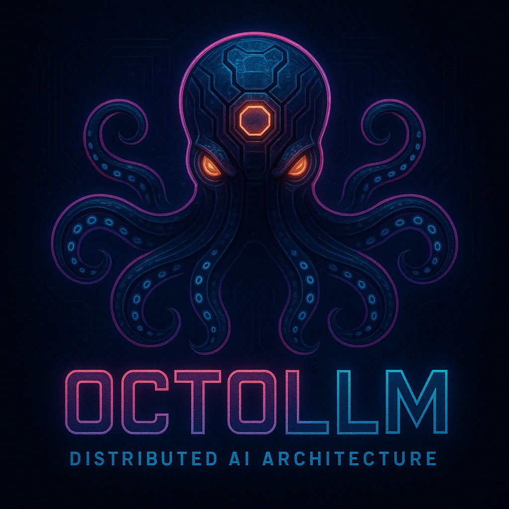
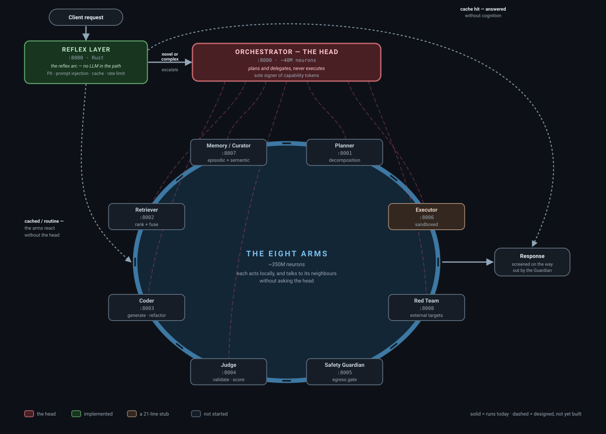

# OctoLLM

**Distributed AI Architecture for Offensive Security and Developer Tooling**

Inspired by the octopus's distributed nervous system, OctoLLM reimagines AI architecture through biological intelligence principles, achieving superior cost efficiency, security, and flexibility compared to monolithic LLM systems.

<p align="center">
  
</p>

[](LICENSE)
[](https://github.com/doublegate/OctoLLM/actions/workflows/ci.yml)
[](https://github.com/doublegate/OctoLLM/actions/workflows/security.yml)
[](https://codecov.io/gh/doublegate/OctoLLM)
[](https://www.python.org/)
[](https://www.rust-lang.org/)
[](CHANGELOG.md)

## What is OctoLLM?

OctoLLM is a distributed AI system inspired by octopus neurobiology, where:
- **Central Brain (Orchestrator)**: Strategic planning and coordination using frontier LLMs (GPT-4, Claude Opus)
- **Autonomous Arms (Specialists)**: Domain-specific execution with local decision-making
- **Reflex Layer**: Fast preprocessing for common patterns without LLM involvement
- **Distributed Memory**: Global semantic memory + local episodic stores per arm

### The Octopus Advantage

Biological octopuses have:
- **40M neurons in brain** → Strategic planning (Orchestrator)
- **350M neurons in arms** → Local intelligence (eight specialized arms)
- **Direct arm-to-arm communication** → Inter-component messaging without orchestrator bottleneck
- **Fast reflexes** → Preprocessing layer for common patterns (<10ms latency)

OctoLLM applies these principles to build a distributed AI system that is **more efficient, robust, and specialized** than monolithic LLM architectures.

## Architecture Overview

<p align="center">
  <picture>
    <source media="(prefers-color-scheme: light)" srcset="docs/images/architecture-light.svg">
    
  </picture>
</p>

<sub>Seven of the eight arms do not exist yet, and the diagram says so rather than drawing
an aspiration. **Solid** edges run today; **dashed** ones are designed and not yet built.
The ring the arms sit on is one continuous ellipse, not eight connectors — an arm reaches
its neighbour along it without the head being in the path.</sub>

<sub>*Drawn by `scripts/render_architecture.py`, not by hand — `make diagram` regenerates
both themes and CI fails if the committed SVGs are stale. It is not a Mermaid block because
Mermaid cannot place nodes on a circle: radial layout has been an open request since 2019,
its dagre engine routes every edge independently so a "ring" comes out as eight unrelated
splines, and the ELK engine that would fix it is not bundled in GitHub's Markdown renderer.*</sub>

### The reflex arc: it should not take the whole head to make an arm react

A biological reflex does not route through the brain. A stimulus reaches a ganglion and
the limb responds; the brain finds out afterwards, if at all. That is the entire reason
a reflex is fast.

So the reflex layer is not merely a filter in front of the orchestrator — it is a
**decision point with three exits**:

| Exit | When | Cost |
|---|---|---|
| **Answer directly** | the request is a cache hit | microseconds, no cognition |
| **Straight to an arm** | routine and already understood — the arms react without the head | no planning, no frontier model |
| **Escalate to the head** | novel or complex | the expensive path, used deliberately |

> **Only the third exit exists today.** The implemented `POST /process` returns a
> *screening verdict* — `pii_detected`, `injection_matches`, a sanitised string — and
> never an answer, so its cache stores detection results rather than responses. A "cache
> hit" currently saves a few milliseconds of regex and nothing else, which means the
> charter's **">60% reflex cache hit rate"** target has no cost meaning yet: every
> request still pays for the head. The two bypass paths above are drawn dotted because
> they are design intent, not current behaviour. Closing that gap is tracked as a
> finding against the execution-engine work.

### Why the arms are a ring and not a fan

A biological octopus carries roughly **40M neurons in its brain and 350M in its arms**,
and those arms act — and coordinate with one another — without waiting on the brain. A
hub-and-spoke design where every exchange passes through a central orchestrator throws
that away and reintroduces the bottleneck the biology solved.

So the eight arms are joined in a **ring**: an arm calls its neighbour directly, over
Redis Streams for broadcast artifacts and capability-token-gated HTTP for tight pairs.
The adjacencies in the diagram are the real ones from the design — **Coder to Judge** is
the validation loop and the thick edge, Retriever feeds Coder, Memory is the Retriever's
corpus, Planner drives the Executor, Red Team delegates its probing to the Executor's
sandbox rather than opening sockets of its own, and its tool output goes to the Safety
Guardian before any of it reaches a model again.

The brain still governs, and the governance is what makes direct calls safe rather than
anarchic:

- it is the **sole signing authority** for capability tokens — no arm mints its own;
- an arm can only be issued a token for an **edge that already appears in the declared
  topology**, so an undeclared peer call is unreachable rather than merely discouraged;
- tokens are scoped to one task, expire in minutes, and their call budget is counted
  **server-side by the callee**, so the bound holds without the caller's cooperation;
- every artifact carries provenance back to the task that produced it.

What the brain is *not* is a hop in the middle of a Coder-to-Judge revision loop.

### Two gates, facing opposite directions

The reflex layer and the Safety Guardian are often mistaken for duplicates. They are
split by **traffic direction**, which is why both exist:

| | Reflex layer (:8080) | Safety Guardian (:8005) |
|---|---|---|
| Direction | **Ingress** — untrusted input arriving | **Egress** — output leaving |
| Sees | the raw client request | arm output, synthesized answers, generated code |
| Budget | sub-10ms, cached, no LLM | may call a model; owns the policy engine |
| On failure | rejects the request | **fails closed** |

The reflex layer never sees an arm's output; the Guardian never sees the raw request.
The Guardian delegates PII detection back to the reflex layer rather than shipping a
second regex corpus that would drift from the first.

### Where state lives

| Store | Holds | Owner |
|---|---|---|
| **PostgreSQL** | global semantic memory, task rows, execution checkpoints | Orchestrator + Memory arm |
| **Qdrant** | per-arm episodic vectors | Memory arm (nothing reads or writes it today) |
| **Redis** | reflex cache, rate-limit buckets, and the ring's streams | Reflex layer + every arm |

The ring is deliberately **advisory**: losing Redis degrades observability and memory,
never correctness. A Memory outage must never fail a task, and there is a test asserting
exactly that.

The ring itself lands in Stage 5 — **before any arm is built**, because retrofitting
seven arms onto a ring they were not designed for is strictly worse than building on it
from the start. See [Current Status](#current-status) for what exists today, arm by arm.

## Key Features

> **Design goals, not measured results.** Nothing in this section is benchmarked yet.
> The evaluation harness that will produce real numbers lands in Stage 10 of the
> [v1.0.0 plan](#roadmap); until then every figure below is a target. See
> [Performance Targets](#performance-targets).

### 1. Distributed Intelligence

- **Direct arm-to-arm communication**: peer calls that bypass the orchestrator, so the
  brain is not a bottleneck for tight loops such as Coder to Judge
- **Swarm decision-making**: multiple arms work in parallel for high-stakes decisions
- **Conflict resolution**: the Judge arm arbitrates disagreements between proposals

### 2. Hierarchical Processing

- **Reflex layer**: pattern matching, PII detection and rate limiting without ever
  reaching a language model
- **Cheap models for simple work**, frontier models reserved for genuinely hard problems
- **Pluggable LLM provider**: Ollama by default for local development, OpenAI and
  Anthropic opt-in, and a deterministic fake provider so the stack and its tests run
  with **no API keys at all**

### 3. Security by Construction

- **Capability isolation**: short-lived, per-arm, per-task JWT capability tokens
- **Sandboxed execution**: the executor arm runs each task in a hardened, ephemeral
  container (all capabilities dropped, read-only root, no network by default, custom
  seccomp profile, argv-only allowlist with no shell anywhere in the path)
- **Ingress and egress are separate gates**: the reflex layer screens untrusted input;
  the Safety Guardian arm screens arm output, generated code and synthesized answers
- **Prompt-injection defence** at the reflex layer, with the Red Team arm's tool output
  routed back through the Guardian because a probed target's own HTTP response is
  attacker-controlled text

## Current Status

**Version 0.5.0.** This is pre-release software under active development toward v1.0.0.
No version of OctoLLM has been tagged, published to PyPI or npm, or released as a
container image.

Work is tracked by a twelve-stage plan whose single rule is that every claim in this
repository is either made true or deleted. Four stages are complete.

### What actually runs

| Component | State | Detail |
|---|---|---|
| **Reflex layer** (Rust, port 8080) | Implemented | ~8,500 lines; PII detection, prompt-injection detection, Redis cache, token-bucket rate limiting. 241 tests. |
| **Orchestrator** (Python, port 8000) | Partial | FastAPI app, SQLAlchemy 2.0 models, reflex client with circuit breaker, arm registry (`GET /arms`). 197 tests, 93% coverage. **It does not yet call any arm** — `POST /submit` validates, screens and persists; tasks stay `pending`. The execution engine lands in Stage 7. |
| **Shared arm framework** (`octollm_common`) | Implemented | App factory, error envelope, contract models, arm roster, LLM providers. 103 tests, 95% coverage. Imported by all eight arms and the orchestrator. |
| **Python SDK** | Implemented | 8 service clients, 28 tests. Unpublished. |
| **TypeScript SDK** | Implemented | 8 service clients, 28 tests. Unpublished. |
| **Executor arm** (Rust, port 8006) | Stub | 21 lines. Sandbox lands in Stage 9. |
| **Planner / Retriever / Coder / Judge / Safety Guardian** (8001-8005) | Scaffolded | Built on the shared framework: each serves `/health`, `/ready`, `/capabilities` and `/metrics`, and answers its own endpoint with **501 naming Stage 8** — never a plausible fake. |
| **Memory / Curator** (8007) | Not started | Stage 6 — it is the Retriever's corpus, so it lands first. |
| **Red Team** (8008) | Not started | Stage 11, flag-gated off and outside the default compose profile. |
| **PostgreSQL / Redis / Qdrant** | Running | Qdrant is in the compose stack but nothing reads or writes it yet. |

### Stage progress

| Stage | Delivered |
|---|---|
| **0. CI that can fail** | Complete — `lint.yml` and `test.yml` replaced by `ci.yml`; blocking jobs behind one `ci-gate`, which is the required check on `main`. Previously every test step was `\|\| echo "No tests found yet"` *and* `continue-on-error: true`, so 446 existing tests were never run by CI. |
| **1. Makefile and VERSION** | Complete — `README` had documented `make lint` / `make test` / `make help` since Phase 0 with no Makefile. Every check is now a make target and **CI invokes those targets**. `VERSION` is propagated to 24 sites by `make version-check`; those sites previously held six different answers at once. |
| **2. Secret scanning that works** | Complete — `.gitleaks.toml` was discarding all ~170 built-in rules (a `[[rules]]` block without `[extend] useDefault = true`) and exempting every markdown file, all of `docs/`, `tests/`, workflows and infra scripts. `scripts/gitleaks-selftest.sh` plants four secrets in four formerly-exempt locations and proves both that this config finds them and that the old one did not. |
| **3. The stack runs** | Complete — `make up` brings all eleven services to **healthy** and `make smoke` round-trips a task. `POST /process` had returned 500 on every request for the life of the service; all 23 compose variables were silently ignored; the reflex client could not parse a single real response; five arm images crash-looped; every arm's spec named its neighbour's port. |
| **4. The shared arm framework** | Complete — one app factory, one error envelope, one set of contract models, one arm roster and one LLM provider boundary, imported by all eight arms and the orchestrator. `FakeProvider` makes every later test deterministic, and `make sdk-parity-check` found four SDK calls that could never have worked and sixteen clients defaulting to the wrong port. |
| **5-12** | Planned. See [Roadmap](#roadmap). |

### Test suites

| Suite | Tests | Run by CI |
|---|---|---|
| Rust workspace | 241 | yes |
| Rust, Redis-backed | 18 | yes — 17 of these were `#[ignore]`d and had never executed anywhere |
| Shared arm framework | 103 | yes, coverage floored at 90% |
| Orchestrator | 186 | yes, coverage floored at 85% |
| Python SDK | 28 | yes |
| TypeScript SDK | 28 | yes |

Every suite asserts a collection floor, because a suite that silently collects zero
tests produces exactly the same green check as one that ran them all.

### Repository inventory

332 tracked markdown files (~277,000 lines), 8 OpenAPI specifications, 8 ADRs, 7 Grafana
dashboards, 84 Prometheus alert rules, and a 13-service development compose stack.

Much of that documentation was written ahead of the code and still describes intentions
as if they were facts. Correcting it is Stage 12; where a document is known to be wrong
it now carries a correction banner rather than being silently left in place.

## CI/CD Pipeline

`ci.yml` is the only blocking gate. **`CI gate` is the sole required status check on
`main`** — it aggregates eleven jobs, and `scripts/ci/check_gate_complete.py` fails the
build if a job is ever added without being wired into it, since an unwired job can fail
while the gate goes green.

| Job | Covers |
|---|---|
| `lint-python` | ruff, black |
| `typecheck-python` | mypy, against real installed dependencies |
| `lint-rust` | `cargo fmt` and `clippy -D warnings`, whole workspace |
| `lint-typescript` | eslint, tsc |
| `lint-config` | yamllint, OpenAPI validity, shellcheck, actionlint, `version-check` |
| `secrets` | gitleaks over full history, plus the scanner self-test |
| `test-rust` | 241 workspace tests + 18 Redis-backed |
| `test-shared` | 103 tests, coverage floored at 90%; provider SDKs deliberately absent |
| `test-orchestrator` | 197 tests, coverage floored at 85% |
| `test-sdk-python` | 28 tests |
| `test-sdk-typescript` | 28 tests |

Three properties are enforced rather than documented: **no step is `continue-on-error`
and none swallows a failure**; **every suite asserts a collection floor**; and **every
CI job invokes a `make` target** rather than its own copy of the commands, so a local
pass and a CI pass mean the same thing by construction.

Other workflows: `security.yml` (bandit, Snyk, cargo-audit — advisory), `mdbook.yml`
(documentation site), and `build.yml` (container images, gated off by the
`ENABLE_IMAGE_PUBLISH` repository variable). CodeQL runs through GitHub's default setup
across Python, TypeScript, Actions and Rust.

**Image builds are deliberately outside the gate.** They build and run today —
`make up` brings all eleven services to healthy — but publishing them is gated on the
`ENABLE_IMAGE_PUBLISH` repository variable until there is a release to publish. They
join `ci-gate` in Stage 12, with the release pipeline.

## Quick Start (Development)

### Prerequisites

**Required**:
- Docker 24.0+ and Docker Compose 2.20+
- Git
- Text editor (VS Code recommended)

**Optional** (for local development without Docker):
- Python 3.14 (for Python services; `>=3.14,<3.15`)
- Rust 1.91.1+ (for Rust services)
- OpenAI API key (for LLM functionality in Phase 1+)

### Setup

```bash
# Clone repository
git clone https://github.com/doublegate/OctoLLM.git
cd OctoLLM

# Install both Python packages (editable) and the TypeScript SDK
make install

# Install pre-commit hooks (recommended)
python -m pip install pre-commit
pre-commit install

# Lint everything: ruff, black, clippy, rustfmt, eslint, tsc, yamllint,
# OpenAPI validity, shellcheck, actionlint
make lint

# Run every suite: 241 Rust, 103 shared, 197 orchestrator, 28 Python SDK, 28 TypeScript SDK
make test

# Everything CI runs, in one command
make verify

# View all available commands
make help
```

`make verify` is the same set of checks the `ci-gate` check runs, invoked through the
same targets — CI calls these targets rather than keeping its own copy of the commands,
so a local pass and a CI pass mean the same thing by construction.

The one suite `make verify` leaves out needs a running Redis:

```bash
make redis && make test-rust-redis && make redis-stop
```

### Development Environment

```bash
make up      # build and start everything; waits for every service to be HEALTHY
make ps      # each service and its health
make smoke   # assert the stack works and a task round-trips
make logs    # follow every service
make down    # stop and remove volumes
```

All eleven services reach a healthy state, and a task round-trips: submitted through
the orchestrator, screened by the reflex layer, persisted, and read back by id. It
**stays `pending`** — the orchestrator does not call an arm yet, and `make smoke`
asserts `pending` on purpose rather than pretending otherwise. Stage 7's execution
engine is what makes `completed` reachable, and that assertion changes with it.

The stack needs **no API keys**. Every published host port is overridable if one is
taken on your machine — `REFLEX_PORT=18080 make up`.

### Service Access

**OctoLLM services** (host port -> container port):

| Service | URL | State |
|---|---|---|
| Orchestrator | http://localhost:8000 | partial |
| Reflex Layer | http://localhost:8080 | implemented |
| Planner Arm | http://localhost:8001 | scaffolded; `POST /plan` returns 501 (Stage 8) |
| Retriever Arm | http://localhost:8002 | scaffolded; `POST /search` returns 501 (Stage 8) |
| Coder Arm | http://localhost:8003 | scaffolded; `POST /code` returns 501 (Stage 8) |
| Judge Arm | http://localhost:8004 | scaffolded; `POST /validate` returns 501 (Stage 8) |
| Safety Guardian Arm | http://localhost:8005 | scaffolded; `POST /check` returns 501 (Stage 8) |
| Executor Arm | http://localhost:18006 (container 8006) | stub; sandbox lands in Stage 9 |
| Memory / Curator Arm | 8007 | not in compose yet (Stage 6) |
| Red Team Arm | 8008 | not in compose yet (Stage 11) |

`GET http://localhost:8000/arms?refresh=true` lists all eight, each with the stage that
builds it and the result of a live probe. An arm that is down reports `unavailable`
rather than disappearing — "down" and "does not exist" are different facts.

**Infrastructure** (these do work): PostgreSQL `localhost:15432` (user `octollm`,
db `octollm`), Redis `localhost:6379`, Qdrant `localhost:6333` REST and `6334` gRPC,
Prometheus `http://localhost:9090`, Grafana `http://localhost:3000`.

The port map was frozen in Stage 3 and is enforced by `make port-map-check`: where a
specification and a Dockerfile disagree, the Dockerfile and compose file win, because
that is what actually binds. It covers both SDKs as of Stage 4, which is how sixteen
clients defaulting to the wrong port were found.

### Development Workflow

```bash
make format             # rewrite Python and Rust in place
make verify             # everything ci-gate runs, in one command
git commit -m "feat: your change"   # pre-commit hooks run automatically
```

`make verify` covers version-check, gate-check, all four linters, mypy, the secret scan
and its self-test, and every suite. The one thing it leaves out needs a running Redis:

```bash
make redis && make test-rust-redis && make redis-stop
```

See [Local Development Guide](docs/development/local-setup.md) for detail.

## Use Cases

### 1. Offensive Security Operations

- **Vulnerability Assessment**: Swarm of arms analyzes code from multiple perspectives (OWASP, STRIDE, pentesting)
- **Exploit Development**: Coder arm generates exploits, Judge arm validates, Guardian ensures ethical boundaries
- **Reconnaissance**: Retriever arm aggregates OSINT from multiple sources

### 2. Developer Tooling

- **Code Review**: 4-arm swarm checks style, performance, security, test coverage
- **Documentation Generation**: Coder arm writes docs, Judge validates accuracy
- **Debugging Assistance**: Retriever finds similar issues, Planner suggests fix strategies

### 3. Research & Analysis

- **Literature Review**: Retriever arm queries arXiv, Google Scholar, GitHub
- **Comparative Analysis**: Multiple arms research alternatives, Judge synthesizes findings
- **Technical Writing**: Coder drafts content, Judge ensures accuracy

## Roadmap

The active plan is twelve stages to v1.0.0. Each stage is one pull request whose exit
criterion is **a green check that was not green before**.

| Stage | Content | Exit criterion |
|---|---|---|
| 0 | CI that can fail, CodeQL, Dependabot, codecov | Zero `continue-on-error`; every suite executing |
| 1 | Makefile, `VERSION`, `version_sync.py`, CI rewired to `make` | The README setup block is literally executable |
| 2 | `.gitleaks.toml` rewrite plus self-test | Self-test finds 4 planted secrets; old config finds 0 |
| 3 | Contract freeze, port map, reflex and orchestrator repair, Alembic, root compose, arm stubs | `compose up -d` all healthy; a task round-trips |
| 4 | Shared arm framework, LLM providers, arm registry | `FakeProvider` makes every later test deterministic; both SDKs stop calling routes that do not exist |
| 5 | Neural Ring and capability tokens | Built **before** any arm, not retrofitted onto seven |
| 6 | Memory / Curator arm | Qdrant is real; global semantic memory exists |
| 7 | Execution engine (LangGraph), worker, cancellation | A task reaches `completed`; kill the worker mid-run and it resumes |
| 8 | The remaining six Python arms | Coder-to-Judge peer loop converges |
| 9 | Executor sandbox and capability enforcement | 18-test escape suite green, **and** a negative control proves escapes succeed unhardened |
| 10 | Evaluation harness and benchmark gates | Real numbers replace every "TBD" |
| 11 | Red Team arm (flag-gated off) | Scope-guard property tests; the deny path writes its audit row |
| 12 | Documentation truth pass, release pipeline, **cut v1.0.0** | Attestations verify; published images pull and run |

Stages 0-3 deliver a working, honest, releasable system on their own; that is the
natural fallback boundary if scope has to be cut.

**Beyond v1.0.0**, `to-dos/MASTER-TODO.md` holds the earlier seven-phase roadmap. It is
superseded as a plan — it predates this work by ten months and its own Phase 0 summary
claims 100% completion while 118 of that phase's 227 checkboxes are unchecked — but it
remains a useful inventory of work that outlives v1.0.0 (Kubernetes, compliance,
autoscaling, cost optimization). A fresh roadmap is minted after the release.

## Technology Stack

### Core Languages

| Language | Version | Usage | Phase 0 Status | Phase 1+ Status |
|----------|---------|-------|---------------|----------------|
| **Python** | 3.14 | Orchestrator, 5 Arms | ✅ Configured (pyproject.toml, linting) | Full implementation |
| **Rust** | 1.91.1 (MSRV) | Reflex Layer, Executor | ✅ Configured (Cargo.toml, linting) | Full implementation |

### Web Frameworks

| Framework | Version | Purpose | Phase 0 Status | Phase 1+ Status |
|-----------|---------|---------|---------------|----------------|
| **FastAPI** | Latest | Python web services | ✅ Dependencies configured | API implementation |
| **Axum** | 0.7+ | Rust web services | 📋 Planned | Implementation |

### Databases

| Database | Version | Purpose | Phase 0 Status | Phase 1+ Status |
|----------|---------|---------|---------------|----------------|
| **PostgreSQL** | 15 | Global memory | ✅ Operational (Docker, port 15432) | Schema + queries |
| **Redis** | 7 | Caching | ✅ Operational (Docker, port 6379) | Cache logic |
| **Qdrant** | 1.7 | Vector store | ✅ Operational (Docker, ports 6333-6334) | Embeddings |

### CI/CD

| Tool | Purpose | Phase 0 Status | Details |
|------|---------|---------------|---------|
| **GitHub Actions** | CI/CD automation | ✅ Operational | 4 workflows (lint, test, security, build) |
| **Codecov** | Coverage reporting | ✅ Integrated | Coverage uploads for Python 3.14 |
| **Pre-commit** | Quality gates | ✅ Operational | 15+ hooks (Black, Ruff, mypy, rustfmt, clippy) |

### Security

| Tool | Purpose | Phase 0 Status | Details |
|------|---------|---------------|---------|
| **Bandit** | SAST (Python) | ✅ Operational | Scanning services/orchestrator, services/arms |
| **Snyk** | Dependency scanning (Python) | ✅ Operational | HIGH+ severity threshold, SARIF output |
| **cargo-audit** | Dependency scanning (Rust) | ✅ Operational | Auditing reflex-layer + executor |
| **gitleaks** | Secret detection | ✅ Operational | Full git history scanning |
| **Trivy** | Container scanning | ⏸️ Disabled (Phase 0) | Will enable in Phase 1 |

### Infrastructure

| Tool | Version | Purpose | Phase 0 Status | Phase 1+ Status |
|------|---------|---------|---------------|----------------|
| **Docker** | 24+ | Containerization | ✅ Complete | Production builds |
| **Docker Compose** | 2.20+ | Dev orchestration | ✅ Complete (13 services) | Continued use |
| **Kubernetes** | 1.28+ | Production orchestration | 📋 Planned | Phase 2 deployment |
| **Terraform** | 1.6+ | Infrastructure as Code | 📋 Planned | Phase 2 provisioning |

### Development Tools

| Tool | Purpose | Phase 0 Status | Details |
|------|---------|---------------|---------|
| **Poetry** | Python dependency management | ✅ Configured | pyproject.toml with 80+ lines |
| **Cargo** | Rust build system | ✅ Configured | Workspace with 2 members |
| **Black** | Python formatting | ✅ Operational | Line length: 100 |
| **Ruff** | Python linting | ✅ Operational | Import sorting + 50+ rules |
| **mypy** | Python type checking | ✅ Operational | Strict mode with plugins |
| **rustfmt** | Rust formatting | ✅ Operational | Edition 2021 |
| **clippy** | Rust linting | ✅ Operational | `-D warnings` (treat as errors) |
| **VS Code Devcontainer** | Unified dev environment | ✅ Complete | 14 extensions, 13 ports |
| **Makefile** | Task automation | ✅ Complete | 20+ commands |

### Monitoring

| Tool | Purpose | Phase 0 Status | Phase 3+ Status |
|------|---------|---------------|----------------|
| **Prometheus** | Metrics collection | ✅ Complete (Sprint 0.9) | Production deployment + 50+ alerts |
| **Grafana** | Visualization | ✅ Complete (Sprint 0.9) | 6 dashboards (cluster, namespaces, services, logs) |
| **Loki** | Log aggregation | ✅ Complete (Sprint 0.9) | GCS backend, tiered retention policies |
| **Jaeger** | Distributed tracing | ✅ Complete (Sprint 0.9) | OTLP endpoints, OpenTelemetry instrumentation |

### LLM Providers (Phase 1+)

| Provider | Models | Purpose | Status |
|----------|--------|---------|--------|
| **OpenAI** | GPT-4, GPT-4 Turbo, GPT-3.5-turbo | Orchestrator, Planner, Coder | 📋 Phase 1 |
| **Anthropic** | Claude 3 Opus, Sonnet | Alternative provider | 📋 Phase 1 |
| **Local** | vLLM, Ollama | Cost optimization | 📋 Phase 3 |

**Legend**: ✅ Complete/Operational | ⏸️ Disabled (temporary) | 📋 Planned | 🚧 In Progress

## Performance Targets

These replace the original seven, which could not be met, measured, or in one case
meant anything. The reasoning is in [ADR-009](docs/adr/009-performance-targets.md);
the short version is that a single latency percentile was applied to every task shape
at once, and the headline cache-hit target assumed a workload this project does not
have.

Three of these are measured today. The rest are falsifiable statements that Stage 10's
evaluation harness will report against, and **whatever number comes out is what ships**.

### Reflex layer — implemented, measured

| Metric | Target | Measured today |
|---|---|---|
| PII + injection screening, in process, ≤1 KB input | P95 < 100 µs | **~12 µs** (6.3 µs PII + 6.2 µs injection, 919-byte text) |
| PII screening, 8.6 KB input | P95 < 500 µs | **47 µs** |
| Redaction (mask) | P95 < 5 µs | **0.12 µs** |
| `POST /process` end to end, including Redis | P95 < 10 ms | not measured — the endpoint works as of Stage 3; the benchmark lands in Stage 10 |

The old target was "Reflex Layer Latency < 10ms P95", which the detector beats by a
factor of roughly 800. A target with that much slack cannot detect a regression: the
pattern corpus could grow fiftyfold and still pass. These are set against measurement,
with enough headroom to absorb the pattern growth Stage 8 will bring and no more.

### Cost avoidance — the reflex arc

The original "> 60% reflex cache hit rate" is the target that most needed replacing. It
presumes requests repeat. **This system's workload is novel by construction** — a new
target to probe, a new codebase to assess, a new diff to review — so a 60% whole-request
hit rate is not a stretch goal, it is a description of a different product. Worse, the
metric was stated as cost efficiency while the cache holds *detection verdicts*: at a
100% hit rate every request would still have paid for the head.

So it is split into the three things it was conflating:

| Metric | Target | Why this number |
|---|---|---|
| **Verdict** cache hit rate — screening results | ≥ 35% | System prompts, tool descriptions and boilerplate recur constantly even when tasks do not. This is the part that genuinely repeats. |
| **Answer** cache hit rate — the reflex arc answering outright | ≥ 10% | Deliberately low. A high number here would mean the eval corpus does not resemble offensive-security work. |
| **Head-bypass rate** — requests never reaching the planning LLM | ≥ 25% | The actual cost lever: cached answers, routine dispatch straight to an arm, and reflex rejections combined. |
| Cost per task vs baseline | ≤ 50% | Charter. Baseline is one frontier-model call given the same task and context. |

### Task latency, by shape

One percentile across every task shape was the original mistake: `P50 < 2s` is
unachievable for anything involving a frontier model, which alone takes 2-5s, while
`P99 < 30s` is enormously loose for a cache hit. Four classes, four targets:

| Task shape | Target P95 |
|---|---|
| Reflex-only — cache hit or rejected | < 50 ms |
| Single arm, one model call | < 8 s |
| Multi-arm — plan → 3+ arms → judge → synthesize | < 45 s |
| Any shape, relative to a single-shot baseline | ≤ 3× (charter) |

### Quality and safety — Stage 10 corpus

| Metric | Target | Note |
|---|---|---|
| Task success on the 50-task corpus | ≥ 70% | Charter. The README previously claimed "> 95%", which contradicted it. |
| PII detector recall, labelled corpus | ≥ 95% | |
| PII false positives, benign corpus | ≤ 2% | Over-redaction is a real cost, not a free win |
| PII leaks in evaluated output | **0** | Not "< 0.1%". A percentage invites tolerating a detector bug, and 0.1% of outputs is unmeasurable without the corpus that makes it 0-or-not anyway |
| Injection detector recall | ≥ 95% | Replaces "> 99% detection", which had no corpus behind it |
| Injection false positives, benign corpus | ≤ 1% | |

### Sandbox — binary, no percentage

18 of 18 escape attempts contained, **and** a negative control run proving the same 18
succeed against an unhardened container. A sandbox suite that has never been shown to
fail is not evidence of a sandbox.

## Documentation

### For Developers

- [Getting Started](./docs/implementation/getting-started.md) - 15-minute quick-start
- [Development Environment](./docs/implementation/dev-environment.md) - Docker Compose setup
- [Custom Arms Guide](./docs/implementation/custom-arms.md) - Build your own specialized arms
- [Testing Guide](./docs/implementation/testing-guide.md) - Unit, integration, E2E testing
- [Debugging Guide](./docs/implementation/debugging.md) - Troubleshooting playbooks

### For Architects

- [System Overview](./docs/architecture/system-overview.md) - High-level architecture
- [Data Flow](./docs/architecture/data-flow.md) - Request processing pipeline
- [Swarm Decision-Making](./docs/architecture/swarm-decision-making.md) - Multi-arm consensus
- [ADRs](./docs/adr/) - Architecture Decision Records

### For Operators

- [Deployment Guide](./docs/operations/deployment-guide.md) - Docker Compose + Kubernetes
- [Monitoring & Alerting](./docs/operations/monitoring-alerting.md) - Prometheus + Grafana
- [Disaster Recovery](./docs/operations/disaster-recovery.md) - Backup and restore
- [Performance Tuning](./docs/operations/performance-tuning.md) - Optimization strategies
- [Scaling Guide](./docs/operations/scaling.md) - HPA, VPA, cluster autoscaling

### For Security Teams

- [Security Overview](./docs/security/overview.md) - Defense in depth
- [Threat Model](./docs/security/threat-model.md) - STRIDE analysis (5,106 lines)
- [PII Protection](./docs/security/pii-protection.md) - GDPR/CCPA compliance
- [Security Testing](./docs/security/security-testing.md) - SAST, DAST, penetration testing
- [Compliance](./docs/security/compliance.md) - a *target* framework mapping. **No compliance
  work has been done and no audit has been performed**; read it as a checklist of what
  such an effort would involve, not as a statement of posture.

### For Project Managers

- [Master TODO](./to-dos/MASTER-TODO.md) - Complete 7-phase roadmap (420+ tasks)
- [Phase 0 TODO](./to-dos/PHASE-0-PROJECT-SETUP.md) - Project setup (45 tasks, 2 weeks)
- [Status & Progress](./to-dos/status/README.md) - Sprint reports and tracking
- [Pre-Phase 0 Readiness Report](./to-dos/status/PRE-PHASE-0-READINESS-REPORT.md) - Documentation audit

## Contributing

We welcome contributions! Please see:
- [CONTRIBUTING.md](./CONTRIBUTING.md) - Contribution guidelines
- [CODE_OF_CONDUCT.md](./CODE_OF_CONDUCT.md) - Community standards
- [SECURITY.md](./SECURITY.md) - Vulnerability disclosure policy

### Development Workflow

1. Fork the repository
2. Create a feature branch (`git checkout -b feature/amazing-feature`)
3. Make your changes (follow [coding standards](./docs/engineering/coding-standards.md))
4. Write tests (target: 85%+ coverage)
5. Run linters and tests locally
6. Commit with conventional commits (`feat:`, `fix:`, `docs:`, `test:`)
7. Push to your fork
8. Open a Pull Request

## Security

### Reporting Vulnerabilities

**DO NOT** open public issues for security vulnerabilities.

Please report security issues to: **security@octollm.org**

We will acknowledge your email within 24 hours and provide a fix timeline within 7 days. We practice coordinated disclosure with a 90-day embargo.

See [SECURITY.md](./SECURITY.md) for full policy.

## License

This project is licensed under the **Apache License 2.0** - see the [LICENSE](./LICENSE) file for details.

### Why Apache 2.0?

- Permissive open-source license
- Patent protection for contributors and users
- Compatible with commercial use
- Requires preservation of copyright and license notices

## Acknowledgments

### Biological Inspiration

- **Octopus vulgaris** research on distributed nervous systems
- Neuroscience studies on autonomous arm control
- Swarm intelligence and consensus algorithms

### Technology Inspiration

- **LangChain** / **LlamaIndex** for LLM orchestration patterns
- **Ray** for distributed Python execution
- **Kubernetes** for container orchestration
- **Prometheus** ecosystem for observability

### Open Source Projects

- OpenAI, Anthropic for LLM APIs
- PostgreSQL, Redis, Qdrant for data persistence
- FastAPI, Axum for web frameworks
- Docker, Kubernetes for deployment

## Contact

- **Project Lead**: TBD
- **Security**: security@octollm.org
- **General Inquiries**: hello@octollm.org
- **GitHub Issues**: [github.com/doublegate/OctoLLM/issues](https://github.com/doublegate/OctoLLM/issues)

