# OctoLLM System Architecture Overview

**Version**: 1.0
**Last Updated**: 2025-11-10
**Status**: Draft

## Table of Contents

- [Introduction](#introduction)
- [Biological Inspiration](#biological-inspiration)
- [High-Level Architecture](#high-level-architecture)
- [Component Interaction](#component-interaction)
- [Data Flow](#data-flow)
- [Deployment Models](#deployment-models)
- [See Also](#see-also)

## Introduction

OctoLLM is a distributed AI architecture inspired by the octopus's nervous system, designed for offensive security operations and advanced developer tooling. Unlike monolithic LLM systems, OctoLLM distributes intelligence across specialized modules (arms) coordinated by a central orchestrator (brain).

### Design Principles

1. **Modular Specialization**: Each component excels at one thing
2. **Distributed Autonomy**: Local decisions are fast and efficient
3. **Defense in Depth**: Multiple overlapping security layers
4. **Hierarchical Processing**: Expensive resources reserved for complex problems
5. **Active Inference**: Proactive uncertainty reduction

## Biological Inspiration

The octopus provides a proven blueprint for distributed intelligence:

| Biological Feature | OctoLLM Equivalent | Benefits |
|-------------------|-------------------|----------|
| Central brain (40M neurons) | Orchestrator LLM | Strategic planning, conflict resolution |
| Autonomous arms (350M neurons) | Specialized agent modules | Domain expertise, parallel execution |
| Neural ring | Message bus/API layer | Direct inter-module communication |
| Reflexes | Preprocessing filters | Fast responses without cognition |
| Parallel exploration | Swarm decision-making | Robust solutions via ensemble |

### Key Insights

- **70% of neurons in arms**: Most processing happens locally
- **Direct arm-to-arm communication**: Not all coordination requires the brain
- **Reflexes handle routine**: Complex brain reserved for novel situations
- **Parallel processing**: Multiple arms can work independently

## High-Level Architecture

## Component Interaction

### Request Processing Flow

### Inter-Arm Communication

Arms can communicate directly without orchestrator involvement:

## Data Flow

### Information Movement

```mermaid
flowchart TD
    INPUT[User Input] --> PII[PII Sanitization]
    PII --> CACHE{Cache?}

    CACHE -->|Hit| OUTPUT[Return to User]
    CACHE -->|Miss| PARSE[Parse Intent]

    PARSE --> PLAN[Generate Plan]
    PLAN --> SELECT[Select Arms]

    SELECT --> ARM1[Arm 1 Execution]
    SELECT --> ARM2[Arm 2 Execution]
    SELECT --> ARM3[Arm 3 Execution]

    ARM1 --> LMEM1[(Local Memory 1)]
    ARM2 --> LMEM2[(Local Memory 2)]
    ARM3 --> LMEM3[(Local Memory 3)]

    ARM1 --> INTEGRATE[Integrate Results]
    ARM2 --> INTEGRATE
    ARM3 --> INTEGRATE

    INTEGRATE --> VALIDATE[Validate]
    VALIDATE -->|Pass| GMEM[(Global Memory)]
    VALIDATE -->|Fail| REPAIR[Repair Loop]

    REPAIR --> INTEGRATE
    GMEM --> OUTPUT
```

### Memory Hierarchy

## Deployment Models

### Development (Docker Compose)

### Production (Kubernetes)

### Edge Deployment

For air-gapped or low-latency scenarios:

## State Management

### Orchestrator State Machine

### Arm Execution States

## Network Topology

### Production Network Segmentation

## Scalability Patterns

### Horizontal Scaling

| Component | Min Replicas | Max Replicas | Scale Trigger | Scale Down |
|-----------|-------------|-------------|---------------|------------|
| Reflex Layer | 3 | 20 | CPU > 60% | CPU < 30% for 5m |
| Orchestrator | 2 | 10 | Memory > 80% | Active tasks < 10 |
| Planner Arm | 1 | 5 | Queue depth > 10 | Queue empty for 10m |
| Coder Arm | 1 | 8 | Avg latency > 5s | Latency < 2s for 15m |
| Executor Arm | 2 | 15 | Active executions > 80% | < 20% for 5m |
| Judge Arm | 1 | 5 | Validation queue > 5 | Queue < 2 for 10m |

### Vertical Scaling

Resource allocation by component tier:

**Tier 1 (Lightweight)**:
- Reflex Layer: 128Mi-512Mi RAM, 100m-500m CPU
- Judge Arm: 256Mi-1Gi RAM, 200m-1000m CPU

**Tier 2 (Medium)**:
- Orchestrator: 512Mi-2Gi RAM, 500m-2000m CPU
- Planner Arm: 256Mi-1Gi RAM, 200m-1000m CPU

**Tier 3 (Heavy)**:
- Coder Arm: 1Gi-4Gi RAM, 1000m-4000m CPU
- Executor Arm: 512Mi-2Gi RAM, 500m-2000m CPU

## Performance Targets

| Metric | Target | Measurement Method |
|--------|--------|-------------------|
| Reflex cache hit | > 60% | `octollm_cache_hits_total / octollm_tasks_total` |
| P50 latency | < 2s | `histogram_quantile(0.5, octollm_task_duration_seconds)` |
| P95 latency | < 10s | `histogram_quantile(0.95, octollm_task_duration_seconds)` |
| P99 latency | < 30s | `histogram_quantile(0.99, octollm_task_duration_seconds)` |
| Task success rate | > 95% | `octollm_tasks_total{status="success"} / octollm_tasks_total` |
| Cost per task | < 50% baseline | Token usage metrics |
| Orchestrator routing accuracy | > 90% | Manual evaluation |

## See Also

- [Component Specifications](../components/README.md)
- [Data Flow Diagrams](./data-flow.md)
- [Network Architecture](./network-topology.md)
- [Deployment Guide](../operations/deployment-guide.md)
- [Performance Tuning](../operations/performance-tuning.md)
