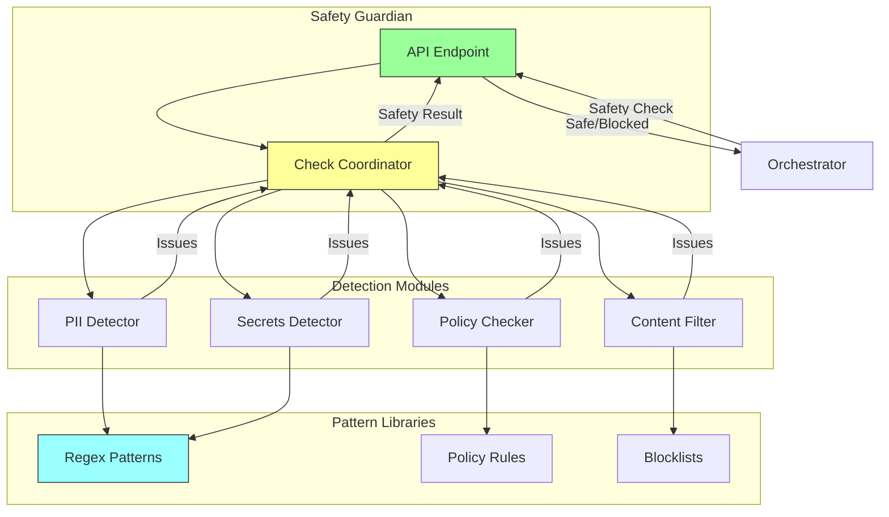
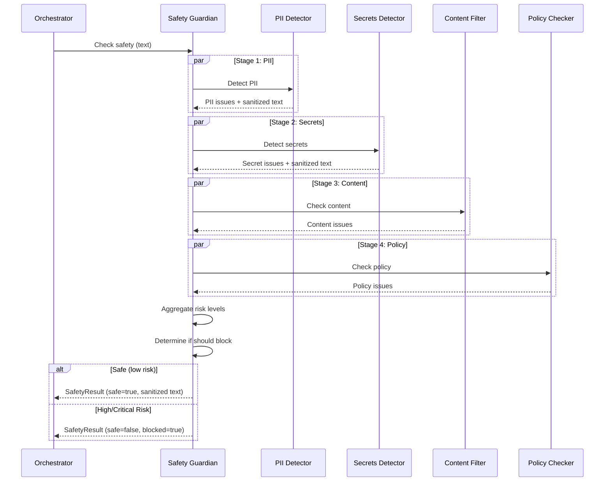

# Safety Guardian Arm: Content & Policy Enforcement

**Components** > **Arms** > Safety Guardian Arm

**Version**: 1.0
**Technology**: Python 3.11+ / FastAPI
**Cost Tier**: 1 (Low)
**Average Latency**: <100ms
**Status**: Phase 1 Complete

## Table of Contents

- [Overview](#overview)
- [Architecture](#architecture)
- [Core Functionality](#core-functionality)
  - [Safety Check Types](#safety-check-types)
  - [Risk Levels](#risk-levels)
  - [Multi-Stage Pipeline](#multi-stage-pipeline)
- [Detection Modules](#detection-modules)
  - [PII Detection](#pii-detection)
  - [Secrets Detection](#secrets-detection)
  - [Content Filtering](#content-filtering)
  - [Policy Compliance](#policy-compliance)
- [Implementation](#implementation)
  - [SafetyGuardian Class](#safetyguardian-class)
  - [PIIDetector](#piidetector)
  - [SecretsDetector](#secretsdetector)
- [API Specification](#api-specification)
  - [Safety Check](#safety-check)
  - [Response Formats](#response-formats)
- [Data Models](#data-models)
- [Configuration](#configuration)
- [Performance Characteristics](#performance-characteristics)
- [Testing](#testing)
- [Deployment](#deployment)
- [See Also](#see-also)

---

## Overview

The Safety Guardian Arm performs fast content filtering, PII (Personally Identifiable Information) detection, secrets detection, and policy enforcement throughout the system. It acts as a pre-filter before expensive operations and a post-filter before outputs are returned to users.

### Key Features

- **Fast Execution**: <100ms latency using regex-based detection
- **PII Detection**: Detect and redact SSN, credit cards, emails, phones, IPs
- **Secrets Detection**: Find API keys, tokens, passwords in text
- **Content Filtering**: Block malicious or inappropriate content
- **Policy Enforcement**: Ensure organizational policy compliance
- **Automatic Redaction**: Replace sensitive data with placeholders
- **Risk Assessment**: Classify findings by severity

### Design Principles

1. **Speed First**: No LLM calls, pure regex/pattern matching
2. **Fail-Safe**: Block on high/critical risk by default
3. **Comprehensive**: Multiple detection layers
4. **Privacy by Default**: Automatic PII redaction
5. **Configurable**: Adjustable risk thresholds

---

## Architecture



### Safety Pipeline Flow



---

## Core Functionality

### Safety Check Types

```python
from enum import Enum

class SafetyCheckType(str, Enum):
    PII = "pii"                  # Personally Identifiable Information
    CONTENT = "content"          # Malicious/inappropriate content
    POLICY = "policy"            # Organization policy compliance
    SECRETS = "secrets"          # API keys, tokens, passwords
    ALL = "all"                  # Run all checks
```

### Risk Levels

```python
class RiskLevel(str, Enum):
    NONE = "none"                # No issues detected
    LOW = "low"                  # Minor issues (e.g., IP addresses)
    MEDIUM = "medium"            # Moderate issues (e.g., emails, phones)
    HIGH = "high"                # Serious issues (e.g., SSN, credit cards)
    CRITICAL = "critical"        # Severe issues (e.g., API keys, passwords)
```

| Risk Level | Examples | Default Action |
|------------|----------|----------------|
| **NONE** | Clean content | Pass |
| **LOW** | IP addresses, generic usernames | Pass with warning |
| **MEDIUM** | Emails, phone numbers | Pass with redaction |
| **HIGH** | SSN, credit card numbers | **Block** |
| **CRITICAL** | API keys, passwords, tokens | **Block** |

### Multi-Stage Pipeline

The Safety Guardian runs checks in sequence, with each stage receiving sanitized output from the previous stage:

1. **PII Detection**: Find and redact personal information
2. **Secrets Detection**: Find and redact API keys and credentials
3. **Content Filtering**: Check for malicious or inappropriate content
4. **Policy Compliance**: Verify organizational policy adherence

---

## Detection Modules

### PII Detection

Detects and redacts various types of personally identifiable information:

```python
class PIIDetector:
    """Detect and redact personally identifiable information."""

    def __init__(self):
        self.patterns = self._compile_patterns()

    def _compile_patterns(self) -> List[Dict]:
        return [
            {
                "name": "ssn",
                "pattern": re.compile(r'\b\d{3}-\d{2}-\d{4}\b'),
                "replacement": "[SSN-REDACTED]",
                "risk_level": RiskLevel.HIGH
            },
            {
                "name": "credit_card",
                "pattern": re.compile(r'\b\d{4}[-\s]?\d{4}[-\s]?\d{4}[-\s]?\d{4}\b'),
                "replacement": "[CC-REDACTED]",
                "risk_level": RiskLevel.HIGH
            },
            {
                "name": "email",
                "pattern": re.compile(r'\b[A-Za-z0-9._%+-]+@[A-Za-z0-9.-]+\.[A-Z|a-z]{2,}\b'),
                "replacement": "[EMAIL-REDACTED]",
                "risk_level": RiskLevel.MEDIUM
            },
            {
                "name": "phone",
                "pattern": re.compile(r'\b\+?1?\s*\(?[0-9]{3}\)?[-.\s]?[0-9]{3}[-.\s]?[0-9]{4}\b'),
                "replacement": "[PHONE-REDACTED]",
                "risk_level": RiskLevel.MEDIUM
            },
            {
                "name": "ip_address",
                "pattern": re.compile(r'\b(?:[0-9]{1,3}\.){3}[0-9]{1,3}\b'),
                "replacement": "[IP-REDACTED]",
                "risk_level": RiskLevel.LOW
            },
        ]

    def detect(self, text: str) -> PIIResult:
        """Detect PII in text."""

        issues = []
        sanitized = text
        max_risk = RiskLevel.NONE

        for pattern_info in self.patterns:
            for match in pattern_info["pattern"].finditer(text):
                issues.append(SafetyIssue(
                    type="pii",
                    risk_level=pattern_info["risk_level"],
                    message=f"PII detected: {pattern_info['name']}",
                    matched_pattern=pattern_info["name"],
                    position=match.start(),
                    redaction=pattern_info["replacement"]
                ))

                sanitized = pattern_info["pattern"].sub(
                    pattern_info["replacement"],
                    sanitized
                )

                max_risk = self._max_risk(max_risk, pattern_info["risk_level"])

        return PIIResult(
            issues=issues,
            sanitized_text=sanitized,
            risk_level=max_risk
        )
```

### Secrets Detection

Detects API keys, tokens, and passwords:

```python
class SecretsDetector:
    """Detect and redact secrets (API keys, tokens, passwords)."""

    def __init__(self):
        self.patterns = self._compile_patterns()

    def _compile_patterns(self) -> List[Dict]:
        return [
            {
                "name": "openai_api_key",
                "pattern": re.compile(r'\bsk-[A-Za-z0-9]{48}\b'),
                "replacement": "[OPENAI-KEY-REDACTED]",
                "risk_level": RiskLevel.CRITICAL
            },
            {
                "name": "github_token",
                "pattern": re.compile(r'\bghp_[A-Za-z0-9]{36}\b'),
                "replacement": "[GITHUB-TOKEN-REDACTED]",
                "risk_level": RiskLevel.CRITICAL
            },
            {
                "name": "aws_access_key",
                "pattern": re.compile(r'\bAKIA[0-9A-Z]{16}\b'),
                "replacement": "[AWS-KEY-REDACTED]",
                "risk_level": RiskLevel.CRITICAL
            },
            {
                "name": "generic_api_key",
                "pattern": re.compile(r'\b(?:api[_-]?key|apikey)[\s:=]+["\']?([A-Za-z0-9]{20,})["\']?', re.IGNORECASE),
                "replacement": "[API-KEY-REDACTED]",
                "risk_level": RiskLevel.CRITICAL
            },
            {
                "name": "password_value",
                "pattern": re.compile(r'\b(?:password|passwd|pwd)[\s:=]+["\']?([^\s"\']{8,})["\']?', re.IGNORECASE),
                "replacement": "[PASSWORD-REDACTED]",
                "risk_level": RiskLevel.CRITICAL
            },
        ]

    def detect(self, text: str) -> SecretsResult:
        """Detect secrets in text."""

        issues = []
        sanitized = text
        max_risk = RiskLevel.NONE

        for pattern_info in self.patterns:
            for match in pattern_info["pattern"].finditer(text):
                issues.append(SafetyIssue(
                    type="secret",
                    risk_level=pattern_info["risk_level"],
                    message=f"Secret detected: {pattern_info['name']}",
                    matched_pattern=pattern_info["name"],
                    position=match.start(),
                    redaction=pattern_info["replacement"]
                ))

                sanitized = pattern_info["pattern"].sub(
                    pattern_info["replacement"],
                    sanitized
                )

                max_risk = RiskLevel.CRITICAL  # Any secret is critical

        return SecretsResult(
            issues=issues,
            sanitized_text=sanitized,
            risk_level=max_risk
        )
```

### Content Filtering

Checks for malicious or inappropriate content:

```python
class ContentFilter:
    """Filter malicious or inappropriate content."""

    def __init__(self):
        self.malicious_patterns = self._load_malicious_patterns()
        self.inappropriate_keywords = self._load_inappropriate_keywords()

    def check(self, text: str) -> ContentResult:
        """Check content for issues."""

        issues = []
        max_risk = RiskLevel.NONE

        # Check for malicious patterns (SQL injection, XSS, etc.)
        for pattern_info in self.malicious_patterns:
            if pattern_info["pattern"].search(text):
                issues.append(SafetyIssue(
                    type="malicious_content",
                    risk_level=RiskLevel.HIGH,
                    message=f"Potential {pattern_info['name']} detected",
                    matched_pattern=pattern_info["name"],
                    position=0
                ))
                max_risk = RiskLevel.HIGH

        # Check for inappropriate keywords
        text_lower = text.lower()
        for keyword in self.inappropriate_keywords:
            if keyword in text_lower:
                issues.append(SafetyIssue(
                    type="inappropriate_content",
                    risk_level=RiskLevel.MEDIUM,
                    message=f"Inappropriate content detected",
                    matched_pattern="keyword",
                    position=text_lower.index(keyword)
                ))
                max_risk = self._max_risk(max_risk, RiskLevel.MEDIUM)

        return ContentResult(
            issues=issues,
            risk_level=max_risk
        )

    def _load_malicious_patterns(self) -> List[Dict]:
        return [
            {
                "name": "sql_injection",
                "pattern": re.compile(r"(?:union|select|insert|update|delete|drop|create|alter)\s+(?:select|from|where|table)", re.IGNORECASE)
            },
            {
                "name": "xss",
                "pattern": re.compile(r"<script[^>]*>.*?</script>", re.IGNORECASE | re.DOTALL)
            },
            {
                "name": "path_traversal",
                "pattern": re.compile(r"\.\.[\\/]")
            },
        ]
```

### Policy Compliance

Enforces organizational policies:

```python
class PolicyChecker:
    """Check compliance with organizational policies."""

    def __init__(self, policy_config_path: str = "/etc/guardian/policy.yaml"):
        self.policies = self._load_policies(policy_config_path)

    def check(self, text: str, context: Dict[str, Any]) -> PolicyResult:
        """Check text against policies."""

        issues = []
        max_risk = RiskLevel.NONE

        for policy in self.policies:
            if not self._check_policy(text, policy, context):
                issues.append(SafetyIssue(
                    type="policy_violation",
                    risk_level=policy["risk_level"],
                    message=f"Policy violation: {policy['name']}",
                    matched_pattern=policy["name"],
                    position=0
                ))
                max_risk = self._max_risk(max_risk, policy["risk_level"])

        return PolicyResult(
            issues=issues,
            risk_level=max_risk
        )
```

---

## Implementation

### SafetyGuardian Class

```python
from typing import List, Dict, Any, Optional
from pydantic import BaseModel, Field
import re

class SafetyRequest(BaseModel):
    text: str
    check_types: List[SafetyCheckType]
    context: Dict[str, Any] = Field(default_factory=dict)
    redact_pii: bool = True
    block_on_high_risk: bool = True

class SafetyIssue(BaseModel):
    type: str
    risk_level: RiskLevel
    message: str
    matched_pattern: str
    position: int
    redaction: Optional[str] = None

class SafetyResult(BaseModel):
    safe: bool
    risk_level: RiskLevel
    issues: List[SafetyIssue] = Field(default_factory=list)
    sanitized_text: str
    blocked: bool = False
    metadata: Dict[str, Any] = Field(default_factory=dict)

class SafetyGuardian:
    """Content filtering and policy enforcement specialist."""

    def __init__(self):
        self.pii_detector = PIIDetector()
        self.content_filter = ContentFilter()
        self.policy_checker = PolicyChecker()
        self.secrets_detector = SecretsDetector()

    async def check(self, req: SafetyRequest) -> SafetyResult:
        """Run safety checks on text."""

        issues = []
        sanitized_text = req.text
        max_risk = RiskLevel.NONE

        # Check 1: PII Detection
        if SafetyCheckType.PII in req.check_types or SafetyCheckType.ALL in req.check_types:
            pii_result = self.pii_detector.detect(req.text)
            issues.extend(pii_result.issues)
            if req.redact_pii:
                sanitized_text = pii_result.sanitized_text
            max_risk = self._max_risk(max_risk, pii_result.risk_level)

        # Check 2: Secrets Detection
        if SafetyCheckType.SECRETS in req.check_types or SafetyCheckType.ALL in req.check_types:
            secrets_result = self.secrets_detector.detect(sanitized_text)
            issues.extend(secrets_result.issues)
            sanitized_text = secrets_result.sanitized_text
            max_risk = self._max_risk(max_risk, secrets_result.risk_level)

        # Check 3: Content Filtering
        if SafetyCheckType.CONTENT in req.check_types or SafetyCheckType.ALL in req.check_types:
            content_result = self.content_filter.check(sanitized_text)
            issues.extend(content_result.issues)
            max_risk = self._max_risk(max_risk, content_result.risk_level)

        # Check 4: Policy Compliance
        if SafetyCheckType.POLICY in req.check_types or SafetyCheckType.ALL in req.check_types:
            policy_result = self.policy_checker.check(sanitized_text, req.context)
            issues.extend(policy_result.issues)
            max_risk = self._max_risk(max_risk, policy_result.risk_level)

        # Determine if should block
        blocked = req.block_on_high_risk and max_risk in [RiskLevel.HIGH, RiskLevel.CRITICAL]
        safe = max_risk not in [RiskLevel.HIGH, RiskLevel.CRITICAL]

        return SafetyResult(
            safe=safe,
            risk_level=max_risk,
            issues=issues,
            sanitized_text=sanitized_text,
            blocked=blocked,
            metadata={
                "checks_run": [ct.value for ct in req.check_types],
                "issues_found": len(issues),
                "pii_detections": sum(1 for i in issues if i.type == "pii"),
                "secrets_detections": sum(1 for i in issues if i.type == "secret")
            }
        )

    def _max_risk(self, current: RiskLevel, new: RiskLevel) -> RiskLevel:
        """Return the higher risk level."""
        risk_order = [RiskLevel.NONE, RiskLevel.LOW, RiskLevel.MEDIUM, RiskLevel.HIGH, RiskLevel.CRITICAL]
        current_idx = risk_order.index(current)
        new_idx = risk_order.index(new)
        return risk_order[max(current_idx, new_idx)]
```

### PIIDetector

See [PII Detection](#pii-detection) section for full implementation.

### SecretsDetector

See [Secrets Detection](#secrets-detection) section for full implementation.

---

## API Specification

### Safety Check

**Endpoint**: `POST /check`

**Request Body**:
```json
{
  "text": "Please contact John at john.doe@example.com or call 555-123-4567. My API key is sk-abc123xyz...",
  "check_types": ["pii", "secrets"],
  "redact_pii": true,
  "block_on_high_risk": true
}
```

**Field Descriptions**:

| Field | Type | Required | Description |
|-------|------|----------|-------------|
| `text` | string | Yes | Text to check for safety issues |
| `check_types` | array[string] | Yes | Types of checks to perform |
| `context` | object | No | Additional context for policy checks |
| `redact_pii` | boolean | No | Automatically redact PII (default: true) |
| `block_on_high_risk` | boolean | No | Block on high/critical risk (default: true) |

### Response Formats

**Safe Content** (200 OK):
```json
{
  "safe": true,
  "risk_level": "medium",
  "issues": [
    {
      "type": "pii",
      "risk_level": "medium",
      "message": "PII detected: email",
      "matched_pattern": "email",
      "position": 24,
      "redaction": "[EMAIL-REDACTED]"
    },
    {
      "type": "pii",
      "risk_level": "medium",
      "message": "PII detected: phone",
      "matched_pattern": "phone",
      "position": 58,
      "redaction": "[PHONE-REDACTED]"
    }
  ],
  "sanitized_text": "Please contact John at [EMAIL-REDACTED] or call [PHONE-REDACTED]. My API key is [OPENAI-KEY-REDACTED]",
  "blocked": false,
  "metadata": {
    "checks_run": ["pii", "secrets"],
    "issues_found": 3,
    "pii_detections": 2,
    "secrets_detections": 1
  }
}
```

**Blocked Content** (200 OK with blocked=true):
```json
{
  "safe": false,
  "risk_level": "critical",
  "issues": [
    {
      "type": "secret",
      "risk_level": "critical",
      "message": "Secret detected: openai_api_key",
      "matched_pattern": "openai_api_key",
      "position": 85,
      "redaction": "[OPENAI-KEY-REDACTED]"
    }
  ],
  "sanitized_text": "[CONTENT BLOCKED DUE TO CRITICAL RISK]",
  "blocked": true,
  "metadata": {
    "checks_run": ["all"],
    "issues_found": 1,
    "pii_detections": 0,
    "secrets_detections": 1
  }
}
```

---

## Data Models

### Result Models

```python
class PIIResult(BaseModel):
    issues: List[SafetyIssue]
    sanitized_text: str
    risk_level: RiskLevel

class SecretsResult(BaseModel):
    issues: List[SafetyIssue]
    sanitized_text: str
    risk_level: RiskLevel

class ContentResult(BaseModel):
    issues: List[SafetyIssue]
    risk_level: RiskLevel

class PolicyResult(BaseModel):
    issues: List[SafetyIssue]
    risk_level: RiskLevel
```

---

## Configuration

### Environment Variables

```bash
# Safety Guardian Configuration
GUARDIAN_PORT=8007
GUARDIAN_ENABLE_PII=true
GUARDIAN_ENABLE_SECRETS=true
GUARDIAN_ENABLE_CONTENT=true
GUARDIAN_ENABLE_POLICY=true

# Risk Thresholds
GUARDIAN_BLOCK_HIGH_RISK=true
GUARDIAN_BLOCK_CRITICAL_RISK=true
GUARDIAN_AUTO_REDACT=true

# Policy Configuration
POLICY_CONFIG_PATH=/etc/guardian/policy.yaml

# Logging
LOG_LEVEL=info
LOG_DETECTIONS=true
LOG_SANITIZED_OUTPUT=false  # Don't log sanitized content
```

### Policy Configuration

**policy.yaml**:
```yaml
policies:
  - name: no_customer_data
    description: "Prevent customer data in logs"
    risk_level: high
    patterns:
      - customer_id
      - user_id
      - account_number

  - name: no_internal_urls
    description: "Block internal URLs"
    risk_level: medium
    patterns:
      - "internal.company.com"
      - "*.internal"

  - name: compliance_gdpr
    description: "GDPR compliance requirements"
    risk_level: high
    rules:
      - no_unredacted_pii
      - explicit_consent_required
```

---

## Performance Characteristics

### Latency

| Check Type | P50 | P95 | P99 |
|------------|-----|-----|-----|
| PII Detection | 5ms | 20ms | 50ms |
| Secrets Detection | 5ms | 20ms | 50ms |
| Content Filtering | 3ms | 10ms | 30ms |
| Policy Checking | 2ms | 5ms | 10ms |
| **Total (all checks)** | **15ms** | **55ms** | **140ms** |

### Throughput

- **Requests/Second**: >10,000 per instance
- **Concurrent Checks**: Unlimited (stateless)
- **CPU Usage**: Minimal (regex-based)
- **Memory**: <50 MB per instance

### Accuracy

- **PII Detection**: >98% (regex-based)
- **Secrets Detection**: >95% (pattern-based)
- **False Positives**: <2% (tunable patterns)
- **False Negatives**: <5% (depends on pattern coverage)

---

## Testing

### Unit Tests

```python
import pytest
from guardian_arm import SafetyGuardian, SafetyRequest, SafetyCheckType, RiskLevel

@pytest.fixture
def guardian():
    return SafetyGuardian()

@pytest.mark.asyncio
async def test_pii_detection(guardian):
    request = SafetyRequest(
        text="Contact me at john@example.com or 555-123-4567",
        check_types=[SafetyCheckType.PII],
        redact_pii=True
    )

    result = await guardian.check(request)

    assert result.safe  # MEDIUM risk is safe
    assert result.risk_level == RiskLevel.MEDIUM
    assert len(result.issues) == 2
    assert "[EMAIL-REDACTED]" in result.sanitized_text
    assert "[PHONE-REDACTED]" in result.sanitized_text

@pytest.mark.asyncio
async def test_secrets_detection(guardian):
    request = SafetyRequest(
        text="My OpenAI key is sk-abc123xyz" + "0" * 39,
        check_types=[SafetyCheckType.SECRETS],
        block_on_high_risk=True
    )

    result = await guardian.check(request)

    assert not result.safe
    assert result.blocked
    assert result.risk_level == RiskLevel.CRITICAL
    assert len(result.issues) == 1
    assert result.issues[0].type == "secret"
```

---

## Deployment

### Dockerfile

```dockerfile
FROM python:3.11-slim

WORKDIR /app

COPY requirements.txt .
RUN pip install --no-cache-dir -r requirements.txt

COPY guardian_arm/ ./guardian_arm/
COPY policy.yaml /etc/guardian/policy.yaml

RUN useradd -m -u 1000 guardian && chown -R guardian:guardian /app
USER guardian

ENV PYTHONUNBUFFERED=1
EXPOSE 8007

CMD ["uvicorn", "guardian_arm.main:app", "--host", "0.0.0.0", "--port", "8007"]
```

### Kubernetes Deployment

```yaml
apiVersion: apps/v1
kind: Deployment
metadata:
  name: guardian-arm
  namespace: octollm
spec:
  replicas: 3
  selector:
    matchLabels:
      app: guardian-arm
  template:
    metadata:
      labels:
        app: guardian-arm
    spec:
      containers:
      - name: guardian
        image: octollm/guardian-arm:1.0
        ports:
        - containerPort: 8007
        env:
        - name: GUARDIAN_PORT
          value: "8007"
        resources:
          requests:
            memory: "64Mi"
            cpu: "50m"
          limits:
            memory: "256Mi"
            cpu: "500m"
        livenessProbe:
          httpGet:
            path: /health
            port: 8007
          initialDelaySeconds: 10
          periodSeconds: 10
```

---

## See Also

- [Reflex Layer](../reflex-layer.md) - Pre-processing with safety checks
- [Judge Arm](./judge-arm.md) - Post-validation quality assurance
- [Security Overview](../../security/overview.md) - System-wide security architecture
- [PII Protection](../../security/pii-protection.md) - Detailed PII handling
- [API Reference](../../api/rest-api.md) - Complete API documentation

---

**Document Status**: Phase 1 Complete
**Last Updated**: 2025-11-10
**Maintainer**: OctoLLM Core Team
**Next Review**: 2025-12-10
