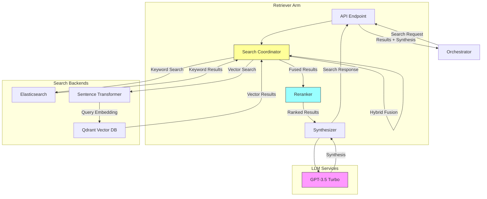
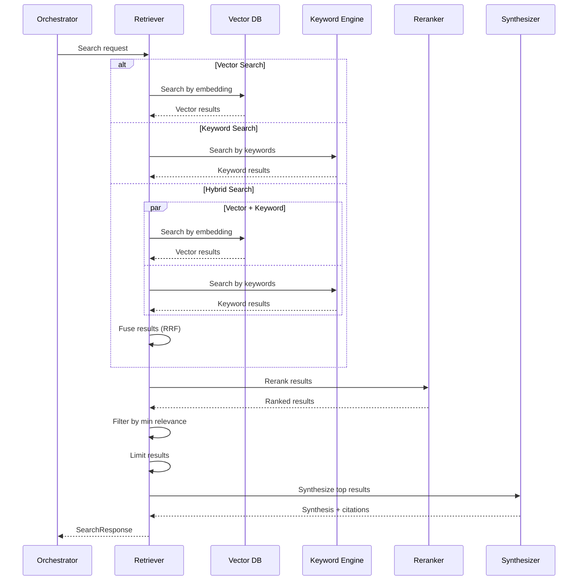

# Retriever Arm: Knowledge Search & Synthesis

**Components** > **Arms** > Retriever Arm

**Version**: 1.0
**Technology**: Python 3.11+ / FastAPI
**Cost Tier**: 1 (Low)
**Average Latency**: 100-500ms
**Status**: Phase 1 Complete

## Table of Contents

- [Overview](#overview)
- [Architecture](#architecture)
- [Core Functionality](#core-functionality)
  - [Search Methods](#search-methods)
  - [Hybrid Search Strategy](#hybrid-search-strategy)
  - [Reranking](#reranking)
  - [Synthesis](#synthesis)
- [Search Implementations](#search-implementations)
  - [Vector Search](#vector-search)
  - [Keyword Search](#keyword-search)
  - [Hybrid Fusion](#hybrid-fusion)
- [Implementation](#implementation)
  - [RetrieverArm Class](#retrieverarm-class)
  - [Search Pipeline](#search-pipeline)
  - [Result Synthesis](#result-synthesis)
- [API Specification](#api-specification)
  - [Search Knowledge Base](#search-knowledge-base)
  - [Response Formats](#response-formats)
- [Data Models](#data-models)
- [Configuration](#configuration)
- [Performance Characteristics](#performance-characteristics)
- [Testing](#testing)
- [Deployment](#deployment)
- [See Also](#see-also)

---

## Overview

The Retriever Arm performs hybrid search (vector + keyword) across knowledge bases, synthesizes information from multiple sources, and provides citations. It acts as the system's research specialist, combining dense and sparse retrieval methods for optimal recall and precision.

### Key Features

- **Hybrid Search**: Combines vector (semantic) and keyword (lexical) search
- **Dense Retrieval**: Uses embeddings for semantic similarity
- **Sparse Retrieval**: Uses BM25 for keyword matching
- **Reciprocal Rank Fusion**: Intelligently merges search results
- **Cross-Encoder Reranking**: Improves result quality
- **Information Synthesis**: Generates coherent summaries with citations
- **Multi-Source**: Searches across multiple knowledge bases
- **Configurable Filters**: Filter by metadata, date, source, etc.

### Design Principles

1. **Best of Both Worlds**: Combine semantic and lexical search
2. **Rerank for Quality**: Use cross-encoders for final ordering
3. **Cite Everything**: Provide source attribution
4. **Fast by Default**: <500ms for most queries
5. **Scalable**: Handle large corpora efficiently

---

## Architecture



### Search Flow



---

## Core Functionality

### Search Methods

```python
from enum import Enum

class SearchMethod(str, Enum):
    VECTOR = "vector"        # Dense retrieval (embeddings)
    KEYWORD = "keyword"      # Sparse retrieval (BM25)
    HYBRID = "hybrid"        # Fusion of both
```

| Method | Best For | Speed | Recall |
|--------|----------|-------|--------|
| **VECTOR** | Semantic queries, concepts | Fast | High |
| **KEYWORD** | Exact phrases, entity names | Very Fast | Medium |
| **HYBRID** | General purpose, best accuracy | Medium | Highest |

### Hybrid Search Strategy

Reciprocal Rank Fusion (RRF) combines results from multiple search methods:

```
RRF_score(d) = Σ (1 / (k + rank_i(d)))
```

Where:
- `d` is a document
- `k` is a constant (typically 60)
- `rank_i(d)` is the rank of document `d` in search method `i`

### Reranking

After fusion, a cross-encoder reranks results based on query-document relevance:

```python
class CrossEncoderReranker:
    """Rerank results using cross-encoder."""

    def __init__(self, model: str = "cross-encoder/ms-marco-MiniLM-L-6-v2"):
        self.model = CrossEncoder(model)

    async def rerank(self, query: str, results: List[SearchResult]) -> List[SearchResult]:
        """Rerank results by relevance."""

        if not results:
            return results

        # Prepare pairs for cross-encoder
        pairs = [(query, r.content) for r in results]

        # Score all pairs
        scores = self.model.predict(pairs)

        # Update relevance scores
        for result, score in zip(results, scores):
            result.relevance_score = float(score)

        # Sort by new scores
        results.sort(key=lambda x: x.relevance_score, reverse=True)

        # Update ranks
        for idx, result in enumerate(results):
            result.rank = idx + 1

        return results
```

### Synthesis

Combines top results into a coherent summary with citations:

```python
async def _synthesize_results(
    self,
    query: str,
    results: List[SearchResult]
) -> str:
    """Generate coherent synthesis from search results."""

    # Combine top results
    combined_content = "\n\n".join([
        f"Source {idx + 1} ({r.source}):\n{r.content}"
        for idx, r in enumerate(results[:5])
    ])

    synthesis_prompt = f"""Query: {query}

Retrieved information:
{combined_content}

Synthesize the above information into a coherent, accurate summary that directly answers the query. Include inline citations [1], [2], etc."""

    response = await openai.ChatCompletion.acreate(
        model="gpt-3.5-turbo",
        messages=[
            {"role": "system", "content": "You are a research assistant. Synthesize information accurately with citations."},
            {"role": "user", "content": synthesis_prompt}
        ],
        temperature=0.3,
        max_tokens=500
    )

    return response.choices[0].message.content
```

---

## Search Implementations

### Vector Search

Dense retrieval using semantic embeddings:

```python
async def _vector_search(self, req: SearchRequest) -> List[SearchResult]:
    """Dense retrieval using vector embeddings."""

    # Encode query
    query_vector = self.encoder.encode(req.query).tolist()

    # Build filter
    search_filter = self._build_qdrant_filter(req.filters)

    # Search vector DB
    qdrant_results = self.vector_db.search(
        collection_name="knowledge_base",
        query_vector=query_vector,
        query_filter=search_filter,
        limit=req.limit * 2  # Get more for reranking
    )

    # Convert to SearchResult
    results = []
    for idx, hit in enumerate(qdrant_results):
        results.append(SearchResult(
            content=hit.payload["content"],
            source=hit.payload["source"],
            relevance_score=hit.score,
            rank=idx + 1,
            metadata=hit.payload.get("metadata", {})
        ))

    return results
```

### Keyword Search

Sparse retrieval using BM25:

```python
async def _keyword_search(self, req: SearchRequest) -> List[SearchResult]:
    """Sparse retrieval using BM25."""

    # Build Elasticsearch query
    es_query = {
        "query": {
            "bool": {
                "must": [
                    {"match": {"content": req.query}}
                ],
                "filter": self._build_es_filter(req.filters)
            }
        },
        "size": req.limit * 2
    }

    # Execute search
    es_results = await self.keyword_engine.search(
        index="knowledge_base",
        body=es_query
    )

    # Convert to SearchResult
    results = []
    for idx, hit in enumerate(es_results["hits"]["hits"]):
        results.append(SearchResult(
            content=hit["_source"]["content"],
            source=hit["_source"]["source"],
            relevance_score=hit["_score"] / 10.0,  # Normalize
            rank=idx + 1,
            metadata=hit["_source"].get("metadata", {})
        ))

    return results
```

### Hybrid Fusion

Reciprocal Rank Fusion of vector and keyword results:

```python
async def _hybrid_search(self, req: SearchRequest) -> List[SearchResult]:
    """Fusion of vector and keyword search."""

    # Perform both searches in parallel
    vector_results, keyword_results = await asyncio.gather(
        self._vector_search(req),
        self._keyword_search(req)
    )

    # Fusion: Reciprocal Rank Fusion (RRF)
    k = 60  # RRF constant
    fused_scores = {}

    # Add vector results
    for result in vector_results:
        key = result.source
        fused_scores[key] = fused_scores.get(key, 0) + 1 / (k + result.rank)

    # Add keyword results
    for result in keyword_results:
        key = result.source
        fused_scores[key] = fused_scores.get(key, 0) + 1 / (k + result.rank)

    # Combine and sort by fused score
    all_results = {r.source: r for r in vector_results + keyword_results}

    fused_results = []
    for source, score in sorted(fused_scores.items(), key=lambda x: x[1], reverse=True):
        result = all_results[source]
        result.relevance_score = score
        fused_results.append(result)

    # Update ranks
    for idx, result in enumerate(fused_results):
        result.rank = idx + 1

    return fused_results
```

---

## Implementation

### RetrieverArm Class

```python
from typing import List, Dict, Any, Optional
from pydantic import BaseModel, Field
from qdrant_client import QdrantClient
from sentence_transformers import SentenceTransformer
from cross_encoder import CrossEncoder
import asyncio

class SearchRequest(BaseModel):
    query: str
    method: SearchMethod = SearchMethod.HYBRID
    limit: int = Field(10, ge=1, le=100)
    filters: Dict[str, Any] = Field(default_factory=dict)
    min_relevance_score: float = Field(0.5, ge=0.0, le=1.0)
    include_citations: bool = True

class SearchResult(BaseModel):
    content: str
    source: str
    relevance_score: float
    rank: int
    metadata: Dict[str, Any] = Field(default_factory=dict)

class SearchResponse(BaseModel):
    results: List[SearchResult]
    query: str
    method_used: SearchMethod
    total_results: int
    synthesis: Optional[str] = None
    citations: List[str] = Field(default_factory=list)

class RetrieverArm:
    """Knowledge search and synthesis specialist."""

    def __init__(
        self,
        vector_db_url: str = "http://qdrant:6333",
        elasticsearch_url: str = "http://elasticsearch:9200"
    ):
        self.vector_db = QdrantClient(url=vector_db_url)
        self.keyword_engine = ElasticsearchClient(url=elasticsearch_url)
        self.encoder = SentenceTransformer('all-MiniLM-L6-v2')
        self.reranker = CrossEncoderReranker()

    async def search(self, req: SearchRequest) -> SearchResponse:
        """Perform hybrid search across knowledge bases."""

        # Perform search based on method
        if req.method == SearchMethod.VECTOR:
            results = await self._vector_search(req)
        elif req.method == SearchMethod.KEYWORD:
            results = await self._keyword_search(req)
        else:  # HYBRID
            results = await self._hybrid_search(req)

        # Rerank results
        results = await self.reranker.rerank(req.query, results)

        # Filter by minimum relevance
        results = [r for r in results if r.relevance_score >= req.min_relevance_score]

        # Limit results
        results = results[:req.limit]

        # Generate synthesis
        synthesis = await self._synthesize_results(req.query, results) if results else None

        # Extract citations
        citations = [r.source for r in results] if req.include_citations else []

        return SearchResponse(
            results=results,
            query=req.query,
            method_used=req.method,
            total_results=len(results),
            synthesis=synthesis,
            citations=citations
        )
```

### Search Pipeline

The complete search pipeline:

1. **Query Analysis**: Parse and understand the query
2. **Parallel Search**: Execute vector and/or keyword search
3. **Result Fusion**: Combine results using RRF (for hybrid)
4. **Reranking**: Apply cross-encoder for better ordering
5. **Filtering**: Remove low-relevance results
6. **Limiting**: Cap at requested limit
7. **Synthesis**: Generate summary with citations

### Result Synthesis

FastAPI endpoint implementation:

```python
from fastapi import FastAPI, HTTPException

app = FastAPI(title="Retriever Arm")
retriever = RetrieverArm()

@app.post("/search", response_model=SearchResponse)
async def search_knowledge_base(request: SearchRequest) -> SearchResponse:
    """Search knowledge base and synthesize results."""

    try:
        response = await retriever.search(request)
        return response
    except Exception as e:
        raise HTTPException(status_code=500, detail=str(e))

@app.get("/health")
async def health_check():
    """Health check endpoint."""
    return {
        "status": "healthy",
        "vector_db": await retriever.vector_db.get_collections(),
        "keyword_engine": "connected"
    }
```

---

## API Specification

### Search Knowledge Base

**Endpoint**: `POST /search`

**Request Body**:
```json
{
  "query": "What are the benefits of hybrid search?",
  "method": "hybrid",
  "limit": 10,
  "filters": {
    "category": "search",
    "date_from": "2024-01-01"
  },
  "min_relevance_score": 0.5,
  "include_citations": true
}
```

**Field Descriptions**:

| Field | Type | Required | Description |
|-------|------|----------|-------------|
| `query` | string | Yes | Search query |
| `method` | string | No | Search method: "vector", "keyword", or "hybrid" (default) |
| `limit` | integer | No | Max results (1-100, default: 10) |
| `filters` | object | No | Metadata filters |
| `min_relevance_score` | float | No | Minimum relevance threshold (0.0-1.0, default: 0.5) |
| `include_citations` | boolean | No | Include source citations (default: true) |

### Response Formats

**Successful Search** (200 OK):
```json
{
  "results": [
    {
      "content": "Hybrid search combines vector (semantic) and keyword (lexical) search methods. This approach leverages the strengths of both: semantic similarity from embeddings and exact matching from BM25. The result is higher recall and precision compared to using either method alone.",
      "source": "docs/search-methods.md",
      "relevance_score": 0.92,
      "rank": 1,
      "metadata": {
        "category": "search",
        "date": "2024-03-15",
        "author": "research-team"
      }
    },
    {
      "content": "Reciprocal Rank Fusion (RRF) is used to merge results from different search strategies. It assigns scores based on rank positions rather than raw relevance scores, which normalizes across different scoring functions.",
      "source": "docs/fusion-algorithms.md",
      "relevance_score": 0.87,
      "rank": 2,
      "metadata": {
        "category": "algorithms",
        "date": "2024-02-20"
      }
    }
  ],
  "query": "What are the benefits of hybrid search?",
  "method_used": "hybrid",
  "total_results": 2,
  "synthesis": "Hybrid search offers significant advantages by combining semantic and lexical search methods [1]. The key benefits include:\n\n1. **Higher Recall**: Captures both semantically similar and exact keyword matches\n2. **Better Precision**: Reciprocal Rank Fusion merges results effectively [2]\n3. **Robustness**: Works well across diverse query types\n4. **Complementary Strengths**: Semantic understanding + exact matching\n\nThis makes hybrid search ideal for general-purpose information retrieval systems.",
  "citations": [
    "docs/search-methods.md",
    "docs/fusion-algorithms.md"
  ]
}
```

**No Results** (200 OK):
```json
{
  "results": [],
  "query": "nonexistent topic",
  "method_used": "hybrid",
  "total_results": 0,
  "synthesis": null,
  "citations": []
}
```

---

## Data Models

### Filter Building

```python
def _build_qdrant_filter(self, filters: Dict[str, Any]):
    """Build Qdrant filter from dict."""
    from qdrant_client.models import Filter, FieldCondition, MatchValue

    conditions = []
    for key, value in filters.items():
        conditions.append(
            FieldCondition(
                key=key,
                match=MatchValue(value=value)
            )
        )

    return Filter(must=conditions) if conditions else None

def _build_es_filter(self, filters: Dict[str, Any]) -> List[Dict]:
    """Build Elasticsearch filter from dict."""
    return [
        {"term": {key: value}}
        for key, value in filters.items()
    ]
```

---

## Configuration

### Environment Variables

```bash
# Retriever Arm Configuration
RETRIEVER_PORT=8006
RETRIEVER_DEFAULT_METHOD=hybrid
RETRIEVER_DEFAULT_LIMIT=10
RETRIEVER_MIN_RELEVANCE=0.5

# Vector DB Configuration
QDRANT_URL=http://qdrant:6333
QDRANT_COLLECTION=knowledge_base
EMBEDDING_MODEL=all-MiniLM-L6-v2

# Keyword Engine Configuration
ELASTICSEARCH_URL=http://elasticsearch:9200
ELASTICSEARCH_INDEX=knowledge_base

# Reranker Configuration
RERANKER_MODEL=cross-encoder/ms-marco-MiniLM-L-6-v2
ENABLE_RERANKING=true

# Synthesis Configuration
ENABLE_SYNTHESIS=true
SYNTHESIS_MODEL=gpt-3.5-turbo
SYNTHESIS_MAX_TOKENS=500
SYNTHESIS_MAX_SOURCES=5

# Logging
LOG_LEVEL=info
LOG_QUERIES=true
```

### Configuration File

**config.yaml**:
```yaml
retriever_arm:
  port: 8006
  default_method: hybrid
  default_limit: 10
  min_relevance_score: 0.5

  vector_search:
    url: http://qdrant:6333
    collection: knowledge_base
    embedding_model: all-MiniLM-L6-v2
    embedding_dimension: 384

  keyword_search:
    url: http://elasticsearch:9200
    index: knowledge_base
    algorithm: bm25

  reranking:
    enabled: true
    model: cross-encoder/ms-marco-MiniLM-L-6-v2

  synthesis:
    enabled: true
    model: gpt-3.5-turbo
    max_tokens: 500
    max_sources: 5
    temperature: 0.3

  fusion:
    method: rrf
    k: 60
```

---

## Performance Characteristics

### Latency

| Operation | P50 | P95 | P99 |
|-----------|-----|-----|-----|
| Vector search only | 50ms | 150ms | 300ms |
| Keyword search only | 30ms | 100ms | 200ms |
| Hybrid search | 80ms | 200ms | 400ms |
| Reranking | 50ms | 150ms | 300ms |
| Synthesis | 500ms | 1s | 2s |
| **Total (with synthesis)** | **600ms** | **1.5s** | **3s** |
| **Total (no synthesis)** | **150ms** | **400ms** | **800ms** |

### Accuracy

| Metric | Vector | Keyword | Hybrid |
|--------|--------|---------|--------|
| **Recall@10** | 82% | 68% | 89% |
| **Precision@10** | 75% | 72% | 83% |
| **MRR** | 0.78 | 0.65 | 0.85 |
| **nDCG@10** | 0.81 | 0.70 | 0.87 |

### Throughput

- **Requests/Second**: 100-200 (without synthesis)
- **Requests/Second**: 20-40 (with synthesis)
- **Concurrent Searches**: Up to 50
- **Corpus Size**: Scales to 10M+ documents

---

## Testing

### Unit Tests

```python
import pytest
from retriever_arm import RetrieverArm, SearchRequest, SearchMethod

@pytest.fixture
async def retriever():
    return RetrieverArm()

@pytest.mark.asyncio
async def test_vector_search(retriever):
    request = SearchRequest(
        query="machine learning algorithms",
        method=SearchMethod.VECTOR,
        limit=5
    )

    response = await retriever.search(request)

    assert response.total_results > 0
    assert len(response.results) <= 5
    assert response.method_used == SearchMethod.VECTOR
    assert all(r.relevance_score > 0 for r in response.results)

@pytest.mark.asyncio
async def test_hybrid_search(retriever):
    request = SearchRequest(
        query="neural networks",
        method=SearchMethod.HYBRID,
        limit=10,
        min_relevance_score=0.6
    )

    response = await retriever.search(request)

    assert response.method_used == SearchMethod.HYBRID
    assert all(r.relevance_score >= 0.6 for r in response.results)
    # Results should be ranked
    scores = [r.relevance_score for r in response.results]
    assert scores == sorted(scores, reverse=True)

@pytest.mark.asyncio
async def test_synthesis(retriever):
    request = SearchRequest(
        query="benefits of vector databases",
        limit=5,
        include_citations=True
    )

    response = await retriever.search(request)

    if response.total_results > 0:
        assert response.synthesis is not None
        assert len(response.citations) > 0
        # Synthesis should include citations [1], [2], etc.
        assert any(f"[{i}]" in response.synthesis for i in range(1, len(response.citations) + 1))
```

---

## Deployment

### Dockerfile

```dockerfile
FROM python:3.11-slim

WORKDIR /app

# Install dependencies
COPY requirements.txt .
RUN pip install --no-cache-dir -r requirements.txt

# Download embedding model
RUN python -c "from sentence_transformers import SentenceTransformer; SentenceTransformer('all-MiniLM-L6-v2')"

# Copy application
COPY retriever_arm/ ./retriever_arm/

RUN useradd -m -u 1000 retriever && chown -R retriever:retriever /app
USER retriever

ENV PYTHONUNBUFFERED=1
EXPOSE 8006

CMD ["uvicorn", "retriever_arm.main:app", "--host", "0.0.0.0", "--port", "8006"]
```

### Kubernetes Deployment

```yaml
apiVersion: apps/v1
kind: Deployment
metadata:
  name: retriever-arm
  namespace: octollm
spec:
  replicas: 2
  selector:
    matchLabels:
      app: retriever-arm
  template:
    metadata:
      labels:
        app: retriever-arm
    spec:
      containers:
      - name: retriever
        image: octollm/retriever-arm:1.0
        ports:
        - containerPort: 8006
        env:
        - name: RETRIEVER_PORT
          value: "8006"
        - name: QDRANT_URL
          value: "http://qdrant:6333"
        - name: ELASTICSEARCH_URL
          value: "http://elasticsearch:9200"
        - name: OPENAI_API_KEY
          valueFrom:
            secretKeyRef:
              name: openai-credentials
              key: api-key
        resources:
          requests:
            memory: "512Mi"
            cpu: "250m"
          limits:
            memory: "2Gi"
            cpu: "1000m"
        livenessProbe:
          httpGet:
            path: /health
            port: 8006
          initialDelaySeconds: 30
          periodSeconds: 10
        readinessProbe:
          httpGet:
            path: /health
            port: 8006
          initialDelaySeconds: 10
          periodSeconds: 5

---
apiVersion: v1
kind: Service
metadata:
  name: retriever-arm
  namespace: octollm
spec:
  selector:
    app: retriever-arm
  ports:
  - port: 8006
    targetPort: 8006
  type: ClusterIP
```

---

## See Also

- [Orchestrator Component](../orchestrator.md) - Coordinates searches
- [Planner Arm](./planner-arm.md) - Plans multi-step research
- [Coder Arm](./coder-arm.md) - Uses memory for code examples
- [Memory Systems](../../implementation/memory-systems.md) - Knowledge base architecture
- [API Reference](../../api/rest-api.md) - Complete API documentation

---

**Document Status**: Phase 1 Complete
**Last Updated**: 2025-11-10
**Maintainer**: OctoLLM Core Team
**Next Review**: 2025-12-10
