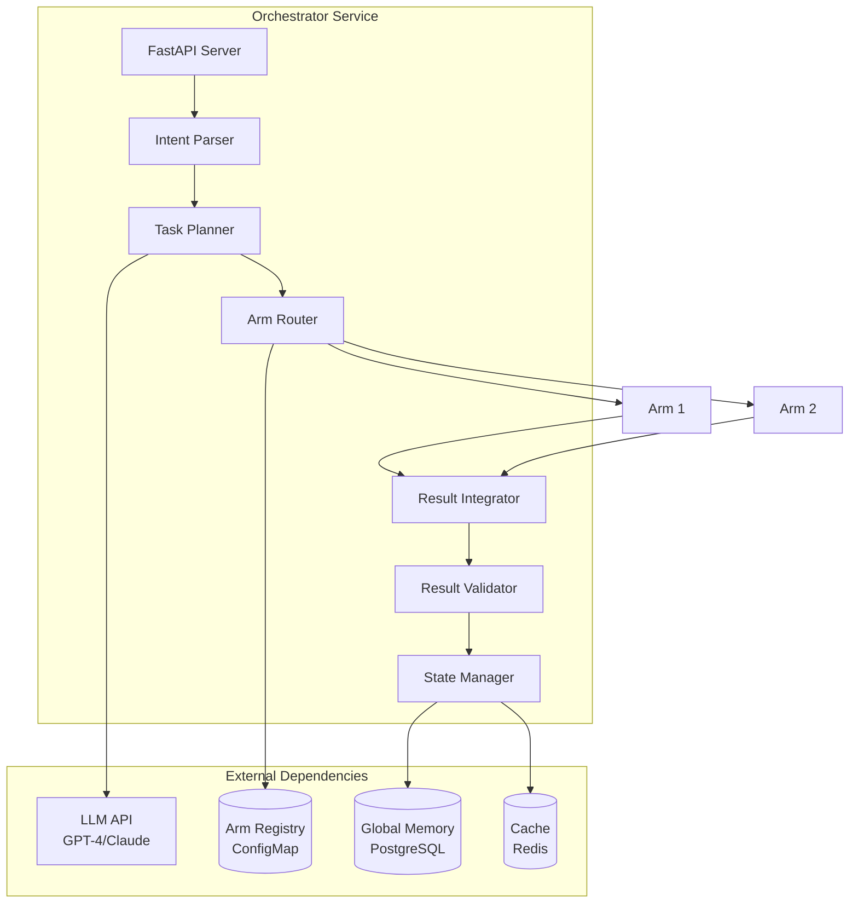
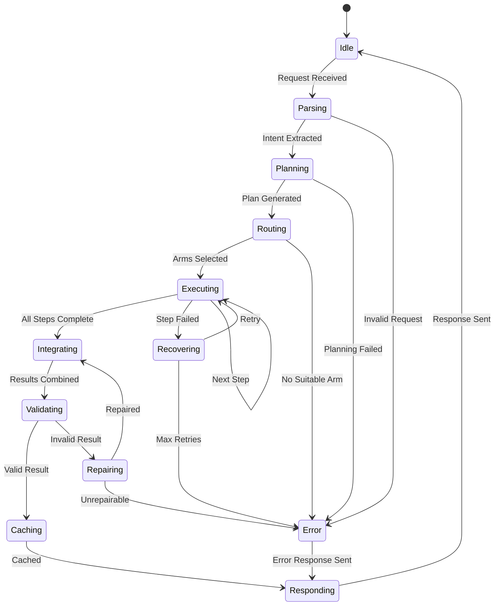

# Orchestrator Component Specification

**Component**: Central Orchestrator (Brain)
**Version**: 1.0
**Last Updated**: 2025-11-10

## Table of Contents

- [Overview](#overview)
- [Responsibilities](#responsibilities)
- [Architecture](#architecture)
- [API Specification](#api-specification)
- [Configuration](#configuration)
- [Implementation Details](#implementation-details)
- [Performance Characteristics](#performance-characteristics)
- [Error Handling](#error-handling)

## Overview

The Orchestrator is the central "brain" of the OctoLLM system, responsible for strategic planning, task decomposition, arm coordination, and result integration. It operates as a stateless service that delegates specialized work to arms while maintaining high-level coherence and safety.

### Design Goals

- **Strategic Intelligence**: High-level planning and decision-making
- **Minimal Overhead**: Delegate execution to arms, avoid unnecessary processing
- **Safety Enforcement**: Global policy enforcement and constraint checking
- **Result Quality**: Ensure outputs meet acceptance criteria
- **Observability**: Complete audit trail of all decisions

## Responsibilities

### Core Functions

1. **Intent Parsing**
   - Extract goal from user request
   - Identify constraints and requirements
   - Classify task complexity and domain

2. **Task Planning**
   - Decompose complex tasks into subtasks
   - Establish execution order and dependencies
   - Define acceptance criteria for each step

3. **Arm Selection and Routing**
   - Match tasks to appropriate arms based on capabilities
   - Load balance across available instances
   - Fall back to alternatives on failure

4. **Result Integration**
   - Combine outputs from multiple arms
   - Resolve conflicts and inconsistencies
   - Ensure logical coherence

5. **Validation and Repair**
   - Verify results meet acceptance criteria
   - Trigger repair loops for invalid outputs
   - Enforce safety policies

6. **State Management**
   - Track task execution progress
   - Manage task context across steps
   - Persist execution history

## Architecture

### Component Diagram



### Internal State Machine



## API Specification

### POST /api/v1/tasks

Submit a new task for execution.

**Request:**

```json
{
  "goal": "Find and fix the authentication bug in the login module",
  "constraints": [
    "Do not modify database schema",
    "Maintain backward compatibility",
    "Complete within 5 minutes"
  ],
  "context": {
    "repository": "https://github.com/example/repo",
    "branch": "main",
    "affected_files": ["auth/login.py", "tests/test_auth.py"]
  },
  "priority": "high",
  "budget": {
    "max_tokens": 10000,
    "max_time_seconds": 300,
    "max_cost_usd": 0.50
  },
  "acceptance_criteria": [
    "All existing tests pass",
    "New test added for bug scenario",
    "Code follows project style guide"
  ]
}
```

**Response (202 Accepted):**

```json
{
  "task_id": "task-a1b2c3d4",
  "status": "accepted",
  "estimated_duration_seconds": 120,
  "created_at": "2025-11-10T10:30:00Z"
}
```

### GET /api/v1/tasks/{task_id}

Get task status and results.

**Response (200 OK):**

```json
{
  "task_id": "task-a1b2c3d4",
  "status": "completed",
  "progress": {
    "current_step": 5,
    "total_steps": 5,
    "percent_complete": 100
  },
  "result": {
    "success": true,
    "output": {
      "bug_location": "auth/login.py:45",
      "root_cause": "Missing null check on user object",
      "fix_applied": true,
      "tests_added": ["test_login_with_invalid_user"],
      "tests_passing": 47,
      "tests_failing": 0
    },
    "artifacts": [
      {
        "type": "code_patch",
        "path": "auth/login.py",
        "content": "..."
      },
      {
        "type": "test_code",
        "path": "tests/test_auth.py",
        "content": "..."
      }
    ]
  },
  "execution_details": {
    "plan": [
      {
        "step": 1,
        "description": "Retrieve code from repository",
        "arm": "retriever",
        "duration_ms": 450,
        "success": true
      },
      {
        "step": 2,
        "description": "Analyze code for bugs",
        "arm": "coder",
        "duration_ms": 2300,
        "success": true
      },
      {
        "step": 3,
        "description": "Generate fix",
        "arm": "coder",
        "duration_ms": 1800,
        "success": true
      },
      {
        "step": 4,
        "description": "Run tests",
        "arm": "executor",
        "duration_ms": 3200,
        "success": true
      },
      {
        "step": 5,
        "description": "Validate fix",
        "arm": "judge",
        "duration_ms": 900,
        "success": true
      }
    ],
    "total_duration_ms": 8650,
    "tokens_used": 3450,
    "cost_usd": 0.12
  },
  "provenance": {
    "created_at": "2025-11-10T10:30:00Z",
    "completed_at": "2025-11-10T10:30:08Z",
    "orchestrator_version": "1.0.0",
    "trace_id": "trace-x1y2z3"
  }
}
```

### POST /api/v1/tasks/{task_id}/cancel

Cancel a running task.

**Response (200 OK):**

```json
{
  "task_id": "task-a1b2c3d4",
  "status": "cancelled",
  "cancelled_at": "2025-11-10T10:30:05Z",
  "partial_results": {
    "completed_steps": 3,
    "total_steps": 5
  }
}
```

### GET /health

Health check endpoint.

**Response (200 OK):**

```json
{
  "status": "healthy",
  "version": "1.0.0",
  "dependencies": {
    "llm_api": "available",
    "redis": "connected",
    "postgresql": "connected",
    "arms": {
      "planner": "healthy",
      "coder": "healthy",
      "executor": "degraded",
      "judge": "healthy"
    }
  },
  "timestamp": "2025-11-10T10:30:00Z"
}
```

### GET /ready

Readiness check for load balancer.

**Response (200 OK / 503 Service Unavailable):**

```json
{
  "ready": true,
  "active_tasks": 3,
  "capacity": 10
}
```

## Configuration

### Environment Variables

| Variable | Required | Default | Description |
|----------|----------|---------|-------------|
| `OPENAI_API_KEY` | Yes | - | OpenAI API key for GPT models |
| `ANTHROPIC_API_KEY` | No | - | Anthropic API key for Claude models |
| `DEFAULT_LLM_MODEL` | No | `gpt-4-turbo` | Default LLM model to use |
| `REDIS_URL` | Yes | - | Redis connection URL |
| `POSTGRES_URL` | Yes | - | PostgreSQL connection URL |
| `ARM_REGISTRY_PATH` | Yes | `/config/registry.json` | Path to arm registry config |
| `MAX_CONCURRENT_TASKS` | No | `10` | Maximum concurrent tasks |
| `DEFAULT_TASK_TIMEOUT` | No | `300` | Default task timeout in seconds |
| `LOG_LEVEL` | No | `INFO` | Logging level |
| `ENABLE_METRICS` | No | `true` | Enable Prometheus metrics |
| `METRICS_PORT` | No | `9090` | Metrics server port |

### Arm Registry Configuration

```json
{
  "planner": {
    "endpoint": "http://planner-arm:8080/plan",
    "capabilities": ["planning", "decomposition", "dependency_resolution"],
    "cost_tier": 2,
    "average_latency_ms": 1200,
    "success_rate": 0.92,
    "max_concurrent": 5
  },
  "retriever": {
    "endpoint": "http://retriever-arm:8080/search",
    "capabilities": ["search", "knowledge_retrieval", "documentation"],
    "cost_tier": 1,
    "average_latency_ms": 300,
    "success_rate": 0.95,
    "max_concurrent": 10
  },
  "coder": {
    "endpoint": "http://coder-arm:8080/code",
    "capabilities": ["code_generation", "debugging", "refactoring", "analysis"],
    "cost_tier": 4,
    "average_latency_ms": 2500,
    "success_rate": 0.88,
    "max_concurrent": 3
  },
  "executor": {
    "endpoint": "http://executor-arm:8080/execute",
    "capabilities": ["shell", "http", "api", "command_execution"],
    "cost_tier": 3,
    "average_latency_ms": 1800,
    "success_rate": 0.90,
    "max_concurrent": 8
  },
  "judge": {
    "endpoint": "http://judge-arm:8080/validate",
    "capabilities": ["validation", "fact_checking", "schema_compliance"],
    "cost_tier": 2,
    "average_latency_ms": 900,
    "success_rate": 0.93,
    "max_concurrent": 5
  },
  "guardian": {
    "endpoint": "http://guardian-arm:8080/check",
    "capabilities": ["pii_detection", "safety_check", "policy_enforcement"],
    "cost_tier": 1,
    "average_latency_ms": 150,
    "success_rate": 0.98,
    "max_concurrent": 15
  }
}
```

## Implementation Details

### Core Classes

```python
from pydantic import BaseModel, Field
from typing import List, Dict, Any, Optional
from enum import Enum
import structlog

logger = structlog.get_logger()

class Priority(str, Enum):
    LOW = "low"
    MEDIUM = "medium"
    HIGH = "high"
    CRITICAL = "critical"

class TaskStatus(str, Enum):
    PENDING = "pending"
    PARSING = "parsing"
    PLANNING = "planning"
    EXECUTING = "executing"
    INTEGRATING = "integrating"
    VALIDATING = "validating"
    COMPLETED = "completed"
    FAILED = "failed"
    CANCELLED = "cancelled"

class TaskContract(BaseModel):
    """Formal specification for a task."""
    task_id: str
    goal: str
    constraints: List[str] = Field(default_factory=list)
    context: Dict[str, Any] = Field(default_factory=dict)
    priority: Priority = Priority.MEDIUM
    budget: Dict[str, int] = Field(
        default_factory=lambda: {
            "max_tokens": 4000,
            "max_time_seconds": 30,
            "max_cost_usd": 1.0
        }
    )
    acceptance_criteria: List[str] = Field(default_factory=list)

class ExecutionPlan(BaseModel):
    """Plan for task execution."""
    steps: List[Dict[str, Any]]
    estimated_duration_seconds: int
    estimated_cost_usd: float
    required_arms: List[str]
    dependencies: Dict[int, List[int]] = Field(default_factory=dict)

class Orchestrator:
    """Central coordinator for OctoLLM system."""

    def __init__(
        self,
        llm_client,
        arm_registry: Dict[str, Any],
        redis_client,
        postgres_client
    ):
        self.llm = llm_client
        self.registry = arm_registry
        self.redis = redis_client
        self.postgres = postgres_client
        self.router = ArmRouter(arm_registry)
        self.integrator = ResultIntegrator()
        self.validator = ResultValidator()

    async def process_task(self, task: TaskContract) -> Dict[str, Any]:
        """Main orchestration loop."""
        logger.info("orchestrator.process_task.start", task_id=task.task_id)

        try:
            # 1. Check cache
            cached = await self._check_cache(task)
            if cached:
                return cached

            # 2. Parse intent
            intent = await self._parse_intent(task)

            # 3. Generate execution plan
            plan = await self._generate_plan(task, intent)

            # 4. Execute plan
            results = await self._execute_plan(plan, task)

            # 5. Integrate results
            integrated = await self.integrator.integrate(results)

            # 6. Validate
            is_valid = await self.validator.validate(integrated, task)
            if not is_valid:
                integrated = await self._repair_result(integrated, task)

            # 7. Cache and return
            await self._cache_result(task, integrated)
            return integrated

        except Exception as e:
            logger.error(
                "orchestrator.process_task.error",
                task_id=task.task_id,
                error=str(e)
            )
            raise

    async def _generate_plan(
        self,
        task: TaskContract,
        intent: Dict[str, Any]
    ) -> ExecutionPlan:
        """Generate execution plan using LLM or Planner arm."""

        # Decide whether to use Planner arm or direct LLM
        if self._should_use_planner_arm(task):
            planner = self.registry["planner"]
            response = await self._call_arm(
                planner,
                {"goal": task.goal, "constraints": task.constraints}
            )
            plan_data = response["plan"]
        else:
            # Use LLM directly for simple tasks
            plan_data = await self._llm_generate_plan(task)

        return ExecutionPlan(**plan_data)

    async def _execute_plan(
        self,
        plan: ExecutionPlan,
        task: TaskContract
    ) -> List[Dict[str, Any]]:
        """Execute plan step by step."""
        results = []
        context = task.context.copy()

        for step in plan.steps:
            try:
                # Select arm for step
                arms = self.router.route_step(step, context)

                # Execute step
                if len(arms) == 1:
                    # Single arm execution
                    result = await self._execute_step(
                        arms[0],
                        step,
                        context
                    )
                else:
                    # Swarm execution for critical steps
                    result = await self._execute_swarm(
                        arms,
                        step,
                        context
                    )

                results.append(result)

                # Update context for next step
                context[f"step_{step['step']}_result"] = result

            except Exception as e:
                logger.error(
                    "orchestrator.step_failed",
                    step=step['step'],
                    error=str(e)
                )
                # Attempt recovery
                recovery = await self._handle_step_failure(
                    step,
                    e,
                    context
                )
                results.append(recovery)

        return results

    async def _execute_step(
        self,
        arm: Dict[str, Any],
        step: Dict[str, Any],
        context: Dict[str, Any]
    ) -> Dict[str, Any]:
        """Execute single step via arm."""

        payload = {
            "instruction": step["action"],
            "context": context,
            "criteria": step.get("criteria", [])
        }

        result = await self._call_arm(arm, payload)

        # Attach provenance
        result["provenance"] = {
            "arm_id": arm["arm_id"],
            "timestamp": datetime.utcnow().isoformat(),
            "step": step["step"],
            "confidence": result.get("confidence", 0.0)
        }

        return result

    async def _execute_swarm(
        self,
        arms: List[Dict[str, Any]],
        step: Dict[str, Any],
        context: Dict[str, Any]
    ) -> Dict[str, Any]:
        """Execute step with multiple arms and aggregate."""

        import asyncio

        # Execute in parallel
        tasks = [
            self._execute_step(arm, step, context)
            for arm in arms
        ]
        results = await asyncio.gather(*tasks, return_exceptions=True)

        # Filter out exceptions
        valid_results = [
            r for r in results
            if not isinstance(r, Exception)
        ]

        # Aggregate results
        aggregated = await self._aggregate_results(valid_results)

        return aggregated

    async def _aggregate_results(
        self,
        results: List[Dict[str, Any]]
    ) -> Dict[str, Any]:
        """Aggregate multiple arm results."""

        # Simple majority voting for now
        # TODO: Implement learned aggregation

        if not results:
            raise ValueError("No valid results to aggregate")

        # Take highest confidence result
        best = max(results, key=lambda r: r.get("confidence", 0.0))

        best["aggregation_metadata"] = {
            "method": "max_confidence",
            "num_results": len(results),
            "confidence_scores": [
                r.get("confidence", 0.0) for r in results
            ]
        }

        return best
```

### Routing Logic

```python
class ArmRouter:
    """Routes tasks to appropriate arms."""

    def __init__(self, registry: Dict[str, Any]):
        self.registry = registry

    def route_step(
        self,
        step: Dict[str, Any],
        context: Dict[str, Any]
    ) -> List[Dict[str, Any]]:
        """Select appropriate arm(s) for step."""

        # Extract required capabilities
        required_caps = self._extract_capabilities(step)

        # Find matching arms
        candidates = []
        for arm_id, arm in self.registry.items():
            arm_caps = set(arm["capabilities"])
            if required_caps.issubset(arm_caps):
                score = self._score_arm(arm, step, context)
                candidates.append((arm_id, arm, score))

        # Sort by score
        candidates.sort(key=lambda x: x[2], reverse=True)

        # Select top candidate(s)
        if not candidates:
            raise ValueError(f"No arm found for capabilities: {required_caps}")

        # Use swarm for high-priority steps
        if step.get("priority") == "critical":
            return [arm for _, arm, _ in candidates[:3]]

        return [candidates[0][1]]

    def _score_arm(
        self,
        arm: Dict[str, Any],
        step: Dict[str, Any],
        context: Dict[str, Any]
    ) -> float:
        """Score arm suitability."""

        score = 0.0

        # Success rate (40%)
        score += arm["success_rate"] * 0.4

        # Inverse latency (30%)
        score += (1.0 / (arm["average_latency_ms"] + 1)) * 1000 * 0.3

        # Inverse cost (20%)
        score += (1.0 / (arm["cost_tier"] + 1)) * 0.2

        # Current load (10%)
        current_load = self._get_arm_load(arm)
        score += (1.0 - current_load) * 0.1

        return score

    def _extract_capabilities(self, step: Dict[str, Any]) -> set:
        """Extract required capabilities from step."""

        # Simple keyword matching for now
        # TODO: Use ML classifier

        action = step["action"].lower()
        caps = set()

        if any(kw in action for kw in ["plan", "decompose", "break down"]):
            caps.add("planning")
        if any(kw in action for kw in ["search", "find", "retrieve"]):
            caps.add("search")
        if any(kw in action for kw in ["code", "function", "implement"]):
            caps.add("code_generation")
        if any(kw in action for kw in ["run", "execute", "call"]):
            caps.add("command_execution")
        if any(kw in action for kw in ["validate", "check", "verify"]):
            caps.add("validation")

        return caps
```

## Performance Characteristics

### Latency Breakdown

| Phase | Target Latency | Notes |
|-------|---------------|-------|
| Intent Parsing | < 100ms | Local processing |
| Plan Generation (LLM) | 1-3s | Depends on model |
| Plan Generation (Planner Arm) | 1-2s | Specialized model |
| Arm Selection | < 50ms | Registry lookup + scoring |
| Single Arm Call | 0.5-5s | Varies by arm type |
| Result Integration | < 200ms | Deterministic logic |
| Validation | 0.5-2s | Judge arm call |
| Total (Simple Task) | 2-5s | 1-3 steps |
| Total (Complex Task) | 10-30s | 5-10 steps |

### Resource Requirements

**Minimum (Development):**
- CPU: 500m (0.5 cores)
- Memory: 512Mi
- Disk: 1Gi

**Recommended (Production):**
- CPU: 2000m (2 cores)
- Memory: 2Gi
- Disk: 10Gi

**Scaling Characteristics:**
- Stateless design enables horizontal scaling
- Each instance can handle ~10 concurrent tasks
- Memory scales with task complexity and context size

## Error Handling

### Error Categories

```python
class OrchestratorError(Exception):
    """Base orchestrator error."""
    pass

class PlanningError(OrchestratorError):
    """Failed to generate plan."""
    pass

class ArmUnavailableError(OrchestratorError):
    """Required arm is unavailable."""
    pass

class ValidationError(OrchestratorError):
    """Result validation failed."""
    pass

class BudgetExceededError(OrchestratorError):
    """Task exceeded budget constraints."""
    pass
```

### Recovery Strategies

| Error Type | Strategy | Max Retries |
|-----------|----------|-------------|
| Transient network | Exponential backoff | 3 |
| Arm timeout | Retry with increased timeout | 2 |
| Arm unavailable | Route to alternative arm | 1 |
| Planning failure | Simplify task or escalate | 1 |
| Validation failure | Repair loop | 3 |
| Budget exceeded | Abort immediately | 0 |

## See Also

- [Arm Specifications](./README.md)
- [Routing Algorithm](../implementation/routing-algorithm.md)
- [Error Handling Guide](../engineering/error-handling.md)
- [API Reference](../api/rest-api.md)
