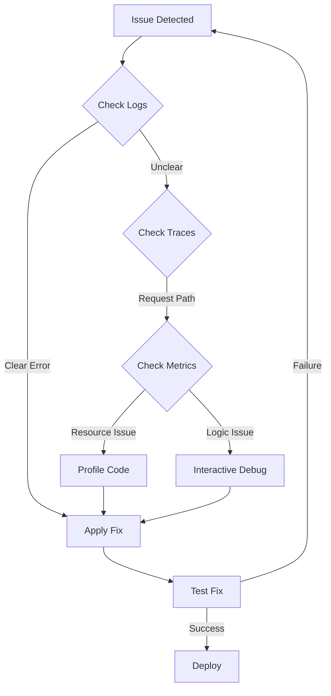

# Debugging Guide for OctoLLM

**Document**: Implementation Guide
**Version**: 1.0
**Last Updated**: 2025-11-10
**Estimated Time**: 30-45 minutes

[← Back to Documentation](../README.md) | [Implementation Guides](./README.md)

---

## Table of Contents

1. [Overview](#overview)
   - [Debugging Philosophy](#debugging-philosophy)
   - [Common Issues](#common-issues)
2. [Tools and Setup](#tools-and-setup)
   - [Logging Configuration](#logging-configuration)
   - [Debugger Setup](#debugger-setup)
   - [Observability Stack](#observability-stack)
3. [Debugging Techniques](#debugging-techniques)
   - [Interactive Debugging](#interactive-debugging)
   - [Log Analysis](#log-analysis)
   - [Distributed Tracing](#distributed-tracing)
4. [Component-Specific Debugging](#component-specific-debugging)
   - [Orchestrator](#orchestrator-debugging)
   - [Arms](#arms-debugging)
   - [Reflex Layer](#reflex-layer-debugging)
   - [Memory Systems](#memory-systems-debugging)
5. [Common Problems](#common-problems)
   - [Task Failures](#task-failures)
   - [Performance Issues](#performance-issues)
   - [Connection Problems](#connection-problems)
   - [Memory Leaks](#memory-leaks)
6. [Production Debugging](#production-debugging)
   - [Live Debugging](#live-debugging)
   - [Post-Mortem Analysis](#post-mortem-analysis)
7. [Best Practices](#best-practices)

---

## Overview

Effective debugging is essential for maintaining a healthy OctoLLM system. This guide provides techniques, tools, and strategies for identifying and fixing issues across all components.

### Debugging Philosophy

OctoLLM follows these debugging principles:

1. **Observability First**: System is instrumented for deep visibility
2. **Structured Logging**: All logs are structured and searchable
3. **Distributed Tracing**: Track requests across components
4. **Fail Fast**: Errors surface quickly with clear messages
5. **Reproducible**: Issues can be reproduced in development



### Common Issues

| Issue Type | Frequency | Severity | Avg Time to Fix |
|------------|-----------|----------|-----------------|
| Configuration errors | High | Medium | 10 min |
| Network timeouts | Medium | High | 30 min |
| Memory leaks | Low | Critical | 2 hours |
| Logic bugs | Medium | Medium | 1 hour |
| Performance degradation | Low | High | 1-2 hours |

---

## Tools and Setup

### Logging Configuration

OctoLLM uses structured logging with `structlog` for consistent, searchable logs.

**File**: `orchestrator/logging_config.py`

```python
"""Logging configuration for OctoLLM."""

import structlog
import logging
import sys
from typing import Any


def configure_logging(log_level: str = "INFO", log_format: str = "json"):
    """
    Configure structured logging.

    Args:
        log_level: Logging level (DEBUG, INFO, WARNING, ERROR)
        log_format: Output format (json or console)
    """
    # Determine processors based on format
    processors = [
        structlog.stdlib.filter_by_level,
        structlog.stdlib.add_logger_name,
        structlog.stdlib.add_log_level,
        structlog.processors.TimeStamper(fmt="iso"),
        structlog.processors.StackInfoRenderer(),
        structlog.processors.format_exc_info,
        structlog.processors.UnicodeDecoder(),
    ]

    if log_format == "json":
        processors.append(structlog.processors.JSONRenderer())
    else:
        processors.append(structlog.dev.ConsoleRenderer(colors=True))

    structlog.configure(
        processors=processors,
        context_class=dict,
        logger_factory=structlog.stdlib.LoggerFactory(),
        wrapper_class=structlog.stdlib.BoundLogger,
        cache_logger_on_first_use=True,
    )

    # Configure stdlib logging
    logging.basicConfig(
        format="%(message)s",
        stream=sys.stdout,
        level=getattr(logging, log_level.upper())
    )


# Example usage
logger = structlog.get_logger()

# Structured logging with context
logger.info(
    "task.started",
    task_id="task-123",
    user_id="user-456",
    goal="Write code"
)

# With extra context
logger.error(
    "database.query.failed",
    query="SELECT * FROM entities",
    error="Connection timeout",
    retry_count=3
)
```

**Enable DEBUG logging for development**:

```python
# In .env or environment
LOG_LEVEL=DEBUG
LOG_FORMAT=console  # Pretty console output
```

**Example log output (console format)**:

```
2025-11-10T10:30:00.123456Z [info     ] task.started                  task_id=task-123 user_id=user-456 goal=Write code
2025-11-10T10:30:01.234567Z [error    ] database.query.failed         query=SELECT * FROM entities error=Connection timeout retry_count=3
```

**Example log output (JSON format)**:

```json
{"event": "task.started", "level": "info", "timestamp": "2025-11-10T10:30:00.123456Z", "task_id": "task-123", "user_id": "user-456", "goal": "Write code"}
{"event": "database.query.failed", "level": "error", "timestamp": "2025-11-10T10:30:01.234567Z", "query": "SELECT * FROM entities", "error": "Connection timeout", "retry_count": 3}
```

### Debugger Setup

#### VS Code Configuration

**File**: `.vscode/launch.json`

```json
{
  "version": "0.2.0",
  "configurations": [
    {
      "name": "Debug Orchestrator",
      "type": "python",
      "request": "launch",
      "module": "uvicorn",
      "args": [
        "orchestrator.main:app",
        "--reload",
        "--host", "0.0.0.0",
        "--port", "8000"
      ],
      "env": {
        "PYTHONPATH": "${workspaceFolder}",
        "LOG_LEVEL": "DEBUG"
      },
      "console": "integratedTerminal",
      "justMyCode": false
    },
    {
      "name": "Debug Tests",
      "type": "python",
      "request": "launch",
      "module": "pytest",
      "args": [
        "${file}",
        "-v",
        "-s"
      ],
      "console": "integratedTerminal",
      "justMyCode": false
    },
    {
      "name": "Debug Specific Test",
      "type": "python",
      "request": "launch",
      "module": "pytest",
      "args": [
        "${file}::${selectedText}",
        "-v",
        "-s"
      ],
      "console": "integratedTerminal"
    }
  ]
}
```

#### PyCharm Configuration

1. **Run/Debug Configurations** → **+** → **Python**
2. **Script path**: Select `uvicorn` module
3. **Parameters**: `orchestrator.main:app --reload`
4. **Environment variables**: `LOG_LEVEL=DEBUG`
5. **Python interpreter**: Select Poetry virtualenv

#### pdb (Python Debugger)

**Quick debugging with breakpoints**:

```python
# Insert breakpoint in code
import pdb; pdb.set_trace()

# Or use built-in breakpoint() (Python 3.7+)
breakpoint()
```

**Common pdb commands**:
```
n (next)      - Execute next line
s (step)      - Step into function
c (continue)  - Continue execution
p var         - Print variable value
pp var        - Pretty print variable
l (list)      - Show code context
w (where)     - Show stack trace
q (quit)      - Exit debugger
```

### Observability Stack

OctoLLM uses Prometheus + Grafana for metrics and observability.

**Enable metrics in orchestrator**:

```python
# orchestrator/metrics.py
from prometheus_client import Counter, Histogram, Gauge
import structlog

logger = structlog.get_logger()

# Define metrics
TASK_COUNTER = Counter(
    'octollm_tasks_total',
    'Total number of tasks',
    ['status', 'priority']
)

TASK_DURATION = Histogram(
    'octollm_task_duration_seconds',
    'Task execution duration',
    ['arm_type']
)

ARM_FAILURES = Counter(
    'octollm_arm_failures_total',
    'Total arm failures',
    ['arm_id', 'error_type']
)

ACTIVE_TASKS = Gauge(
    'octollm_active_tasks',
    'Number of active tasks'
)


# Usage
TASK_COUNTER.labels(status='completed', priority='high').inc()
TASK_DURATION.labels(arm_type='coder').observe(12.5)
ARM_FAILURES.labels(arm_id='coder-001', error_type='timeout').inc()
ACTIVE_TASKS.set(5)
```

**Expose metrics endpoint**:

```python
# orchestrator/api/metrics.py
from fastapi import APIRouter
from prometheus_client import generate_latest, CONTENT_TYPE_LATEST
from starlette.responses import Response

router = APIRouter()

@router.get("/metrics")
async def metrics():
    """Prometheus metrics endpoint."""
    return Response(
        content=generate_latest(),
        media_type=CONTENT_TYPE_LATEST
    )
```

**Query metrics in Prometheus**:

```promql
# Total tasks completed
sum(octollm_tasks_total{status="completed"})

# Average task duration by arm
rate(octollm_task_duration_seconds_sum[5m]) / rate(octollm_task_duration_seconds_count[5m])

# Failure rate
sum(rate(octollm_arm_failures_total[5m])) by (arm_id)
```

---

## Debugging Techniques

### Interactive Debugging

**Set breakpoint and inspect state**:

```python
async def execute_task(task: TaskContract):
    """Execute task with debugging."""

    # Set breakpoint
    breakpoint()

    # At breakpoint, inspect:
    # - Variables: p task.goal
    # - Function calls: s to step into
    # - Stack: w to see call stack

    result = await orchestrator.process(task)
    return result
```

**Conditional breakpoints**:

```python
async def execute_task(task: TaskContract):
    """Execute with conditional breakpoint."""

    # Only break for high-priority tasks
    if task.priority == "high":
        breakpoint()

    result = await orchestrator.process(task)
    return result
```

**Post-mortem debugging**:

```python
import sys
import traceback

try:
    result = await execute_task(task)
except Exception:
    # Drop into debugger on exception
    type, value, tb = sys.exc_info()
    traceback.print_exc()
    import pdb
    pdb.post_mortem(tb)
```

### Log Analysis

**Grep logs for specific request**:

```bash
# Find all logs for specific task
cat logs/orchestrator.log | grep "task-123"

# Find errors in last hour
tail -n 10000 logs/orchestrator.log | grep "level.*error"

# Count errors by type
cat logs/orchestrator.log | grep "error" | jq -r '.error_type' | sort | uniq -c
```

**Analyze with `jq`** (JSON logs):

```bash
# Extract task failures
cat logs/orchestrator.log | jq 'select(.event == "task.failed")'

# Group errors by type
cat logs/orchestrator.log | jq -r 'select(.level == "error") | .error_type' | sort | uniq -c

# Find slow tasks (> 10 seconds)
cat logs/orchestrator.log | jq 'select(.event == "task.complete" and .duration > 10)'
```

**Log aggregation with ELK Stack**:

1. **Elasticsearch**: Store logs
2. **Logstash**: Process and ship logs
3. **Kibana**: Visualize and search

**Example Kibana query**:

```
event:"task.failed" AND priority:"high" AND @timestamp:[now-1h TO now]
```

### Distributed Tracing

OctoLLM uses request IDs to trace requests across components.

**Add request ID to logs**:

```python
import uuid
from contextvars import ContextVar

# Context variable for request ID
request_id_var: ContextVar[str] = ContextVar('request_id', default='')

async def process_request(request):
    """Process request with tracing."""

    # Generate request ID
    request_id = f"req-{uuid.uuid4()}"
    request_id_var.set(request_id)

    logger.info(
        "request.start",
        request_id=request_id,
        endpoint=request.url.path
    )

    # All subsequent logs include request_id
    try:
        result = await handle_request(request)

        logger.info(
            "request.complete",
            request_id=request_id,
            status="success"
        )

        return result

    except Exception as e:
        logger.error(
            "request.failed",
            request_id=request_id,
            error=str(e)
        )
        raise
```

**Trace request across services**:

```python
# Orchestrator → Arm communication
async def call_arm(arm_endpoint: str, payload: dict):
    """Call arm with request ID propagation."""

    request_id = request_id_var.get()

    logger.info(
        "arm.call.start",
        request_id=request_id,
        arm_endpoint=arm_endpoint
    )

    # Include request ID in headers
    async with httpx.AsyncClient() as client:
        response = await client.post(
            arm_endpoint,
            json=payload,
            headers={"X-Request-ID": request_id}
        )

        logger.info(
            "arm.call.complete",
            request_id=request_id,
            status=response.status_code
        )

        return response.json()
```

**Search logs across services**:

```bash
# Find all logs for specific request across all services
grep "req-abc123" logs/*.log

# Or with centralized logging
curl "http://elasticsearch:9200/_search" -d '
{
  "query": {
    "match": {
      "request_id": "req-abc123"
    }
  }
}'
```

---

## Component-Specific Debugging

### Orchestrator Debugging

**Common issues**:

1. **Task routing failures**

```python
# Enable detailed routing logs
logger.debug(
    "arm_router.scoring",
    candidates=candidates,
    scores=[
        {"arm_id": s.arm_id, "score": s.total_score}
        for s in scores
    ]
)
```

2. **LLM API errors**

```python
try:
    response = await openai_client.chat.completions.create(...)
except openai.RateLimitError as e:
    logger.error(
        "openai.rate_limit",
        error=str(e),
        retry_after=e.response.headers.get("Retry-After")
    )
    # Implement exponential backoff
except openai.APIError as e:
    logger.error(
        "openai.api_error",
        status_code=e.status_code,
        error=str(e)
    )
```

3. **Memory integration issues**

```python
# Test database connectivity
async def test_db_connection():
    """Test PostgreSQL connection."""
    try:
        async with db_pool.acquire() as conn:
            result = await conn.fetchval("SELECT 1")
            logger.info("database.connection.ok", result=result)
    except Exception as e:
        logger.error("database.connection.failed", error=str(e))
```

### Arms Debugging

**Enable arm-level debugging**:

```python
# coder_arm/main.py
from orchestrator.logging_config import configure_logging

configure_logging(log_level="DEBUG")
logger = structlog.get_logger()

@app.post("/execute")
async def execute(request: CoderRequest):
    """Execute code generation with debugging."""

    logger.debug(
        "coder.execute.start",
        goal=request.goal,
        context_size=len(request.context)
    )

    # Log intermediate steps
    logger.debug("coder.retrieval.start")
    context = await retrieve_context(request.goal)
    logger.debug("coder.retrieval.complete", context_items=len(context))

    logger.debug("coder.generation.start")
    code = await generate_code(request.goal, context)
    logger.debug("coder.generation.complete", code_length=len(code))

    return {"code": code}
```

**Test arm in isolation**:

```bash
# Start arm standalone
cd coder_arm
uvicorn main:app --reload --port 8080

# Test with curl
curl -X POST http://localhost:8080/execute \
  -H "Content-Type: application/json" \
  -d '{
    "goal": "Write a sorting function",
    "context": {}
  }'
```

### Reflex Layer Debugging

**Debug caching behavior**:

```python
# reflex/cache.py
async def check_cache(request_hash: str) -> Optional[dict]:
    """Check cache with debug logging."""

    logger.debug("cache.lookup.start", hash=request_hash)

    cached = await redis_client.get(request_hash)

    if cached:
        logger.info("cache.hit", hash=request_hash)
        return json.loads(cached)
    else:
        logger.info("cache.miss", hash=request_hash)
        return None
```

**Debug PII detection**:

```python
# reflex/pii_detector.py
def detect_pii(text: str) -> List[str]:
    """Detect PII with debug output."""

    patterns_found = []

    for pattern_name, regex in PII_PATTERNS.items():
        matches = regex.findall(text)
        if matches:
            logger.warning(
                "pii.detected",
                pattern=pattern_name,
                count=len(matches),
                examples=matches[:3]  # Log first 3 examples
            )
            patterns_found.append(pattern_name)

    return patterns_found
```

---

## Common Problems

### Task Failures

**Problem**: Tasks fail with "No suitable arm found"

**Debug steps**:

1. Check arm registry:
```python
# Print registered arms
logger.info("arm_registry", arms=list(arm_registry.keys()))
```

2. Check arm health:
```python
# Test arm connectivity
for arm_id, arm_info in arm_registry.items():
    try:
        response = await httpx.get(f"{arm_info['endpoint']}/health")
        logger.info("arm.health", arm_id=arm_id, status=response.status_code)
    except Exception as e:
        logger.error("arm.health.failed", arm_id=arm_id, error=str(e))
```

3. Check capability matching:
```python
logger.debug(
    "routing.debug",
    required_capabilities=required_capabilities,
    available_arms={
        arm_id: info.get("capabilities")
        for arm_id, info in arm_registry.items()
    }
)
```

**Solution**: Ensure arms are registered with correct capabilities.

---

### Performance Issues

**Problem**: High latency for task execution

**Debug steps**:

1. **Profile with cProfile**:

```python
import cProfile
import pstats

profiler = cProfile.Profile()
profiler.enable()

# Code to profile
result = await execute_task(task)

profiler.disable()
stats = pstats.Stats(profiler)
stats.sort_stats('cumulative')
stats.print_stats(20)  # Top 20 slowest functions
```

2. **Add timing logs**:

```python
import time

start = time.time()

# Slow operation
result = await slow_function()

duration = time.time() - start
logger.warning(
    "slow_operation",
    function="slow_function",
    duration_seconds=duration
)
```

3. **Check database query performance**:

```python
# PostgreSQL: Enable query logging
async with conn.transaction():
    start = time.time()
    result = await conn.fetch("SELECT * FROM entities WHERE ...")
    duration = time.time() - start

    logger.info(
        "database.query",
        query="SELECT ...",
        rows_returned=len(result),
        duration_ms=duration * 1000
    )
```

**Solution**: Optimize slow queries, add indexes, use caching.

---

### Connection Problems

**Problem**: "Connection refused" or "Timeout" errors

**Debug steps**:

1. **Test connectivity**:

```bash
# Test PostgreSQL
psql -h localhost -U postgres -d octollm

# Test Redis
redis-cli ping

# Test Qdrant
curl http://localhost:6333/collections
```

2. **Check network configuration**:

```python
# Test arm endpoint reachability
try:
    response = await httpx.get(
        f"{arm_endpoint}/health",
        timeout=5.0
    )
    logger.info("connectivity.ok", endpoint=arm_endpoint)
except httpx.TimeoutException:
    logger.error("connectivity.timeout", endpoint=arm_endpoint)
except httpx.ConnectError as e:
    logger.error("connectivity.refused", endpoint=arm_endpoint, error=str(e))
```

3. **Verify Docker networking** (if using containers):

```bash
# Check container network
docker network inspect octollm_network

# Test connectivity between containers
docker exec orchestrator ping coder-arm
```

**Solution**: Fix network configuration, update endpoints, check firewall rules.

---

## Production Debugging

### Live Debugging

**Never use `pdb` in production!** Instead:

1. **Increase log verbosity temporarily**:

```bash
# Update environment variable
export LOG_LEVEL=DEBUG

# Restart service
kubectl rollout restart deployment/orchestrator
```

2. **Add diagnostic endpoints**:

```python
# orchestrator/api/debug.py
from fastapi import APIRouter

router = APIRouter()

@router.get("/debug/arm-registry")
async def get_arm_registry():
    """Return current arm registry (development only)."""
    return arm_registry

@router.get("/debug/active-tasks")
async def get_active_tasks():
    """Return active tasks."""
    return state_manager.get_active_tasks()
```

3. **Use remote profiling**:

```python
# Enable remote profiling with py-spy
# $ py-spy top --pid <process_id>
# $ py-spy record -o profile.svg --pid <process_id>
```

### Post-Mortem Analysis

**Analyze logs after incident**:

1. **Extract time window**:

```bash
# Get logs from incident window
cat logs/orchestrator.log | \
  jq 'select(.timestamp >= "2025-11-10T10:00:00" and .timestamp <= "2025-11-10T11:00:00")'
```

2. **Identify root cause**:

```bash
# Find first error
cat logs/orchestrator.log | jq 'select(.level == "error")' | head -1

# Count error types
cat logs/orchestrator.log | jq -r 'select(.level == "error") | .error_type' | sort | uniq -c
```

3. **Create incident report**:

```markdown
## Incident Report: Task Failures on 2025-11-10

**Timeline**:
- 10:00 - First failures observed
- 10:15 - Database connection pool exhausted
- 10:30 - Service restarted, normal operation resumed

**Root Cause**: Database connection pool size (10) insufficient for load spike (50 concurrent tasks)

**Solution**: Increased pool size to 50, added auto-scaling based on active tasks

**Prevention**: Add alerts for connection pool saturation
```

---

## Best Practices

1. **Log generously**: Better too much information than too little
2. **Use structured logging**: Makes searching/filtering easier
3. **Include context**: Request IDs, user IDs, task IDs
4. **Set log levels appropriately**: DEBUG for development, INFO for production
5. **Monitor metrics**: Track key performance indicators
6. **Test error paths**: Write tests that trigger error conditions
7. **Document debugging procedures**: Update this guide with new techniques
8. **Use feature flags**: Toggle debugging features without redeployment

---

## Summary

This guide covered debugging techniques for OctoLLM:

| Technique | Use Case | Complexity |
|-----------|----------|------------|
| Interactive debugging | Development | Low |
| Log analysis | Production | Medium |
| Distributed tracing | Multi-component issues | High |
| Performance profiling | Optimization | Medium |
| Metrics monitoring | Proactive detection | Medium |

### Key Takeaways

1. **Structured logging** makes debugging easier
2. **Request IDs** enable distributed tracing
3. **Metrics** provide early warning signs
4. **Never debug in production** with interactive tools
5. **Document solutions** to prevent recurring issues

### Next Steps

- [Testing Guide](./testing-guide.md) - Prevent bugs with testing
- [Integration Patterns](./integration-patterns.md) - Debug integrations
- [Monitoring](../operations/monitoring.md) - Set up observability
- [Troubleshooting](../operations/troubleshooting.md) - Common issues and fixes

---

**Document Maintainers**: OctoLLM Core Team
**Last Updated**: 2025-11-10
**Next Review**: 2025-12-10
