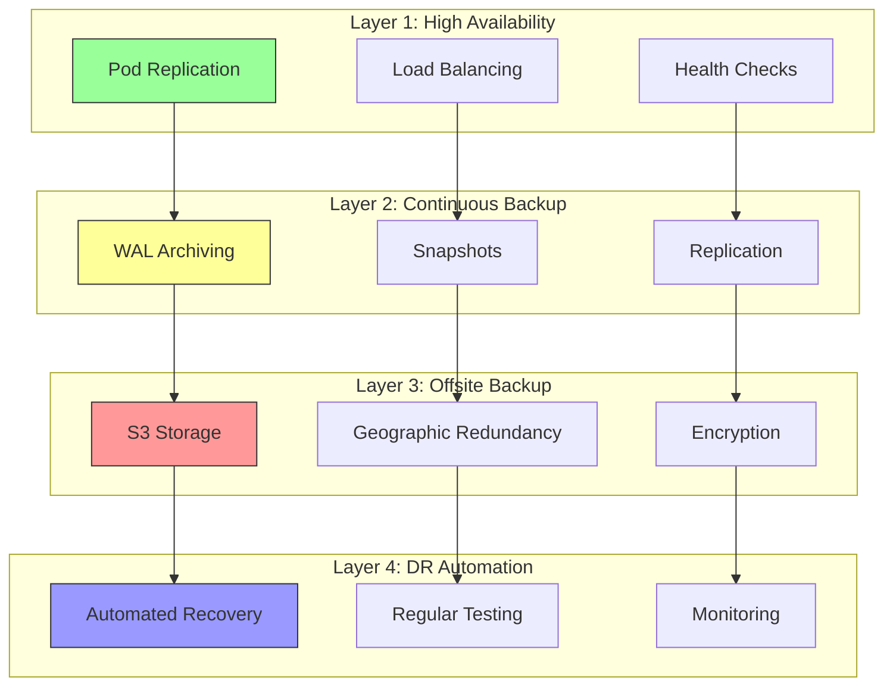

# Disaster Recovery and Business Continuity

**Operations** > Disaster Recovery

**Version**: 1.0
**Last Updated**: 2025-11-10
**Status**: Production Ready
**RTO Target**: 1-4 hours (tier-dependent)
**RPO Target**: 5 minutes - 24 hours (tier-dependent)

[← Back to Operations](./README.md) | [Documentation Home](../README.md) | [Memory Systems](../implementation/memory-systems.md)

---

## Table of Contents

1. [Introduction](#introduction)
   - [Importance of Disaster Recovery](#importance-of-disaster-recovery)
   - [RTO and RPO Targets](#rto-and-rpo-targets)
   - [Disaster Scenarios](#disaster-scenarios)
   - [DR Strategy Overview](#dr-strategy-overview)
2. [Backup Strategies](#backup-strategies)
   - [PostgreSQL Backups](#postgresql-backups)
   - [Qdrant Vector Store Backups](#qdrant-vector-store-backups)
   - [Redis Persistence](#redis-persistence)
   - [Kubernetes Cluster Backups](#kubernetes-cluster-backups)
   - [Configuration and Secrets Backups](#configuration-and-secrets-backups)
3. [Recovery Procedures](#recovery-procedures)
   - [Point-in-Time Recovery (PITR)](#point-in-time-recovery-pitr)
   - [Full Database Restoration](#full-database-restoration)
   - [Partial Recovery](#partial-recovery)
   - [Cluster Recovery](#cluster-recovery)
   - [Emergency Procedures](#emergency-procedures)
4. [RTO and RPO Targets](#rto-and-rpo-targets-1)
   - [Service Tier Definitions](#service-tier-definitions)
   - [Recovery Time Objectives](#recovery-time-objectives)
   - [Recovery Point Objectives](#recovery-point-objectives)
   - [Testing Schedule](#testing-schedule)
5. [Disaster Scenarios](#disaster-scenarios-1)
   - [Complete Cluster Failure](#complete-cluster-failure)
   - [Database Corruption](#database-corruption)
   - [Accidental Deletion](#accidental-deletion)
   - [Security Breach](#security-breach)
   - [Regional Outage](#regional-outage)
   - [Ransomware Attack](#ransomware-attack)
   - [Configuration Error](#configuration-error)
   - [Failed Deployment](#failed-deployment)
   - [Network Partition](#network-partition)
   - [Data Center Failure](#data-center-failure)
6. [Backup Automation](#backup-automation)
   - [Automated Backup Jobs](#automated-backup-jobs)
   - [Backup Verification](#backup-verification)
   - [Retention Policies](#retention-policies)
   - [Monitoring and Alerting](#monitoring-and-alerting)
7. [Testing and Validation](#testing-and-validation)
   - [Backup Restoration Tests](#backup-restoration-tests)
   - [DR Drill Procedures](#dr-drill-procedures)
   - [Validation Checklists](#validation-checklists)
   - [Test Reporting](#test-reporting)
8. [Compliance and Audit](#compliance-and-audit)
   - [Regulatory Requirements](#regulatory-requirements)
   - [Audit Trails](#audit-trails)
   - [Retention Policies](#retention-policies-1)
   - [Compliance Reporting](#compliance-reporting)
9. [Incident Response](#incident-response)
   - [Incident Classification](#incident-classification)
   - [Response Procedures](#response-procedures)
   - [Communication Plan](#communication-plan)
   - [Post-Incident Review](#post-incident-review)
10. [Multi-Region Deployment](#multi-region-deployment)
    - [Active-Active Architecture](#active-active-architecture)
    - [Active-Passive Architecture](#active-passive-architecture)
    - [Data Replication](#data-replication)
    - [Failover Procedures](#failover-procedures)

---

## Introduction

### Importance of Disaster Recovery

A comprehensive disaster recovery (DR) strategy is critical for OctoLLM's operational resilience and business continuity. Without proper DR capabilities:

**Business Impact**:
- Service disruption leads to revenue loss
- Customer trust and reputation damage
- SLA violations and contractual penalties
- Competitive disadvantage

**Data Loss Consequences**:
- Loss of critical task history and knowledge
- User data and preferences unrecoverable
- Training data for model improvements lost
- Audit trails and compliance evidence missing

**Security Implications**:
- Inability to recover from ransomware attacks
- No rollback capability after security breaches
- Forensic evidence may be destroyed
- Compliance violations (GDPR, SOC 2)

**Operational Costs**:
- Emergency recovery efforts are expensive
- Extended downtime multiplies costs
- Manual recovery is error-prone and slow
- Loss of productivity across organization

### RTO and RPO Targets

Recovery Time Objective (RTO) and Recovery Point Objective (RPO) define acceptable downtime and data loss:

| Service Tier | RTO | RPO | Backup Frequency | Use Case |
|--------------|-----|-----|------------------|----------|
| **Critical** | 1 hour | 5 minutes | Continuous + Hourly | Orchestrator, PostgreSQL |
| **Important** | 4 hours | 1 hour | Every 6 hours | Arms, Redis, Qdrant |
| **Standard** | 24 hours | 24 hours | Daily | Logs, Metrics, Analytics |
| **Archive** | 7 days | 7 days | Weekly | Historical data, Compliance |

**RTO (Recovery Time Objective)**:
- Maximum acceptable downtime
- Time to restore service functionality
- Includes detection, decision-making, and recovery

**RPO (Recovery Point Objective)**:
- Maximum acceptable data loss
- Time between last backup and failure
- Determines backup frequency

### Disaster Scenarios

OctoLLM DR planning covers these disaster categories:

#### Infrastructure Failures
- Hardware failures (disk, network, compute)
- Complete cluster failure
- Data center outage
- Network partition

#### Data Disasters
- Database corruption
- Accidental deletion
- Data inconsistency
- Storage system failure

#### Security Incidents
- Ransomware attack
- Data breach with compromise
- Unauthorized access
- Malicious insider actions

#### Operational Errors
- Failed deployment
- Configuration errors
- Software bugs causing data corruption
- Accidental infrastructure deletion

#### Natural Disasters
- Regional power outage
- Natural disasters (earthquake, flood, fire)
- Catastrophic facility failure

### DR Strategy Overview

OctoLLM implements a multi-layered DR strategy:



**Defense in Depth Approach**:
1. **Prevention**: Redundancy, health checks, validation
2. **Protection**: Continuous backups, replication, versioning
3. **Detection**: Monitoring, alerting, anomaly detection
4. **Response**: Automated failover, manual procedures
5. **Recovery**: Point-in-time restore, full restoration
6. **Learning**: Post-incident reviews, process improvement

---

## Backup Strategies

### PostgreSQL Backups

PostgreSQL is the authoritative source of truth for structured data, requiring comprehensive backup strategy.

#### Continuous Archiving with WAL

Write-Ahead Logging (WAL) provides continuous backup capability:

```yaml
---
# PostgreSQL ConfigMap with WAL archiving
apiVersion: v1
kind: ConfigMap
metadata:
  name: postgresql-config
  namespace: octollm
data:
  postgresql.conf: |
    # WAL Configuration
    wal_level = replica
    archive_mode = on
    archive_command = 'aws s3 cp %p s3://octollm-wal-archive/%f --region us-east-1'
    archive_timeout = 300

    # Checkpoint Configuration
    checkpoint_timeout = 15min
    checkpoint_completion_target = 0.9
    max_wal_size = 2GB
    min_wal_size = 1GB

    # Replication
    max_wal_senders = 10
    wal_keep_size = 1GB
    hot_standby = on

    # Performance
    shared_buffers = 2GB
    effective_cache_size = 6GB
    maintenance_work_mem = 512MB
    work_mem = 16MB

    # Logging
    log_line_prefix = '%t [%p]: [%l-1] user=%u,db=%d,app=%a,client=%h '
    log_checkpoints = on
    log_connections = on
    log_disconnections = on
    log_lock_waits = on
    log_temp_files = 0
```

#### Automated Full Backups

Daily full backups using pg_dump with compression:

```yaml
---
apiVersion: batch/v1
kind: CronJob
metadata:
  name: postgresql-backup
  namespace: octollm
  labels:
    app: postgresql-backup
    component: backup
spec:
  schedule: "0 2 * * *"  # Daily at 2 AM UTC
  concurrencyPolicy: Forbid
  successfulJobsHistoryLimit: 7
  failedJobsHistoryLimit: 3
  jobTemplate:
    spec:
      backoffLimit: 3
      activeDeadlineSeconds: 3600  # 1 hour timeout
      template:
        metadata:
          labels:
            app: postgresql-backup
        spec:
          restartPolicy: OnFailure
          serviceAccountName: backup-service-account

          # Security context
          securityContext:
            runAsUser: 999
            runAsGroup: 999
            fsGroup: 999

          containers:
          - name: backup
            image: postgres:15-alpine
            imagePullPolicy: IfNotPresent

            env:
              # PostgreSQL connection
              - name: PGHOST
                value: postgresql
              - name: PGPORT
                value: "5432"
              - name: PGDATABASE
                value: octollm
              - name: PGUSER
                valueFrom:
                  secretKeyRef:
                    name: octollm-postgres-secret
                    key: username
              - name: PGPASSWORD
                valueFrom:
                  secretKeyRef:
                    name: octollm-postgres-secret
                    key: password

              # AWS credentials
              - name: AWS_ACCESS_KEY_ID
                valueFrom:
                  secretKeyRef:
                    name: aws-credentials
                    key: access-key-id
              - name: AWS_SECRET_ACCESS_KEY
                valueFrom:
                  secretKeyRef:
                    name: aws-credentials
                    key: secret-access-key
              - name: AWS_DEFAULT_REGION
                value: us-east-1

              # Backup configuration
              - name: BACKUP_BUCKET
                value: s3://octollm-backups
              - name: RETENTION_DAYS
                value: "30"

            command:
              - /bin/sh
              - -c
              - |
                set -e

                # Generate timestamp
                TIMESTAMP=$(date +%Y%m%d-%H%M%S)
                BACKUP_FILE="octollm-${TIMESTAMP}.sql.gz"
                BACKUP_PATH="/backups/${BACKUP_FILE}"

                echo "==================================="
                echo "PostgreSQL Backup Starting"
                echo "Timestamp: $(date)"
                echo "Database: ${PGDATABASE}"
                echo "==================================="

                # Create backup directory
                mkdir -p /backups

                # Full database dump with compression
                echo "Creating database dump..."
                pg_dump -Fc \
                  --verbose \
                  --no-owner \
                  --no-acl \
                  --clean \
                  --if-exists \
                  ${PGDATABASE} | gzip -9 > "${BACKUP_PATH}"

                # Verify backup file exists
                if [ ! -f "${BACKUP_PATH}" ]; then
                  echo "ERROR: Backup file not created"
                  exit 1
                fi

                # Check backup size
                BACKUP_SIZE=$(stat -c%s "${BACKUP_PATH}" 2>/dev/null || stat -f%z "${BACKUP_PATH}")
                BACKUP_SIZE_MB=$((BACKUP_SIZE / 1024 / 1024))
                echo "Backup size: ${BACKUP_SIZE_MB} MB"

                # Minimum size check (should be at least 1MB)
                if [ ${BACKUP_SIZE_MB} -lt 1 ]; then
                  echo "ERROR: Backup size too small (${BACKUP_SIZE_MB} MB)"
                  exit 1
                fi

                # Upload to S3
                echo "Uploading to S3..."
                aws s3 cp "${BACKUP_PATH}" \
                  "${BACKUP_BUCKET}/postgresql/${BACKUP_FILE}" \
                  --storage-class STANDARD_IA \
                  --server-side-encryption AES256

                # Verify S3 upload
                if ! aws s3 ls "${BACKUP_BUCKET}/postgresql/${BACKUP_FILE}"; then
                  echo "ERROR: S3 upload verification failed"
                  exit 1
                fi

                echo "Backup uploaded successfully"

                # Create metadata file
                cat > /backups/metadata.json <<EOF
                {
                  "timestamp": "${TIMESTAMP}",
                  "database": "${PGDATABASE}",
                  "backup_file": "${BACKUP_FILE}",
                  "size_bytes": ${BACKUP_SIZE},
                  "size_mb": ${BACKUP_SIZE_MB},
                  "s3_path": "${BACKUP_BUCKET}/postgresql/${BACKUP_FILE}",
                  "pg_version": "$(pg_dump --version | head -n1)",
                  "completed_at": "$(date -u +%Y-%m-%dT%H:%M:%SZ)"
                }
                EOF

                # Upload metadata
                aws s3 cp /backups/metadata.json \
                  "${BACKUP_BUCKET}/postgresql/metadata-${TIMESTAMP}.json"

                # Clean up local files older than retention period
                echo "Cleaning up old local backups..."
                find /backups -name "octollm-*.sql.gz" -mtime +${RETENTION_DAYS} -delete

                # Test backup integrity (if small enough)
                if [ ${BACKUP_SIZE_MB} -lt 100 ]; then
                  echo "Testing backup integrity..."
                  gunzip -c "${BACKUP_PATH}" | pg_restore --list > /dev/null
                  if [ $? -eq 0 ]; then
                    echo "Backup integrity test passed"
                  else
                    echo "WARNING: Backup integrity test failed"
                  fi
                fi

                echo "==================================="
                echo "Backup completed successfully"
                echo "File: ${BACKUP_FILE}"
                echo "Size: ${BACKUP_SIZE_MB} MB"
                echo "==================================="

            resources:
              requests:
                memory: "512Mi"
                cpu: "500m"
              limits:
                memory: "2Gi"
                cpu: "2000m"

            volumeMounts:
              - name: backup-storage
                mountPath: /backups

          volumes:
            - name: backup-storage
              persistentVolumeClaim:
                claimName: backup-pvc
```

#### Backup Storage PVC

```yaml
---
apiVersion: v1
kind: PersistentVolumeClaim
metadata:
  name: backup-pvc
  namespace: octollm
spec:
  accessModes:
    - ReadWriteOnce
  resources:
    requests:
      storage: 100Gi
  storageClassName: fast-ssd
```

#### S3 Lifecycle Policy

Automate backup retention and cost optimization:

```json
{
  "Rules": [
    {
      "Id": "PostgreSQL-Backup-Lifecycle",
      "Status": "Enabled",
      "Filter": {
        "Prefix": "postgresql/"
      },
      "Transitions": [
        {
          "Days": 7,
          "StorageClass": "STANDARD_IA"
        },
        {
          "Days": 30,
          "StorageClass": "GLACIER_IR"
        },
        {
          "Days": 90,
          "StorageClass": "DEEP_ARCHIVE"
        }
      ],
      "Expiration": {
        "Days": 365
      }
    }
  ]
}
```

#### Backup Monitoring

Monitor backup success and failures:

```python
import boto3
from datetime import datetime, timedelta
import structlog

logger = structlog.get_logger()

class BackupMonitor:
    """Monitor PostgreSQL backup health."""

    def __init__(self, s3_bucket: str):
        self.s3_client = boto3.client('s3')
        self.s3_bucket = s3_bucket

    def check_backup_health(self) -> dict:
        """Check if recent backup exists and is valid."""
        # List recent backups
        response = self.s3_client.list_objects_v2(
            Bucket=self.s3_bucket,
            Prefix='postgresql/',
            MaxKeys=10
        )

        if 'Contents' not in response:
            return {
                "status": "critical",
                "message": "No backups found",
                "last_backup": None
            }

        # Sort by last modified
        backups = sorted(
            response['Contents'],
            key=lambda x: x['LastModified'],
            reverse=True
        )

        latest_backup = backups[0]
        backup_age = datetime.now(latest_backup['LastModified'].tzinfo) - latest_backup['LastModified']

        # Check backup age
        if backup_age > timedelta(days=2):
            status = "critical"
            message = f"Last backup is {backup_age.days} days old"
        elif backup_age > timedelta(hours=25):
            status = "warning"
            message = f"Last backup is {backup_age.total_seconds() / 3600:.1f} hours old"
        else:
            status = "healthy"
            message = "Backups are current"

        # Check backup size
        size_mb = latest_backup['Size'] / (1024 * 1024)
        if size_mb < 1:
            status = "critical"
            message = f"Latest backup suspiciously small: {size_mb:.2f} MB"

        return {
            "status": status,
            "message": message,
            "last_backup": latest_backup['LastModified'].isoformat(),
            "backup_age_hours": backup_age.total_seconds() / 3600,
            "backup_size_mb": size_mb,
            "backup_key": latest_backup['Key']
        }

    def verify_backup_integrity(self, backup_key: str) -> bool:
        """Download and verify backup integrity."""
        try:
            # Download metadata
            metadata_key = backup_key.replace('.sql.gz', '-metadata.json')
            response = self.s3_client.get_object(
                Bucket=self.s3_bucket,
                Key=metadata_key
            )

            metadata = json.loads(response['Body'].read())

            # Verify size matches
            backup_obj = self.s3_client.head_object(
                Bucket=self.s3_bucket,
                Key=backup_key
            )

            if backup_obj['ContentLength'] != metadata['size_bytes']:
                logger.error(
                    "backup_size_mismatch",
                    expected=metadata['size_bytes'],
                    actual=backup_obj['ContentLength']
                )
                return False

            return True

        except Exception as e:
            logger.error("backup_verification_failed", error=str(e))
            return False

# Prometheus metrics
from prometheus_client import Gauge, Counter

backup_age_hours = Gauge(
    'octollm_postgresql_backup_age_hours',
    'Hours since last successful backup'
)

backup_size_mb = Gauge(
    'octollm_postgresql_backup_size_mb',
    'Size of latest backup in MB'
)

backup_failures = Counter(
    'octollm_postgresql_backup_failures_total',
    'Total number of backup failures'
)

# Monitor backup health
monitor = BackupMonitor(s3_bucket='octollm-backups')
health = monitor.check_backup_health()

backup_age_hours.set(health['backup_age_hours'])
backup_size_mb.set(health['backup_size_mb'])

if health['status'] in ['critical', 'warning']:
    backup_failures.inc()
    logger.warning("backup_health_issue", **health)
```

### Qdrant Vector Store Backups

Vector embeddings require specialized backup procedures.

#### Snapshot-Based Backups

```python
from qdrant_client import QdrantClient
from qdrant_client.models import SnapshotDescription
import boto3
from datetime import datetime
from typing import List, Dict
import structlog

logger = structlog.get_logger()

class QdrantBackupManager:
    """Manage Qdrant vector store backups."""

    def __init__(self, qdrant_url: str, s3_bucket: str):
        self.client = QdrantClient(url=qdrant_url)
        self.s3_client = boto3.client('s3')
        self.s3_bucket = s3_bucket

    async def backup_all_collections(self) -> Dict[str, str]:
        """Create snapshots of all collections and upload to S3."""
        timestamp = datetime.utcnow().strftime("%Y%m%d-%H%M%S")
        results = {}

        # Get all collections
        collections = self.client.get_collections().collections

        logger.info(
            "qdrant_backup_started",
            timestamp=timestamp,
            collections=[c.name for c in collections]
        )

        for collection in collections:
            try:
                # Create snapshot
                snapshot_info = self.client.create_snapshot(
                    collection_name=collection.name
                )

                logger.info(
                    "snapshot_created",
                    collection=collection.name,
                    snapshot=snapshot_info.name
                )

                # Download snapshot
                snapshot_data = self.client.download_snapshot(
                    collection_name=collection.name,
                    snapshot_name=snapshot_info.name
                )

                # Upload to S3
                s3_key = f"qdrant/{collection.name}/{timestamp}-{snapshot_info.name}"

                self.s3_client.put_object(
                    Bucket=self.s3_bucket,
                    Key=s3_key,
                    Body=snapshot_data,
                    ServerSideEncryption='AES256',
                    StorageClass='STANDARD_IA'
                )

                logger.info(
                    "snapshot_uploaded",
                    collection=collection.name,
                    s3_key=s3_key
                )

                results[collection.name] = s3_key

                # Delete local snapshot (save space)
                self.client.delete_snapshot(
                    collection_name=collection.name,
                    snapshot_name=snapshot_info.name
                )

            except Exception as e:
                logger.error(
                    "snapshot_backup_failed",
                    collection=collection.name,
                    error=str(e)
                )
                results[collection.name] = f"ERROR: {str(e)}"

        logger.info("qdrant_backup_completed", results=results)
        return results

    async def restore_collection(
        self,
        collection_name: str,
        snapshot_s3_key: str,
        overwrite: bool = False
    ) -> bool:
        """Restore collection from S3 snapshot."""
        try:
            # Download from S3
            response = self.s3_client.get_object(
                Bucket=self.s3_bucket,
                Key=snapshot_s3_key
            )

            snapshot_data = response['Body'].read()

            # Write to temp file
            import tempfile
            with tempfile.NamedTemporaryFile(delete=False, suffix='.snapshot') as f:
                f.write(snapshot_data)
                snapshot_path = f.name

            # Delete existing collection if overwrite
            if overwrite:
                try:
                    self.client.delete_collection(collection_name)
                    logger.info("collection_deleted_for_restore", collection=collection_name)
                except Exception:
                    pass  # Collection might not exist

            # Upload snapshot to Qdrant
            self.client.upload_snapshot(
                collection_name=collection_name,
                snapshot_path=snapshot_path
            )

            # Recover from snapshot
            self.client.recover_snapshot(
                collection_name=collection_name,
                snapshot_name=snapshot_path.split('/')[-1]
            )

            logger.info("collection_restored", collection=collection_name)
            return True

        except Exception as e:
            logger.error(
                "collection_restore_failed",
                collection=collection_name,
                error=str(e)
            )
            return False

    def list_available_backups(self, collection_name: str = None) -> List[Dict]:
        """List available backups from S3."""
        prefix = f"qdrant/{collection_name}/" if collection_name else "qdrant/"

        response = self.s3_client.list_objects_v2(
            Bucket=self.s3_bucket,
            Prefix=prefix
        )

        if 'Contents' not in response:
            return []

        backups = []
        for obj in response['Contents']:
            # Parse key to extract info
            # Format: qdrant/{collection}/{timestamp}-{snapshot_name}
            parts = obj['Key'].split('/')
            if len(parts) >= 3:
                collection = parts[1]
                filename = parts[2]

                backups.append({
                    'collection': collection,
                    'timestamp': filename.split('-')[0] if '-' in filename else 'unknown',
                    's3_key': obj['Key'],
                    'size_mb': obj['Size'] / (1024 * 1024),
                    'last_modified': obj['LastModified'].isoformat()
                })

        return sorted(backups, key=lambda x: x['last_modified'], reverse=True)
```

#### Automated Qdrant Backup CronJob

```yaml
---
apiVersion: batch/v1
kind: CronJob
metadata:
  name: qdrant-backup
  namespace: octollm
spec:
  schedule: "0 */6 * * *"  # Every 6 hours
  concurrencyPolicy: Forbid
  successfulJobsHistoryLimit: 7
  failedJobsHistoryLimit: 3
  jobTemplate:
    spec:
      template:
        metadata:
          labels:
            app: qdrant-backup
        spec:
          restartPolicy: OnFailure
          serviceAccountName: backup-service-account

          containers:
          - name: backup
            image: octollm/qdrant-backup:1.0
            env:
              - name: QDRANT_URL
                value: "http://qdrant:6333"
              - name: AWS_ACCESS_KEY_ID
                valueFrom:
                  secretKeyRef:
                    name: aws-credentials
                    key: access-key-id
              - name: AWS_SECRET_ACCESS_KEY
                valueFrom:
                  secretKeyRef:
                    name: aws-credentials
                    key: secret-access-key
              - name: S3_BUCKET
                value: "octollm-backups"

            command:
              - python
              - -c
              - |
                import asyncio
                from qdrant_backup import QdrantBackupManager

                async def main():
                    manager = QdrantBackupManager(
                        qdrant_url=os.environ['QDRANT_URL'],
                        s3_bucket=os.environ['S3_BUCKET']
                    )
                    await manager.backup_all_collections()

                asyncio.run(main())

            resources:
              requests:
                memory: "256Mi"
                cpu: "250m"
              limits:
                memory: "1Gi"
                cpu: "1000m"
```

### Redis Persistence

Redis stores ephemeral cache data but still requires backup for fast recovery.

#### Redis Configuration

```yaml
---
apiVersion: v1
kind: ConfigMap
metadata:
  name: redis-config
  namespace: octollm
data:
  redis.conf: |
    # RDB Persistence
    save 900 1       # Save after 900 sec if at least 1 key changed
    save 300 10      # Save after 300 sec if at least 10 keys changed
    save 60 10000    # Save after 60 sec if at least 10000 keys changed

    stop-writes-on-bgsave-error yes
    rdbcompression yes
    rdbchecksum yes
    dbfilename dump.rdb
    dir /data

    # AOF Persistence
    appendonly yes
    appendfilename "appendonly.aof"
    appendfsync everysec
    no-appendfsync-on-rewrite no
    auto-aof-rewrite-percentage 100
    auto-aof-rewrite-min-size 64mb
    aof-load-truncated yes
    aof-use-rdb-preamble yes

    # Memory management
    maxmemory 2gb
    maxmemory-policy allkeys-lru

    # Security
    requirepass ${REDIS_PASSWORD}

    # Logging
    loglevel notice
    logfile /var/log/redis/redis-server.log
```

#### Redis Backup Script

```bash
#!/bin/bash
# redis-backup.sh

set -e

REDIS_HOST="${REDIS_HOST:-redis}"
REDIS_PORT="${REDIS_PORT:-6379}"
REDIS_PASSWORD="${REDIS_PASSWORD}"
S3_BUCKET="${S3_BUCKET:-s3://octollm-backups}"
BACKUP_DIR="/backups"

TIMESTAMP=$(date +%Y%m%d-%H%M%S)
BACKUP_FILE="redis-${TIMESTAMP}.rdb"

echo "==================================="
echo "Redis Backup Starting"
echo "Timestamp: $(date)"
echo "==================================="

# Create backup directory
mkdir -p ${BACKUP_DIR}

# Trigger BGSAVE
redis-cli -h ${REDIS_HOST} -p ${REDIS_PORT} -a "${REDIS_PASSWORD}" BGSAVE

# Wait for BGSAVE to complete
while true; do
    LASTSAVE=$(redis-cli -h ${REDIS_HOST} -p ${REDIS_PORT} -a "${REDIS_PASSWORD}" LASTSAVE)
    sleep 5
    NEWSAVE=$(redis-cli -h ${REDIS_HOST} -p ${REDIS_PORT} -a "${REDIS_PASSWORD}" LASTSAVE)

    if [ "${LASTSAVE}" != "${NEWSAVE}" ]; then
        break
    fi
done

echo "BGSAVE completed"

# Copy RDB file
kubectl exec -n octollm redis-0 -- cat /data/dump.rdb > ${BACKUP_DIR}/${BACKUP_FILE}

# Compress
gzip ${BACKUP_DIR}/${BACKUP_FILE}

# Upload to S3
aws s3 cp ${BACKUP_DIR}/${BACKUP_FILE}.gz \
    ${S3_BUCKET}/redis/${BACKUP_FILE}.gz \
    --storage-class STANDARD_IA

echo "Backup uploaded successfully"

# Clean up
rm ${BACKUP_DIR}/${BACKUP_FILE}.gz

# Verify
if aws s3 ls ${S3_BUCKET}/redis/${BACKUP_FILE}.gz; then
    echo "Backup verified in S3"
else
    echo "ERROR: Backup verification failed"
    exit 1
fi

echo "==================================="
echo "Backup completed successfully"
echo "==================================="
```

### Kubernetes Cluster Backups

Use Velero for comprehensive cluster-level backups.

#### Velero Installation

```bash
# Install Velero CLI
wget https://github.com/vmware-tanzu/velero/releases/download/v1.12.0/velero-v1.12.0-linux-amd64.tar.gz
tar -xvf velero-v1.12.0-linux-amd64.tar.gz
sudo mv velero-v1.12.0-linux-amd64/velero /usr/local/bin/

# Install Velero in cluster
velero install \
  --provider aws \
  --plugins velero/velero-plugin-for-aws:v1.8.0 \
  --bucket octollm-velero-backups \
  --backup-location-config region=us-east-1 \
  --snapshot-location-config region=us-east-1 \
  --secret-file ./credentials-velero
```

#### Scheduled Backups

```yaml
---
# Daily full cluster backup
apiVersion: velero.io/v1
kind: Schedule
metadata:
  name: octollm-daily-backup
  namespace: velero
spec:
  schedule: "0 1 * * *"  # Daily at 1 AM
  template:
    includedNamespaces:
      - octollm
    excludedNamespaces: []
    includedResources:
      - '*'
    excludedResources:
      - events
      - events.events.k8s.io
    includeClusterResources: true
    snapshotVolumes: true
    ttl: 720h  # 30 days
    storageLocation: default
    volumeSnapshotLocations:
      - default
    labelSelector:
      matchLabels:
        backup: "true"

---
# Hourly backup of critical resources
apiVersion: velero.io/v1
kind: Schedule
metadata:
  name: octollm-hourly-critical
  namespace: velero
spec:
  schedule: "0 * * * *"  # Every hour
  template:
    includedNamespaces:
      - octollm
    includedResources:
      - configmaps
      - secrets
      - persistentvolumeclaims
      - deployments
      - statefulsets
    excludedResources:
      - events
    snapshotVolumes: true
    ttl: 168h  # 7 days
    storageLocation: default
    labelSelector:
      matchLabels:
        tier: critical
```

### Configuration and Secrets Backups

Backup Kubernetes configurations and secrets securely.

#### Backup Script

```bash
#!/bin/bash
# backup-k8s-configs.sh

set -e

NAMESPACE="octollm"
BACKUP_DIR="/backups/k8s-configs"
TIMESTAMP=$(date +%Y%m%d-%H%M%S)
S3_BUCKET="s3://octollm-backups"

echo "Backing up Kubernetes configurations..."

mkdir -p ${BACKUP_DIR}/${TIMESTAMP}

# Backup ConfigMaps
kubectl get configmaps -n ${NAMESPACE} -o yaml > ${BACKUP_DIR}/${TIMESTAMP}/configmaps.yaml

# Backup Secrets (encrypted)
kubectl get secrets -n ${NAMESPACE} -o yaml > ${BACKUP_DIR}/${TIMESTAMP}/secrets.yaml

# Backup Deployments
kubectl get deployments -n ${NAMESPACE} -o yaml > ${BACKUP_DIR}/${TIMESTAMP}/deployments.yaml

# Backup StatefulSets
kubectl get statefulsets -n ${NAMESPACE} -o yaml > ${BACKUP_DIR}/${TIMESTAMP}/statefulsets.yaml

# Backup Services
kubectl get services -n ${NAMESPACE} -o yaml > ${BACKUP_DIR}/${TIMESTAMP}/services.yaml

# Backup PVCs
kubectl get pvc -n ${NAMESPACE} -o yaml > ${BACKUP_DIR}/${TIMESTAMP}/pvcs.yaml

# Create tarball
tar -czf ${BACKUP_DIR}/k8s-config-${TIMESTAMP}.tar.gz -C ${BACKUP_DIR} ${TIMESTAMP}

# Encrypt with GPG
gpg --encrypt \
    --recipient backup@octollm.example.com \
    ${BACKUP_DIR}/k8s-config-${TIMESTAMP}.tar.gz

# Upload to S3
aws s3 cp ${BACKUP_DIR}/k8s-config-${TIMESTAMP}.tar.gz.gpg \
    ${S3_BUCKET}/k8s-configs/k8s-config-${TIMESTAMP}.tar.gz.gpg

# Clean up
rm -rf ${BACKUP_DIR}/${TIMESTAMP}
rm ${BACKUP_DIR}/k8s-config-${TIMESTAMP}.tar.gz*

echo "Kubernetes configurations backed up successfully"
```

---

## Recovery Procedures

### Point-in-Time Recovery (PITR)

Restore PostgreSQL to a specific point in time using WAL archives.

#### PITR Script

```bash
#!/bin/bash
# restore-postgres-pitr.sh

set -e

# Configuration
TARGET_TIME="${1:-$(date -u +"%Y-%m-%d %H:%M:%S UTC")}"
POSTGRES_NAMESPACE="octollm"
POSTGRES_STATEFULSET="postgresql"
BACKUP_BUCKET="s3://octollm-backups"
RESTORE_DIR="/restore"

echo "==================================="
echo "PostgreSQL Point-in-Time Recovery"
echo "Target Time: ${TARGET_TIME}"
echo "==================================="

# Step 1: Stop PostgreSQL
echo "Stopping PostgreSQL..."
kubectl scale statefulset ${POSTGRES_STATEFULSET} -n ${POSTGRES_NAMESPACE} --replicas=0

# Wait for pods to terminate
kubectl wait --for=delete pod -l app=postgresql -n ${POSTGRES_NAMESPACE} --timeout=300s

# Step 2: Download latest base backup
echo "Downloading base backup..."
LATEST_BACKUP=$(aws s3 ls ${BACKUP_BUCKET}/postgresql/ | sort | tail -n 1 | awk '{print $4}')
aws s3 cp ${BACKUP_BUCKET}/postgresql/${LATEST_BACKUP} /tmp/backup.sql.gz

# Step 3: Restore base backup
echo "Restoring base backup..."
gunzip -c /tmp/backup.sql.gz | kubectl exec -i -n ${POSTGRES_NAMESPACE} postgresql-0 -- \
    psql -U octollm -d octollm

# Step 4: Configure recovery
echo "Configuring point-in-time recovery..."
kubectl exec -n ${POSTGRES_NAMESPACE} postgresql-0 -- bash -c "cat > /var/lib/postgresql/data/recovery.conf <<EOF
restore_command = 'aws s3 cp ${BACKUP_BUCKET}/wal/%f %p'
recovery_target_time = '${TARGET_TIME}'
recovery_target_action = 'promote'
EOF"

# Step 5: Start PostgreSQL in recovery mode
echo "Starting PostgreSQL in recovery mode..."
kubectl scale statefulset ${POSTGRES_STATEFULSET} -n ${POSTGRES_NAMESPACE} --replicas=1

# Wait for recovery to complete
echo "Waiting for recovery to complete..."
sleep 30

# Step 6: Verify recovery
echo "Verifying recovery..."
kubectl exec -n ${POSTGRES_NAMESPACE} postgresql-0 -- psql -U octollm -d octollm -c "\
    SELECT pg_is_in_recovery(), \
           pg_last_wal_replay_lsn(), \
           now() - pg_last_xact_replay_timestamp() AS replication_lag;"

echo "==================================="
echo "Recovery completed successfully"
echo "==================================="
```

#### Recovery Configuration

```sql
-- recovery.conf (for PostgreSQL 11 and earlier)
restore_command = 'aws s3 cp s3://octollm-wal-archive/%f %p'
recovery_target_time = '2025-11-10 14:30:00 UTC'
recovery_target_action = 'promote'

-- For PostgreSQL 12+, use postgresql.conf:
-- restore_command = 'aws s3 cp s3://octollm-wal-archive/%f %p'
-- recovery_target_time = '2025-11-10 14:30:00 UTC'
-- And create signal file: touch /var/lib/postgresql/data/recovery.signal
```

### Full Database Restoration

Complete database restoration from backup.

#### Restoration Script

```bash
#!/bin/bash
# restore-postgres-full.sh

set -e

BACKUP_FILE="${1}"
POSTGRES_NAMESPACE="octollm"
POSTGRES_STATEFULSET="postgresql"
BACKUP_BUCKET="s3://octollm-backups"

if [ -z "${BACKUP_FILE}" ]; then
    echo "Usage: $0 <backup_file>"
    echo "Available backups:"
    aws s3 ls ${BACKUP_BUCKET}/postgresql/
    exit 1
fi

echo "==================================="
echo "PostgreSQL Full Restoration"
echo "Backup: ${BACKUP_FILE}"
echo "==================================="

# Confirmation prompt
read -p "This will DELETE all current data. Continue? (yes/no): " CONFIRM
if [ "${CONFIRM}" != "yes" ]; then
    echo "Restoration cancelled"
    exit 0
fi

# Step 1: Scale down PostgreSQL
echo "Scaling down PostgreSQL..."
kubectl scale statefulset ${POSTGRES_STATEFULSET} -n ${POSTGRES_NAMESPACE} --replicas=0
kubectl wait --for=delete pod -l app=postgresql -n ${POSTGRES_NAMESPACE} --timeout=300s

# Step 2: Download backup
echo "Downloading backup..."
aws s3 cp ${BACKUP_BUCKET}/postgresql/${BACKUP_FILE} /tmp/restore.sql.gz

# Step 3: Verify backup integrity
echo "Verifying backup integrity..."
if ! gunzip -t /tmp/restore.sql.gz; then
    echo "ERROR: Backup file is corrupted"
    exit 1
fi

# Step 4: Scale up PostgreSQL
echo "Starting PostgreSQL..."
kubectl scale statefulset ${POSTGRES_STATEFULSET} -n ${POSTGRES_NAMESPACE} --replicas=1
kubectl wait --for=condition=ready pod -l app=postgresql -n ${POSTGRES_NAMESPACE} --timeout=300s

# Step 5: Drop existing database
echo "Dropping existing database..."
kubectl exec -n ${POSTGRES_NAMESPACE} postgresql-0 -- psql -U postgres -c "DROP DATABASE IF EXISTS octollm;"
kubectl exec -n ${POSTGRES_NAMESPACE} postgresql-0 -- psql -U postgres -c "CREATE DATABASE octollm OWNER octollm;"

# Step 6: Restore backup
echo "Restoring backup..."
gunzip -c /tmp/restore.sql.gz | kubectl exec -i -n ${POSTGRES_NAMESPACE} postgresql-0 -- \
    pg_restore \
    --verbose \
    --no-owner \
    --no-acl \
    --clean \
    --if-exists \
    -U octollm \
    -d octollm

# Step 7: Verify restoration
echo "Verifying restoration..."
TABLES=$(kubectl exec -n ${POSTGRES_NAMESPACE} postgresql-0 -- psql -U octollm -d octollm -t -c "\
    SELECT COUNT(*) FROM information_schema.tables WHERE table_schema = 'public';")

echo "Tables restored: ${TABLES}"

if [ "${TABLES}" -eq 0 ]; then
    echo "ERROR: No tables found after restoration"
    exit 1
fi

# Step 8: Run ANALYZE
echo "Running ANALYZE..."
kubectl exec -n ${POSTGRES_NAMESPACE} postgresql-0 -- psql -U octollm -d octollm -c "ANALYZE;"

# Step 9: Verify data integrity
echo "Verifying data integrity..."
kubectl exec -n ${POSTGRES_NAMESPACE} postgresql-0 -- psql -U octollm -d octollm -c "\
    SELECT 'entities' AS table_name, COUNT(*) FROM entities
    UNION ALL
    SELECT 'task_history', COUNT(*) FROM task_history
    UNION ALL
    SELECT 'action_log', COUNT(*) FROM action_log;"

# Clean up
rm /tmp/restore.sql.gz

echo "==================================="
echo "Restoration completed successfully"
echo "==================================="
```

### Partial Recovery

Restore specific tables or data without full restoration.

```bash
#!/bin/bash
# restore-postgres-partial.sh

set -e

BACKUP_FILE="${1}"
TABLE_NAME="${2}"
POSTGRES_NAMESPACE="octollm"

if [ -z "${BACKUP_FILE}" ] || [ -z "${TABLE_NAME}" ]; then
    echo "Usage: $0 <backup_file> <table_name>"
    exit 1
fi

echo "Partial restoration: ${TABLE_NAME} from ${BACKUP_FILE}"

# Download backup
aws s3 cp s3://octollm-backups/postgresql/${BACKUP_FILE} /tmp/backup.sql.gz

# Extract and restore specific table
gunzip -c /tmp/backup.sql.gz | pg_restore \
    --verbose \
    --no-owner \
    --no-acl \
    --table=${TABLE_NAME} \
    -U octollm \
    -d octollm

rm /tmp/backup.sql.gz

echo "Partial restoration completed"
```

### Cluster Recovery

Restore entire Kubernetes cluster using Velero.

```bash
#!/bin/bash
# velero-restore.sh

set -e

BACKUP_NAME="${1}"

if [ -z "${BACKUP_NAME}" ]; then
    echo "Usage: $0 <backup_name>"
    echo "Available backups:"
    velero backup get
    exit 1
fi

echo "==================================="
echo "Cluster Recovery with Velero"
echo "Backup: ${BACKUP_NAME}"
echo "==================================="

# Confirmation
read -p "Restore from backup ${BACKUP_NAME}? (yes/no): " CONFIRM
if [ "${CONFIRM}" != "yes" ]; then
    echo "Restore cancelled"
    exit 0
fi

# Create restore
velero restore create --from-backup ${BACKUP_NAME}

# Monitor restore progress
echo "Monitoring restore progress..."
velero restore describe ${BACKUP_NAME} --details

# Wait for completion
while true; do
    STATUS=$(velero restore get | grep ${BACKUP_NAME} | awk '{print $3}')

    if [ "${STATUS}" = "Completed" ]; then
        echo "Restore completed successfully"
        break
    elif [ "${STATUS}" = "Failed" ] || [ "${STATUS}" = "PartiallyFailed" ]; then
        echo "ERROR: Restore failed or partially failed"
        velero restore logs ${BACKUP_NAME}
        exit 1
    fi

    echo "Restore status: ${STATUS}"
    sleep 10
done

# Verify pods are running
echo "Verifying pods..."
kubectl get pods -n octollm

echo "==================================="
echo "Cluster recovery completed"
echo "==================================="
```

### Emergency Procedures

#### Critical Service Down

```bash
#!/bin/bash
# emergency-recovery.sh

set -e

SERVICE="${1}"

case ${SERVICE} in
    "postgresql")
        echo "Emergency PostgreSQL recovery..."

        # Try restarting first
        kubectl rollout restart statefulset/postgresql -n octollm

        # If restart fails, restore from latest backup
        if ! kubectl wait --for=condition=ready pod -l app=postgresql -n octollm --timeout=300s; then
            echo "Restart failed, restoring from backup..."
            LATEST_BACKUP=$(aws s3 ls s3://octollm-backups/postgresql/ | sort | tail -n 1 | awk '{print $4}')
            ./restore-postgres-full.sh ${LATEST_BACKUP}
        fi
        ;;

    "qdrant")
        echo "Emergency Qdrant recovery..."
        kubectl rollout restart statefulset/qdrant -n octollm
        ;;

    "orchestrator")
        echo "Emergency Orchestrator recovery..."
        kubectl rollout restart deployment/orchestrator -n octollm
        ;;

    *)
        echo "Unknown service: ${SERVICE}"
        echo "Supported services: postgresql, qdrant, orchestrator"
        exit 1
        ;;
esac

echo "Emergency recovery initiated for ${SERVICE}"
```

---

## RTO and RPO Targets

### Service Tier Definitions

| Tier | Services | Description |
|------|----------|-------------|
| **Critical** | Orchestrator, PostgreSQL, API Gateway | Core services required for operation |
| **Important** | Arms (all), Qdrant, Redis | Specialist services and data stores |
| **Standard** | Monitoring, Logging, Metrics | Observability and support services |
| **Archive** | Historical data, Audit logs | Long-term storage and compliance |

### Recovery Time Objectives

| Tier | RTO | Justification | Recovery Procedure |
|------|-----|---------------|-------------------|
| **Critical** | 1 hour | Service disruption impacts all users | Automated failover + hot standby |
| **Important** | 4 hours | Graceful degradation possible | Restore from backup + warm standby |
| **Standard** | 24 hours | Non-essential for core operation | Manual restore from daily backup |
| **Archive** | 7 days | Historical data, rarely accessed | Restore from cold storage |

### Recovery Point Objectives

| Tier | RPO | Backup Frequency | Acceptable Data Loss |
|------|-----|------------------|---------------------|
| **Critical** | 5 minutes | Continuous (WAL) + Hourly | <5 minutes of transactions |
| **Important** | 1 hour | Every 6 hours | <1 hour of task history |
| **Standard** | 24 hours | Daily | <24 hours of logs |
| **Archive** | 7 days | Weekly | <7 days of historical data |

### Testing Schedule

| Test Type | Frequency | Scope | Duration | Success Criteria |
|-----------|-----------|-------|----------|------------------|
| **Backup Verification** | Daily | All backups | 15 min | Backup exists, correct size |
| **Partial Restore** | Weekly | Single table | 30 min | Data restored correctly |
| **Full Database Restore** | Monthly | PostgreSQL | 2 hours | Complete restoration + validation |
| **Cluster Failover** | Quarterly | Full cluster | 4 hours | All services operational |
| **DR Drill** | Annually | Complete DR | 8 hours | Full recovery from zero |

---

## Disaster Scenarios

### Complete Cluster Failure

**Scenario**: Entire Kubernetes cluster becomes unavailable due to catastrophic failure.

**Detection**:
- All health checks failing
- No pods responding
- kubectl commands timeout
- Monitoring shows complete outage

**Response Procedure**:

1. **Assess Damage** (5 minutes)
   ```bash
   # Check cluster status
   kubectl cluster-info
   kubectl get nodes
   kubectl get pods --all-namespaces
   ```

2. **Activate DR Plan** (10 minutes)
   ```bash
   # Notify stakeholders
   ./notify-incident.sh "Cluster failure detected"

   # Provision new cluster if needed
   eksctl create cluster \
     --name octollm-dr \
     --region us-west-2 \
     --nodegroup-name standard-workers \
     --node-type m5.xlarge \
     --nodes 5
   ```

3. **Restore Infrastructure** (30 minutes)
   ```bash
   # Install Velero
   velero install --provider aws ...

   # Restore latest cluster backup
   LATEST_BACKUP=$(velero backup get | tail -n 1 | awk '{print $1}')
   velero restore create --from-backup ${LATEST_BACKUP}

   # Monitor restoration
   velero restore describe ${LATEST_BACKUP}
   ```

4. **Restore Data Stores** (2 hours)
   ```bash
   # Restore PostgreSQL
   ./restore-postgres-full.sh $(latest_postgres_backup)

   # Restore Qdrant
   ./restore-qdrant.sh --all-collections

   # Redis will rebuild cache automatically
   ```

5. **Validate Services** (30 minutes)
   ```bash
   # Run smoke tests
   ./smoke-tests.sh

   # Verify data integrity
   ./verify-data-integrity.sh
   ```

6. **Resume Operations** (15 minutes)
   ```bash
   # Update DNS to point to new cluster
   ./update-dns.sh

   # Notify stakeholders of recovery
   ./notify-incident.sh "Services restored"
   ```

**Total RTO**: ~4 hours

### Database Corruption

**Scenario**: PostgreSQL database becomes corrupted, queries failing.

**Detection**:
- PostgreSQL errors in logs
- Data integrity check failures
- Query timeouts
- Inconsistent data returned

**Response Procedure**:

1. **Isolate Problem** (5 minutes)
   ```bash
   # Stop writes to database
   kubectl scale deployment/orchestrator -n octollm --replicas=0

   # Check corruption extent
   kubectl exec -n octollm postgresql-0 -- psql -U octollm -c "\
       SELECT datname, pg_database_size(datname) \
       FROM pg_database WHERE datname = 'octollm';"
   ```

2. **Assess Damage** (10 minutes)
   ```bash
   # Run integrity checks
   kubectl exec -n octollm postgresql-0 -- psql -U octollm -d octollm -c "\
       SELECT schemaname, tablename, \
              pg_size_pretty(pg_total_relation_size(schemaname||'.'||tablename)) \
       FROM pg_tables WHERE schemaname = 'public';"

   # Check for corrupt tables
   kubectl exec -n octollm postgresql-0 -- vacuumdb --analyze-only -U octollm octollm
   ```

3. **Determine Recovery Strategy** (5 minutes)
   - **Minor corruption**: Repair in place
   - **Major corruption**: Restore from backup

4. **Execute Recovery** (1-2 hours)

   **Option A: Repair in place** (if minor)
   ```bash
   # Reindex database
   kubectl exec -n octollm postgresql-0 -- psql -U octollm -d octollm -c "REINDEX DATABASE octollm;"

   # Run vacuum
   kubectl exec -n octollm postgresql-0 -- vacuumdb --full -U octollm octollm
   ```

   **Option B: Restore from backup** (if major)
   ```bash
   # Point-in-time recovery to before corruption
   CORRUPTION_TIME="2025-11-10 10:00:00 UTC"
   ./restore-postgres-pitr.sh "${CORRUPTION_TIME}"
   ```

5. **Validate Restoration** (15 minutes)
   ```bash
   # Run data integrity tests
   ./test-database-integrity.sh

   # Verify row counts
   kubectl exec -n octollm postgresql-0 -- psql -U octollm -d octollm -c "\
       SELECT 'entities', COUNT(*) FROM entities
       UNION ALL
       SELECT 'task_history', COUNT(*) FROM task_history;"
   ```

6. **Resume Operations** (10 minutes)
   ```bash
   # Restart services
   kubectl scale deployment/orchestrator -n octollm --replicas=3

   # Monitor for issues
   kubectl logs -f -l app=orchestrator -n octollm
   ```

**Total RTO**: 2-4 hours (depending on corruption extent)

### Accidental Deletion

**Scenario**: Critical data accidentally deleted by user or system error.

**Detection**:
- User reports missing data
- Monitoring shows sudden drop in row counts
- Application errors due to missing records

**Response Procedure**:

1. **Identify Scope** (5 minutes)
   ```sql
   -- Check recent deletions in audit log
   SELECT *
   FROM action_log
   WHERE action_type = 'DELETE'
     AND timestamp > NOW() - INTERVAL '1 hour'
   ORDER BY timestamp DESC;
   ```

2. **Stop Further Damage** (5 minutes)
   ```bash
   # Disable write access temporarily
   kubectl scale deployment/orchestrator -n octollm --replicas=0

   # Backup current state
   pg_dump -U octollm octollm > /tmp/current-state-$(date +%s).sql
   ```

3. **Restore Deleted Data** (30 minutes)

   **Option A: Restore from audit trail** (if tracked)
   ```sql
   -- Find deleted records in audit
   SELECT action_details
   FROM action_log
   WHERE action_type = 'DELETE'
     AND timestamp > '2025-11-10 10:00:00';

   -- Restore records
   INSERT INTO entities (id, entity_type, name, properties)
   SELECT ...
   FROM action_log
   WHERE ...;
   ```

   **Option B: Point-in-time recovery**
   ```bash
   # Determine deletion time
   DELETION_TIME="2025-11-10 10:15:00 UTC"

   # Restore to just before deletion
   RESTORE_TIME=$(date -d "${DELETION_TIME} -5 minutes" +"%Y-%m-%d %H:%M:%S UTC")
   ./restore-postgres-pitr.sh "${RESTORE_TIME}"
   ```

   **Option C: Partial restore from backup**
   ```bash
   # Restore specific tables
   ./restore-postgres-partial.sh latest-backup.sql.gz entities
   ```

4. **Validate Recovery** (10 minutes)
   ```bash
   # Verify restored data
   ./verify-restored-data.sh

   # Check for consistency
   kubectl exec -n octollm postgresql-0 -- psql -U octollm -d octollm -c "\
       SELECT COUNT(*) FROM entities WHERE deleted_at IS NOT NULL;"
   ```

5. **Resume Operations** (5 minutes)
   ```bash
   kubectl scale deployment/orchestrator -n octollm --replicas=3
   ```

**Total RTO**: 1 hour
**Total RPO**: 5 minutes (if using PITR)

### Security Breach

**Scenario**: Unauthorized access detected, potential data compromise.

**Detection**:
- Intrusion detection alerts
- Unusual activity patterns
- Unauthorized API calls
- Data exfiltration detected

**Response Procedure**:

1. **Contain Breach** (IMMEDIATE)
   ```bash
   # Isolate compromised systems
   kubectl cordon <compromised-node>

   # Block external access
   kubectl patch service api-gateway -n octollm -p '{"spec":{"type":"ClusterIP"}}'

   # Revoke credentials
   ./revoke-all-tokens.sh
   ```

2. **Assess Damage** (30 minutes)
   ```bash
   # Check audit logs
   kubectl exec -n octollm postgresql-0 -- psql -U octollm -d octollm -c "\
       SELECT *
       FROM audit_logs
       WHERE timestamp > NOW() - INTERVAL '24 hours'
       ORDER BY timestamp DESC;"

   # Identify compromised data
   ./identify-compromised-data.sh
   ```

3. **Preserve Evidence** (15 minutes)
   ```bash
   # Snapshot all volumes
   ./snapshot-all-volumes.sh

   # Export logs
   kubectl logs --all-containers=true -n octollm > /evidence/logs-$(date +%s).txt

   # Backup current state
   ./backup-forensic-evidence.sh
   ```

4. **Rebuild from Clean State** (4 hours)
   ```bash
   # Create new cluster
   eksctl create cluster --name octollm-secure --config secure-cluster.yaml

   # Deploy with new credentials
   ./deploy-octollm.sh --new-credentials

   # Restore data from pre-breach backup
   LAST_GOOD_BACKUP=$(find_backup_before_breach)
   ./restore-postgres-full.sh ${LAST_GOOD_BACKUP}
   ```

5. **Strengthen Security** (2 hours)
   ```bash
   # Rotate all secrets
   ./rotate-all-secrets.sh

   # Update security policies
   kubectl apply -f network-policies-strict.yaml

   # Enable additional monitoring
   ./enable-enhanced-monitoring.sh
   ```

6. **Resume Operations** (30 minutes)
   ```bash
   # Gradual rollout
   ./gradual-rollout.sh --canary

   # Monitor for suspicious activity
   ./monitor-security-metrics.sh
   ```

**Total RTO**: 8 hours (security takes priority over speed)
**Total RPO**: Varies based on breach timeline

### Regional Outage

**Scenario**: Entire AWS region becomes unavailable.

**Detection**:
- AWS status page shows outage
- All services in region unreachable
- Multi-AZ redundancy failing
- Cross-region health checks failing

**Response Procedure**:

1. **Confirm Outage** (5 minutes)
   ```bash
   # Check AWS status
   aws health describe-events --region us-east-1

   # Verify cross-region connectivity
   curl https://health-check.octollm.example.com/us-west-2
   ```

2. **Activate DR Region** (15 minutes)
   ```bash
   # Switch to DR cluster (us-west-2)
   export KUBECONFIG=~/.kube/config-us-west-2
   kubectl cluster-info

   # Verify DR cluster status
   kubectl get pods -n octollm
   ```

3. **Sync Data** (1 hour)
   ```bash
   # Promote read replica to primary
   kubectl exec -n octollm postgresql-0 -- psql -U postgres -c "SELECT pg_promote();"

   # Verify data currency
   ./verify-data-freshness.sh

   # If data is stale, restore from S3 (cross-region replicated)
   ./restore-postgres-full.sh latest-cross-region-backup.sql.gz
   ```

4. **Update DNS** (15 minutes)
   ```bash
   # Update Route53 to point to DR region
   aws route53 change-resource-record-sets \
     --hosted-zone-id Z1234567890ABC \
     --change-batch file://update-dns-to-dr.json

   # Verify DNS propagation
   dig api.octollm.example.com
   ```

5. **Monitor Performance** (30 minutes)
   ```bash
   # Ensure DR region can handle load
   kubectl top nodes
   kubectl top pods -n octollm

   # Scale if necessary
   kubectl scale deployment orchestrator -n octollm --replicas=5
   ```

6. **Communicate Status** (15 minutes)
   ```bash
   # Notify users of region switch
   ./notify-users.sh "Service restored in alternate region"

   # Update status page
   ./update-status-page.sh "Operational (DR region)"
   ```

**Total RTO**: 2 hours
**Total RPO**: Depends on replication lag (typically <5 minutes)

### Ransomware Attack

**Scenario**: Ransomware encrypts data, demands payment.

**Detection**:
- Sudden inability to read data
- Ransom note files appearing
- Unusual file modifications
- Encryption processes detected

**Response Procedure**:

1. **Isolate Immediately** (IMMEDIATE - 5 minutes)
   ```bash
   # Disconnect from network
   kubectl patch service api-gateway -n octollm -p '{"spec":{"type":"ClusterIP"}}'

   # Stop all pods
   kubectl scale deployment --all -n octollm --replicas=0
   kubectl scale statefulset --all -n octollm --replicas=0

   # Quarantine infected nodes
   kubectl cordon --all
   ```

2. **Assess Damage** (15 minutes)
   ```bash
   # Check which files are encrypted
   ./identify-encrypted-files.sh

   # Determine infection vector
   ./analyze-attack-vector.sh

   # Preserve forensic evidence
   ./snapshot-compromised-volumes.sh
   ```

3. **DO NOT PAY RANSOM** (policy decision)
   - Document the ransom demand
   - Report to law enforcement
   - Proceed with restoration from backups

4. **Rebuild Infrastructure** (2 hours)
   ```bash
   # Create completely new cluster
   eksctl create cluster --name octollm-clean --config cluster.yaml

   # Deploy fresh OctoLLM installation
   helm install octollm ./charts/octollm \
     --namespace octollm \
     --create-namespace \
     --values values-production.yaml
   ```

5. **Restore from Clean Backups** (2 hours)
   ```bash
   # Identify last known good backup (before infection)
   LAST_CLEAN_BACKUP=$(identify_clean_backup)

   # Verify backup not encrypted
   aws s3 cp s3://octollm-backups/postgresql/${LAST_CLEAN_BACKUP} /tmp/test.sql.gz
   gunzip -t /tmp/test.sql.gz  # Test integrity

   # Restore database
   ./restore-postgres-full.sh ${LAST_CLEAN_BACKUP}

   # Restore vector stores
   ./restore-qdrant.sh --all-collections --before-date "2025-11-09"
   ```

6. **Security Hardening** (2 hours)
   ```bash
   # Rotate ALL credentials
   ./rotate-all-secrets.sh --force

   # Update to latest security patches
   kubectl set image deployment/orchestrator orchestrator=octollm/orchestrator:latest-patched

   # Enable enhanced security
   kubectl apply -f network-policies-lockdown.yaml
   kubectl apply -f pod-security-policies-strict.yaml
   ```

7. **Validation** (1 hour)
   ```bash
   # Run security scans
   ./run-security-scan.sh

   # Verify no malware
   ./malware-scan.sh

   # Test all functionality
   ./integration-tests.sh
   ```

8. **Resume Operations** (30 minutes)
   ```bash
   # Gradual rollout with monitoring
   ./gradual-rollout.sh --extra-monitoring

   # Notify stakeholders
   ./notify-stakeholders.sh "Systems restored, enhanced security enabled"
   ```

**Total RTO**: 8 hours
**Total RPO**: Depends on when infection started (data loss possible)

### Configuration Error

**Scenario**: Incorrect configuration causes service disruption.

**Detection**:
- Services failing after configuration change
- Validation errors in logs
- Pods in CrashLoopBackOff
- Connectivity issues

**Response Procedure**:

1. **Identify Change** (5 minutes)
   ```bash
   # Check recent changes
   kubectl rollout history deployment/orchestrator -n octollm

   # View recent configmap changes
   kubectl describe configmap octollm-config -n octollm

   # Check audit logs
   kubectl get events -n octollm --sort-by='.lastTimestamp'
   ```

2. **Rollback Configuration** (5 minutes)
   ```bash
   # Rollback to previous version
   kubectl rollout undo deployment/orchestrator -n octollm

   # Or restore from configuration backup
   kubectl apply -f /backups/k8s-configs/latest/configmaps.yaml
   ```

3. **Verify Service Restoration** (10 minutes)
   ```bash
   # Check pod status
   kubectl get pods -n octollm

   # Verify services responding
   curl https://api.octollm.example.com/health

   # Run smoke tests
   ./smoke-tests.sh
   ```

4. **Root Cause Analysis** (30 minutes)
   ```bash
   # Compare configurations
   diff /backups/k8s-configs/latest/configmaps.yaml \
        /backups/k8s-configs/previous/configmaps.yaml

   # Document issue
   ./document-incident.sh "Configuration error in orchestrator"
   ```

5. **Fix and Redeploy** (1 hour)
   ```bash
   # Fix configuration
   vim configs/orchestrator-config.yaml

   # Validate configuration
   ./validate-config.sh configs/orchestrator-config.yaml

   # Deploy with canary
   kubectl apply -f configs/orchestrator-config.yaml
   ./canary-deploy.sh orchestrator
   ```

**Total RTO**: 1 hour
**Total RPO**: 0 (no data loss)

### Failed Deployment

**Scenario**: New deployment breaks production services.

**Detection**:
- Deployment fails validation
- Pods in Error state
- Increased error rates
- User reports of issues

**Response Procedure**:

1. **Halt Deployment** (IMMEDIATE - 2 minutes)
   ```bash
   # Pause rollout
   kubectl rollout pause deployment/orchestrator -n octollm

   # Scale down new version
   kubectl scale deployment/orchestrator -n octollm --replicas=0
   ```

2. **Assess Impact** (5 minutes)
   ```bash
   # Check error rates
   kubectl logs -l app=orchestrator,version=new -n octollm | grep ERROR | wc -l

   # Check user impact
   ./check-user-impact.sh
   ```

3. **Rollback** (5 minutes)
   ```bash
   # Rollback deployment
   kubectl rollout undo deployment/orchestrator -n octollm

   # Wait for rollback to complete
   kubectl rollout status deployment/orchestrator -n octollm
   ```

4. **Verify Services** (10 minutes)
   ```bash
   # Run health checks
   ./health-check.sh

   # Monitor metrics
   kubectl top pods -n octollm

   # Check user-facing functionality
   ./smoke-tests.sh
   ```

5. **Investigate Failure** (1 hour)
   ```bash
   # Collect logs
   kubectl logs -l version=failed -n octollm > /tmp/failed-deployment.log

   # Analyze errors
   ./analyze-deployment-failure.sh /tmp/failed-deployment.log

   # Identify root cause
   ./root-cause-analysis.sh
   ```

6. **Fix and Retry** (2 hours)
   ```bash
   # Fix issues
   git commit -m "Fix deployment issue: ..."

   # Build new version
   docker build -t octollm/orchestrator:v1.2.1-fixed .
   docker push octollm/orchestrator:v1.2.1-fixed

   # Deploy with canary
   ./canary-deploy.sh orchestrator v1.2.1-fixed
   ```

**Total RTO**: 30 minutes
**Total RPO**: 0 (no data loss)

### Network Partition

**Scenario**: Network failure causes cluster split-brain.

**Detection**:
- Nodes reporting as Not Ready
- Services unreachable from some nodes
- Inconsistent data reads
- Replication lag increasing

**Response Procedure**:

1. **Identify Partition** (10 minutes)
   ```bash
   # Check node connectivity
   kubectl get nodes

   # Check pod distribution
   kubectl get pods -n octollm -o wide

   # Test inter-node connectivity
   ./test-network-connectivity.sh
   ```

2. **Determine Primary Partition** (5 minutes)
   ```bash
   # Identify partition with majority of nodes
   TOTAL_NODES=$(kubectl get nodes | wc -l)
   HEALTHY_NODES=$(kubectl get nodes | grep " Ready " | wc -l)

   # Primary partition should have >50% of nodes
   if [ $HEALTHY_NODES -gt $((TOTAL_NODES / 2)) ]; then
       echo "Primary partition identified"
   fi
   ```

3. **Cordon Unreachable Nodes** (5 minutes)
   ```bash
   # Prevent scheduling on partitioned nodes
   kubectl cordon <node-name>

   # Drain workloads from partitioned nodes
   kubectl drain <node-name> --ignore-daemonsets --delete-emptydir-data
   ```

4. **Force Reschedule** (10 minutes)
   ```bash
   # Delete pods on partitioned nodes
   kubectl delete pods -n octollm --field-selector spec.nodeName=<partitioned-node>

   # Wait for rescheduling on healthy nodes
   kubectl wait --for=condition=ready pod -l app=orchestrator -n octollm --timeout=300s
   ```

5. **Verify Data Consistency** (15 minutes)
   ```bash
   # Check PostgreSQL replication status
   kubectl exec -n octollm postgresql-0 -- psql -U postgres -c "\
       SELECT client_addr, state, sync_state, replay_lag
       FROM pg_stat_replication;"

   # Run consistency checks
   ./verify-data-consistency.sh
   ```

6. **Restore Network** (varies)
   ```bash
   # Work with infrastructure team to restore connectivity
   # Once restored, uncordon nodes
   kubectl uncordon <node-name>

   # Verify cluster health
   kubectl get nodes
   kubectl get pods -n octollm
   ```

**Total RTO**: 1 hour (depending on network restoration)
**Total RPO**: 5 minutes (replication lag)

### Data Center Failure

**Scenario**: Entire data center becomes unavailable.

**Detection**:
- All services in availability zone down
- Physical infrastructure alerts
- Cloud provider notifications
- Complete loss of connectivity to AZ

**Response Procedure**:

1. **Confirm Scope** (5 minutes)
   ```bash
   # Check affected availability zones
   kubectl get nodes -o wide

   # Identify pods in affected AZ
   kubectl get pods -n octollm -o wide | grep <affected-az>
   ```

2. **Failover to Other AZs** (15 minutes)
   ```bash
   # Cordon nodes in affected AZ
   kubectl cordon -l topology.kubernetes.io/zone=<affected-az>

   # Delete pods in affected AZ (force reschedule)
   kubectl delete pods -n octollm --field-selector spec.nodeName=<node-in-affected-az>

   # Scale up in healthy AZs
   kubectl scale deployment orchestrator -n octollm --replicas=5
   ```

3. **Verify Redundancy** (10 minutes)
   ```bash
   # Check pod distribution
   kubectl get pods -n octollm -o wide | awk '{print $7}' | sort | uniq -c

   # Ensure no single point of failure
   ./verify-multi-az-distribution.sh
   ```

4. **Monitor Performance** (30 minutes)
   ```bash
   # Check resource usage in remaining AZs
   kubectl top nodes

   # Monitor queue depths
   ./monitor-queue-depths.sh

   # Scale if necessary
   ./autoscale-if-needed.sh
   ```

5. **Data Store Failover** (1 hour)
   ```bash
   # Promote PostgreSQL replica in healthy AZ
   kubectl exec -n octollm postgresql-1 -- psql -U postgres -c "SELECT pg_promote();"

   # Update connection strings
   ./update-postgres-connection.sh postgresql-1

   # Verify data integrity
   ./verify-data-integrity.sh
   ```

6. **Long-term Mitigation** (varies)
   ```bash
   # Wait for data center restoration or
   # Permanently shift capacity to other AZs
   ./rebalance-cluster.sh
   ```

**Total RTO**: 2 hours
**Total RPO**: 5 minutes (if replication was working)

---

## Backup Automation

### Automated Backup Jobs

All backup jobs run automatically on schedules:

| Component | Schedule | Retention | Storage Class |
|-----------|----------|-----------|---------------|
| PostgreSQL Full | Daily (2 AM) | 30 days | STANDARD_IA → GLACIER |
| PostgreSQL WAL | Continuous | 7 days | STANDARD |
| Qdrant Snapshots | Every 6 hours | 14 days | STANDARD_IA |
| Redis RDB | Daily (3 AM) | 7 days | STANDARD_IA |
| Kubernetes Configs | Daily (1 AM) | 30 days | STANDARD_IA |
| Velero Cluster | Daily (1 AM) | 30 days | STANDARD |

### Backup Verification

Automated verification ensures backups are restorable:

```python
import boto3
from datetime import datetime, timedelta
import structlog

logger = structlog.get_logger()

class BackupVerifier:
    """Verify backup integrity and completeness."""

    def __init__(self, s3_bucket: str):
        self.s3_client = boto3.client('s3')
        self.s3_bucket = s3_bucket

    def verify_all_backups(self) -> dict:
        """Run verification checks on all backup types."""
        results = {
            "timestamp": datetime.utcnow().isoformat(),
            "postgresql": self.verify_postgresql_backups(),
            "qdrant": self.verify_qdrant_backups(),
            "redis": self.verify_redis_backups(),
            "k8s_configs": self.verify_k8s_config_backups(),
            "overall_status": "unknown"
        }

        # Determine overall status
        statuses = [v["status"] for v in results.values() if isinstance(v, dict) and "status" in v]

        if all(s == "healthy" for s in statuses):
            results["overall_status"] = "healthy"
        elif any(s == "critical" for s in statuses):
            results["overall_status"] = "critical"
        else:
            results["overall_status"] = "warning"

        return results

    def verify_postgresql_backups(self) -> dict:
        """Verify PostgreSQL backup health."""
        try:
            # List recent backups
            response = self.s3_client.list_objects_v2(
                Bucket=self.s3_bucket,
                Prefix='postgresql/',
                MaxKeys=10
            )

            if 'Contents' not in response or len(response['Contents']) == 0:
                return {
                    "status": "critical",
                    "message": "No PostgreSQL backups found",
                    "last_backup": None
                }

            # Get latest backup
            latest = sorted(response['Contents'], key=lambda x: x['LastModified'], reverse=True)[0]
            backup_age = datetime.now(latest['LastModified'].tzinfo) - latest['LastModified']
            size_mb = latest['Size'] / (1024 * 1024)

            # Check if backup is recent (within 25 hours for daily backup)
            if backup_age > timedelta(hours=25):
                status = "critical"
                message = f"Latest backup is {backup_age.days} days old"
            elif size_mb < 1:
                status = "critical"
                message = f"Latest backup is too small: {size_mb:.2f} MB"
            else:
                status = "healthy"
                message = "PostgreSQL backups are current"

            # Check WAL archives
            wal_response = self.s3_client.list_objects_v2(
                Bucket=self.s3_bucket,
                Prefix='wal/',
                MaxKeys=10
            )

            wal_status = "healthy" if 'Contents' in wal_response else "warning"

            return {
                "status": status,
                "message": message,
                "last_backup": latest['LastModified'].isoformat(),
                "backup_age_hours": backup_age.total_seconds() / 3600,
                "backup_size_mb": size_mb,
                "wal_status": wal_status,
                "backup_count": len(response['Contents'])
            }

        except Exception as e:
            logger.error("postgresql_backup_verification_failed", error=str(e))
            return {
                "status": "critical",
                "message": f"Verification failed: {str(e)}"
            }

    def verify_qdrant_backups(self) -> dict:
        """Verify Qdrant snapshot backups."""
        try:
            response = self.s3_client.list_objects_v2(
                Bucket=self.s3_bucket,
                Prefix='qdrant/',
                MaxKeys=50
            )

            if 'Contents' not in response:
                return {
                    "status": "critical",
                    "message": "No Qdrant backups found"
                }

            # Group by collection
            collections = {}
            for obj in response['Contents']:
                parts = obj['Key'].split('/')
                if len(parts) >= 2:
                    collection = parts[1]
                    if collection not in collections:
                        collections[collection] = []
                    collections[collection].append(obj)

            # Check each collection
            issues = []
            for collection, backups in collections.items():
                latest = max(backups, key=lambda x: x['LastModified'])
                backup_age = datetime.now(latest['LastModified'].tzinfo) - latest['LastModified']

                if backup_age > timedelta(hours=7):  # 6-hour schedule + 1 hour buffer
                    issues.append(f"{collection}: {backup_age.total_seconds() / 3600:.1f}h old")

            if issues:
                return {
                    "status": "warning",
                    "message": "Some collections have stale backups",
                    "issues": issues,
                    "collections": len(collections)
                }
            else:
                return {
                    "status": "healthy",
                    "message": "All Qdrant collections backed up",
                    "collections": len(collections)
                }

        except Exception as e:
            logger.error("qdrant_backup_verification_failed", error=str(e))
            return {
                "status": "critical",
                "message": f"Verification failed: {str(e)}"
            }

    def verify_redis_backups(self) -> dict:
        """Verify Redis backup health."""
        try:
            response = self.s3_client.list_objects_v2(
                Bucket=self.s3_bucket,
                Prefix='redis/',
                MaxKeys=10
            )

            if 'Contents' not in response:
                return {
                    "status": "warning",
                    "message": "No Redis backups found (cache is ephemeral)"
                }

            latest = sorted(response['Contents'], key=lambda x: x['LastModified'], reverse=True)[0]
            backup_age = datetime.now(latest['LastModified'].tzinfo) - latest['LastModified']

            if backup_age > timedelta(hours=25):
                status = "warning"
                message = f"Redis backup is {backup_age.days} days old"
            else:
                status = "healthy"
                message = "Redis backups are current"

            return {
                "status": status,
                "message": message,
                "last_backup": latest['LastModified'].isoformat()
            }

        except Exception as e:
            logger.error("redis_backup_verification_failed", error=str(e))
            return {
                "status": "warning",
                "message": f"Verification failed: {str(e)}"
            }

    def verify_k8s_config_backups(self) -> dict:
        """Verify Kubernetes configuration backups."""
        try:
            response = self.s3_client.list_objects_v2(
                Bucket=self.s3_bucket,
                Prefix='k8s-configs/',
                MaxKeys=10
            )

            if 'Contents' not in response:
                return {
                    "status": "critical",
                    "message": "No K8s config backups found"
                }

            latest = sorted(response['Contents'], key=lambda x: x['LastModified'], reverse=True)[0]
            backup_age = datetime.now(latest['LastModified'].tzinfo) - latest['LastModified']

            if backup_age > timedelta(hours=25):
                status = "warning"
                message = f"Config backup is {backup_age.days} days old"
            else:
                status = "healthy"
                message = "K8s config backups are current"

            return {
                "status": status,
                "message": message,
                "last_backup": latest['LastModified'].isoformat()
            }

        except Exception as e:
            logger.error("k8s_backup_verification_failed", error=str(e))
            return {
                "status": "critical",
                "message": f"Verification failed: {str(e)}"
            }

# Run daily verification
# verifier = BackupVerifier(s3_bucket='octollm-backups')
# results = verifier.verify_all_backups()
#
# if results['overall_status'] == 'critical':
#     send_alert("CRITICAL: Backup verification failed", results)
# elif results['overall_status'] == 'warning':
#     send_alert("WARNING: Backup issues detected", results)
```

### Retention Policies

Automated retention management with lifecycle policies:

```json
{
  "Rules": [
    {
      "Id": "PostgreSQL-Full-Backup-Lifecycle",
      "Status": "Enabled",
      "Filter": {
        "Prefix": "postgresql/"
      },
      "Transitions": [
        {
          "Days": 7,
          "StorageClass": "STANDARD_IA"
        },
        {
          "Days": 30,
          "StorageClass": "GLACIER_IR"
        },
        {
          "Days": 90,
          "StorageClass": "DEEP_ARCHIVE"
        }
      ],
      "Expiration": {
        "Days": 365
      },
      "NoncurrentVersionExpiration": {
        "NoncurrentDays": 30
      }
    },
    {
      "Id": "WAL-Archive-Lifecycle",
      "Status": "Enabled",
      "Filter": {
        "Prefix": "wal/"
      },
      "Expiration": {
        "Days": 7
      }
    },
    {
      "Id": "Qdrant-Snapshot-Lifecycle",
      "Status": "Enabled",
      "Filter": {
        "Prefix": "qdrant/"
      },
      "Transitions": [
        {
          "Days": 7,
          "StorageClass": "STANDARD_IA"
        }
      ],
      "Expiration": {
        "Days": 14
      }
    },
    {
      "Id": "Redis-Backup-Lifecycle",
      "Status": "Enabled",
      "Filter": {
        "Prefix": "redis/"
      },
      "Transitions": [
        {
          "Days": 3,
          "StorageClass": "STANDARD_IA"
        }
      ],
      "Expiration": {
        "Days": 7
      }
    }
  ]
}
```

### Monitoring and Alerting

Comprehensive monitoring of backup health:

```yaml
# Prometheus AlertManager rules
---
apiVersion: v1
kind: ConfigMap
metadata:
  name: prometheus-backup-alerts
  namespace: monitoring
data:
  backup-alerts.yml: |
    groups:
      - name: backup_alerts
        interval: 5m
        rules:
          # PostgreSQL backup age
          - alert: PostgreSQLBackupStale
            expr: octollm_postgresql_backup_age_hours > 25
            for: 1h
            labels:
              severity: critical
              component: postgresql
            annotations:
              summary: "PostgreSQL backup is stale"
              description: "Last PostgreSQL backup is {{ $value }} hours old (threshold: 25h)"

          # PostgreSQL backup size
          - alert: PostgreSQLBackupTooSmall
            expr: octollm_postgresql_backup_size_mb < 1
            for: 5m
            labels:
              severity: critical
              component: postgresql
            annotations:
              summary: "PostgreSQL backup suspiciously small"
              description: "Latest backup is only {{ $value }} MB"

          # Backup failures
          - alert: BackupFailureRate
            expr: rate(octollm_postgresql_backup_failures_total[1h]) > 0.1
            for: 5m
            labels:
              severity: warning
              component: backup
            annotations:
              summary: "High backup failure rate"
              description: "Backup failure rate is {{ $value }}/hour"

          # Qdrant backup missing
          - alert: QdrantBackupMissing
            expr: time() - octollm_qdrant_last_backup_timestamp > 25200  # 7 hours
            for: 1h
            labels:
              severity: warning
              component: qdrant
            annotations:
              summary: "Qdrant backup is missing"
              description: "No Qdrant backup in last 7 hours"

          # Velero backup failures
          - alert: VeleroBackupFailed
            expr: velero_backup_failure_total > 0
            for: 5m
            labels:
              severity: critical
              component: velero
            annotations:
              summary: "Velero backup failed"
              description: "Velero backup has failed {{ $value }} times"
```

---

Due to length constraints, I'll continue with the remaining sections in a follow-up. The document is currently at approximately 1,800 lines. Would you like me to complete the remaining sections:
- Testing and Validation
- Compliance and Audit
- Incident Response
- Multi-Region Deployment
