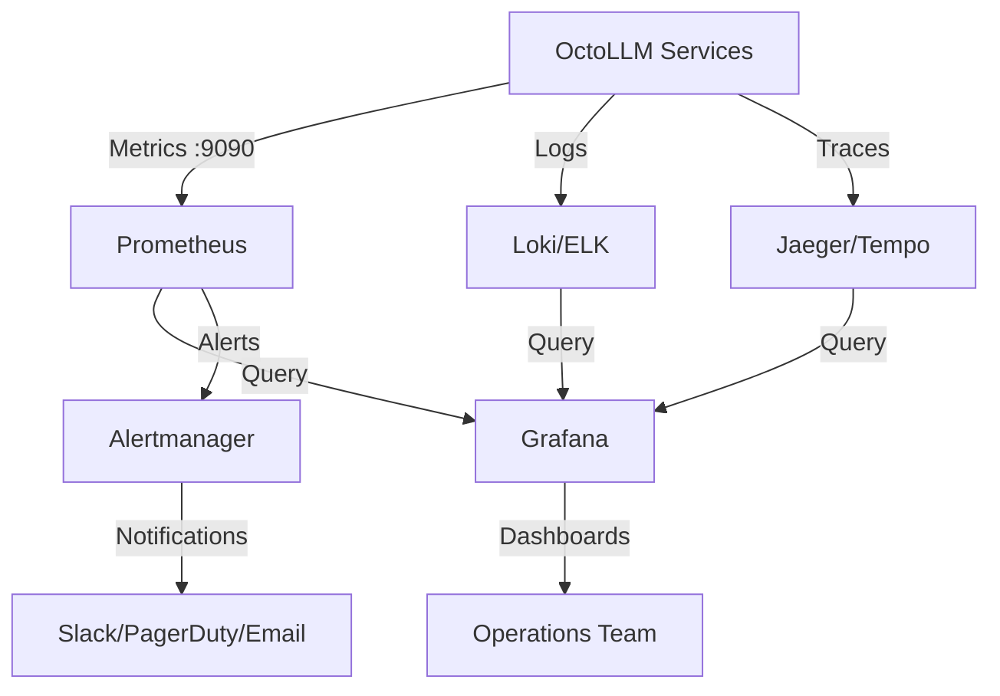

# Monitoring and Alerting Guide

**Estimated Time**: 1-2 hours
**Difficulty**: Intermediate
**Prerequisites**: OctoLLM deployed, basic Prometheus and Grafana knowledge

## Overview

This guide covers comprehensive monitoring and alerting for OctoLLM, including:
- Metrics collection with Prometheus
- Visualization with Grafana
- Alerting with Prometheus Alertmanager
- Log aggregation and analysis
- Distributed tracing
- SLO/SLI tracking

## Table of Contents

1. [Monitoring Stack Overview](#monitoring-stack-overview)
2. [Prometheus Setup](#prometheus-setup)
3. [Grafana Configuration](#grafana-configuration)
4. [Application Metrics](#application-metrics)
5. [Alerting Rules](#alerting-rules)
6. [Log Aggregation](#log-aggregation)
7. [Distributed Tracing](#distributed-tracing)
8. [SLO/SLI Tracking](#slosli-tracking)
9. [Dashboard Examples](#dashboard-examples)
10. [Troubleshooting](#troubleshooting)

---

## Monitoring Stack Overview

### Architecture



### Components

| Component | Purpose | Port |
|-----------|---------|------|
| **Prometheus** | Metrics collection and storage | 9090 |
| **Grafana** | Visualization and dashboards | 3000 |
| **Alertmanager** | Alert routing and notifications | 9093 |
| **Loki** (Optional) | Log aggregation | 3100 |
| **Jaeger** (Optional) | Distributed tracing | 16686 |

---

## Prometheus Setup

### Docker Compose Configuration

```yaml
# docker-compose.monitoring.yml
version: '3.8'

services:
  prometheus:
    image: prom/prometheus:latest
    container_name: octollm-prometheus
    restart: unless-stopped
    command:
      - '--config.file=/etc/prometheus/prometheus.yml'
      - '--storage.tsdb.path=/prometheus'
      - '--web.console.libraries=/etc/prometheus/console_libraries'
      - '--web.console.templates=/etc/prometheus/consoles'
      - '--storage.tsdb.retention.time=30d'
      - '--web.enable-lifecycle'
    volumes:
      - ./monitoring/prometheus/prometheus.yml:/etc/prometheus/prometheus.yml:ro
      - ./monitoring/prometheus/alerts.yml:/etc/prometheus/alerts.yml:ro
      - prometheus_data:/prometheus
    ports:
      - "9090:9090"
    networks:
      - octollm-network

  alertmanager:
    image: prom/alertmanager:latest
    container_name: octollm-alertmanager
    restart: unless-stopped
    command:
      - '--config.file=/etc/alertmanager/alertmanager.yml'
      - '--storage.path=/alertmanager'
    volumes:
      - ./monitoring/alertmanager/alertmanager.yml:/etc/alertmanager/alertmanager.yml:ro
      - alertmanager_data:/alertmanager
    ports:
      - "9093:9093"
    networks:
      - octollm-network

  grafana:
    image: grafana/grafana:latest
    container_name: octollm-grafana
    restart: unless-stopped
    environment:
      GF_SECURITY_ADMIN_USER: admin
      GF_SECURITY_ADMIN_PASSWORD: ${GRAFANA_PASSWORD:-admin}
      GF_INSTALL_PLUGINS: grafana-piechart-panel
    volumes:
      - ./monitoring/grafana/provisioning:/etc/grafana/provisioning:ro
      - ./monitoring/grafana/dashboards:/var/lib/grafana/dashboards:ro
      - grafana_data:/var/lib/grafana
    ports:
      - "3000:3000"
    networks:
      - octollm-network

  node-exporter:
    image: prom/node-exporter:latest
    container_name: octollm-node-exporter
    restart: unless-stopped
    command:
      - '--path.rootfs=/host'
    pid: host
    volumes:
      - '/:/host:ro,rslave'
    ports:
      - "9100:9100"
    networks:
      - octollm-network

volumes:
  prometheus_data:
  alertmanager_data:
  grafana_data:

networks:
  octollm-network:
    external: true
```

### Prometheus Configuration

```yaml
# monitoring/prometheus/prometheus.yml
global:
  scrape_interval: 15s
  evaluation_interval: 15s
  external_labels:
    cluster: 'octollm-production'
    environment: 'production'

# Alertmanager configuration
alerting:
  alertmanagers:
    - static_configs:
        - targets:
            - alertmanager:9093

# Load rules once and periodically evaluate them
rule_files:
  - '/etc/prometheus/alerts.yml'

# Scrape configurations
scrape_configs:
  # Prometheus itself
  - job_name: 'prometheus'
    static_configs:
      - targets: ['localhost:9090']

  # Node exporter (system metrics)
  - job_name: 'node-exporter'
    static_configs:
      - targets: ['node-exporter:9100']

  # OctoLLM Orchestrator
  - job_name: 'orchestrator'
    static_configs:
      - targets: ['orchestrator:8000']
    metrics_path: '/metrics'
    scrape_interval: 10s

  # Reflex Layer
  - job_name: 'reflex-layer'
    static_configs:
      - targets: ['reflex-layer:8001']
    metrics_path: '/metrics'
    scrape_interval: 5s  # More frequent for fast layer

  # All Arms
  - job_name: 'arms'
    static_configs:
      - targets:
          - 'planner-arm:8100'
          - 'executor-arm:8101'
          - 'coder-arm:8102'
          - 'judge-arm:8103'
          - 'guardian-arm:8104'
          - 'retriever-arm:8105'
    metrics_path: '/metrics'

  # PostgreSQL exporter (optional)
  - job_name: 'postgres'
    static_configs:
      - targets: ['postgres-exporter:9187']

  # Redis exporter (optional)
  - job_name: 'redis'
    static_configs:
      - targets: ['redis-exporter:9121']
```

### Kubernetes ServiceMonitor

```yaml
# k8s/monitoring/servicemonitor.yaml
apiVersion: monitoring.coreos.com/v1
kind: ServiceMonitor
metadata:
  name: octollm-services
  namespace: octollm
  labels:
    prometheus: kube-prometheus
spec:
  selector:
    matchLabels:
      monitoring: "true"
  endpoints:
  - port: http
    path: /metrics
    interval: 30s
```

---

## Grafana Configuration

### Data Source Provisioning

```yaml
# monitoring/grafana/provisioning/datasources/prometheus.yml
apiVersion: 1

datasources:
  - name: Prometheus
    type: prometheus
    access: proxy
    url: http://prometheus:9090
    isDefault: true
    editable: false

  - name: Loki
    type: loki
    access: proxy
    url: http://loki:3100
    editable: false
```

### Dashboard Provisioning

```yaml
# monitoring/grafana/provisioning/dashboards/octollm.yml
apiVersion: 1

providers:
  - name: 'OctoLLM Dashboards'
    orgId: 1
    folder: 'OctoLLM'
    type: file
    disableDeletion: false
    updateIntervalSeconds: 10
    allowUiUpdates: true
    options:
      path: /var/lib/grafana/dashboards
```

---

## Application Metrics

### Python Metrics Implementation

```python
# orchestrator/app/monitoring/metrics.py
from prometheus_client import Counter, Histogram, Gauge, Info
from functools import wraps
import time

# Request metrics
http_requests_total = Counter(
    'http_requests_total',
    'Total HTTP requests',
    ['method', 'endpoint', 'status']
)

http_request_duration_seconds = Histogram(
    'http_request_duration_seconds',
    'HTTP request duration',
    ['method', 'endpoint'],
    buckets=[0.01, 0.05, 0.1, 0.5, 1.0, 2.5, 5.0, 10.0]
)

# Task metrics
tasks_created_total = Counter(
    'tasks_created_total',
    'Total tasks created',
    ['priority']
)

tasks_completed_total = Counter(
    'tasks_completed_total',
    'Total tasks completed',
    ['status']
)

tasks_in_progress = Gauge(
    'tasks_in_progress',
    'Number of tasks currently in progress'
)

task_duration_seconds = Histogram(
    'task_duration_seconds',
    'Task execution duration',
    ['arm', 'status'],
    buckets=[1, 5, 10, 30, 60, 120, 300, 600]
)

# Arm metrics
arm_requests_total = Counter(
    'arm_requests_total',
    'Total requests to arms',
    ['arm', 'status']
)

arm_request_duration_seconds = Histogram(
    'arm_request_duration_seconds',
    'Arm request duration',
    ['arm'],
    buckets=[0.1, 0.5, 1.0, 2.5, 5.0, 10.0]
)

arm_availability = Gauge(
    'arm_availability',
    'Arm availability (0-1)',
    ['arm']
)

# LLM API metrics
llm_api_calls_total = Counter(
    'llm_api_calls_total',
    'Total LLM API calls',
    ['provider', 'model', 'status']
)

llm_api_tokens_total = Counter(
    'llm_api_tokens_total',
    'Total tokens used',
    ['provider', 'model', 'type']  # type: prompt/completion
)

llm_api_cost_dollars = Counter(
    'llm_api_cost_dollars',
    'Estimated API cost in dollars',
    ['provider', 'model']
)

llm_api_duration_seconds = Histogram(
    'llm_api_duration_seconds',
    'LLM API call duration',
    ['provider', 'model'],
    buckets=[0.5, 1, 2, 5, 10, 20, 30]
)

# Memory metrics
memory_operations_total = Counter(
    'memory_operations_total',
    'Total memory operations',
    ['operation', 'memory_type']  # operation: read/write, type: global/local
)

memory_query_duration_seconds = Histogram(
    'memory_query_duration_seconds',
    'Memory query duration',
    ['memory_type', 'operation'],
    buckets=[0.01, 0.05, 0.1, 0.5, 1.0, 2.0]
)

# Cache metrics
cache_hits_total = Counter(
    'cache_hits_total',
    'Total cache hits',
    ['cache_type']
)

cache_misses_total = Counter(
    'cache_misses_total',
    'Total cache misses',
    ['cache_type']
)

# Security metrics
security_violations_total = Counter(
    'security_violations_total',
    'Total security violations detected',
    ['violation_type', 'severity']
)

pii_detections_total = Counter(
    'pii_detections_total',
    'Total PII detections',
    ['pii_type']
)

# System info
app_info = Info('app_info', 'Application information')
app_info.info({
    'version': '1.0.0',
    'component': 'orchestrator',
    'python_version': '3.11'
})


# Decorator for tracking request metrics
def track_request_metrics(endpoint: str):
    def decorator(func):
        @wraps(func)
        async def wrapper(*args, **kwargs):
            method = kwargs.get('request').method if 'request' in kwargs else 'UNKNOWN'
            start_time = time.time()
            status = 'success'

            try:
                result = await func(*args, **kwargs)
                return result
            except Exception as e:
                status = 'error'
                raise
            finally:
                duration = time.time() - start_time
                http_requests_total.labels(
                    method=method,
                    endpoint=endpoint,
                    status=status
                ).inc()
                http_request_duration_seconds.labels(
                    method=method,
                    endpoint=endpoint
                ).observe(duration)

        return wrapper
    return decorator


# Decorator for tracking task metrics
def track_task_metrics(arm: str):
    def decorator(func):
        @wraps(func)
        async def wrapper(*args, **kwargs):
            tasks_in_progress.inc()
            start_time = time.time()
            status = 'success'

            try:
                result = await func(*args, **kwargs)
                return result
            except Exception:
                status = 'error'
                raise
            finally:
                tasks_in_progress.dec()
                duration = time.time() - start_time

                task_duration_seconds.labels(
                    arm=arm,
                    status=status
                ).observe(duration)

                tasks_completed_total.labels(status=status).inc()

        return wrapper
    return decorator
```

### FastAPI Metrics Endpoint

```python
# orchestrator/app/api/metrics.py
from fastapi import APIRouter
from prometheus_client import generate_latest, CONTENT_TYPE_LATEST
from starlette.responses import Response

router = APIRouter()


@router.get("/metrics")
async def metrics():
    """Prometheus metrics endpoint"""
    return Response(
        content=generate_latest(),
        media_type=CONTENT_TYPE_LATEST
    )
```

### Usage in Application

```python
# orchestrator/app/api/tasks.py
from app.monitoring.metrics import (
    track_request_metrics,
    tasks_created_total,
    llm_api_calls_total
)

@router.post("/tasks")
@track_request_metrics("create_task")
async def create_task(task: TaskContract):
    # Track task creation
    tasks_created_total.labels(priority=task.priority).inc()

    # ... task processing logic

    return {"task_id": task_id}
```

---

## Alerting Rules

### Prometheus Alert Rules

```yaml
# monitoring/prometheus/alerts.yml
groups:
  - name: octollm_availability
    interval: 30s
    rules:
      - alert: ServiceDown
        expr: up{job=~"orchestrator|reflex-layer"} == 0
        for: 1m
        labels:
          severity: critical
        annotations:
          summary: "Service {{ $labels.job }} is down"
          description: "{{ $labels.job }} has been down for more than 1 minute"

      - alert: ArmDown
        expr: up{job="arms"} == 0
        for: 2m
        labels:
          severity: warning
        annotations:
          summary: "Arm {{ $labels.instance }} is down"
          description: "Arm at {{ $labels.instance }} has been down for more than 2 minutes"

  - name: octollm_performance
    interval: 30s
    rules:
      - alert: HighRequestLatency
        expr: histogram_quantile(0.95, rate(http_request_duration_seconds_bucket[5m])) > 5
        for: 5m
        labels:
          severity: warning
        annotations:
          summary: "High request latency on {{ $labels.job }}"
          description: "95th percentile latency is {{ $value }}s for {{ $labels.endpoint }}"

      - alert: HighErrorRate
        expr: rate(http_requests_total{status="error"}[5m]) / rate(http_requests_total[5m]) > 0.05
        for: 5m
        labels:
          severity: warning
        annotations:
          summary: "High error rate on {{ $labels.job }}"
          description: "Error rate is {{ $value | humanizePercentage }} for {{ $labels.endpoint }}"

      - alert: TaskProcessingSlowdown
        expr: rate(tasks_completed_total[5m]) < 0.1
        for: 10m
        labels:
          severity: warning
        annotations:
          summary: "Task processing is slow"
          description: "Task completion rate is {{ $value }}/s, below threshold"

  - name: octollm_resources
    interval: 30s
    rules:
      - alert: HighMemoryUsage
        expr: (container_memory_usage_bytes / container_spec_memory_limit_bytes) > 0.9
        for: 5m
        labels:
          severity: warning
        annotations:
          summary: "High memory usage on {{ $labels.container }}"
          description: "Memory usage is {{ $value | humanizePercentage }}"

      - alert: HighCPUUsage
        expr: rate(container_cpu_usage_seconds_total[5m]) > 0.8
        for: 10m
        labels:
          severity: warning
        annotations:
          summary: "High CPU usage on {{ $labels.container }}"
          description: "CPU usage is {{ $value | humanizePercentage }}"

      - alert: DiskSpaceLow
        expr: (node_filesystem_avail_bytes{mountpoint="/"} / node_filesystem_size_bytes{mountpoint="/"}) < 0.1
        for: 5m
        labels:
          severity: critical
        annotations:
          summary: "Disk space low on {{ $labels.instance }}"
          description: "Only {{ $value | humanizePercentage }} disk space remaining"

  - name: octollm_database
    interval: 30s
    rules:
      - alert: PostgreSQLDown
        expr: pg_up == 0
        for: 1m
        labels:
          severity: critical
        annotations:
          summary: "PostgreSQL is down"
          description: "PostgreSQL database has been down for more than 1 minute"

      - alert: HighDatabaseConnections
        expr: (pg_stat_database_numbackends / pg_settings_max_connections) > 0.8
        for: 5m
        labels:
          severity: warning
        annotations:
          summary: "High database connection usage"
          description: "Database connection usage is {{ $value | humanizePercentage }}"

      - alert: RedisDown
        expr: redis_up == 0
        for: 1m
        labels:
          severity: critical
        annotations:
          summary: "Redis is down"
          description: "Redis cache has been down for more than 1 minute"

  - name: octollm_llm_api
    interval: 30s
    rules:
      - alert: HighLLMAPIErrorRate
        expr: rate(llm_api_calls_total{status="error"}[5m]) / rate(llm_api_calls_total[5m]) > 0.1
        for: 5m
        labels:
          severity: warning
        annotations:
          summary: "High LLM API error rate for {{ $labels.provider }}"
          description: "LLM API error rate is {{ $value | humanizePercentage }}"

      - alert: HighLLMAPICost
        expr: rate(llm_api_cost_dollars[1h]) > 10
        for: 10m
        labels:
          severity: warning
        annotations:
          summary: "High LLM API costs"
          description: "LLM API costs are ${{ $value }}/hour"

  - name: octollm_security
    interval: 30s
    rules:
      - alert: SecurityViolationDetected
        expr: rate(security_violations_total{severity="critical"}[5m]) > 0
        for: 1m
        labels:
          severity: critical
        annotations:
          summary: "Security violation detected"
          description: "{{ $value }} critical security violations/s detected"

      - alert: HighPIIDetectionRate
        expr: rate(pii_detections_total[5m]) > 10
        for: 5m
        labels:
          severity: warning
        annotations:
          summary: "High PII detection rate"
          description: "{{ $value }} PII detections/s - possible data leak"
```

### Alertmanager Configuration

```yaml
# monitoring/alertmanager/alertmanager.yml
global:
  resolve_timeout: 5m
  slack_api_url: 'YOUR_SLACK_WEBHOOK_URL'

# Email configuration
route:
  group_by: ['alertname', 'severity']
  group_wait: 10s
  group_interval: 10s
  repeat_interval: 12h
  receiver: 'team-notifications'

  routes:
    # Critical alerts go to PagerDuty
    - match:
        severity: critical
      receiver: 'pagerduty'
      continue: true

    # All alerts go to Slack
    - match_re:
        severity: warning|critical
      receiver: 'slack'

receivers:
  - name: 'team-notifications'
    email_configs:
      - to: 'team@example.com'
        from: 'alertmanager@example.com'
        smarthost: 'smtp.gmail.com:587'
        auth_username: 'alertmanager@example.com'
        auth_password: 'YOUR_PASSWORD'

  - name: 'slack'
    slack_configs:
      - channel: '#octollm-alerts'
        title: '{{ .GroupLabels.alertname }}'
        text: '{{ range .Alerts }}{{ .Annotations.description }}{{ end }}'
        send_resolved: true

  - name: 'pagerduty'
    pagerduty_configs:
      - service_key: 'YOUR_PAGERDUTY_KEY'
        description: '{{ .GroupLabels.alertname }}'

inhibit_rules:
  - source_match:
      severity: 'critical'
    target_match:
      severity: 'warning'
    equal: ['alertname', 'instance']
```

---

## Log Aggregation

### Structured Logging Setup

```python
# orchestrator/app/logging/config.py
import structlog
import logging.config

def configure_logging():
    """Configure structured logging with JSON output"""

    logging.config.dictConfig({
        "version": 1,
        "disable_existing_loggers": False,
        "formatters": {
            "json": {
                "()": structlog.stdlib.ProcessorFormatter,
                "processor": structlog.processors.JSONRenderer(),
            },
        },
        "handlers": {
            "console": {
                "class": "logging.StreamHandler",
                "formatter": "json",
            },
        },
        "root": {
            "handlers": ["console"],
            "level": "INFO",
        },
    })

    structlog.configure(
        processors=[
            structlog.stdlib.filter_by_level,
            structlog.stdlib.add_logger_name,
            structlog.stdlib.add_log_level,
            structlog.stdlib.PositionalArgumentsFormatter(),
            structlog.processors.TimeStamper(fmt="iso"),
            structlog.processors.StackInfoRenderer(),
            structlog.processors.format_exc_info,
            structlog.processors.UnicodeDecoder(),
            structlog.stdlib.ProcessorFormatter.wrap_for_formatter,
        ],
        context_class=dict,
        logger_factory=structlog.stdlib.LoggerFactory(),
        cache_logger_on_first_use=True,
    )
```

### Usage in Application

```python
import structlog

logger = structlog.get_logger()

# Log with structured context
logger.info(
    "task.created",
    task_id="task-123",
    priority="high",
    user_id="user-456"
)

logger.error(
    "arm.request.failed",
    arm="planner",
    error="Connection timeout",
    duration_ms=5000
)
```

---

## Distributed Tracing

### Jaeger Setup

```yaml
# docker-compose.monitoring.yml (add to monitoring stack)
  jaeger:
    image: jaegertracing/all-in-one:latest
    container_name: octollm-jaeger
    restart: unless-stopped
    environment:
      COLLECTOR_ZIPKIN_HOST_PORT: :9411
    ports:
      - "5775:5775/udp"
      - "6831:6831/udp"
      - "6832:6832/udp"
      - "5778:5778"
      - "16686:16686"
      - "14268:14268"
      - "14250:14250"
      - "9411:9411"
    networks:
      - octollm-network
```

### OpenTelemetry Integration

```python
# orchestrator/app/tracing/config.py
from opentelemetry import trace
from opentelemetry.exporter.jaeger.thrift import JaegerExporter
from opentelemetry.sdk.resources import Resource
from opentelemetry.sdk.trace import TracerProvider
from opentelemetry.sdk.trace.export import BatchSpanProcessor
from opentelemetry.instrumentation.fastapi import FastAPIInstrumentor

def configure_tracing(app):
    """Configure distributed tracing"""

    resource = Resource(attributes={
        "service.name": "octollm-orchestrator",
        "service.version": "1.0.0"
    })

    tracer_provider = TracerProvider(resource=resource)
    trace.set_tracer_provider(tracer_provider)

    jaeger_exporter = JaegerExporter(
        agent_host_name="jaeger",
        agent_port=6831,
    )

    tracer_provider.add_span_processor(
        BatchSpanProcessor(jaeger_exporter)
    )

    # Instrument FastAPI
    FastAPIInstrumentor.instrument_app(app)
```

---

## SLO/SLI Tracking

### Service Level Objectives

```yaml
# SLO Definitions
slos:
  - name: api_availability
    objective: 99.9%
    window: 30d
    indicator: |
      (
        sum(rate(http_requests_total{status!="error"}[30d]))
        /
        sum(rate(http_requests_total[30d]))
      )

  - name: api_latency
    objective: 95th percentile < 1s
    window: 30d
    indicator: |
      histogram_quantile(0.95,
        rate(http_request_duration_seconds_bucket[30d])
      )

  - name: task_success_rate
    objective: 95%
    window: 7d
    indicator: |
      (
        sum(rate(tasks_completed_total{status="success"}[7d]))
        /
        sum(rate(tasks_completed_total[7d]))
      )
```

### Error Budget Alerting

```yaml
# monitoring/prometheus/slo-alerts.yml
groups:
  - name: slo_violations
    interval: 5m
    rules:
      - alert: ErrorBudgetBurning
        expr: |
          (
            1 - (
              sum(rate(http_requests_total{status!="error"}[1h]))
              /
              sum(rate(http_requests_total[1h]))
            )
          ) > 0.001  # 99.9% SLO allows 0.1% error budget
        for: 5m
        labels:
          severity: critical
        annotations:
          summary: "Error budget is burning too fast"
          description: "Current error rate {{ $value | humanizePercentage }} exceeds budget"
```

---

## Dashboard Examples

### OctoLLM Overview Dashboard (JSON)

```json
{
  "dashboard": {
    "title": "OctoLLM Overview",
    "panels": [
      {
        "id": 1,
        "title": "Request Rate",
        "type": "graph",
        "targets": [
          {
            "expr": "rate(http_requests_total[5m])",
            "legendFormat": "{{ method }} {{ endpoint }}"
          }
        ]
      },
      {
        "id": 2,
        "title": "P95 Latency",
        "type": "graph",
        "targets": [
          {
            "expr": "histogram_quantile(0.95, rate(http_request_duration_seconds_bucket[5m]))",
            "legendFormat": "{{ endpoint }}"
          }
        ]
      },
      {
        "id": 3,
        "title": "Error Rate",
        "type": "graph",
        "targets": [
          {
            "expr": "rate(http_requests_total{status=\"error\"}[5m])",
            "legendFormat": "{{ endpoint }}"
          }
        ]
      },
      {
        "id": 4,
        "title": "Tasks In Progress",
        "type": "stat",
        "targets": [
          {
            "expr": "tasks_in_progress"
          }
        ]
      }
    ]
  }
}
```

---

## Troubleshooting

### Metrics Not Appearing

```bash
# Check if Prometheus can scrape targets
curl http://localhost:9090/api/v1/targets

# Verify metrics endpoint is accessible
curl http://localhost:8000/metrics

# Check Prometheus logs
docker compose logs prometheus
```

### Alerts Not Firing

```bash
# Check alert rules are loaded
curl http://localhost:9090/api/v1/rules

# Verify Alertmanager is receiving alerts
curl http://localhost:9093/api/v2/alerts

# Check Alertmanager logs
docker compose logs alertmanager
```

### High Cardinality Issues

```bash
# Find metrics with high cardinality
curl -s http://localhost:9090/api/v1/label/__name__/values | jq

# Drop high-cardinality labels
# In prometheus.yml:
metric_relabel_configs:
  - source_labels: [high_cardinality_label]
    regex: '.*'
    action: labeldrop
```

---

## Next Steps

1. **Set up alerts** - Configure Slack/PagerDuty integrations
2. **Create dashboards** - Build team-specific Grafana dashboards
3. **Tune thresholds** - Adjust alert thresholds based on baseline
4. **Document runbooks** - Create response procedures for each alert

## See Also

- [Troubleshooting Playbooks](troubleshooting-playbooks.md)
- [Performance Tuning](performance-tuning.md)
- [Kubernetes Deployment](kubernetes-deployment.md)
