# OctoLLM Data Flow Architecture

**Version**: 1.0
**Last Updated**: 2025-11-10

## Table of Contents

- [Overview](#overview)
- [Request Processing Pipeline](#request-processing-pipeline)
- [Memory Data Flow](#memory-data-flow)
- [Inter-Component Communication](#inter-component-communication)
- [Provenance Tracking](#provenance-tracking)
- [Error Handling Flow](#error-handling-flow)

## Overview

This document details how data flows through the OctoLLM system, from initial user request to final response, including memory operations, inter-component communication, and error handling.

## Request Processing Pipeline

### Complete Flow

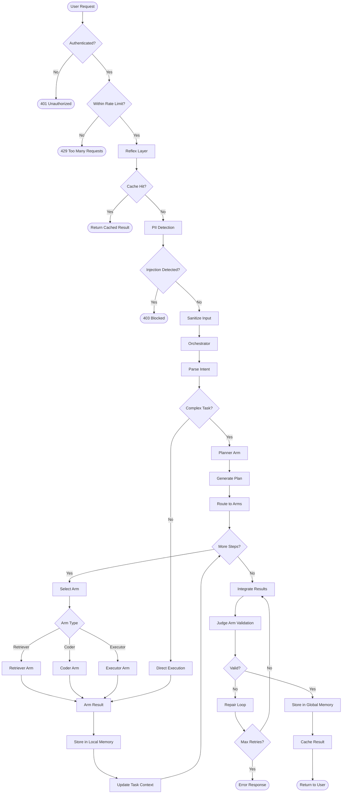

### Layer-by-Layer Processing

#### Layer 1: API Gateway

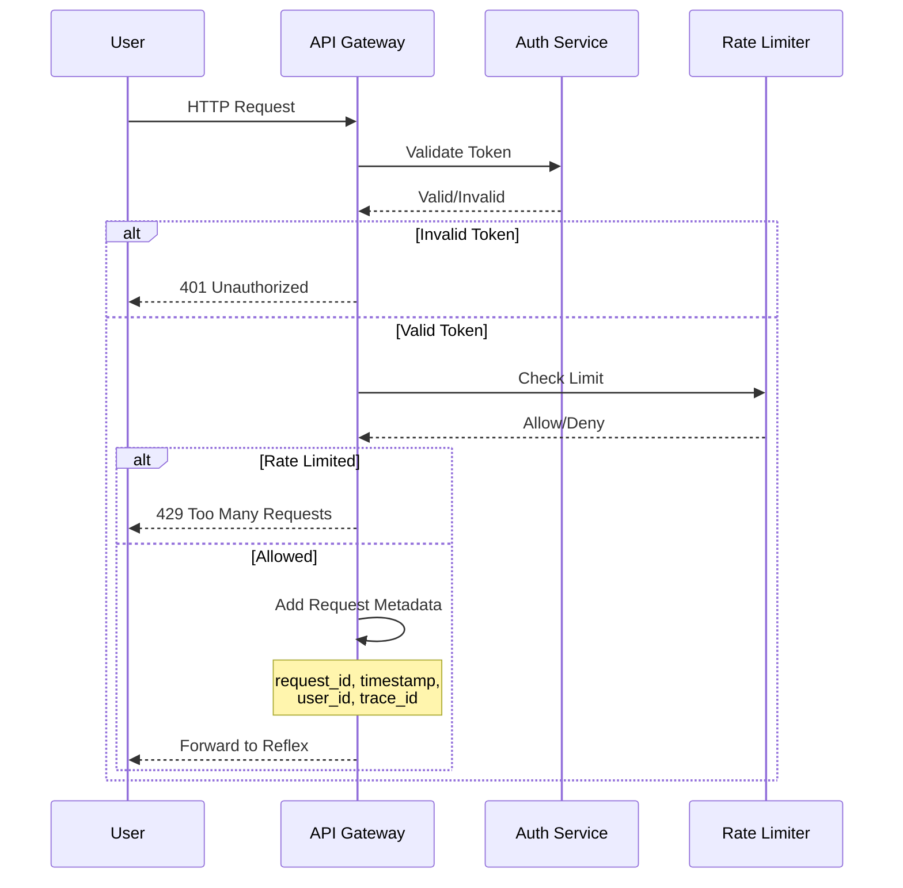

#### Layer 2: Reflex Preprocessing

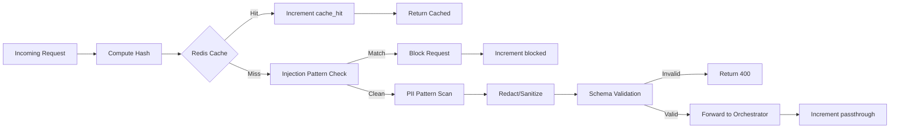

**Reflex Decision Matrix:**

| Condition | Action | Latency | Cache |
|-----------|--------|---------|-------|
| Exact query match | Return cached | < 5ms | Hit |
| Similar query (>0.95 similarity) | Return cached + log variance | < 10ms | Near-hit |
| PII detected | Sanitize + forward | < 15ms | Miss |
| Injection pattern | Block + alert | < 5ms | N/A |
| Novel query | Forward | < 10ms | Miss |

#### Layer 3: Orchestrator Planning

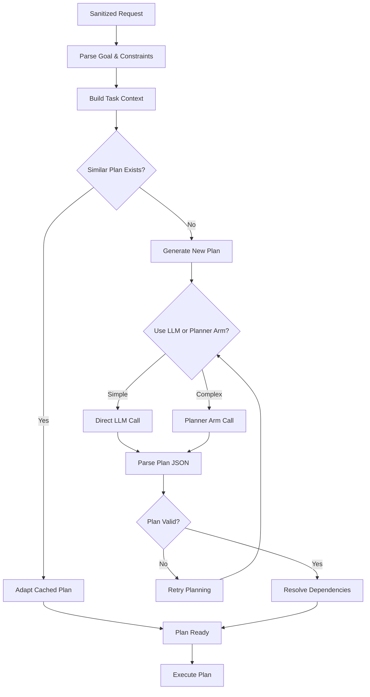

**Planning Decision Criteria:**

```python
def should_use_planner_arm(task):
    # Use dedicated Planner Arm if:
    return (
        len(task.constraints) > 3 or
        task.priority == Priority.HIGH or
        estimate_steps(task) > 5 or
        has_complex_dependencies(task) or
        requires_specialized_domain_knowledge(task)
    )
```

#### Layer 4: Arm Execution

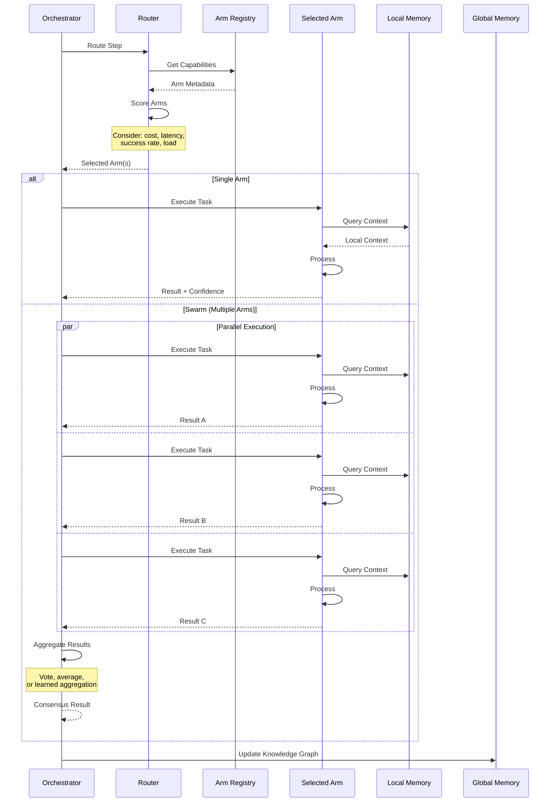

## Memory Data Flow

### Write Operations

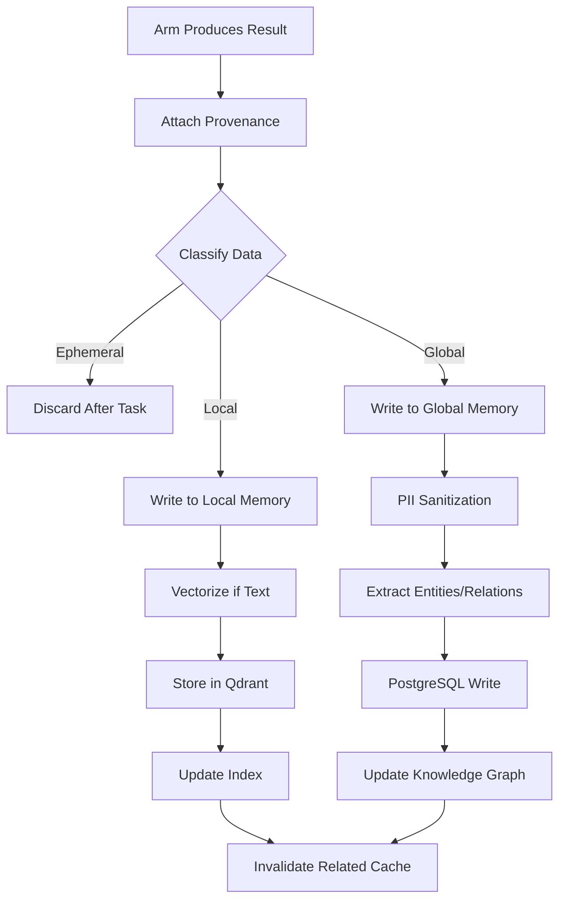

### Read Operations

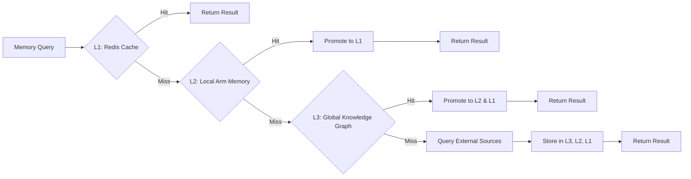

### Memory Routing Strategy

```python
class MemoryRouter:
    def route_query(self, query, context):
        # Classify query type
        if is_recent(query, window="5m"):
            return "L1_cache"  # Redis

        domain = extract_domain(query)
        if domain in ["code", "docs", "data"]:
            # Domain-specific local memory
            return f"L2_{domain}_vector_db"

        if is_entity_query(query):
            return "L3_knowledge_graph"  # PostgreSQL

        if requires_external_data(query):
            return "external_sources"

        # Default to global search
        return "L3_knowledge_graph"
```

## Inter-Component Communication

### Message Format

All inter-component messages follow this schema:

```json
{
  "message_id": "uuid-v4",
  "timestamp": "2025-11-10T10:30:00Z",
  "from": "orchestrator",
  "to": "coder-arm",
  "message_type": "task_request",
  "payload": {
    "task_id": "task-12345",
    "action": "generate_function",
    "context": {},
    "constraints": [],
    "budget": {
      "max_tokens": 4000,
      "max_time_seconds": 30
    }
  },
  "trace_id": "trace-uuid",
  "parent_message_id": "parent-uuid"
}
```

### Communication Patterns

#### 1. Request-Response (Synchronous)

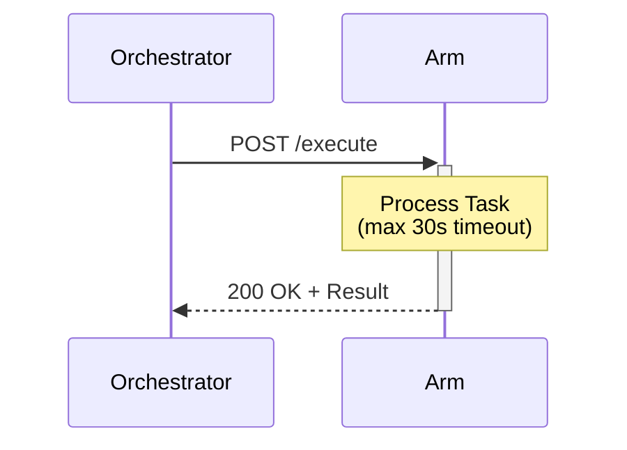

#### 2. Fire-and-Forget (Asynchronous)

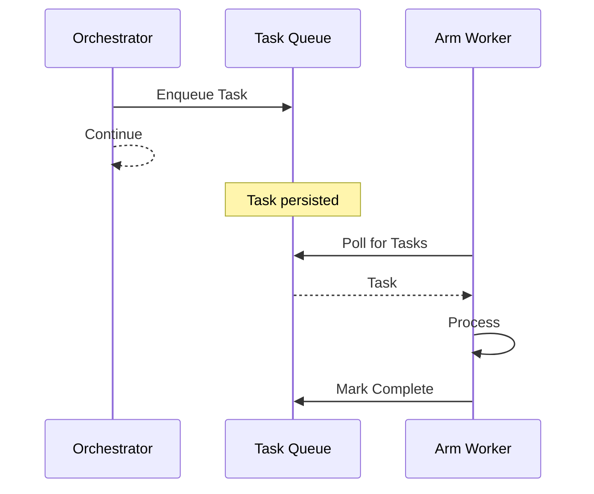

#### 3. Publish-Subscribe (Events)

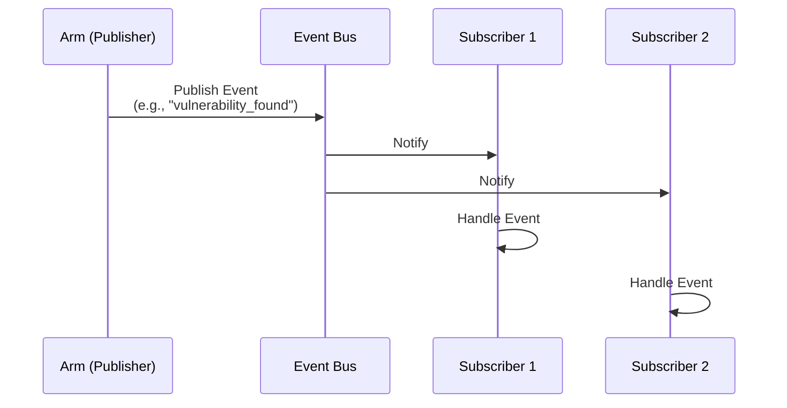

### Direct Arm-to-Arm Communication

Certain workflows benefit from direct communication:

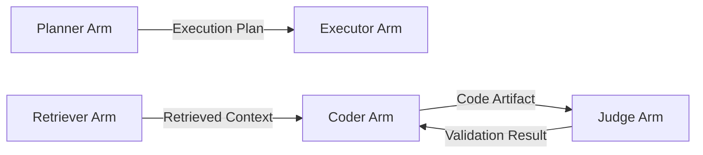

**When to use direct communication:**
- High-frequency interactions (e.g., code validation loop)
- Large data transfers (avoid orchestrator bottleneck)
- Tight coupling between specific arms (e.g., coder + judge)

**Constraints:**
- Must register intent with orchestrator
- Include provenance in all messages
- Respect capability boundaries (no privilege escalation)

## Provenance Tracking

Every data artifact includes complete lineage:

```json
{
  "artifact_id": "art-uuid",
  "artifact_type": "code_function",
  "content": "def hello(): ...",
  "provenance": {
    "created_by": "coder-arm",
    "created_at": "2025-11-10T10:30:00Z",
    "task_id": "task-12345",
    "parent_task_id": "task-12300",
    "input_sources": [
      {
        "source_id": "doc-456",
        "source_type": "documentation",
        "relevance_score": 0.92
      }
    ],
    "transformations": [
      {
        "step": 1,
        "operation": "template_fill",
        "tool": "code_generator_v1"
      },
      {
        "step": 2,
        "operation": "syntax_validation",
        "tool": "ast_parser"
      }
    ],
    "validation_status": {
      "validated": true,
      "validator": "judge-arm",
      "confidence": 0.95,
      "checks_passed": ["syntax", "type_hints", "docstring"]
    },
    "model_info": {
      "model_name": "gpt-3.5-turbo",
      "prompt_hash": "sha256:abc123...",
      "temperature": 0.3,
      "tokens_used": 350
    }
  }
}
```

### Provenance Flow

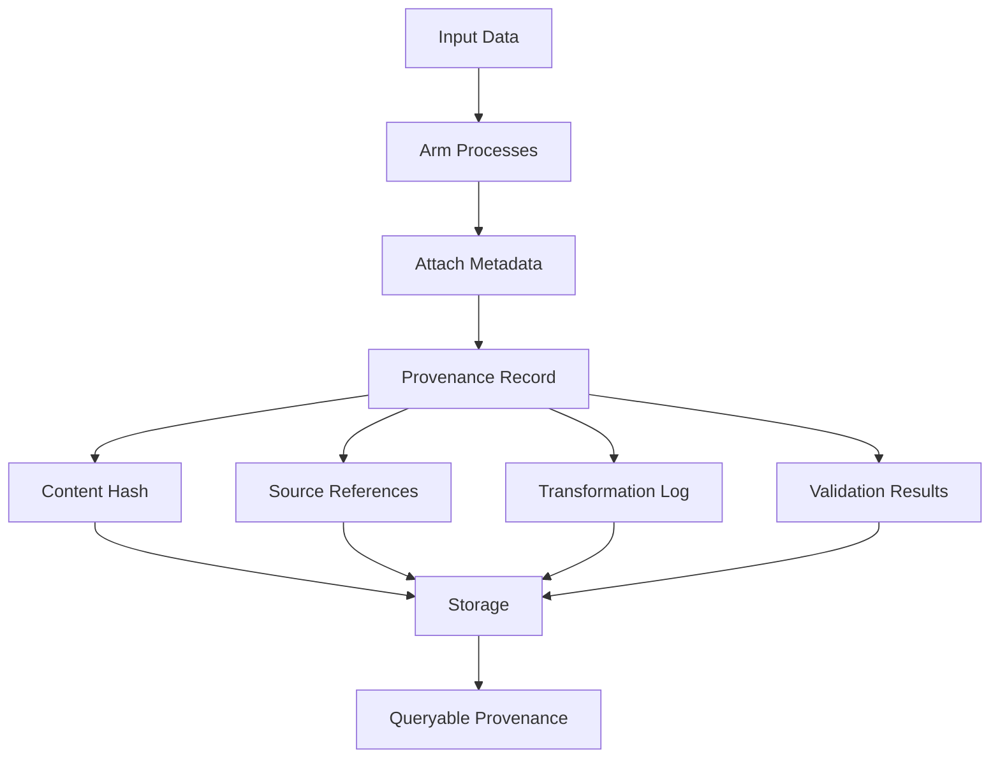

## Error Handling Flow

### Error Classification

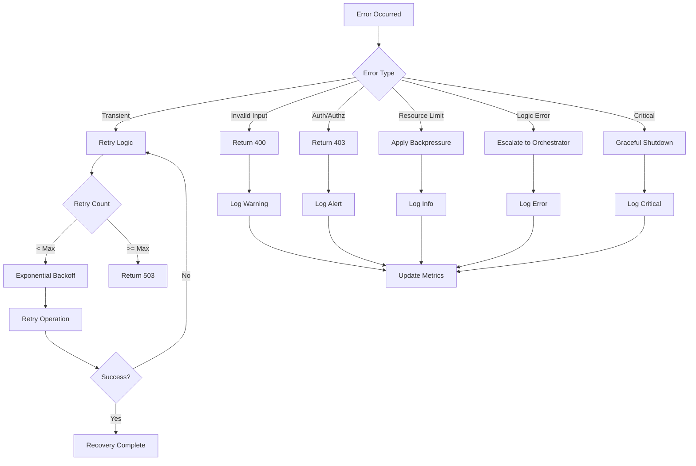

### Retry Strategy

```python
from tenacity import retry, stop_after_attempt, wait_exponential

@retry(
    stop=stop_after_attempt(3),
    wait=wait_exponential(multiplier=1, min=1, max=10),
    retry=retry_if_exception_type(TransientError)
)
async def call_arm(arm_endpoint, payload):
    async with httpx.AsyncClient() as client:
        response = await client.post(
            arm_endpoint,
            json=payload,
            timeout=30.0
        )
        response.raise_for_status()
        return response.json()
```

### Circuit Breaker Pattern

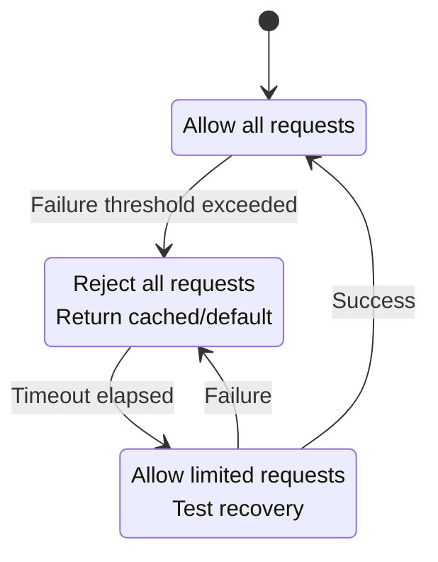

**Implementation:**

```python
from circuitbreaker import circuit

@circuit(failure_threshold=5, recovery_timeout=60)
async def call_external_api(url):
    # Will open circuit after 5 consecutive failures
    # Attempt recovery after 60 seconds
    async with httpx.AsyncClient() as client:
        return await client.get(url)
```

### Error Propagation

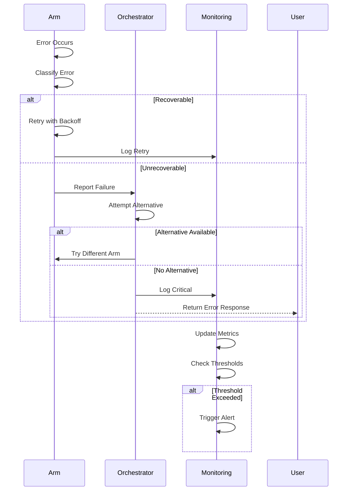

## See Also

- [System Architecture Overview](./system-overview.md)
- [Component Specifications](../components/README.md)
- [Error Handling Guide](../engineering/error-handling.md)
- [Monitoring and Observability](../operations/monitoring.md)
