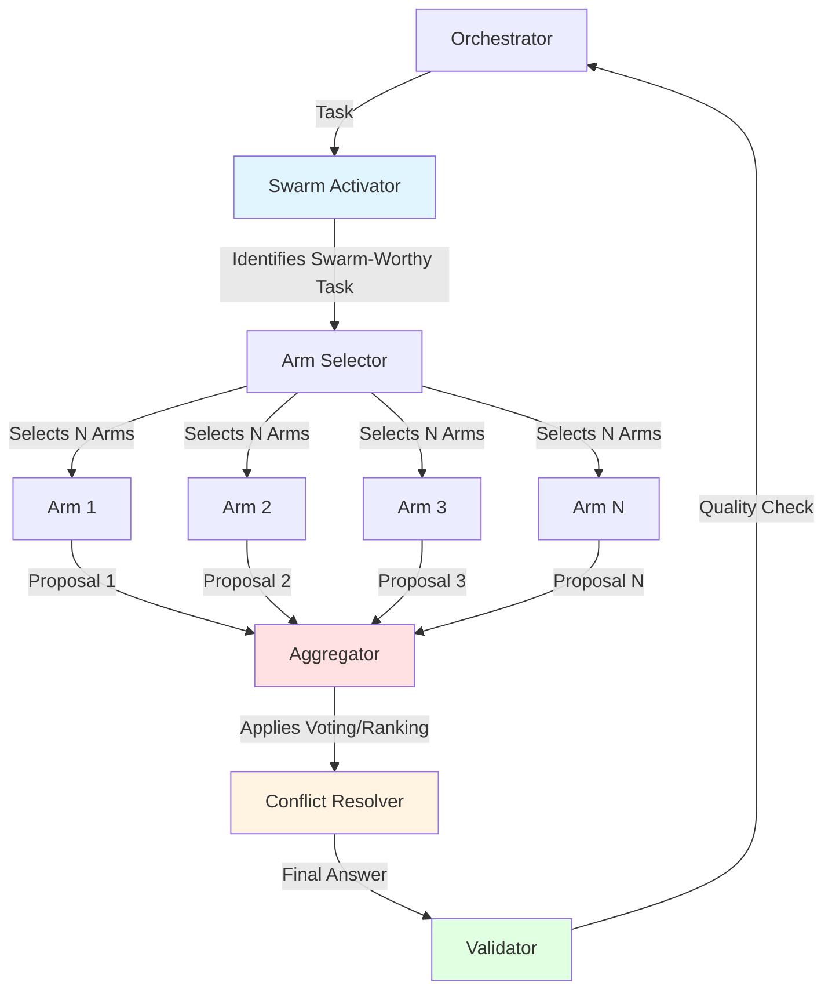
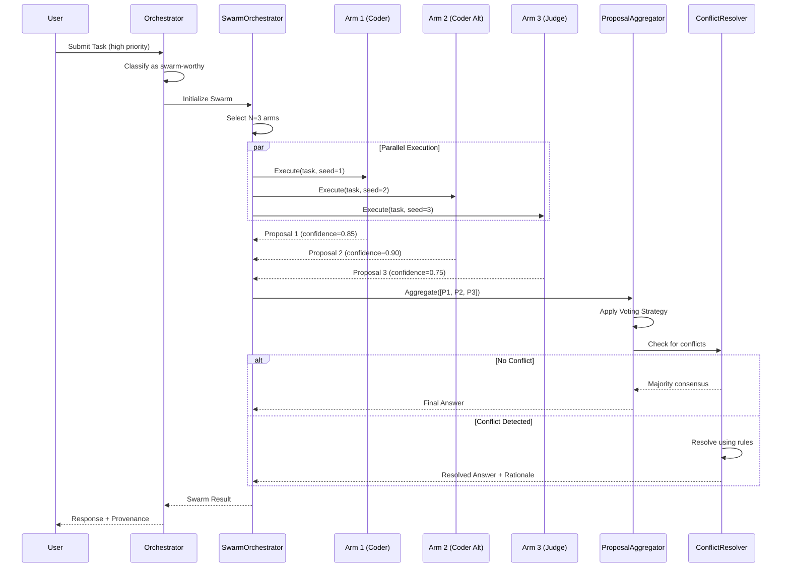

# Swarm Decision-Making Architecture

**Version**: 1.0
**Last Updated**: 2025-11-10
**Status**: Phase 2 - Core Capabilities
**Difficulty**: Advanced

## Table of Contents

1. [Overview](#overview)
2. [Swarm Concept and Principles](#swarm-concept-and-principles)
3. [Orchestration Flow](#orchestration-flow)
4. [Use Cases](#use-cases)
5. [Implementation Patterns](#implementation-patterns)
6. [Complete Python Implementation](#complete-python-implementation)
7. [Configuration and Tuning](#configuration-and-tuning)
8. [Performance Considerations](#performance-considerations)
9. [Example Scenarios](#example-scenarios)
10. [Testing Swarm Behavior](#testing-swarm-behavior)
11. [Troubleshooting](#troubleshooting)

---

## Overview

**Swarm decision-making** is a critical Phase 2 capability that enables OctoLLM to leverage multiple specialized arms working in parallel to generate diverse solutions, which are then aggregated into a final, high-quality answer. This approach mirrors the biological octopus's ability to explore multiple strategies simultaneously.

### Key Benefits

- **Higher Accuracy**: Multiple perspectives reduce single-point-of-failure risks
- **Diverse Solutions**: Different arms bring unique viewpoints and approaches
- **Robustness**: System continues even if individual arms fail
- **Quality Assurance**: Consensus mechanisms validate correctness
- **Risk Mitigation**: Critical decisions benefit from multiple expert opinions

### When to Use Swarm

Swarm decision-making is **expensive** (multiple LLM calls, parallel processing) but valuable for:

- **High-stakes decisions**: Security vulnerability assessments, production deployments
- **Complex problems**: Multi-faceted issues requiring diverse expertise
- **Quality-critical outputs**: Code reviews, documentation generation
- **Research tasks**: Information synthesis from multiple sources
- **Creative solutions**: Brainstorming, design alternatives

### When NOT to Use Swarm

- **Simple queries**: Single arm is faster and cheaper
- **Low-priority tasks**: Cost doesn't justify quality gain
- **Time-sensitive operations**: Latency overhead unacceptable
- **Resource-constrained environments**: Limited parallel capacity

---

## Swarm Concept and Principles

### Biological Inspiration

The octopus can explore multiple strategies in parallel:
- Each arm independently probes and evaluates options
- Arms communicate findings to the brain
- The brain synthesizes information and makes final decisions
- Disagreement between arms triggers deeper analysis

### OctoLLM Swarm Model



### Core Principles

1. **Diversity**: Select arms with different specializations or prompting strategies
2. **Independence**: Arms work without knowing others' proposals (avoid groupthink)
3. **Aggregation**: Combine proposals using voting, ranking, or learned methods
4. **Conflict Resolution**: Handle disagreements with explicit rules
5. **Confidence Weighting**: High-confidence proposals carry more weight
6. **Quality Validation**: Final answer must pass acceptance criteria

---

## Orchestration Flow

### High-Level Sequence



### Step-by-Step Process

#### Step 1: Swarm Activation Decision

The orchestrator determines if a task warrants swarm processing based on:

```python
def should_use_swarm(task: TaskContract) -> bool:
    """Determine if task benefits from swarm processing."""

    # High-priority tasks
    if task.priority in [Priority.HIGH, Priority.CRITICAL]:
        return True

    # Explicit swarm request
    if task.context.get("force_swarm", False):
        return True

    # Complex tasks (estimated multiple steps)
    if task.context.get("complexity_score", 0.0) > 0.7:
        return True

    # Security-critical operations
    if any(keyword in task.goal.lower() for keyword in [
        "security", "vulnerability", "exploit", "penetration", "audit"
    ]):
        return True

    # High-cost operations that justify swarm overhead
    if task.budget.get("max_cost_usd", 0.0) > 1.0:
        return True

    return False
```

#### Step 2: Arm Selection

Select N arms (typically 3-5) with diverse capabilities:

```python
def select_swarm_arms(
    task: TaskContract,
    registry: Dict[str, ArmCapability],
    swarm_size: int = 3
) -> List[str]:
    """Select diverse arms for swarm execution."""

    # Score all arms for this task
    arm_scores = {}
    for arm_id, arm in registry.items():
        score = calculate_arm_relevance(arm, task)
        arm_scores[arm_id] = score

    # Sort by relevance
    sorted_arms = sorted(
        arm_scores.items(),
        key=lambda x: x[1],
        reverse=True
    )

    # Select top N arms, ensuring diversity
    selected = []
    for arm_id, score in sorted_arms:
        if len(selected) >= swarm_size:
            break

        # Ensure diversity (e.g., don't select multiple same-type arms)
        if is_diverse_from(arm_id, selected, registry):
            selected.append(arm_id)

    return selected
```

#### Step 3: Parallel Execution

Execute tasks in parallel using `asyncio.gather()`:

```python
async def execute_swarm(
    task: TaskContract,
    arms: List[str],
    registry: Dict[str, ArmCapability]
) -> List[Proposal]:
    """Execute task across multiple arms in parallel."""

    # Create execution tasks with different seeds for diversity
    tasks = []
    for i, arm_id in enumerate(arms):
        arm = registry[arm_id]

        # Vary prompts slightly for diversity
        task_variant = task.copy(deep=True)
        task_variant.context["seed"] = i
        task_variant.context["variant"] = f"approach_{i+1}"

        # Create async task
        coro = call_arm(arm, task_variant)
        tasks.append(coro)

    # Execute all in parallel
    results = await asyncio.gather(*tasks, return_exceptions=True)

    # Convert to Proposal objects
    proposals = []
    for i, result in enumerate(results):
        if isinstance(result, Exception):
            logger.warning(f"Arm {arms[i]} failed: {result}")
            continue

        proposals.append(Proposal(
            arm_id=arms[i],
            content=result.get("output"),
            confidence=result.get("confidence", 0.5),
            rationale=result.get("rationale", ""),
            execution_time_ms=result.get("duration_ms", 0)
        ))

    return proposals
```

#### Step 4: Proposal Aggregation

Combine proposals using one of several strategies:

**A. Majority Voting** (for discrete choices):

```python
def majority_vote(proposals: List[Proposal]) -> Proposal:
    """Select most common proposal."""
    from collections import Counter

    # Count identical outputs
    output_counts = Counter([p.content for p in proposals])
    most_common = output_counts.most_common(1)[0][0]

    # Return first proposal with that output
    for p in proposals:
        if p.content == most_common:
            return p

    return proposals[0]  # Fallback
```

**B. Confidence-Weighted Voting**:

```python
def weighted_vote(proposals: List[Proposal]) -> Proposal:
    """Weight proposals by confidence scores."""

    # Group by similar content
    groups = group_similar_proposals(proposals, similarity_threshold=0.8)

    # Calculate weighted score for each group
    group_scores = {}
    for group_id, group_proposals in groups.items():
        total_weight = sum(p.confidence for p in group_proposals)
        group_scores[group_id] = total_weight

    # Select highest-weighted group
    best_group = max(group_scores.items(), key=lambda x: x[1])[0]

    # Return highest-confidence proposal from best group
    best_proposals = sorted(
        groups[best_group],
        key=lambda p: p.confidence,
        reverse=True
    )

    return best_proposals[0]
```

**C. Ranked Choice** (Borda count):

```python
def ranked_choice(proposals: List[Proposal]) -> Proposal:
    """Use Borda count to rank proposals."""

    # Each arm ranks all proposals (including its own)
    rankings = []
    for evaluator_arm in arms:
        # Ask evaluator to rank all proposals
        ranking = await ask_arm_to_rank(evaluator_arm, proposals)
        rankings.append(ranking)

    # Calculate Borda scores
    scores = {p.arm_id: 0 for p in proposals}
    num_proposals = len(proposals)

    for ranking in rankings:
        for position, arm_id in enumerate(ranking):
            # Higher position = higher score
            scores[arm_id] += (num_proposals - position - 1)

    # Select highest-scoring proposal
    best_arm_id = max(scores.items(), key=lambda x: x[1])[0]
    return next(p for p in proposals if p.arm_id == best_arm_id)
```

#### Step 5: Conflict Resolution

Handle disagreements between arms:

```python
class ConflictResolver:
    """Resolves conflicts between swarm proposals."""

    def detect_conflict(self, proposals: List[Proposal]) -> Optional[Conflict]:
        """Check if proposals significantly disagree."""

        # Calculate pairwise similarity
        similarities = []
        for i, p1 in enumerate(proposals):
            for j, p2 in enumerate(proposals[i+1:], start=i+1):
                sim = calculate_similarity(p1.content, p2.content)
                similarities.append(sim)

        avg_similarity = np.mean(similarities)

        # Conflict if low average similarity
        if avg_similarity < 0.6:
            return Conflict(
                conflict_type="low_consensus",
                severity="high" if avg_similarity < 0.4 else "medium",
                proposals=proposals,
                similarity_score=avg_similarity
            )

        # Check for contradictions
        contradictions = self._find_contradictions(proposals)
        if contradictions:
            return Conflict(
                conflict_type="contradiction",
                severity="high",
                proposals=proposals,
                details=contradictions
            )

        return None

    def resolve_conflict(
        self,
        conflict: Conflict,
        task: TaskContract
    ) -> Resolution:
        """Apply resolution strategy based on conflict type."""

        if conflict.conflict_type == "low_consensus":
            # Use confidence weighting
            return self._resolve_by_confidence(conflict.proposals)

        elif conflict.conflict_type == "contradiction":
            # Escalate to Judge arm for arbitration
            return self._escalate_to_judge(conflict, task)

        else:
            # Default: select highest confidence
            return self._select_highest_confidence(conflict.proposals)

    def _escalate_to_judge(
        self,
        conflict: Conflict,
        task: TaskContract
    ) -> Resolution:
        """Have Judge arm arbitrate between conflicting proposals."""

        judge_task = TaskContract(
            task_id=f"{task.task_id}-judge",
            goal=f"Evaluate and select the best proposal for: {task.goal}",
            context={
                "original_task": task.dict(),
                "proposals": [p.dict() for p in conflict.proposals],
                "conflict_details": conflict.details
            },
            acceptance_criteria=[
                "Provides clear rationale for selection",
                "Identifies strengths and weaknesses of each proposal"
            ]
        )

        # Call Judge arm
        judge_result = await call_arm(judge_arm, judge_task)

        return Resolution(
            selected_proposal=judge_result["selected_proposal"],
            resolution_method="judge_arbitration",
            rationale=judge_result["rationale"],
            confidence=judge_result["confidence"]
        )
```

---

## Use Cases

### 1. Security Vulnerability Assessment

**Scenario**: Analyze a codebase for security vulnerabilities

**Swarm Configuration**:
- **Arm 1**: Code Analyzer (static analysis focused)
- **Arm 2**: Security Specialist (OWASP Top 10 focused)
- **Arm 3**: Penetration Tester (exploit-focused)
- **Arm 4**: Code Reviewer (best practices focused)

**Aggregation Strategy**: Weighted voting + Judge arbitration for disagreements

**Example**:

```python
task = TaskContract(
    task_id="sec-audit-001",
    goal="Identify security vulnerabilities in user authentication module",
    context={
        "code_path": "/src/auth/",
        "frameworks": ["Flask", "SQLAlchemy"],
        "threat_model": "OWASP Top 10"
    },
    priority=Priority.CRITICAL,
    constraints=[
        "Focus on authentication and authorization",
        "Provide exploit scenarios for each finding"
    ]
)

# Execute swarm
swarm_result = await swarm_orchestrator.execute(
    task=task,
    swarm_size=4,
    aggregation_strategy="weighted_vote_with_judge"
)

# Result includes:
# - Vulnerabilities found by majority (high confidence)
# - Unique findings from individual arms (flagged for review)
# - Confidence scores for each vulnerability
# - Recommended mitigations
```

**Benefits**:
- Catches vulnerabilities that single-arm might miss
- Diverse perspectives (static analysis + pentesting + code review)
- Higher confidence in findings through consensus

### 2. Code Review and Quality Assurance

**Scenario**: Review pull request for code quality

**Swarm Configuration**:
- **Arm 1**: Code Style Reviewer (PEP 8, linting)
- **Arm 2**: Performance Analyzer (algorithmic efficiency)
- **Arm 3**: Security Reviewer (injection, XSS, etc.)
- **Arm 4**: Test Coverage Analyzer

**Aggregation Strategy**: Merge all feedback, rank by severity

**Example**:

```python
task = TaskContract(
    task_id="pr-review-456",
    goal="Review pull request #456 for quality and correctness",
    context={
        "pr_url": "https://github.com/org/repo/pull/456",
        "diff": pr_diff_content,
        "test_coverage_delta": -2.5  # Coverage decreased
    },
    priority=Priority.HIGH
)

# Swarm review
reviews = await swarm_orchestrator.execute(
    task=task,
    swarm_size=4,
    aggregation_strategy="merge_and_rank"
)

# Result:
# {
#   "critical_issues": [
#     {"type": "security", "severity": "high", "description": "SQL injection in line 42", ...},
#     {"type": "performance", "severity": "high", "description": "N+1 query pattern", ...}
#   ],
#   "warnings": [...],
#   "suggestions": [...],
#   "overall_verdict": "NEEDS_CHANGES",
#   "consensus_confidence": 0.92
# }
```

### 3. Research and Information Synthesis

**Scenario**: Research a complex technical topic

**Swarm Configuration**:
- **Arm 1**: Academic Paper Retriever (arXiv, Google Scholar)
- **Arm 2**: Documentation Searcher (official docs, Stack Overflow)
- **Arm 3**: Code Example Finder (GitHub, GitLab)
- **Arm 4**: Expert Q&A (Reddit, HackerNews, forums)

**Aggregation Strategy**: Merge information, de-duplicate, rank by source quality

**Example**:

```python
task = TaskContract(
    task_id="research-ml-001",
    goal="Research state-of-the-art techniques for few-shot learning",
    context={
        "domain": "machine_learning",
        "sub_domain": "few_shot_learning",
        "recency": "last_2_years"
    },
    acceptance_criteria=[
        "At least 5 peer-reviewed papers",
        "2+ production implementations",
        "Comparison of different approaches"
    ]
)

# Swarm research
synthesis = await swarm_orchestrator.execute(
    task=task,
    swarm_size=4,
    aggregation_strategy="information_merge"
)

# Result:
# {
#   "summary": "Comprehensive overview of few-shot learning...",
#   "key_papers": [
#     {"title": "...", "authors": [...], "year": 2024, "citations": 142, ...}
#   ],
#   "implementations": [
#     {"name": "Pytorch Meta-Learning", "github": "...", "stars": 3200}
#   ],
#   "comparative_analysis": {...},
#   "sources_consulted": 47,
#   "confidence": 0.88
# }
```

### 4. Creative Problem Solving

**Scenario**: Generate multiple approaches to a design problem

**Swarm Configuration**:
- **Arm 1**: Traditional approach (established patterns)
- **Arm 2**: Innovative approach (novel techniques)
- **Arm 3**: Performance-optimized approach
- **Arm 4**: Simplicity-first approach (KISS principle)

**Aggregation Strategy**: Present all diverse solutions, rank by criteria

**Example**:

```python
task = TaskContract(
    task_id="design-cache-001",
    goal="Design a distributed caching layer for microservices",
    context={
        "scale": "1000+ req/sec",
        "latency_requirement": "< 10ms P99",
        "consistency": "eventual"
    },
    constraints=[
        "Must integrate with Kubernetes",
        "Cost-effective at scale"
    ]
)

# Swarm brainstorm
designs = await swarm_orchestrator.execute(
    task=task,
    swarm_size=4,
    aggregation_strategy="diversity_ranking"
)

# Result: Multiple distinct designs
# {
#   "proposals": [
#     {
#       "approach": "Redis Cluster with Sentinel",
#       "pros": [...],
#       "cons": [...],
#       "estimated_cost": "$X/month",
#       "confidence": 0.9
#     },
#     {
#       "approach": "Hazelcast IMDG",
#       ...
#     },
#     ...
#   ],
#   "recommendation": "Redis Cluster",
#   "rationale": "Best balance of performance, cost, and operational maturity"
# }
```

---

## Implementation Patterns

### Pattern 1: Simple Swarm (Synchronous Voting)

**Use When**: Fast decisions, discrete choices (yes/no, A/B/C)

```python
class SimpleSwarmOrchestrator:
    """Basic swarm with majority voting."""

    async def execute(
        self,
        task: TaskContract,
        swarm_size: int = 3
    ) -> SwarmResult:
        # Select arms
        arms = self.select_arms(task, swarm_size)

        # Execute in parallel
        proposals = await asyncio.gather(*[
            self.call_arm(arm, task) for arm in arms
        ])

        # Majority vote
        result = self.majority_vote(proposals)

        return SwarmResult(
            final_answer=result,
            all_proposals=proposals,
            aggregation_method="majority_vote"
        )
```

### Pattern 2: Weighted Swarm (Confidence-Based)

**Use When**: Proposals have varying quality, arms have different expertise

```python
class WeightedSwarmOrchestrator:
    """Swarm with confidence-weighted voting."""

    async def execute(
        self,
        task: TaskContract,
        swarm_size: int = 3
    ) -> SwarmResult:
        arms = self.select_arms(task, swarm_size)

        # Get proposals with confidence scores
        proposals = await asyncio.gather(*[
            self.call_arm_with_confidence(arm, task)
            for arm in arms
        ])

        # Weight by confidence
        weights = [p.confidence for p in proposals]
        result = self.weighted_average(proposals, weights)

        return SwarmResult(
            final_answer=result,
            all_proposals=proposals,
            weights=weights,
            aggregation_method="confidence_weighted"
        )
```

### Pattern 3: Judge-Mediated Swarm

**Use When**: Complex outputs, need expert arbitration

```python
class JudgeMediatedSwarmOrchestrator:
    """Swarm with Judge arm for final decision."""

    async def execute(
        self,
        task: TaskContract,
        swarm_size: int = 3
    ) -> SwarmResult:
        # Get diverse proposals
        arms = self.select_arms(task, swarm_size)
        proposals = await asyncio.gather(*[
            self.call_arm(arm, task) for arm in arms
        ])

        # Have Judge evaluate all proposals
        judge_task = self.create_judge_task(task, proposals)
        judge_result = await self.call_arm(
            self.judge_arm,
            judge_task
        )

        return SwarmResult(
            final_answer=judge_result["selected_proposal"],
            all_proposals=proposals,
            judge_rationale=judge_result["rationale"],
            aggregation_method="judge_mediated"
        )
```

### Pattern 4: Iterative Refinement Swarm

**Use When**: Need multiple rounds of improvement

```python
class IterativeRefinementSwarm:
    """Swarm that refines answer over multiple rounds."""

    async def execute(
        self,
        task: TaskContract,
        swarm_size: int = 3,
        max_iterations: int = 3
    ) -> SwarmResult:
        current_answer = None

        for iteration in range(max_iterations):
            # Generate proposals (or refinements)
            if current_answer:
                task.context["previous_answer"] = current_answer
                task.goal = f"Improve upon: {current_answer}"

            arms = self.select_arms(task, swarm_size)
            proposals = await asyncio.gather(*[
                self.call_arm(arm, task) for arm in arms
            ])

            # Aggregate
            current_answer = self.aggregate(proposals)

            # Check if converged
            if self.has_converged(proposals):
                break

        return SwarmResult(
            final_answer=current_answer,
            iterations=iteration + 1,
            aggregation_method="iterative_refinement"
        )
```

---

## Complete Python Implementation

### Core Data Models

```python
from pydantic import BaseModel, Field
from typing import List, Optional, Dict, Any
from enum import Enum
import hashlib

class ProposalStatus(str, Enum):
    """Status of a proposal in the swarm."""
    PENDING = "pending"
    COMPLETED = "completed"
    FAILED = "failed"
    REJECTED = "rejected"

class Proposal(BaseModel):
    """A single proposal from an arm."""

    arm_id: str = Field(..., description="Which arm generated this")
    content: Any = Field(..., description="The proposed solution")
    confidence: float = Field(..., ge=0.0, le=1.0, description="Arm's confidence")
    rationale: str = Field("", description="Why this proposal")
    execution_time_ms: int = Field(..., ge=0)
    status: ProposalStatus = Field(default=ProposalStatus.COMPLETED)
    metadata: Dict[str, Any] = Field(default_factory=dict)

    def content_hash(self) -> str:
        """Generate hash of content for deduplication."""
        content_str = str(self.content)
        return hashlib.sha256(content_str.encode()).hexdigest()[:16]

class SwarmConfig(BaseModel):
    """Configuration for swarm execution."""

    swarm_size: int = Field(3, ge=2, le=10, description="Number of arms")
    aggregation_strategy: str = Field(
        "weighted_vote",
        description="How to combine proposals"
    )
    timeout_seconds: int = Field(60, ge=10, le=600)
    require_consensus: bool = Field(False, description="All arms must agree")
    consensus_threshold: float = Field(0.7, ge=0.5, le=1.0)
    enable_judge: bool = Field(True, description="Use Judge for conflicts")
    diversity_requirement: float = Field(0.5, ge=0.0, le=1.0)

class SwarmResult(BaseModel):
    """Result from swarm execution."""

    final_answer: Any = Field(..., description="Aggregated result")
    all_proposals: List[Proposal] = Field(..., description="All proposals")
    aggregation_method: str
    consensus_score: float = Field(..., ge=0.0, le=1.0)
    execution_time_ms: int
    metadata: Dict[str, Any] = Field(default_factory=dict)
```

### Swarm Orchestrator

```python
import asyncio
from typing import List, Dict, Optional, Callable
import numpy as np
from datetime import datetime
import structlog

logger = structlog.get_logger()

class SwarmOrchestrator:
    """
    Coordinates swarm decision-making across multiple arms.

    Features:
    - Parallel arm execution
    - Multiple aggregation strategies
    - Conflict detection and resolution
    - Performance tracking
    """

    def __init__(
        self,
        arm_registry: Dict[str, ArmCapability],
        judge_arm_id: str = "judge",
        default_config: Optional[SwarmConfig] = None
    ):
        self.registry = arm_registry
        self.judge_arm_id = judge_arm_id
        self.default_config = default_config or SwarmConfig()
        self.aggregator = ProposalAggregator()
        self.conflict_resolver = ConflictResolver()

    async def execute(
        self,
        task: TaskContract,
        config: Optional[SwarmConfig] = None
    ) -> SwarmResult:
        """
        Execute task across swarm of arms and aggregate results.

        Args:
            task: Task to execute
            config: Swarm configuration (uses default if None)

        Returns:
            SwarmResult with final answer and metadata
        """
        config = config or self.default_config
        start_time = datetime.utcnow()

        logger.info(
            "swarm.execute.start",
            task_id=task.task_id,
            swarm_size=config.swarm_size,
            strategy=config.aggregation_strategy
        )

        # Step 1: Select diverse arms
        selected_arms = self._select_diverse_arms(task, config.swarm_size)
        logger.info("swarm.arms_selected", arms=selected_arms)

        # Step 2: Execute in parallel
        proposals = await self._execute_parallel(
            task, selected_arms, config.timeout_seconds
        )
        logger.info(
            "swarm.proposals_received",
            count=len(proposals),
            successful=sum(1 for p in proposals if p.status == ProposalStatus.COMPLETED)
        )

        # Step 3: Filter failed proposals
        valid_proposals = [
            p for p in proposals if p.status == ProposalStatus.COMPLETED
        ]

        if len(valid_proposals) < 2:
            raise InsufficientProposalsError(
                f"Only {len(valid_proposals)} valid proposals (minimum 2 required)"
            )

        # Step 4: Aggregate proposals
        aggregation_result = await self._aggregate_proposals(
            valid_proposals,
            config.aggregation_strategy,
            task
        )

        # Step 5: Check for conflicts
        conflict = self.conflict_resolver.detect_conflict(valid_proposals)
        if conflict and config.enable_judge:
            logger.warning("swarm.conflict_detected", conflict_type=conflict.conflict_type)
            resolution = await self.conflict_resolver.resolve_conflict(
                conflict, task, self.registry[self.judge_arm_id]
            )
            final_answer = resolution.selected_proposal
            aggregation_method = f"{config.aggregation_strategy}_with_judge"
        else:
            final_answer = aggregation_result["answer"]
            aggregation_method = config.aggregation_strategy

        # Step 6: Calculate consensus score
        consensus_score = self._calculate_consensus(valid_proposals)

        # Step 7: Validate against acceptance criteria
        if config.require_consensus and consensus_score < config.consensus_threshold:
            logger.warning(
                "swarm.low_consensus",
                score=consensus_score,
                threshold=config.consensus_threshold
            )

        execution_time = (datetime.utcnow() - start_time).total_seconds() * 1000

        result = SwarmResult(
            final_answer=final_answer,
            all_proposals=valid_proposals,
            aggregation_method=aggregation_method,
            consensus_score=consensus_score,
            execution_time_ms=int(execution_time),
            metadata={
                "selected_arms": selected_arms,
                "conflict_detected": conflict is not None,
                "proposal_count": len(valid_proposals)
            }
        )

        logger.info(
            "swarm.execute.complete",
            task_id=task.task_id,
            consensus_score=consensus_score,
            execution_time_ms=result.execution_time_ms
        )

        return result

    def _select_diverse_arms(
        self,
        task: TaskContract,
        swarm_size: int
    ) -> List[str]:
        """Select diverse arms for swarm execution."""

        # Score all arms for relevance
        arm_scores = {}
        for arm_id, arm in self.registry.items():
            if arm_id == self.judge_arm_id:
                continue  # Don't include judge in swarm

            relevance_score = self._calculate_arm_relevance(arm, task)
            arm_scores[arm_id] = relevance_score

        # Sort by relevance
        sorted_arms = sorted(
            arm_scores.items(),
            key=lambda x: x[1],
            reverse=True
        )

        # Select top N, ensuring diversity
        selected = []
        for arm_id, score in sorted_arms:
            if len(selected) >= swarm_size:
                break

            # Check diversity
            if not selected or self._is_diverse_from(arm_id, selected):
                selected.append(arm_id)

        # If not enough diverse arms, fill with top-scoring
        while len(selected) < swarm_size and len(selected) < len(sorted_arms):
            for arm_id, _ in sorted_arms:
                if arm_id not in selected:
                    selected.append(arm_id)
                    break

        return selected

    def _calculate_arm_relevance(
        self,
        arm: ArmCapability,
        task: TaskContract
    ) -> float:
        """Calculate how relevant an arm is for this task."""

        # Extract keywords from task goal
        goal_keywords = set(task.goal.lower().split())

        # Match against arm capabilities
        capability_keywords = set()
        for cap in arm.capabilities:
            capability_keywords.update(cap.lower().split())

        # Calculate overlap
        overlap = len(goal_keywords & capability_keywords)
        total = len(goal_keywords | capability_keywords)

        keyword_score = overlap / total if total > 0 else 0.0

        # Factor in historical success rate
        success_score = arm.success_rate

        # Combine scores
        relevance = 0.6 * keyword_score + 0.4 * success_score

        return relevance

    def _is_diverse_from(
        self,
        arm_id: str,
        selected_arms: List[str]
    ) -> bool:
        """Check if arm brings diversity to selection."""

        arm = self.registry[arm_id]

        for selected_id in selected_arms:
            selected_arm = self.registry[selected_id]

            # Check capability overlap
            overlap = len(
                set(arm.capabilities) & set(selected_arm.capabilities)
            )
            total = len(
                set(arm.capabilities) | set(selected_arm.capabilities)
            )

            similarity = overlap / total if total > 0 else 0.0

            # If too similar, not diverse
            if similarity > 0.7:
                return False

        return True

    async def _execute_parallel(
        self,
        task: TaskContract,
        arms: List[str],
        timeout_seconds: int
    ) -> List[Proposal]:
        """Execute task across multiple arms in parallel."""

        # Create tasks with variation for diversity
        async_tasks = []
        for i, arm_id in enumerate(arms):
            # Vary the task slightly for each arm
            task_variant = task.copy(deep=True)
            task_variant.context["swarm_variant"] = i
            task_variant.context["swarm_seed"] = i + 1

            # Create execution coroutine
            coro = self._execute_single_arm(
                arm_id, task_variant, timeout_seconds
            )
            async_tasks.append(coro)

        # Execute all in parallel with timeout
        results = await asyncio.gather(*async_tasks, return_exceptions=True)

        # Convert results to Proposal objects
        proposals = []
        for i, result in enumerate(results):
            arm_id = arms[i]

            if isinstance(result, Exception):
                logger.error(
                    "swarm.arm_failed",
                    arm_id=arm_id,
                    error=str(result)
                )
                proposals.append(Proposal(
                    arm_id=arm_id,
                    content=None,
                    confidence=0.0,
                    rationale=f"Execution failed: {str(result)}",
                    execution_time_ms=0,
                    status=ProposalStatus.FAILED
                ))
            else:
                proposals.append(result)

        return proposals

    async def _execute_single_arm(
        self,
        arm_id: str,
        task: TaskContract,
        timeout_seconds: int
    ) -> Proposal:
        """Execute task on a single arm with timeout."""

        arm = self.registry[arm_id]
        start_time = datetime.utcnow()

        try:
            # Call arm with timeout
            result = await asyncio.wait_for(
                self._call_arm(arm, task),
                timeout=timeout_seconds
            )

            execution_time = (datetime.utcnow() - start_time).total_seconds() * 1000

            return Proposal(
                arm_id=arm_id,
                content=result.get("output"),
                confidence=result.get("confidence", 0.5),
                rationale=result.get("rationale", ""),
                execution_time_ms=int(execution_time),
                status=ProposalStatus.COMPLETED,
                metadata=result.get("metadata", {})
            )

        except asyncio.TimeoutError:
            logger.warning("swarm.arm_timeout", arm_id=arm_id, timeout=timeout_seconds)
            return Proposal(
                arm_id=arm_id,
                content=None,
                confidence=0.0,
                rationale=f"Timeout after {timeout_seconds}s",
                execution_time_ms=timeout_seconds * 1000,
                status=ProposalStatus.FAILED
            )

        except Exception as e:
            logger.error("swarm.arm_error", arm_id=arm_id, error=str(e))
            raise

    async def _call_arm(
        self,
        arm: ArmCapability,
        task: TaskContract
    ) -> Dict[str, Any]:
        """Make HTTP call to arm endpoint."""

        import aiohttp

        async with aiohttp.ClientSession() as session:
            async with session.post(
                arm.endpoint,
                json=task.dict(),
                timeout=aiohttp.ClientTimeout(total=60)
            ) as response:
                response.raise_for_status()
                return await response.json()

    async def _aggregate_proposals(
        self,
        proposals: List[Proposal],
        strategy: str,
        task: TaskContract
    ) -> Dict[str, Any]:
        """Aggregate proposals using specified strategy."""

        if strategy == "majority_vote":
            return self.aggregator.majority_vote(proposals)
        elif strategy == "weighted_vote":
            return self.aggregator.weighted_vote(proposals)
        elif strategy == "ranked_choice":
            return await self.aggregator.ranked_choice(proposals)
        elif strategy == "confidence_max":
            return self.aggregator.select_highest_confidence(proposals)
        else:
            raise ValueError(f"Unknown aggregation strategy: {strategy}")

    def _calculate_consensus(self, proposals: List[Proposal]) -> float:
        """Calculate consensus score (0.0-1.0) among proposals."""

        if len(proposals) < 2:
            return 1.0

        # Calculate pairwise similarities
        similarities = []
        for i, p1 in enumerate(proposals):
            for p2 in proposals[i+1:]:
                sim = self._calculate_similarity(p1.content, p2.content)
                similarities.append(sim)

        # Average similarity is consensus score
        return np.mean(similarities) if similarities else 0.0

    def _calculate_similarity(self, content1: Any, content2: Any) -> float:
        """Calculate similarity between two proposal contents."""

        # Simple string-based similarity for now
        # TODO: Use embedding-based similarity for better results

        str1 = str(content1).lower()
        str2 = str(content2).lower()

        # Jaccard similarity on words
        words1 = set(str1.split())
        words2 = set(str2.split())

        intersection = len(words1 & words2)
        union = len(words1 | words2)

        return intersection / union if union > 0 else 0.0
```

### Proposal Aggregator

```python
class ProposalAggregator:
    """Aggregates proposals using various strategies."""

    def majority_vote(self, proposals: List[Proposal]) -> Dict[str, Any]:
        """Select most common proposal (for discrete choices)."""
        from collections import Counter

        # Hash proposals to group identical ones
        proposal_hashes = [p.content_hash() for p in proposals]
        hash_counts = Counter(proposal_hashes)

        # Find most common
        most_common_hash = hash_counts.most_common(1)[0][0]

        # Return first proposal with that hash
        for p in proposals:
            if p.content_hash() == most_common_hash:
                return {
                    "answer": p.content,
                    "method": "majority_vote",
                    "vote_count": hash_counts[most_common_hash],
                    "total_votes": len(proposals)
                }

        # Fallback
        return {"answer": proposals[0].content, "method": "majority_vote"}

    def weighted_vote(self, proposals: List[Proposal]) -> Dict[str, Any]:
        """Weight proposals by confidence scores."""

        # Group similar proposals
        groups = self._group_similar_proposals(proposals, threshold=0.8)

        # Calculate weighted score for each group
        group_scores = {}
        for group_id, group_proposals in groups.items():
            # Sum of confidences
            total_weight = sum(p.confidence for p in group_proposals)
            group_scores[group_id] = total_weight

        # Select highest-weighted group
        best_group_id = max(group_scores.items(), key=lambda x: x[1])[0]
        best_group = groups[best_group_id]

        # Within best group, select highest-confidence proposal
        best_proposal = max(best_group, key=lambda p: p.confidence)

        return {
            "answer": best_proposal.content,
            "method": "weighted_vote",
            "total_weight": group_scores[best_group_id],
            "group_size": len(best_group)
        }

    async def ranked_choice(self, proposals: List[Proposal]) -> Dict[str, Any]:
        """Use Borda count ranking."""

        # For simplicity, rank by confidence (in production, could ask arms to rank each other)
        sorted_proposals = sorted(
            proposals,
            key=lambda p: p.confidence,
            reverse=True
        )

        # Borda count: first place gets N-1 points, second gets N-2, etc.
        n = len(proposals)
        scores = {p.arm_id: 0 for p in proposals}

        for position, proposal in enumerate(sorted_proposals):
            scores[proposal.arm_id] = n - position - 1

        # Select highest-scoring
        best_arm_id = max(scores.items(), key=lambda x: x[1])[0]
        best_proposal = next(p for p in proposals if p.arm_id == best_arm_id)

        return {
            "answer": best_proposal.content,
            "method": "ranked_choice",
            "borda_score": scores[best_arm_id],
            "ranking": [p.arm_id for p in sorted_proposals]
        }

    def select_highest_confidence(
        self,
        proposals: List[Proposal]
    ) -> Dict[str, Any]:
        """Simply select proposal with highest confidence."""

        best = max(proposals, key=lambda p: p.confidence)

        return {
            "answer": best.content,
            "method": "confidence_max",
            "confidence": best.confidence,
            "arm_id": best.arm_id
        }

    def _group_similar_proposals(
        self,
        proposals: List[Proposal],
        threshold: float = 0.8
    ) -> Dict[int, List[Proposal]]:
        """Group proposals by similarity."""

        groups = {}
        next_group_id = 0

        for proposal in proposals:
            # Check if similar to any existing group
            assigned = False
            for group_id, group_proposals in groups.items():
                # Compare to first proposal in group
                representative = group_proposals[0]
                similarity = self._calculate_similarity(
                    proposal.content,
                    representative.content
                )

                if similarity >= threshold:
                    groups[group_id].append(proposal)
                    assigned = True
                    break

            # Create new group if not assigned
            if not assigned:
                groups[next_group_id] = [proposal]
                next_group_id += 1

        return groups

    def _calculate_similarity(self, content1: Any, content2: Any) -> float:
        """Calculate similarity (same as in SwarmOrchestrator)."""
        str1 = str(content1).lower()
        str2 = str(content2).lower()
        words1 = set(str1.split())
        words2 = set(str2.split())
        intersection = len(words1 & words2)
        union = len(words1 | words2)
        return intersection / union if union > 0 else 0.0
```

### Conflict Resolver

```python
class Conflict(BaseModel):
    """Represents a conflict between proposals."""
    conflict_type: str  # "low_consensus", "contradiction", "high_variance"
    severity: str  # "low", "medium", "high"
    proposals: List[Proposal]
    similarity_score: Optional[float] = None
    details: Optional[Dict[str, Any]] = None

class Resolution(BaseModel):
    """Resolution of a conflict."""
    selected_proposal: Any
    resolution_method: str
    rationale: str
    confidence: float

class ConflictResolver:
    """Detects and resolves conflicts between swarm proposals."""

    def detect_conflict(
        self,
        proposals: List[Proposal],
        similarity_threshold: float = 0.6
    ) -> Optional[Conflict]:
        """Detect if proposals are in conflict."""

        if len(proposals) < 2:
            return None

        # Calculate all pairwise similarities
        similarities = []
        for i, p1 in enumerate(proposals):
            for p2 in proposals[i+1:]:
                sim = self._calculate_similarity(p1.content, p2.content)
                similarities.append(sim)

        avg_similarity = np.mean(similarities)

        # Low consensus = conflict
        if avg_similarity < similarity_threshold:
            severity = "high" if avg_similarity < 0.4 else "medium"
            return Conflict(
                conflict_type="low_consensus",
                severity=severity,
                proposals=proposals,
                similarity_score=avg_similarity
            )

        # Check for logical contradictions
        contradictions = self._find_contradictions(proposals)
        if contradictions:
            return Conflict(
                conflict_type="contradiction",
                severity="high",
                proposals=proposals,
                details={"contradictions": contradictions}
            )

        return None

    async def resolve_conflict(
        self,
        conflict: Conflict,
        task: TaskContract,
        judge_arm: ArmCapability
    ) -> Resolution:
        """Resolve conflict using appropriate strategy."""

        if conflict.conflict_type == "low_consensus":
            # Use confidence weighting
            return self._resolve_by_confidence(conflict.proposals)

        elif conflict.conflict_type == "contradiction":
            # Escalate to Judge
            return await self._escalate_to_judge(conflict, task, judge_arm)

        else:
            # Default: highest confidence
            return self._resolve_by_confidence(conflict.proposals)

    def _resolve_by_confidence(
        self,
        proposals: List[Proposal]
    ) -> Resolution:
        """Select highest-confidence proposal."""

        best = max(proposals, key=lambda p: p.confidence)

        return Resolution(
            selected_proposal=best.content,
            resolution_method="confidence_selection",
            rationale=f"Selected highest confidence ({best.confidence:.2f}) from {best.arm_id}",
            confidence=best.confidence
        )

    async def _escalate_to_judge(
        self,
        conflict: Conflict,
        task: TaskContract,
        judge_arm: ArmCapability
    ) -> Resolution:
        """Have Judge arm arbitrate."""

        judge_task = TaskContract(
            task_id=f"{task.task_id}-judge-arbitration",
            goal=f"Evaluate and select best proposal for: {task.goal}",
            context={
                "original_task": task.dict(),
                "proposals": [
                    {
                        "arm_id": p.arm_id,
                        "content": p.content,
                        "confidence": p.confidence,
                        "rationale": p.rationale
                    }
                    for p in conflict.proposals
                ],
                "conflict_details": conflict.dict()
            },
            acceptance_criteria=[
                "Provides clear selection rationale",
                "Identifies strengths/weaknesses of each proposal",
                "Explains why selected proposal is best"
            ]
        )

        # Call Judge arm
        import aiohttp
        async with aiohttp.ClientSession() as session:
            async with session.post(
                judge_arm.endpoint,
                json=judge_task.dict(),
                timeout=aiohttp.ClientTimeout(total=60)
            ) as response:
                response.raise_for_status()
                result = await response.json()

        return Resolution(
            selected_proposal=result["selected_proposal"],
            resolution_method="judge_arbitration",
            rationale=result["rationale"],
            confidence=result.get("confidence", 0.7)
        )

    def _calculate_similarity(self, content1: Any, content2: Any) -> float:
        """Calculate similarity (reuse from aggregator)."""
        str1 = str(content1).lower()
        str2 = str(content2).lower()
        words1 = set(str1.split())
        words2 = set(str2.split())
        intersection = len(words1 & words2)
        union = len(words1 | words2)
        return intersection / union if union > 0 else 0.0

    def _find_contradictions(
        self,
        proposals: List[Proposal]
    ) -> Optional[List[Dict[str, Any]]]:
        """Find logical contradictions between proposals."""

        # Simple contradiction detection (could be enhanced with NLP)
        contradiction_keywords = [
            ("yes", "no"),
            ("true", "false"),
            ("safe", "unsafe"),
            ("valid", "invalid"),
            ("secure", "insecure")
        ]

        contradictions = []
        for i, p1 in enumerate(proposals):
            for p2 in proposals[i+1:]:
                content1 = str(p1.content).lower()
                content2 = str(p2.content).lower()

                for kw1, kw2 in contradiction_keywords:
                    if kw1 in content1 and kw2 in content2:
                        contradictions.append({
                            "proposal_1": p1.arm_id,
                            "proposal_2": p2.arm_id,
                            "keyword_1": kw1,
                            "keyword_2": kw2
                        })

        return contradictions if contradictions else None
```

---

## Configuration and Tuning

### Swarm Size Selection

```python
def determine_optimal_swarm_size(task: TaskContract) -> int:
    """Determine optimal number of arms for this task."""

    # Default: 3 arms
    swarm_size = 3

    # High-priority tasks: 5 arms
    if task.priority in [Priority.HIGH, Priority.CRITICAL]:
        swarm_size = 5

    # Complex tasks: 4-5 arms
    complexity = task.context.get("complexity_score", 0.5)
    if complexity > 0.7:
        swarm_size = max(swarm_size, 4)

    # Budget-constrained: 2 arms
    if task.budget.get("max_cost_usd", float('inf')) < 0.5:
        swarm_size = 2

    # Time-sensitive: 3 arms (parallel overhead)
    if task.budget.get("max_time_seconds", float('inf')) < 30:
        swarm_size = min(swarm_size, 3)

    return swarm_size
```

### Aggregation Strategy Selection

```python
def select_aggregation_strategy(
    task: TaskContract,
    proposals: List[Proposal]
) -> str:
    """Select best aggregation strategy for this task."""

    # Discrete choices: majority vote
    if task.context.get("output_type") == "discrete":
        return "majority_vote"

    # High variance in confidence: weighted vote
    confidences = [p.confidence for p in proposals]
    if max(confidences) - min(confidences) > 0.3:
        return "weighted_vote"

    # Complex evaluation needed: ranked choice with judge
    if task.priority == Priority.CRITICAL:
        return "ranked_choice"

    # Default: weighted vote
    return "weighted_vote"
```

### Performance vs. Quality Tradeoffs

```python
class SwarmTuningConfig(BaseModel):
    """Tuning parameters for swarm performance."""

    # Quality settings
    min_swarm_size: int = Field(2, description="Minimum arms for swarm")
    max_swarm_size: int = Field(10, description="Maximum arms for swarm")
    consensus_threshold: float = Field(0.7, description="Minimum consensus required")

    # Performance settings
    parallel_timeout_seconds: int = Field(60, description="Max wait for all arms")
    enable_early_termination: bool = Field(
        True,
        description="Stop if consensus reached early"
    )
    early_termination_threshold: float = Field(
        0.9,
        description="Consensus needed for early stop"
    )

    # Cost settings
    max_cost_per_task_usd: float = Field(5.0, description="Maximum spend per task")
    prefer_cheap_arms: bool = Field(
        False,
        description="Bias toward lower-cost arms"
    )
```

---

## Performance Considerations

### Latency Analysis

**Single Arm**: 1-5 seconds (typical)
**Swarm (3 arms)**: 1-5 seconds (parallel execution, minimal overhead)
**Swarm (5 arms)**: 1-5 seconds (still parallel)
**Swarm with Judge**: +2-4 seconds (judge evaluation)
**Swarm with Conflict Resolution**: +3-6 seconds (additional round)

### Cost Analysis

| Scenario | Arms | LLM Calls | Relative Cost | Use When |
|----------|------|-----------|---------------|----------|
| Single Arm | 1 | 1 | 1x (baseline) | Routine tasks |
| Simple Swarm | 3 | 3 | 3x | Important tasks |
| Swarm + Judge | 3 | 4 | 4x | Critical decisions |
| Large Swarm | 5 | 5 | 5x | Highest priority |
| Iterative Swarm | 3 | 9 (3 rounds) | 9x | Quality-critical |

### Optimization Strategies

#### 1. Early Termination

```python
async def execute_with_early_termination(
    self,
    task: TaskContract,
    config: SwarmConfig
) -> SwarmResult:
    """Stop swarm execution early if consensus reached."""

    proposals = []
    for arm_id in selected_arms:
        # Execute one arm at a time
        proposal = await self._execute_single_arm(arm_id, task, timeout)
        proposals.append(proposal)

        # Check consensus after each new proposal
        if len(proposals) >= 2:
            consensus = self._calculate_consensus(proposals)
            if consensus >= config.early_termination_threshold:
                logger.info(
                    "swarm.early_termination",
                    consensus=consensus,
                    proposals_used=len(proposals)
                )
                break

    # Continue with aggregation...
```

#### 2. Cached Swarm Results

```python
async def execute_with_cache(
    self,
    task: TaskContract,
    config: SwarmConfig
) -> SwarmResult:
    """Cache swarm results for similar tasks."""

    # Generate cache key from task
    cache_key = self._generate_cache_key(task)

    # Check cache
    cached = await self.cache.get(cache_key)
    if cached:
        logger.info("swarm.cache_hit", task_id=task.task_id)
        return cached

    # Execute swarm
    result = await self.execute(task, config)

    # Store in cache (1 hour TTL)
    await self.cache.set(cache_key, result, ttl=3600)

    return result
```

#### 3. Adaptive Swarm Size

```python
def adaptive_swarm_size(
    task: TaskContract,
    budget: Dict[str, float]
) -> int:
    """Dynamically adjust swarm size based on budget."""

    available_budget_usd = budget.get("remaining_usd", 1.0)
    estimated_cost_per_arm = 0.02  # $0.02 per LLM call

    max_affordable_arms = int(available_budget_usd / estimated_cost_per_arm)

    # Clamp to reasonable range
    return max(2, min(10, max_affordable_arms))
```

---

## Example Scenarios

### Scenario 1: Security Vulnerability Assessment

```python
# Task: Analyze authentication module for vulnerabilities
task = TaskContract(
    task_id="sec-001",
    goal="Identify security vulnerabilities in Flask authentication module",
    context={
        "code_path": "/app/auth.py",
        "frameworks": ["Flask", "SQLAlchemy"],
        "threat_model": "OWASP Top 10 2024"
    },
    priority=Priority.CRITICAL,
    acceptance_criteria=[
        "Identifies all SQL injection vectors",
        "Checks for XSS vulnerabilities",
        "Validates session management",
        "Provides exploit scenarios"
    ]
)

# Swarm configuration
config = SwarmConfig(
    swarm_size=4,
    aggregation_strategy="weighted_vote",
    enable_judge=True,
    require_consensus=True,
    consensus_threshold=0.75
)

# Execute swarm
swarm = SwarmOrchestrator(arm_registry, judge_arm_id="judge")
result = await swarm.execute(task, config)

# Result:
# {
#   "final_answer": {
#     "vulnerabilities": [
#       {
#         "type": "SQL Injection",
#         "severity": "CRITICAL",
#         "location": "auth.py:142",
#         "description": "Unsanitized user input in SQL query",
#         "exploit_scenario": "Attacker can bypass authentication with payload: ' OR '1'='1",
#         "confidence": 0.95,
#         "supporting_arms": ["coder", "security_specialist", "pentester"]
#       },
#       {
#         "type": "Session Fixation",
#         "severity": "HIGH",
#         "location": "auth.py:78",
#         "confidence": 0.87,
#         "supporting_arms": ["security_specialist", "coder"]
#       }
#     ],
#     "total_issues": 7,
#     "critical": 1,
#     "high": 2,
#     "medium": 4
#   },
#   "consensus_score": 0.82,
#   "aggregation_method": "weighted_vote_with_judge",
#   "all_proposals": [...],  # 4 proposals from arms
#   "execution_time_ms": 4250
# }
```

### Scenario 2: Code Review with Swarm

```python
# Task: Review pull request
task = TaskContract(
    task_id="pr-review-123",
    goal="Review pull request #123 for code quality and correctness",
    context={
        "pr_url": "https://github.com/org/repo/pull/123",
        "diff": pr_diff,
        "files_changed": 8,
        "lines_added": 342,
        "lines_deleted": 87
    },
    priority=Priority.HIGH,
    acceptance_criteria=[
        "Identifies code style violations",
        "Checks for performance regressions",
        "Validates test coverage",
        "Assesses security implications"
    ]
)

config = SwarmConfig(
    swarm_size=4,
    aggregation_strategy="merge_and_rank",
    enable_judge=False  # Don't need judge for code review
)

result = await swarm.execute(task, config)

# Result: Merged feedback from all reviewers
# {
#   "final_answer": {
#     "approval_status": "NEEDS_CHANGES",
#     "blocking_issues": [
#       {"type": "security", "severity": "high", "line": 42, "message": "..."},
#       {"type": "performance", "severity": "high", "line": 156, "message": "..."}
#     ],
#     "warnings": [...],
#     "suggestions": [...],
#     "test_coverage_delta": -2.5,
#     "estimated_review_time_hours": 2
#   },
#   "consensus_score": 0.91,
#   "execution_time_ms": 3800
# }
```

### Scenario 3: Research Task

```python
# Task: Research few-shot learning techniques
task = TaskContract(
    task_id="research-001",
    goal="Research and summarize state-of-the-art few-shot learning techniques (2023-2024)",
    context={
        "domain": "machine_learning",
        "recency": "last_2_years",
        "depth": "comprehensive"
    },
    priority=Priority.MEDIUM,
    acceptance_criteria=[
        "At least 5 peer-reviewed papers",
        "2+ production implementations",
        "Comparative analysis of approaches"
    ]
)

config = SwarmConfig(
    swarm_size=4,  # Different research sources
    aggregation_strategy="information_merge",
    timeout_seconds=120  # Longer for research
)

result = await swarm.execute(task, config)

# Result: Synthesized research from multiple sources
# {
#   "final_answer": {
#     "summary": "Comprehensive overview of few-shot learning...",
#     "key_papers": [
#       {"title": "...", "authors": [...], "year": 2024, "citations": 142},
#       ...
#     ],
#     "implementations": [
#       {"name": "PyTorch Meta-Learning", "github": "...", "stars": 3200},
#       ...
#     ],
#     "comparison_table": {...},
#     "recommendations": [...],
#     "sources_count": 47
#   },
#   "consensus_score": 0.88,
#   "execution_time_ms": 8900
# }
```

---

## Testing Swarm Behavior

### Unit Tests

```python
import pytest
from unittest.mock import Mock, AsyncMock

@pytest.mark.asyncio
async def test_swarm_majority_vote():
    """Test majority voting aggregation."""

    proposals = [
        Proposal(arm_id="arm1", content="A", confidence=0.8, execution_time_ms=1000, status=ProposalStatus.COMPLETED),
        Proposal(arm_id="arm2", content="A", confidence=0.9, execution_time_ms=1200, status=ProposalStatus.COMPLETED),
        Proposal(arm_id="arm3", content="B", confidence=0.7, execution_time_ms=1100, status=ProposalStatus.COMPLETED),
    ]

    aggregator = ProposalAggregator()
    result = aggregator.majority_vote(proposals)

    assert result["answer"] == "A"
    assert result["vote_count"] == 2
    assert result["total_votes"] == 3

@pytest.mark.asyncio
async def test_swarm_conflict_detection():
    """Test conflict detection between proposals."""

    # Low consensus scenario
    proposals = [
        Proposal(arm_id="arm1", content="Solution A", confidence=0.8, execution_time_ms=1000, status=ProposalStatus.COMPLETED),
        Proposal(arm_id="arm2", content="Solution B", confidence=0.9, execution_time_ms=1200, status=ProposalStatus.COMPLETED),
        Proposal(arm_id="arm3", content="Solution C", confidence=0.7, execution_time_ms=1100, status=ProposalStatus.COMPLETED),
    ]

    resolver = ConflictResolver()
    conflict = resolver.detect_conflict(proposals, similarity_threshold=0.6)

    assert conflict is not None
    assert conflict.conflict_type == "low_consensus"
    assert conflict.severity in ["medium", "high"]

@pytest.mark.asyncio
async def test_swarm_execution():
    """Test full swarm execution flow."""

    # Mock arm registry
    registry = {
        "arm1": Mock(endpoint="http://arm1:8080", capabilities=["code"], success_rate=0.9),
        "arm2": Mock(endpoint="http://arm2:8080", capabilities=["code", "review"], success_rate=0.85),
        "arm3": Mock(endpoint="http://arm3:8080", capabilities=["security"], success_rate=0.95),
        "judge": Mock(endpoint="http://judge:8080", capabilities=["validation"], success_rate=0.92),
    }

    swarm = SwarmOrchestrator(registry, judge_arm_id="judge")

    # Mock arm calls
    swarm._call_arm = AsyncMock(return_value={
        "output": "Test result",
        "confidence": 0.85,
        "rationale": "Test rationale"
    })

    task = TaskContract(
        task_id="test-001",
        goal="Test swarm execution",
        priority=Priority.MEDIUM
    )

    config = SwarmConfig(swarm_size=3, aggregation_strategy="weighted_vote")

    result = await swarm.execute(task, config)

    assert result.final_answer is not None
    assert len(result.all_proposals) == 3
    assert 0.0 <= result.consensus_score <= 1.0
    assert result.execution_time_ms > 0
```

### Integration Tests

```python
@pytest.mark.asyncio
@pytest.mark.integration
async def test_swarm_with_real_arms():
    """Test swarm with actual arm services."""

    # Assumes arm services are running (e.g., via docker-compose)

    registry = {
        "coder": ArmCapability(
            arm_id="coder",
            name="Coder Arm",
            endpoint="http://localhost:8100/code",
            capabilities=["code_generation"],
            success_rate=0.9
        ),
        "judge": ArmCapability(
            arm_id="judge",
            name="Judge Arm",
            endpoint="http://localhost:8102/validate",
            capabilities=["validation"],
            success_rate=0.92
        ),
    }

    swarm = SwarmOrchestrator(registry, judge_arm_id="judge")

    task = TaskContract(
        task_id="integration-test-001",
        goal="Write a Python function to calculate Fibonacci numbers",
        acceptance_criteria=["Includes docstring", "Has unit tests"]
    )

    config = SwarmConfig(swarm_size=2, aggregation_strategy="confidence_max")

    result = await swarm.execute(task, config)

    # Verify result structure
    assert "final_answer" in result.dict()
    assert result.consensus_score >= 0.0

    # Verify proposals were generated
    assert len(result.all_proposals) == 2
    for proposal in result.all_proposals:
        assert proposal.status == ProposalStatus.COMPLETED
        assert proposal.confidence > 0.0
```

### Performance Tests

```python
@pytest.mark.asyncio
@pytest.mark.performance
async def test_swarm_latency():
    """Verify swarm executes within acceptable latency bounds."""

    import time

    swarm = SwarmOrchestrator(mock_registry)

    # Mock fast arms (100ms each)
    swarm._execute_single_arm = AsyncMock(
        side_effect=lambda *args, **kwargs: asyncio.sleep(0.1)
    )

    task = TaskContract(task_id="perf-001", goal="Performance test")
    config = SwarmConfig(swarm_size=5)

    start = time.time()
    result = await swarm.execute(task, config)
    elapsed = time.time() - start

    # With 5 arms executing in parallel, total time should be ~100ms + overhead
    # Allow 500ms for overhead
    assert elapsed < 0.6, f"Swarm took {elapsed}s (expected < 0.6s)"

@pytest.mark.asyncio
async def test_swarm_handles_arm_failures():
    """Verify swarm degrades gracefully when arms fail."""

    swarm = SwarmOrchestrator(mock_registry)

    # Mock arms: 2 succeed, 1 fails
    call_count = 0
    async def mock_execute(*args, **kwargs):
        nonlocal call_count
        call_count += 1
        if call_count == 2:
            raise Exception("Arm failed")
        await asyncio.sleep(0.1)

    swarm._execute_single_arm = AsyncMock(side_effect=mock_execute)

    task = TaskContract(task_id="fail-001", goal="Failure test")
    config = SwarmConfig(swarm_size=3)

    # Should still succeed with 2/3 arms
    result = await swarm.execute(task, config)

    assert len(result.all_proposals) == 3
    successful = [p for p in result.all_proposals if p.status == ProposalStatus.COMPLETED]
    assert len(successful) == 2
```

---

## Troubleshooting

### Common Issues

#### 1. Low Consensus Score

**Symptom**: Swarm returns low consensus score (< 0.5)

**Causes**:
- Arms are using very different approaches
- Task is ambiguous or underspecified
- Arms have divergent interpretations

**Solutions**:
```python
# Add more context to task
task.context["approach_hint"] = "Use iterative approach"

# Increase swarm size for more data points
config.swarm_size = 5

# Enable judge for arbitration
config.enable_judge = True
```

#### 2. Swarm Timeout

**Symptom**: Some or all arms timeout

**Causes**:
- Arms are slow (complex LLM calls)
- Network issues
- Timeout set too low

**Solutions**:
```python
# Increase timeout
config.timeout_seconds = 120

# Use faster models for swarm
task.context["prefer_fast_models"] = True

# Reduce swarm size
config.swarm_size = 3
```

#### 3. High Cost

**Symptom**: Swarm execution costs exceed budget

**Causes**:
- Too many arms
- Expensive models used
- Multiple swarm rounds

**Solutions**:
```python
# Reduce swarm size
config.swarm_size = 2

# Use cheaper models
task.context["model"] = "gpt-3.5-turbo"

# Disable judge if not critical
config.enable_judge = False

# Enable early termination
config.enable_early_termination = True
```

#### 4. Contradictory Results

**Symptom**: Arms return contradictory answers

**Causes**:
- Task has multiple valid solutions
- Arms interpret differently
- Genuine disagreement

**Solutions**:
```python
# Enable conflict resolution
config.enable_judge = True

# Clarify task goal
task.goal = "Identify THE MOST CRITICAL vulnerability (singular)"

# Add tiebreaker criteria
task.acceptance_criteria.append("Prioritize by OWASP severity ranking")
```

### Debug Logging

```python
import structlog

logger = structlog.get_logger()

# Enable detailed swarm logging
logger.info(
    "swarm.debug",
    task_id=task.task_id,
    selected_arms=selected_arms,
    proposals=[
        {
            "arm": p.arm_id,
            "confidence": p.confidence,
            "content_preview": str(p.content)[:100]
        }
        for p in proposals
    ],
    consensus_score=consensus_score,
    aggregation_strategy=config.aggregation_strategy
)
```

---

## Summary

Swarm decision-making is a powerful Phase 2 capability that enables OctoLLM to:

1. **Leverage diversity**: Multiple arms bring unique perspectives
2. **Increase robustness**: System continues even if individual arms fail
3. **Improve quality**: Consensus mechanisms validate correctness
4. **Handle complexity**: Parallel processing tackles multi-faceted problems

**Key Takeaways**:
- Use swarm for high-stakes, complex, or quality-critical tasks
- Choose swarm size based on task priority and budget
- Select aggregation strategy based on task characteristics
- Enable judge for conflict resolution when needed
- Monitor performance and costs carefully
- Test swarm behavior thoroughly before production

**Next Steps**:
- Review [Deployment Guide](../operations/deployment-guide.md) for production setup
- See [Security Testing](../security/security-testing.md) for swarm security patterns
- Consult [Performance Tuning](../operations/performance-tuning.md) for optimization

---

**Document Version**: 1.0
**Last Updated**: 2025-11-10
**Maintained By**: OctoLLM Core Team
