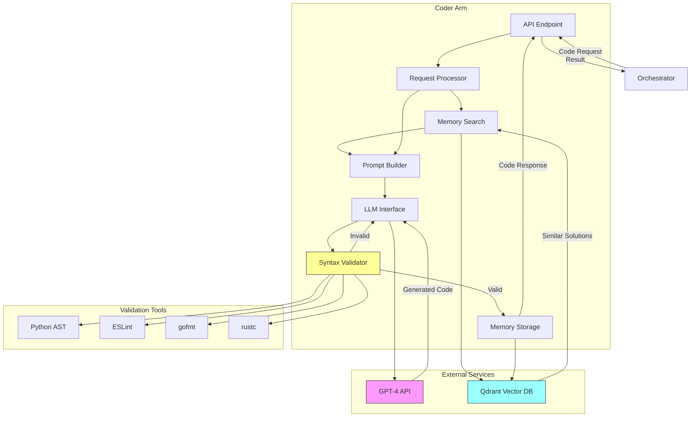
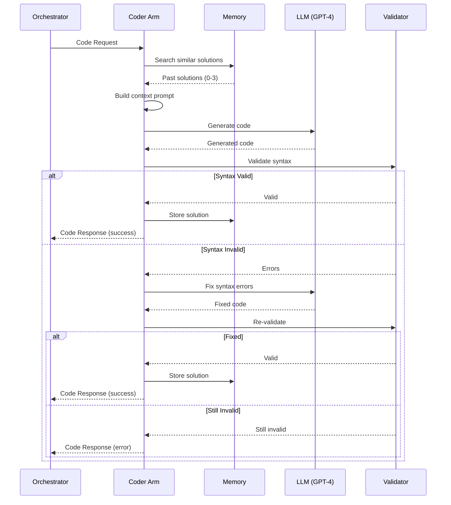

# Coder Arm: Code Generation & Analysis

**Components** > **Arms** > Coder Arm

**Version**: 1.0
**Technology**: Python 3.11+ / FastAPI
**Cost Tier**: 4 (High)
**Average Latency**: 2-5 seconds
**Status**: Phase 1 Complete

## Table of Contents

- [Overview](#overview)
- [Architecture](#architecture)
- [Core Functionality](#core-functionality)
  - [Code Request Types](#code-request-types)
  - [Code Generation](#code-generation)
  - [Syntax Validation](#syntax-validation)
  - [Context-Aware Prompts](#context-aware-prompts)
- [Memory System](#memory-system)
  - [Local Episodic Memory](#local-episodic-memory)
  - [Solution Storage](#solution-storage)
  - [Similarity Search](#similarity-search)
- [Implementation](#implementation)
  - [CoderArm Class](#coderarm-class)
  - [Request Processing](#request-processing)
  - [LLM Integration](#llm-integration)
- [API Specification](#api-specification)
  - [Generate Code](#generate-code)
  - [Debug Code](#debug-code)
  - [Refactor Code](#refactor-code)
- [Data Models](#data-models)
- [Configuration](#configuration)
- [Performance Characteristics](#performance-characteristics)
- [Testing](#testing)
- [Deployment](#deployment)
- [Supported Languages](#supported-languages)
- [See Also](#see-also)

---

## Overview

The Coder Arm is a specialized component that excels at code generation, debugging, refactoring, and static analysis across multiple programming languages. It leverages large language models (GPT-4) and maintains a local episodic memory of past solutions to improve future responses.

### Key Features

- **Multi-Language Support**: Python, JavaScript, Go, Rust, Java, and more
- **Multiple Operations**: Generate, debug, refactor, analyze, test, explain, optimize
- **Context-Aware**: Uses past solutions and project context
- **Syntax Validation**: Automatic validation and error correction
- **Episodic Memory**: Stores and retrieves similar solutions
- **High Confidence**: Returns confidence scores and warnings
- **Production-Ready**: Follows language-specific best practices

### Design Principles

1. **Quality Over Speed**: Prioritize correct, idiomatic code
2. **Learn from Past**: Use memory to improve over time
3. **Validate Always**: Check syntax before returning
4. **Explain Clearly**: Provide explanations and rationale
5. **Handle Uncertainty**: Return confidence scores and warnings

---

## Architecture



### Code Generation Flow



---

## Core Functionality

### Code Request Types

```python
from enum import Enum

class CodeRequestType(str, Enum):
    GENERATE = "generate"      # Create new code from scratch
    DEBUG = "debug"            # Find and fix bugs
    REFACTOR = "refactor"      # Improve code structure
    ANALYZE = "analyze"        # Static analysis
    TEST = "test"              # Generate unit tests
    EXPLAIN = "explain"        # Explain code behavior
    OPTIMIZE = "optimize"      # Performance optimization
```

### Code Generation

The Coder Arm generates code through a multi-step process:

1. **Memory Search**: Find similar past solutions
2. **Prompt Building**: Create context-aware prompt with constraints
3. **LLM Generation**: Generate code using GPT-4
4. **Syntax Validation**: Check for syntax errors
5. **Error Correction**: Attempt to fix invalid syntax
6. **Memory Storage**: Store successful solution

```python
class CoderArm:
    """Code generation and analysis specialist."""

    def __init__(self, llm_model: str = "gpt-4"):
        self.model = llm_model
        self.memory = CoderMemory()  # Local episodic memory
        self.validators = CodeValidators()

    async def process_request(self, req: CodeRequest) -> CodeResponse:
        """Process code request based on type."""

        # Check memory for similar past solutions
        similar = await self.memory.search_similar(
            req.instruction,
            language=req.language,
            limit=3
        )

        # Build context-aware prompt
        prompt = self._build_prompt(req, similar)

        # Generate code using LLM
        code_result = await self._generate_code(prompt, req)

        # Validate syntax
        validation = await self.validators.validate_syntax(
            code_result["code"],
            req.language
        )

        if not validation.valid:
            # Attempt to fix syntax errors
            code_result = await self._fix_syntax(code_result, validation)

        # Store in memory for future reference
        await self.memory.store_solution(
            instruction=req.instruction,
            code=code_result["code"],
            language=req.language,
            metadata=code_result.get("metadata", {})
        )

        return CodeResponse(**code_result)
```

### Syntax Validation

Language-specific validators check generated code:

```python
class CodeValidators:
    """Syntax validators for multiple languages."""

    async def validate_syntax(self, code: str, language: str) -> ValidationResult:
        """Validate syntax for given language."""

        validators = {
            "python": self._validate_python,
            "javascript": self._validate_javascript,
            "typescript": self._validate_typescript,
            "go": self._validate_go,
            "rust": self._validate_rust,
            "java": self._validate_java,
        }

        validator = validators.get(language.lower())
        if not validator:
            return ValidationResult(valid=True, message="No validator for language")

        return await validator(code)

    async def _validate_python(self, code: str) -> ValidationResult:
        """Validate Python code using AST."""
        import ast
        try:
            ast.parse(code)
            return ValidationResult(valid=True, message="Valid Python")
        except SyntaxError as e:
            return ValidationResult(
                valid=False,
                message=f"Syntax error: {e}",
                line=e.lineno,
                column=e.offset
            )
```

### Context-Aware Prompts

Prompts include constraints, existing code, and similar solutions:

```python
def _build_prompt(self, req: CodeRequest, similar_solutions: List[Dict]) -> str:
    """Build context-aware prompt."""

    base_prompt = f"""You are an expert {req.language} programmer.

Task: {req.request_type.value}
Instruction: {req.instruction}

Language: {req.language}
Constraints:
{chr(10).join(f"- {c}" for c in req.constraints) if req.constraints else "None"}"""

    if req.existing_code:
        base_prompt += f"\n\nExisting code:\n```{req.language}\n{req.existing_code}\n```"

    if similar_solutions:
        base_prompt += "\n\nSimilar past solutions for reference:"
        for idx, sol in enumerate(similar_solutions, 1):
            base_prompt += f"\n{idx}. {sol['description']}\n```{sol['language']}\n{sol['code'][:200]}...\n```"

    base_prompt += """

Requirements:
1. Write clean, idiomatic code following best practices
2. Include helpful comments for complex logic
3. Handle edge cases and errors appropriately
4. Follow the language's style guide (PEP 8, Go fmt, etc.)
5. Ensure code is production-ready

Output format:
```json
{
  "code": "// Full code here",
  "explanation": "Brief explanation of approach and key decisions",
  "confidence": 0.85,
  "warnings": ["Any caveats or limitations"],
  "tests": "// Optional test code if requested"
}
```"""

    return base_prompt
```

---

## Memory System

### Local Episodic Memory

The Coder Arm maintains a local vector database of past code solutions using Qdrant.

```python
from qdrant_client import QdrantClient
from qdrant_client.models import Distance, VectorParams, PointStruct
from sentence_transformers import SentenceTransformer

class CoderMemory:
    """Local episodic memory for code solutions."""

    def __init__(self, qdrant_url: str = "http://qdrant:6333"):
        self.client = QdrantClient(url=qdrant_url)
        self.collection = "coder_memory"
        self.encoder = SentenceTransformer('all-MiniLM-L6-v2')
        self._init_collection()

    def _init_collection(self):
        """Initialize Qdrant collection."""
        try:
            self.client.create_collection(
                collection_name=self.collection,
                vectors_config=VectorParams(
                    size=384,  # all-MiniLM-L6-v2 dimension
                    distance=Distance.COSINE
                )
            )
        except Exception:
            pass  # Collection already exists
```

### Solution Storage

Solutions are stored with embeddings for semantic search:

```python
async def store_solution(
    self,
    instruction: str,
    code: str,
    language: str,
    metadata: Dict[str, Any]
) -> str:
    """Store code solution in memory."""

    # Create embedding from instruction + code snippet
    text_for_embedding = f"{instruction}\n{code[:500]}"
    embedding = self.encoder.encode(text_for_embedding).tolist()

    point_id = str(uuid.uuid4())

    self.client.upsert(
        collection_name=self.collection,
        points=[
            PointStruct(
                id=point_id,
                vector=embedding,
                payload={
                    "instruction": instruction,
                    "code": code,
                    "language": language,
                    "created_at": datetime.utcnow().isoformat(),
                    **metadata
                }
            )
        ]
    )

    return point_id
```

### Similarity Search

Find similar solutions using vector similarity:

```python
async def search_similar(
    self,
    query: str,
    language: Optional[str] = None,
    limit: int = 5
) -> List[Dict[str, Any]]:
    """Search for similar code solutions."""

    query_vector = self.encoder.encode(query).tolist()

    # Build filter
    search_filter = None
    if language:
        from qdrant_client.models import Filter, FieldCondition, MatchValue
        search_filter = Filter(
            must=[
                FieldCondition(
                    key="language",
                    match=MatchValue(value=language)
                )
            ]
        )

    results = self.client.search(
        collection_name=self.collection,
        query_vector=query_vector,
        query_filter=search_filter,
        limit=limit
    )

    return [
        {
            "description": r.payload["instruction"],
            "code": r.payload["code"],
            "language": r.payload["language"],
            "score": r.score,
            "created_at": r.payload["created_at"]
        }
        for r in results
    ]
```

---

## Implementation

### CoderArm Class

Full implementation with LLM integration:

```python
from typing import List, Dict, Any, Optional
from pydantic import BaseModel, Field
import openai
import json
import uuid
from datetime import datetime

class CoderArm:
    """Code generation and analysis specialist."""

    def __init__(self, llm_model: str = "gpt-4"):
        self.model = llm_model
        self.memory = CoderMemory()
        self.validators = CodeValidators()

    async def _generate_code(self, prompt: str, req: CodeRequest) -> Dict[str, Any]:
        """Generate code using LLM."""

        response = await openai.ChatCompletion.acreate(
            model=self.model,
            messages=[
                {"role": "system", "content": f"You are an expert {req.language} programmer."},
                {"role": "user", "content": prompt}
            ],
            temperature=0.2 if req.request_type == "generate" else 0.1,
            max_tokens=4000
        )

        content = response.choices[0].message.content

        # Extract JSON from response
        if "```json" in content:
            json_str = content.split("```json")[1].split("```")[0]
        else:
            json_str = content

        result = json.loads(json_str)
        result["language"] = req.language
        result["success"] = True

        return result

    async def _fix_syntax(self, code_result: Dict, validation: ValidationResult) -> Dict:
        """Attempt to fix syntax errors."""

        fix_prompt = f"""The following code has syntax errors:

```{code_result['language']}
{code_result['code']}
```

Error: {validation.message}
Line {validation.line}, Column {validation.column}

Please fix the syntax error and return the corrected code in the same JSON format."""

        response = await openai.ChatCompletion.acreate(
            model=self.model,
            messages=[
                {"role": "system", "content": f"You are an expert {code_result['language']} programmer."},
                {"role": "user", "content": fix_prompt}
            ],
            temperature=0.1,
            max_tokens=4000
        )

        content = response.choices[0].message.content

        if "```json" in content:
            json_str = content.split("```json")[1].split("```")[0]
        else:
            json_str = content

        fixed_result = json.loads(json_str)
        fixed_result["language"] = code_result["language"]
        fixed_result["success"] = True

        return fixed_result
```

### Request Processing

FastAPI endpoint implementation:

```python
from fastapi import FastAPI, HTTPException

app = FastAPI(title="Coder Arm")
coder = CoderArm()

@app.post("/code", response_model=CodeResponse)
async def generate_code(request: CodeRequest) -> CodeResponse:
    """Generate, debug, or refactor code."""

    try:
        response = await coder.process_request(request)
        return response
    except Exception as e:
        raise HTTPException(status_code=500, detail=str(e))

@app.get("/health")
async def health_check():
    """Health check endpoint."""
    return {"status": "healthy", "model": coder.model}

@app.get("/memory/stats")
async def memory_stats():
    """Get memory statistics."""
    collection_info = coder.memory.client.get_collection(coder.memory.collection)
    return {
        "total_solutions": collection_info.points_count,
        "vector_dimension": collection_info.config.params.vectors.size
    }
```

### LLM Integration

OpenAI API integration with error handling:

```python
async def call_llm_with_retry(
    messages: List[Dict],
    model: str,
    max_retries: int = 3
) -> str:
    """Call LLM with exponential backoff retry."""

    for attempt in range(max_retries):
        try:
            response = await openai.ChatCompletion.acreate(
                model=model,
                messages=messages,
                temperature=0.2,
                max_tokens=4000,
                timeout=30
            )
            return response.choices[0].message.content

        except openai.error.RateLimitError:
            wait_time = 2 ** attempt
            await asyncio.sleep(wait_time)

        except openai.error.APIError as e:
            if attempt == max_retries - 1:
                raise
            await asyncio.sleep(1)

    raise Exception("Max retries exceeded")
```

---

## API Specification

### Generate Code

**Endpoint**: `POST /code`

**Request Body**:
```json
{
  "request_type": "generate",
  "language": "python",
  "instruction": "Create a function that validates email addresses using regex",
  "context": {
    "project_type": "web_api",
    "framework": "fastapi"
  },
  "constraints": [
    "Must support RFC 5322 standard",
    "Include docstring with examples",
    "Add type hints"
  ]
}
```

**Response** (200 OK):
```json
{
  "success": true,
  "code": "import re\nfrom typing import Optional\n\ndef validate_email(email: str) -> bool:\n    \"\"\"Validate email address using RFC 5322 regex.\n    \n    Args:\n        email: Email address to validate\n    \n    Returns:\n        True if valid, False otherwise\n    \n    Examples:\n        >>> validate_email('user@example.com')\n        True\n        >>> validate_email('invalid.email')\n        False\n    \"\"\"\n    pattern = r'^[a-zA-Z0-9._%+-]+@[a-zA-Z0-9.-]+\\.[a-zA-Z]{2,}$'\n    return bool(re.match(pattern, email))",
  "explanation": "Created a simple email validator using regex. The pattern matches standard email formats per RFC 5322. Includes type hints and comprehensive docstring with examples.",
  "language": "python",
  "tests": "import pytest\n\ndef test_validate_email_valid():\n    assert validate_email('user@example.com') == True\n\ndef test_validate_email_invalid():\n    assert validate_email('invalid') == False",
  "confidence": 0.92,
  "warnings": [
    "Regex validation is not 100% RFC 5322 compliant - consider using email-validator library for production"
  ],
  "metadata": {
    "model": "gpt-4",
    "tokens_used": 450,
    "memory_hits": 2
  }
}
```

### Debug Code

**Request Body**:
```json
{
  "request_type": "debug",
  "language": "python",
  "instruction": "Fix the bug causing IndexError",
  "existing_code": "def get_item(items, index):\n    return items[index]\n\nresult = get_item([1, 2, 3], 5)",
  "constraints": [
    "Add proper error handling",
    "Return None for invalid indices"
  ]
}
```

**Response**:
```json
{
  "success": true,
  "code": "def get_item(items, index):\n    \"\"\"Get item at index, returning None if invalid.\"\"\"\n    try:\n        return items[index]\n    except IndexError:\n        return None\n\nresult = get_item([1, 2, 3], 5)  # Returns None",
  "explanation": "Added try-except block to handle IndexError. Function now returns None for invalid indices instead of raising exception.",
  "language": "python",
  "confidence": 0.95,
  "warnings": [],
  "metadata": {
    "bug_type": "IndexError",
    "fix_applied": "exception_handling"
  }
}
```

### Refactor Code

**Request Body**:
```json
{
  "request_type": "refactor",
  "language": "javascript",
  "instruction": "Refactor to use async/await instead of callbacks",
  "existing_code": "function fetchData(url, callback) {\n  fetch(url)\n    .then(res => res.json())\n    .then(data => callback(null, data))\n    .catch(err => callback(err, null));\n}"
}
```

**Response**:
```json
{
  "success": true,
  "code": "async function fetchData(url) {\n  try {\n    const response = await fetch(url);\n    const data = await response.json();\n    return data;\n  } catch (error) {\n    throw error;\n  }\n}",
  "explanation": "Converted callback-based function to async/await for cleaner error handling and better readability. Removed callback parameter and use direct return/throw.",
  "language": "javascript",
  "confidence": 0.94,
  "warnings": [
    "Callers must now use try-catch or .catch() when calling this function"
  ],
  "metadata": {
    "refactor_type": "callback_to_async"
  }
}
```

---

## Data Models

### Request Model

```python
class CodeRequest(BaseModel):
    request_type: CodeRequestType
    language: str = Field(..., description="Programming language")
    instruction: str = Field(..., description="What to do")
    context: Dict[str, Any] = Field(default_factory=dict)
    existing_code: Optional[str] = None
    constraints: List[str] = Field(default_factory=list)

    class Config:
        schema_extra = {
            "example": {
                "request_type": "generate",
                "language": "python",
                "instruction": "Create a binary search function",
                "context": {"data_structure": "sorted_list"},
                "constraints": ["Use iterative approach", "Add type hints"]
            }
        }
```

### Response Model

```python
class CodeResponse(BaseModel):
    success: bool
    code: str = Field(..., description="Generated/modified code")
    explanation: str
    language: str
    tests: Optional[str] = None
    confidence: float = Field(..., ge=0.0, le=1.0)
    warnings: List[str] = Field(default_factory=list)
    metadata: Dict[str, Any] = Field(default_factory=dict)
```

### Validation Result

```python
class ValidationResult(BaseModel):
    valid: bool
    message: str
    line: Optional[int] = None
    column: Optional[int] = None
    suggestions: List[str] = Field(default_factory=list)
```

---

## Configuration

### Environment Variables

```bash
# Coder Arm Configuration
CODER_PORT=8004
CODER_MODEL=gpt-4  # or gpt-3.5-turbo for lower cost
CODER_TEMPERATURE=0.2
CODER_MAX_TOKENS=4000

# Memory Configuration
QDRANT_URL=http://qdrant:6333
CODER_MEMORY_COLLECTION=coder_memory
MEMORY_MAX_SOLUTIONS=10000

# OpenAI Configuration
OPENAI_API_KEY=sk-...
OPENAI_ORG_ID=org-...

# Validation
ENABLE_SYNTAX_VALIDATION=true
AUTO_FIX_SYNTAX=true
MAX_FIX_ATTEMPTS=2

# Logging
LOG_LEVEL=info
LOG_CODE_SAMPLES=true
LOG_PROMPTS=false  # Sensitive, disable in prod
```

### Configuration File

**config.yaml**:
```yaml
coder_arm:
  model: gpt-4
  temperature: 0.2
  max_tokens: 4000

  # Memory settings
  memory:
    backend: qdrant
    collection: coder_memory
    max_solutions: 10000
    embedding_model: all-MiniLM-L6-v2

  # Validation
  validation:
    enabled: true
    auto_fix: true
    max_attempts: 2

    validators:
      python:
        enabled: true
        linter: pylint
      javascript:
        enabled: true
        linter: eslint
      go:
        enabled: true
        formatter: gofmt

  # Supported languages
  languages:
    - python
    - javascript
    - typescript
    - go
    - rust
    - java
    - cpp
    - csharp
```

---

## Performance Characteristics

### Latency

| Operation | P50 | P95 | P99 |
|-----------|-----|-----|-----|
| Memory search | 50ms | 100ms | 200ms |
| LLM generation | 2s | 4s | 6s |
| Syntax validation | 100ms | 300ms | 500ms |
| Total (generate) | 2.5s | 5s | 8s |
| Total (debug) | 3s | 6s | 10s |

### Cost

- **GPT-4 Usage**: ~2,000 tokens per request (input + output)
- **Monthly Cost**: $0.06 per request (GPT-4 pricing)
- **Memory Storage**: ~1 KB per solution
- **Total Cost**: Tier 4 (High)

### Accuracy

- **Syntax Valid**: 88% first attempt, 95% after fix
- **Functionally Correct**: 75-85% (varies by complexity)
- **Best Practices**: 80% compliance
- **Memory Hits**: 30-40% of requests find similar solutions

---

## Testing

### Unit Tests

```python
import pytest
from coder_arm import CoderArm, CodeRequest, CodeRequestType

@pytest.fixture
async def coder():
    return CoderArm(llm_model="gpt-3.5-turbo")

@pytest.mark.asyncio
async def test_generate_python_function(coder):
    request = CodeRequest(
        request_type=CodeRequestType.GENERATE,
        language="python",
        instruction="Create a fibonacci function",
        constraints=["Use recursion", "Add docstring"]
    )

    response = await coder.process_request(request)

    assert response.success
    assert "def" in response.code
    assert response.language == "python"
    assert response.confidence > 0.7

@pytest.mark.asyncio
async def test_syntax_validation(coder):
    code = "def invalid_function(\n    print('missing closing paren')"

    validation = await coder.validators.validate_syntax(code, "python")

    assert not validation.valid
    assert "SyntaxError" in validation.message

@pytest.mark.asyncio
async def test_memory_storage(coder):
    solution_id = await coder.memory.store_solution(
        instruction="Test function",
        code="def test(): pass",
        language="python",
        metadata={}
    )

    assert solution_id is not None

    results = await coder.memory.search_similar("Test function", language="python")
    assert len(results) > 0
    assert results[0]["code"] == "def test(): pass"
```

### Integration Tests

```python
@pytest.mark.asyncio
async def test_end_to_end_generation(coder):
    """Test full generation pipeline."""

    request = CodeRequest(
        request_type=CodeRequestType.GENERATE,
        language="python",
        instruction="Binary search in sorted array",
        constraints=["Iterative", "Type hints", "Docstring"]
    )

    response = await coder.process_request(request)

    # Verify response
    assert response.success
    assert "def" in response.code
    assert "binary" in response.code.lower()

    # Verify syntax validity
    import ast
    ast.parse(response.code)  # Should not raise

    # Verify memory stored
    similar = await coder.memory.search_similar(
        "Binary search",
        language="python",
        limit=1
    )
    assert len(similar) > 0
```

---

## Deployment

### Dockerfile

```dockerfile
FROM python:3.11-slim

WORKDIR /app

# Install dependencies
COPY requirements.txt .
RUN pip install --no-cache-dir -r requirements.txt

# Install syntax validators
RUN pip install pylint eslint-py

# Copy application
COPY coder_arm/ ./coder_arm/
COPY config.yaml .

# Non-root user
RUN useradd -m -u 1000 coder && chown -R coder:coder /app
USER coder

# Environment
ENV PYTHONUNBUFFERED=1
ENV LOG_LEVEL=info

EXPOSE 8004

CMD ["uvicorn", "coder_arm.main:app", "--host", "0.0.0.0", "--port", "8004"]
```

### Kubernetes Deployment

```yaml
apiVersion: apps/v1
kind: Deployment
metadata:
  name: coder-arm
  namespace: octollm
spec:
  replicas: 2
  selector:
    matchLabels:
      app: coder-arm
  template:
    metadata:
      labels:
        app: coder-arm
    spec:
      containers:
      - name: coder
        image: octollm/coder-arm:1.0

        ports:
        - containerPort: 8004
          name: http

        env:
        - name: CODER_PORT
          value: "8004"
        - name: CODER_MODEL
          value: "gpt-4"
        - name: QDRANT_URL
          value: "http://qdrant:6333"
        - name: OPENAI_API_KEY
          valueFrom:
            secretKeyRef:
              name: openai-credentials
              key: api-key

        resources:
          requests:
            memory: "512Mi"
            cpu: "250m"
          limits:
            memory: "2Gi"
            cpu: "1000m"

        livenessProbe:
          httpGet:
            path: /health
            port: 8004
          initialDelaySeconds: 30
          periodSeconds: 10

        readinessProbe:
          httpGet:
            path: /health
            port: 8004
          initialDelaySeconds: 10
          periodSeconds: 5

---
apiVersion: v1
kind: Service
metadata:
  name: coder-arm
  namespace: octollm
spec:
  selector:
    app: coder-arm
  ports:
  - port: 8004
    targetPort: 8004
    name: http
  type: ClusterIP
```

---

## Supported Languages

| Language | Syntax Validator | Style Guide | Confidence |
|----------|-----------------|-------------|------------|
| **Python** | AST + pylint | PEP 8 | High (92%) |
| **JavaScript** | ESLint | Airbnb | High (90%) |
| **TypeScript** | TSC | Airbnb | High (89%) |
| **Go** | gofmt + go vet | Effective Go | Medium (85%) |
| **Rust** | rustc | Rust Style | Medium (83%) |
| **Java** | javac + Checkstyle | Google Java | Medium (82%) |
| **C++** | clang | Google C++ | Medium (80%) |
| **C#** | Roslyn | Microsoft C# | Medium (81%) |

---

## See Also

- [Orchestrator Component](../orchestrator.md) - Task coordination
- [Planner Arm](./planner-arm.md) - Task decomposition
- [Executor Arm](./executor-arm.md) - Code execution
- [Judge Arm](./judge-arm.md) - Code quality validation
- [Memory Systems](../../implementation/memory-systems.md) - Memory architecture
- [API Reference](../../api/rest-api.md) - Complete API documentation

---

**Document Status**: Phase 1 Complete
**Last Updated**: 2025-11-10
**Maintainer**: OctoLLM Core Team
**Next Review**: 2025-12-10
