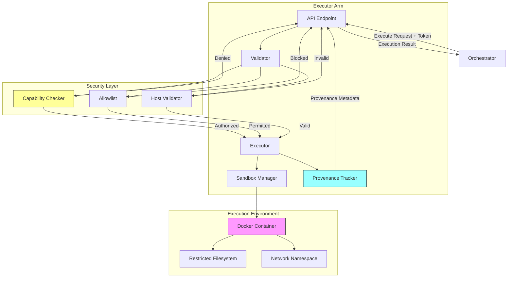
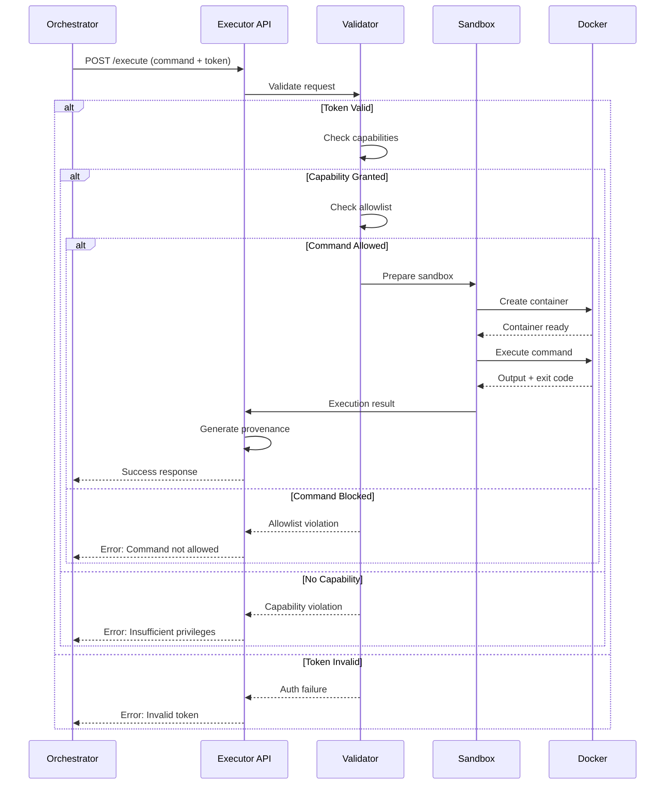
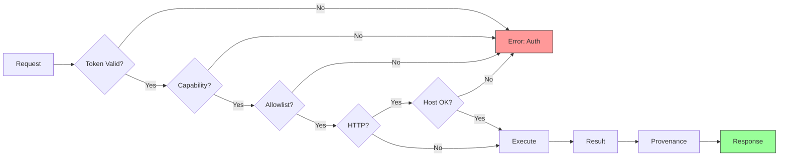

# Tool Executor Arm: Sandboxed Command Execution

**Components** > **Arms** > Tool Executor Arm

**Version**: 1.0
**Technology**: Rust / actix-web
**Cost Tier**: 3 (Medium-High)
**Average Latency**: 0.5-5 seconds
**Status**: Phase 1 Complete

## Table of Contents

- [Overview](#overview)
- [Architecture](#architecture)
- [Security Model](#security-model)
  - [Capability-Based Access Control](#capability-based-access-control)
  - [Capability Types](#capability-types)
- [Core Functionality](#core-functionality)
  - [Command Allowlist](#command-allowlist)
  - [Sandboxed Execution](#sandboxed-execution)
  - [Resource Limits](#resource-limits)
- [Implementation](#implementation)
  - [Executor Structure](#executor-structure)
  - [Command Validation](#command-validation)
  - [Execution Pipeline](#execution-pipeline)
- [API Specification](#api-specification)
  - [Execute Command](#execute-command)
  - [Response Formats](#response-formats)
- [Data Models](#data-models)
- [Configuration](#configuration)
- [Performance Characteristics](#performance-characteristics)
- [Testing](#testing)
- [Deployment](#deployment)
  - [Docker Sandbox](#docker-sandbox)
  - [Kubernetes Configuration](#kubernetes-configuration)
- [Security Considerations](#security-considerations)
- [See Also](#see-also)

---

## Overview

The Tool Executor Arm is a security-first component that executes external commands, API calls, and scripts in isolated sandboxes with strict capability controls. It provides the system with the ability to interact with external tools while maintaining strong security boundaries.

### Key Features

- **Capability-Based Access Control**: Fine-grained permissions for command execution
- **Command Allowlist**: Only pre-approved commands can be executed
- **Sandbox Isolation**: All executions run in isolated Docker containers
- **Resource Limits**: Timeouts, memory limits, and CPU restrictions
- **Provenance Tracking**: Complete audit trail of all executions
- **Network Control**: Host allowlisting for HTTP requests
- **Non-Root Execution**: All commands run as unprivileged users

### Design Principles

1. **Security by Default**: Deny all, permit explicitly
2. **Defense in Depth**: Multiple layers of security controls
3. **Least Privilege**: Minimal capabilities granted for each operation
4. **Auditability**: Complete logging and provenance metadata
5. **Fail-Safe**: Errors default to blocking execution

---

## Architecture



### Execution Flow



---

## Security Model

### Capability-Based Access Control

The Executor Arm uses a capability-based security model where each operation requires specific permissions granted through time-limited tokens.

```rust
#[derive(Debug, Clone, Serialize, Deserialize)]
struct CapabilityToken {
    token_id: String,
    granted_capabilities: HashSet<Capability>,
    expires_at: DateTime<Utc>,
    issued_to: String,
}

#[derive(Debug, Clone, Hash, Eq, PartialEq, Serialize, Deserialize)]
enum Capability {
    // Shell command execution
    ShellRead,        // Read-only commands (ls, cat, grep)
    ShellWrite,       // Write commands (echo >, mkdir)
    ShellExecute,     // Execute scripts

    // Network access
    HttpGet,          // HTTP GET requests
    HttpPost,         // HTTP POST requests
    HttpAllHosts,     // Access any host (vs allowlist)

    // File system
    FilesystemRead,   // Read files
    FilesystemWrite,  // Write files
    FilesystemDelete, // Delete files

    // Special
    PythonExec,       // Run Python scripts
    DockerAccess,     // Access Docker API
}

impl CapabilityToken {
    fn can_execute(&self, required: &Capability) -> bool {
        !self.is_expired() && self.granted_capabilities.contains(required)
    }

    fn is_expired(&self) -> bool {
        Utc::now() > self.expires_at
    }
}
```

### Capability Types

| Capability | Description | Risk Level |
|------------|-------------|------------|
| `ShellRead` | Read-only shell commands (ls, cat, grep) | Low |
| `ShellWrite` | Write operations (echo >, mkdir) | Medium |
| `ShellExecute` | Execute scripts | High |
| `HttpGet` | HTTP GET requests to allowlisted hosts | Low |
| `HttpPost` | HTTP POST requests to allowlisted hosts | Medium |
| `HttpAllHosts` | HTTP requests to any host | High |
| `FilesystemRead` | Read files from sandbox | Low |
| `FilesystemWrite` | Write files to sandbox | Medium |
| `FilesystemDelete` | Delete files in sandbox | Medium |
| `PythonExec` | Execute Python scripts | High |
| `DockerAccess` | Access Docker API (privileged) | Critical |

---

## Core Functionality

### Command Allowlist

Only pre-approved commands can be executed, with required capabilities mapped to each command.

```rust
struct Executor {
    allowed_commands: HashMap<String, Vec<Capability>>,
    allowed_hosts: Vec<String>,
    timeout: Duration,
}

impl Executor {
    fn default_safe() -> Self {
        let mut allowed_commands = HashMap::new();

        // Read-only commands
        allowed_commands.insert("echo".to_string(), vec![Capability::ShellRead]);
        allowed_commands.insert("cat".to_string(), vec![Capability::ShellRead, Capability::FilesystemRead]);
        allowed_commands.insert("ls".to_string(), vec![Capability::ShellRead, Capability::FilesystemRead]);
        allowed_commands.insert("grep".to_string(), vec![Capability::ShellRead]);
        allowed_commands.insert("find".to_string(), vec![Capability::ShellRead, Capability::FilesystemRead]);
        allowed_commands.insert("head".to_string(), vec![Capability::ShellRead, Capability::FilesystemRead]);
        allowed_commands.insert("tail".to_string(), vec![Capability::ShellRead, Capability::FilesystemRead]);

        // Network commands
        allowed_commands.insert("curl".to_string(), vec![Capability::HttpGet]);
        allowed_commands.insert("wget".to_string(), vec![Capability::HttpGet]);

        // Version control (read-only)
        allowed_commands.insert("git".to_string(), vec![Capability::ShellRead, Capability::FilesystemRead]);

        Self {
            allowed_commands,
            allowed_hosts: vec![
                "api.github.com".to_string(),
                "registry.npmjs.org".to_string(),
                "pypi.org".to_string(),
            ],
            timeout: Duration::from_secs(30),
        }
    }
}
```

### Sandboxed Execution

All commands execute in isolated environments with resource limits.

```rust
impl Executor {
    async fn execute(&self, req: ExecutionRequest, token: &CapabilityToken) -> Result<ExecutionResult> {
        // 1. Validate command is allowed
        self.validate_command(&req.command, token)?;

        // 2. For HTTP requests, validate host
        if req.action_type == "http" {
            self.validate_host(&req.command, token)?;
        }

        // 3. Execute with timeout and resource limits
        let result = self.execute_sandboxed(req).await?;

        // 4. Generate provenance metadata
        let provenance = self.generate_provenance(&req, &result);

        Ok(ExecutionResult {
            success: result.status.success(),
            stdout: String::from_utf8_lossy(&result.stdout).to_string(),
            stderr: String::from_utf8_lossy(&result.stderr).to_string(),
            exit_code: result.status.code(),
            duration_ms: result.duration.as_millis() as u64,
            provenance,
        })
    }

    async fn execute_sandboxed(&self, req: ExecutionRequest) -> Result<CommandOutput> {
        use tokio::process::Command;
        use tokio::time::timeout;

        let start = Instant::now();

        // Build command with resource limits
        let mut cmd = Command::new(&req.command);
        cmd.args(&req.args)
           .stdout(Stdio::piped())
           .stderr(Stdio::piped())
           .kill_on_drop(true);

        // Execute with timeout
        let output = timeout(self.timeout, cmd.output())
            .await
            .map_err(|_| Error::Timeout)?
            .map_err(|e| Error::Execution(e.to_string()))?;

        Ok(CommandOutput {
            status: output.status,
            stdout: output.stdout,
            stderr: output.stderr,
            duration: start.elapsed(),
        })
    }
}
```

### Resource Limits

| Resource | Limit | Rationale |
|----------|-------|-----------|
| **Execution Timeout** | 30 seconds (default) | Prevent infinite loops |
| **Memory** | 512 MB | Limit resource consumption |
| **CPU** | 1 core | Fair sharing |
| **Disk I/O** | Read-only root, writable /tmp | Prevent system modification |
| **Network** | Allowlisted hosts only | Prevent data exfiltration |
| **Process Count** | 10 max | Prevent fork bombs |

---

## Implementation

### Executor Structure

```rust
use actix_web::{web, App, HttpResponse, HttpServer};
use serde::{Deserialize, Serialize};
use std::collections::{HashMap, HashSet};
use std::time::{Duration, Instant};
use tokio::process::{Command, Stdio};
use chrono::{DateTime, Utc};

#[derive(Debug, Deserialize)]
struct ExecutionRequest {
    action_type: String,  // "shell", "http", "python"
    command: String,
    args: Vec<String>,
    timeout_seconds: Option<u64>,
    capability_token: String,
    metadata: HashMap<String, String>,
}

#[derive(Debug, Serialize)]
struct ExecutionResult {
    success: bool,
    stdout: String,
    stderr: String,
    exit_code: Option<i32>,
    duration_ms: u64,
    provenance: ProvenanceMetadata,
}

#[derive(Debug, Serialize)]
struct ProvenanceMetadata {
    arm_id: String,
    timestamp: DateTime<Utc>,
    action_type: String,
    command_hash: String,
    capabilities_used: Vec<String>,
}

struct CommandOutput {
    status: std::process::ExitStatus,
    stdout: Vec<u8>,
    stderr: Vec<u8>,
    duration: Duration,
}
```

### Command Validation

```rust
impl Executor {
    fn validate_command(&self, command: &str, token: &CapabilityToken) -> Result<()> {
        // Check if command is in allowlist
        let required_caps = self.allowed_commands
            .get(command)
            .ok_or(Error::CommandNotAllowed(command.to_string()))?;

        // Check if token has all required capabilities
        for cap in required_caps {
            if !token.can_execute(cap) {
                return Err(Error::InsufficientCapability {
                    required: cap.clone(),
                    command: command.to_string(),
                });
            }
        }

        Ok(())
    }

    fn validate_host(&self, url: &str, token: &CapabilityToken) -> Result<()> {
        // If token has HttpAllHosts, allow any host
        if token.can_execute(&Capability::HttpAllHosts) {
            return Ok(());
        }

        // Otherwise, check allowlist
        let host = extract_host(url)?;
        if !self.allowed_hosts.contains(&host) {
            return Err(Error::HostNotAllowed(host));
        }

        Ok(())
    }

    fn generate_provenance(&self, req: &ExecutionRequest, result: &CommandOutput) -> ProvenanceMetadata {
        use sha2::{Sha256, Digest};

        let command_str = format!("{} {}", req.command, req.args.join(" "));
        let mut hasher = Sha256::new();
        hasher.update(command_str.as_bytes());
        let command_hash = format!("{:x}", hasher.finalize());

        ProvenanceMetadata {
            arm_id: "executor".to_string(),
            timestamp: Utc::now(),
            action_type: req.action_type.clone(),
            command_hash,
            capabilities_used: self.get_used_capabilities(&req.command),
        }
    }
}
```

### Execution Pipeline



---

## API Specification

### Execute Command

**Endpoint**: `POST /execute`

**Headers**:
```
Content-Type: application/json
X-Request-ID: uuid (optional)
```

**Request Body**:
```json
{
  "action_type": "shell",
  "command": "ls",
  "args": ["-la", "/tmp"],
  "timeout_seconds": 10,
  "capability_token": "tok_abc123xyz",
  "metadata": {
    "task_id": "task-123",
    "requested_by": "orchestrator"
  }
}
```

**Field Descriptions**:

| Field | Type | Required | Description |
|-------|------|----------|-------------|
| `action_type` | string | Yes | Type of action: "shell", "http", "python" |
| `command` | string | Yes | Command to execute |
| `args` | array[string] | No | Command arguments |
| `timeout_seconds` | integer | No | Execution timeout (default: 30, max: 300) |
| `capability_token` | string | Yes | Authorization token with capabilities |
| `metadata` | object | No | Additional context for logging |

### Response Formats

**Success Response** (200 OK):
```json
{
  "success": true,
  "stdout": "total 32\ndrwxrwxrwt 10 root root 4096 Nov 10 10:30 .\ndrwxr-xr-x 20 root root 4096 Oct 15 08:12 ..",
  "stderr": "",
  "exit_code": 0,
  "duration_ms": 45,
  "provenance": {
    "arm_id": "executor",
    "timestamp": "2025-11-10T10:30:00Z",
    "action_type": "shell",
    "command_hash": "5d41402abc4b2a76b9719d911017c592",
    "capabilities_used": ["ShellRead", "FilesystemRead"]
  }
}
```

**Blocked Command** (403 Forbidden):
```json
{
  "success": false,
  "error": "Command 'rm' not in allowlist",
  "error_type": "CapabilityViolation",
  "allowed_commands": ["echo", "cat", "ls", "grep", "curl"]
}
```

**Invalid Token** (401 Unauthorized):
```json
{
  "success": false,
  "error": "Capability token expired or invalid",
  "error_type": "AuthenticationFailure"
}
```

**Execution Timeout** (408 Request Timeout):
```json
{
  "success": false,
  "error": "Command execution exceeded timeout of 30 seconds",
  "error_type": "ExecutionTimeout",
  "partial_output": "...",
  "duration_ms": 30000
}
```

---

## Data Models

### Capability Token

```rust
#[derive(Debug, Clone, Serialize, Deserialize)]
pub struct CapabilityToken {
    pub token_id: String,
    pub granted_capabilities: HashSet<Capability>,
    pub expires_at: DateTime<Utc>,
    pub issued_to: String,
}
```

### Error Types

```rust
#[derive(Debug, thiserror::Error)]
pub enum Error {
    #[error("Command '{0}' not in allowlist")]
    CommandNotAllowed(String),

    #[error("Host '{0}' not in allowlist")]
    HostNotAllowed(String),

    #[error("Insufficient capability: {command} requires {required:?}")]
    InsufficientCapability {
        required: Capability,
        command: String,
    },

    #[error("Token expired or invalid")]
    InvalidToken,

    #[error("Execution timeout")]
    Timeout,

    #[error("Execution failed: {0}")]
    Execution(String),
}
```

---

## Configuration

### Environment Variables

```bash
# Executor Configuration
EXECUTOR_PORT=8003
EXECUTOR_TIMEOUT_SECONDS=30
EXECUTOR_MAX_CONCURRENT=10

# Security
EXECUTOR_ALLOWLIST_PATH=/etc/executor/allowlist.yaml
EXECUTOR_HOST_ALLOWLIST_PATH=/etc/executor/hosts.yaml
CAPABILITY_TOKEN_VERIFIER_URL=http://orchestrator:8000/verify-token

# Sandbox
SANDBOX_TYPE=docker  # docker, kubernetes, firecracker
SANDBOX_IMAGE=executor-sandbox:latest
SANDBOX_MEMORY_LIMIT=512m
SANDBOX_CPU_LIMIT=1.0

# Logging
LOG_LEVEL=info
LOG_FORMAT=json
PROVENANCE_LOG_PATH=/var/log/executor/provenance.jsonl
```

### Allowlist Configuration

**allowlist.yaml**:
```yaml
commands:
  # Read-only commands
  - name: echo
    capabilities:
      - ShellRead
    description: "Print text"

  - name: cat
    capabilities:
      - ShellRead
      - FilesystemRead
    description: "Display file contents"

  - name: ls
    capabilities:
      - ShellRead
      - FilesystemRead
    description: "List directory contents"

  # Network commands
  - name: curl
    capabilities:
      - HttpGet
    description: "HTTP GET requests"

  - name: wget
    capabilities:
      - HttpGet
    description: "Download files"

# Host allowlist
hosts:
  - api.github.com
  - registry.npmjs.org
  - pypi.org
  - api.openai.com

# Sandbox configuration
sandbox:
  memory_limit: "512m"
  cpu_limit: 1.0
  timeout_seconds: 30
  max_processes: 10
  readonly_root: true
  writable_paths:
    - /tmp
    - /workspace
```

---

## Performance Characteristics

### Latency

| Operation | P50 | P95 | P99 |
|-----------|-----|-----|-----|
| Command validation | 5ms | 10ms | 15ms |
| Sandbox creation | 200ms | 500ms | 1s |
| Command execution | 50ms | 2s | 5s |
| Total latency | 255ms | 2.5s | 6s |

### Throughput

- **Concurrent Executions**: 10 (configurable)
- **Queue Depth**: 100 requests
- **Requests/Second**: ~40 (with 10 workers)

### Resource Usage

- **Memory**: 50 MB base + 512 MB per sandbox
- **CPU**: Minimal (execution in sandbox)
- **Disk**: 10 MB logs per hour

---

## Testing

### Unit Tests

```rust
#[cfg(test)]
mod tests {
    use super::*;

    #[test]
    fn test_capability_validation() {
        let mut caps = HashSet::new();
        caps.insert(Capability::ShellRead);

        let token = CapabilityToken {
            token_id: "test".to_string(),
            granted_capabilities: caps,
            expires_at: Utc::now() + Duration::from_secs(3600),
            issued_to: "test".to_string(),
        };

        assert!(token.can_execute(&Capability::ShellRead));
        assert!(!token.can_execute(&Capability::ShellWrite));
    }

    #[test]
    fn test_token_expiration() {
        let token = CapabilityToken {
            token_id: "test".to_string(),
            granted_capabilities: HashSet::new(),
            expires_at: Utc::now() - Duration::from_secs(1),
            issued_to: "test".to_string(),
        };

        assert!(token.is_expired());
    }

    #[tokio::test]
    async fn test_command_allowlist() {
        let executor = Executor::default_safe();

        let mut caps = HashSet::new();
        caps.insert(Capability::ShellRead);
        caps.insert(Capability::FilesystemRead);

        let token = CapabilityToken {
            token_id: "test".to_string(),
            granted_capabilities: caps,
            expires_at: Utc::now() + Duration::from_secs(3600),
            issued_to: "test".to_string(),
        };

        // Should succeed
        assert!(executor.validate_command("ls", &token).is_ok());

        // Should fail (not in allowlist)
        assert!(executor.validate_command("rm", &token).is_err());
    }
}
```

### Integration Tests

```rust
#[tokio::test]
async fn test_execute_safe_command() {
    let executor = Executor::default_safe();

    let mut caps = HashSet::new();
    caps.insert(Capability::ShellRead);

    let token = CapabilityToken {
        token_id: "test".to_string(),
        granted_capabilities: caps,
        expires_at: Utc::now() + Duration::from_secs(3600),
        issued_to: "test".to_string(),
    };

    let req = ExecutionRequest {
        action_type: "shell".to_string(),
        command: "echo".to_string(),
        args: vec!["Hello, World!".to_string()],
        timeout_seconds: Some(5),
        capability_token: token.token_id.clone(),
        metadata: HashMap::new(),
    };

    let result = executor.execute(req, &token).await.unwrap();

    assert!(result.success);
    assert_eq!(result.stdout.trim(), "Hello, World!");
    assert_eq!(result.exit_code, Some(0));
}

#[tokio::test]
async fn test_blocked_command() {
    let executor = Executor::default_safe();

    let mut caps = HashSet::new();
    caps.insert(Capability::ShellRead);

    let token = CapabilityToken {
        token_id: "test".to_string(),
        granted_capabilities: caps,
        expires_at: Utc::now() + Duration::from_secs(3600),
        issued_to: "test".to_string(),
    };

    let req = ExecutionRequest {
        action_type: "shell".to_string(),
        command: "rm".to_string(),  // Not in allowlist
        args: vec!["-rf".to_string(), "/".to_string()],
        timeout_seconds: Some(5),
        capability_token: token.token_id.clone(),
        metadata: HashMap::new(),
    };

    let result = executor.execute(req, &token).await;
    assert!(result.is_err());
}
```

---

## Deployment

### Docker Sandbox

**Dockerfile**:
```dockerfile
FROM debian:bookworm-slim

# Install minimal toolset
RUN apt-get update && apt-get install -y \
    curl \
    git \
    && rm -rf /var/lib/apt/lists/*

# Create non-root user
RUN useradd -m -s /bin/bash executor
USER executor

# Set restrictive umask
RUN echo "umask 077" >> /home/executor/.bashrc

WORKDIR /workspace

# No CMD - controlled by executor service
```

### Kubernetes Configuration

**deployment.yaml**:
```yaml
apiVersion: apps/v1
kind: Deployment
metadata:
  name: executor-arm
  namespace: octollm
spec:
  replicas: 2
  selector:
    matchLabels:
      app: executor-arm
  template:
    metadata:
      labels:
        app: executor-arm
    spec:
      serviceAccountName: executor-arm

      # Security Context
      securityContext:
        runAsNonRoot: true
        runAsUser: 1000
        fsGroup: 1000
        seccompProfile:
          type: RuntimeDefault

      containers:
      - name: executor
        image: octollm/executor-arm:1.0

        # Container Security
        securityContext:
          allowPrivilegeEscalation: false
          readOnlyRootFilesystem: true
          capabilities:
            drop:
              - ALL

        # Resource Limits
        resources:
          requests:
            memory: "128Mi"
            cpu: "100m"
          limits:
            memory: "1Gi"
            cpu: "1000m"

        # Port
        ports:
        - containerPort: 8003
          name: http

        # Configuration
        env:
        - name: EXECUTOR_PORT
          value: "8003"
        - name: EXECUTOR_TIMEOUT_SECONDS
          value: "30"
        - name: SANDBOX_TYPE
          value: "docker"

        # Config Volume
        volumeMounts:
        - name: config
          mountPath: /etc/executor
          readOnly: true
        - name: tmp
          mountPath: /tmp

      volumes:
      - name: config
        configMap:
          name: executor-config
      - name: tmp
        emptyDir: {}

---
apiVersion: v1
kind: Service
metadata:
  name: executor-arm
  namespace: octollm
spec:
  selector:
    app: executor-arm
  ports:
  - port: 8003
    targetPort: 8003
    name: http
  type: ClusterIP
```

**ConfigMap**:
```yaml
apiVersion: v1
kind: ConfigMap
metadata:
  name: executor-config
  namespace: octollm
data:
  allowlist.yaml: |
    commands:
      - name: echo
        capabilities: [ShellRead]
      - name: cat
        capabilities: [ShellRead, FilesystemRead]
      - name: ls
        capabilities: [ShellRead, FilesystemRead]
      - name: curl
        capabilities: [HttpGet]

    hosts:
      - api.github.com
      - pypi.org

    sandbox:
      memory_limit: "512m"
      timeout_seconds: 30
```

---

## Security Considerations

### Threat Model

| Threat | Mitigation |
|--------|------------|
| **Command Injection** | Strict allowlist, no shell interpolation |
| **Privilege Escalation** | Non-root execution, capability restrictions |
| **Resource Exhaustion** | Timeouts, memory limits, process limits |
| **Data Exfiltration** | Host allowlist, network namespace isolation |
| **Sandbox Escape** | Defense in depth: seccomp, AppArmor, read-only root |
| **Token Theft** | Short-lived tokens, secure storage, HTTPS only |

### Security Best Practices

1. **Never Run as Root**: All executions use unprivileged users
2. **Minimal Capabilities**: Grant only required capabilities
3. **Short-Lived Tokens**: Tokens expire after 1 hour by default
4. **Audit Logging**: Log all executions with provenance metadata
5. **Network Isolation**: Use network policies in Kubernetes
6. **Regular Updates**: Keep sandbox images and tools updated
7. **Penetration Testing**: Regular security assessments

---

## See Also

- [Orchestrator Component](../orchestrator.md) - Token issuance and coordination
- [Planner Arm](./planner-arm.md) - Task decomposition that generates execution plans
- [Safety Guardian Arm](./guardian-arm.md) - Pre-execution validation
- [Security Architecture](../../security/overview.md) - System-wide security model
- [Capability Isolation](../../security/capability-isolation.md) - Detailed capability design
- [API Reference](../../api/rest-api.md) - Complete API documentation

---

**Document Status**: Phase 1 Complete
**Last Updated**: 2025-11-10
**Maintainer**: OctoLLM Core Team
**Next Review**: 2025-12-10
