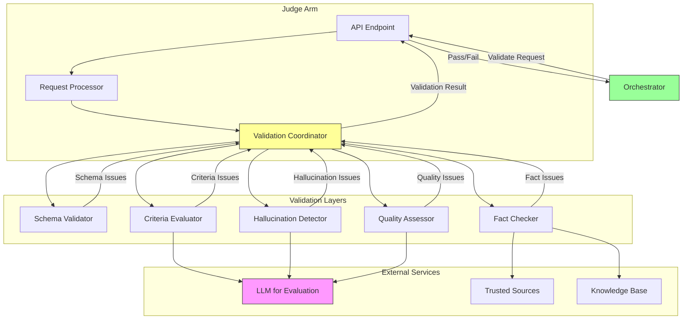
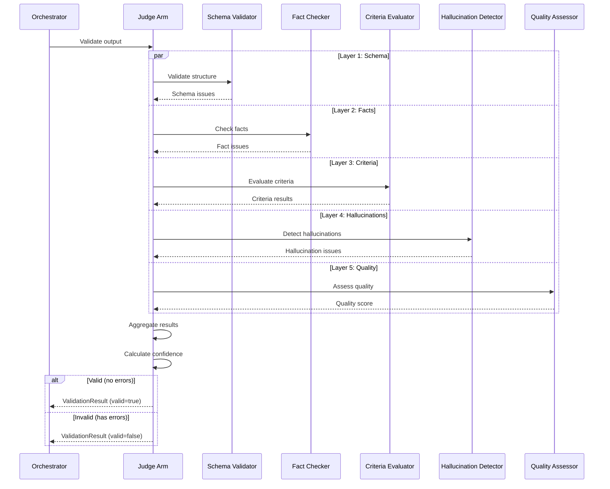

# Judge Arm: Validation & Quality Assurance

**Components** > **Arms** > Judge Arm

**Version**: 1.0
**Technology**: Python 3.11+ / FastAPI
**Cost Tier**: 2 (Medium)
**Average Latency**: 0.5-2 seconds
**Status**: Phase 1 Complete

## Table of Contents

- [Overview](#overview)
- [Architecture](#architecture)
- [Core Functionality](#core-functionality)
  - [Validation Types](#validation-types)
  - [Multi-Layer Validation](#multi-layer-validation)
  - [Acceptance Criteria Checking](#acceptance-criteria-checking)
  - [Hallucination Detection](#hallucination-detection)
- [Validation Layers](#validation-layers)
  - [Layer 1: Schema Validation](#layer-1-schema-validation)
  - [Layer 2: Fact-Checking](#layer-2-fact-checking)
  - [Layer 3: Criteria Validation](#layer-3-criteria-validation)
  - [Layer 4: Hallucination Detection](#layer-4-hallucination-detection)
  - [Layer 5: Quality Assessment](#layer-5-quality-assessment)
- [Implementation](#implementation)
  - [JudgeArm Class](#judgearm-class)
  - [Schema Validator](#schema-validator)
  - [Fact Checker](#fact-checker)
  - [Quality Assessor](#quality-assessor)
- [API Specification](#api-specification)
  - [Validate Output](#validate-output)
  - [Response Formats](#response-formats)
- [Data Models](#data-models)
- [Configuration](#configuration)
- [Performance Characteristics](#performance-characteristics)
- [Testing](#testing)
- [Deployment](#deployment)
- [See Also](#see-also)

---

## Overview

The Judge Arm is responsible for validating outputs from other arms against acceptance criteria, checking facts, detecting hallucinations, and ensuring quality standards. It acts as the quality assurance gate before results are returned to the orchestrator.

### Key Features

- **Multi-Layer Validation**: Five distinct validation layers
- **Schema Validation**: JSON/data structure compliance
- **Fact-Checking**: Verify claims against trusted sources
- **Criteria Checking**: Ensure acceptance criteria are met
- **Hallucination Detection**: Identify unsupported or fabricated information
- **Quality Assessment**: General quality scoring
- **Confidence Scoring**: Quantify validation certainty
- **Issue Classification**: Errors, warnings, and informational suggestions

### Design Principles

1. **Defense in Depth**: Multiple independent validation layers
2. **Fail-Safe**: Errors result in rejection
3. **Explainability**: Clear issue descriptions with suggestions
4. **Severity Levels**: Distinguish critical errors from warnings
5. **Confidence Quantification**: Express uncertainty in results

---

## Architecture



### Validation Flow



---

## Core Functionality

### Validation Types

```python
from enum import Enum

class ValidationType(str, Enum):
    SCHEMA = "schema"                    # JSON/data structure validation
    FACTS = "facts"                      # Fact-checking against sources
    CRITERIA = "criteria"                # Acceptance criteria checking
    QUALITY = "quality"                  # General quality assessment
    HALLUCINATION = "hallucination"      # Detect false information
```

### Multi-Layer Validation

The Judge Arm performs validation through five independent layers, each producing issues with severity levels:

| Severity | Meaning | Impact |
|----------|---------|--------|
| **error** | Critical problem, must fix | `valid = false` |
| **warning** | Potential issue, review recommended | `valid = true` (if no errors) |
| **info** | Suggestion for improvement | `valid = true` |

### Acceptance Criteria Checking

Evaluates whether output meets specified requirements using LLM-based assessment:

```python
async def _check_criteria(
    self,
    output: Any,
    criteria: List[str]
) -> CriteriaResult:
    """Check if output meets acceptance criteria."""

    passed = []
    failed = []
    issues = []

    for criterion in criteria:
        # Use LLM to evaluate criterion
        is_met = await self._evaluate_criterion(output, criterion)

        if is_met:
            passed.append(criterion)
        else:
            failed.append(criterion)
            issues.append(ValidationIssue(
                severity="error",
                type="criteria_not_met",
                message=f"Acceptance criterion not met: {criterion}",
                suggestion="Review output and ensure it addresses this requirement"
            ))

    confidence = len(passed) / len(criteria) if criteria else 1.0

    return CriteriaResult(
        passed=passed,
        failed=failed,
        issues=issues,
        confidence=confidence
    )
```

### Hallucination Detection

Identifies claims not supported by provided context:

```python
async def _detect_hallucinations(
    self,
    output: Any,
    context: Dict[str, Any]
) -> HallucinationResult:
    """Detect unsupported claims or fabricated information."""

    # Extract claims from output
    claims = await self._extract_claims(output)

    issues = []
    hallucination_count = 0

    for claim in claims:
        # Check if claim is supported by context
        is_supported = await self._verify_claim_support(claim, context)

        if not is_supported:
            hallucination_count += 1
            issues.append(ValidationIssue(
                severity="warning",
                type="unsupported_claim",
                message=f"Claim not supported by context: {claim}",
                suggestion="Verify this information or mark as uncertain"
            ))

    confidence = 1.0 - (hallucination_count / len(claims)) if claims else 1.0

    return HallucinationResult(
        issues=issues,
        confidence=confidence,
        hallucination_count=hallucination_count,
        total_claims=len(claims)
    )
```

---

## Validation Layers

### Layer 1: Schema Validation

Validates data structure against JSON Schema or Pydantic models:

```python
class SchemaValidator:
    """Validate output against expected schema."""

    async def validate(
        self,
        output: Any,
        schema: Dict[str, Any]
    ) -> ValidationResult:
        """Validate output structure."""

        try:
            # Use jsonschema for validation
            import jsonschema
            jsonschema.validate(output, schema)

            return ValidationResult(
                issues=[],
                confidence=1.0
            )

        except jsonschema.ValidationError as e:
            return ValidationResult(
                issues=[
                    ValidationIssue(
                        severity="error",
                        type="schema_violation",
                        message=f"Schema validation failed: {e.message}",
                        location=".".join(str(p) for p in e.path),
                        suggestion="Ensure output matches expected structure"
                    )
                ],
                confidence=0.0
            )
```

### Layer 2: Fact-Checking

Verifies factual claims against trusted sources:

```python
class FactChecker:
    """Verify facts against trusted sources."""

    def __init__(self, knowledge_base_url: str):
        self.kb_url = knowledge_base_url

    async def verify_facts(
        self,
        output: Any,
        trusted_sources: List[str]
    ) -> ValidationResult:
        """Check facts against trusted sources."""

        # Extract factual statements
        facts = await self._extract_facts(output)

        issues = []
        verified_count = 0

        for fact in facts:
            # Query knowledge base
            is_verified = await self._verify_fact(fact, trusted_sources)

            if not is_verified:
                issues.append(ValidationIssue(
                    severity="warning",
                    type="unverified_fact",
                    message=f"Cannot verify fact: {fact}",
                    suggestion="Provide source or mark as unverified"
                ))
            else:
                verified_count += 1

        confidence = verified_count / len(facts) if facts else 1.0

        return ValidationResult(
            issues=issues,
            confidence=confidence
        )
```

### Layer 3: Criteria Validation

LLM-based evaluation of acceptance criteria:

```python
async def _evaluate_criterion(self, output: Any, criterion: str) -> bool:
    """Evaluate if output meets criterion using LLM."""

    prompt = f"""Evaluate if the following output meets this criterion:

Criterion: {criterion}

Output:
{json.dumps(output, indent=2)}

Respond with ONLY "YES" if the criterion is met, or "NO" if not met.
"""

    response = await openai.ChatCompletion.acreate(
        model="gpt-3.5-turbo",
        messages=[
            {"role": "system", "content": "You are a precise evaluator."},
            {"role": "user", "content": prompt}
        ],
        temperature=0.0,
        max_tokens=10
    )

    answer = response.choices[0].message.content.strip().upper()
    return answer == "YES"
```

### Layer 4: Hallucination Detection

Extracts and verifies claims:

```python
async def _extract_claims(self, output: Any) -> List[str]:
    """Extract factual claims from output."""

    prompt = f"""Extract all factual claims from this output as a JSON array:

Output:
{json.dumps(output, indent=2)}

Return only verifiable factual statements, not opinions or instructions.
Format: ["claim 1", "claim 2", ...]
"""

    response = await openai.ChatCompletion.acreate(
        model="gpt-3.5-turbo",
        messages=[
            {"role": "system", "content": "You are a fact extractor."},
            {"role": "user", "content": prompt}
        ],
        temperature=0.0,
        max_tokens=500
    )

    content = response.choices[0].message.content.strip()
    claims = json.loads(content)
    return claims

async def _verify_claim_support(
    self,
    claim: str,
    context: Dict[str, Any]
) -> bool:
    """Verify if claim is supported by context."""

    prompt = f"""Is this claim supported by the provided context?

Claim: {claim}

Context:
{json.dumps(context, indent=2)}

Respond with ONLY "YES" if supported, "NO" if not.
"""

    response = await openai.ChatCompletion.acreate(
        model="gpt-3.5-turbo",
        messages=[
            {"role": "system", "content": "You are a claim verifier."},
            {"role": "user", "content": prompt}
        ],
        temperature=0.0,
        max_tokens=10
    )

    answer = response.choices[0].message.content.strip().upper()
    return answer == "YES"
```

### Layer 5: Quality Assessment

General quality scoring:

```python
class QualityAssessor:
    """Assess overall quality of output."""

    async def assess(self, output: Any) -> QualityResult:
        """Perform comprehensive quality assessment."""

        issues = []
        scores = []

        # Check completeness
        completeness = await self._check_completeness(output)
        scores.append(completeness.score)
        issues.extend(completeness.issues)

        # Check clarity
        clarity = await self._check_clarity(output)
        scores.append(clarity.score)
        issues.extend(clarity.issues)

        # Check consistency
        consistency = await self._check_consistency(output)
        scores.append(consistency.score)
        issues.extend(consistency.issues)

        overall_score = sum(scores) / len(scores)

        return QualityResult(
            score=overall_score,
            issues=issues
        )
```

---

## Implementation

### JudgeArm Class

```python
from typing import List, Dict, Any, Optional
from pydantic import BaseModel, Field

class ValidationRequest(BaseModel):
    output: Any = Field(..., description="Output to validate")
    validation_types: List[ValidationType]
    acceptance_criteria: List[str] = Field(default_factory=list)
    expected_schema: Optional[Dict[str, Any]] = None
    trusted_sources: List[str] = Field(default_factory=list)
    context: Dict[str, Any] = Field(default_factory=dict)

class ValidationIssue(BaseModel):
    severity: str = Field(..., description="error, warning, info")
    type: str
    message: str
    location: Optional[str] = None
    suggestion: Optional[str] = None

class ValidationResult(BaseModel):
    valid: bool
    confidence: float = Field(..., ge=0.0, le=1.0)
    issues: List[ValidationIssue] = Field(default_factory=list)
    passed_criteria: List[str] = Field(default_factory=list)
    failed_criteria: List[str] = Field(default_factory=list)
    quality_score: float = Field(..., ge=0.0, le=1.0)
    metadata: Dict[str, Any] = Field(default_factory=dict)

class JudgeArm:
    """Output validation and quality assurance specialist."""

    def __init__(self):
        self.schema_validator = SchemaValidator()
        self.fact_checker = FactChecker()
        self.quality_assessor = QualityAssessor()

    async def validate(self, req: ValidationRequest) -> ValidationResult:
        """Validate output through multiple layers."""

        issues = []
        passed_criteria = []
        failed_criteria = []
        confidence_scores = []

        # Layer 1: Schema validation
        if ValidationType.SCHEMA in req.validation_types and req.expected_schema:
            schema_result = await self.schema_validator.validate(
                req.output,
                req.expected_schema
            )
            issues.extend(schema_result.issues)
            confidence_scores.append(schema_result.confidence)

        # Layer 2: Fact-checking
        if ValidationType.FACTS in req.validation_types:
            fact_result = await self.fact_checker.verify_facts(
                req.output,
                req.trusted_sources
            )
            issues.extend(fact_result.issues)
            confidence_scores.append(fact_result.confidence)

        # Layer 3: Acceptance criteria
        if ValidationType.CRITERIA in req.validation_types:
            criteria_result = await self._check_criteria(
                req.output,
                req.acceptance_criteria
            )
            passed_criteria = criteria_result.passed
            failed_criteria = criteria_result.failed
            issues.extend(criteria_result.issues)
            confidence_scores.append(criteria_result.confidence)

        # Layer 4: Hallucination detection
        if ValidationType.HALLUCINATION in req.validation_types:
            hallucination_result = await self._detect_hallucinations(
                req.output,
                req.context
            )
            issues.extend(hallucination_result.issues)
            confidence_scores.append(hallucination_result.confidence)

        # Layer 5: Quality assessment
        if ValidationType.QUALITY in req.validation_types:
            quality_result = await self.quality_assessor.assess(req.output)
            issues.extend(quality_result.issues)
            confidence_scores.append(quality_result.score)

        # Determine overall validity
        has_errors = any(issue.severity == "error" for issue in issues)
        valid = not has_errors and len(failed_criteria) == 0

        # Calculate overall confidence
        overall_confidence = sum(confidence_scores) / len(confidence_scores) if confidence_scores else 0.5

        return ValidationResult(
            valid=valid,
            confidence=overall_confidence,
            issues=issues,
            passed_criteria=passed_criteria,
            failed_criteria=failed_criteria,
            quality_score=quality_result.score if quality_result else 0.5,
            metadata={
                "validation_types_run": [vt.value for vt in req.validation_types],
                "total_issues": len(issues),
                "error_count": sum(1 for i in issues if i.severity == "error"),
                "warning_count": sum(1 for i in issues if i.severity == "warning")
            }
        )
```

### Schema Validator

See [Layer 1: Schema Validation](#layer-1-schema-validation) section.

### Fact Checker

See [Layer 2: Fact-Checking](#layer-2-fact-checking) section.

### Quality Assessor

See [Layer 5: Quality Assessment](#layer-5-quality-assessment) section.

---

## API Specification

### Validate Output

**Endpoint**: `POST /validate`

**Request Body**:
```json
{
  "output": {
    "code": "def sort_list(lst): return sorted(lst)",
    "tests": "assert sort_list([3,1,2]) == [1,2,3]"
  },
  "validation_types": ["schema", "criteria", "quality"],
  "acceptance_criteria": [
    "Code implements sorting functionality",
    "Tests are included",
    "Function has proper naming"
  ],
  "expected_schema": {
    "type": "object",
    "required": ["code", "tests"],
    "properties": {
      "code": {"type": "string"},
      "tests": {"type": "string"}
    }
  }
}
```

**Field Descriptions**:

| Field | Type | Required | Description |
|-------|------|----------|-------------|
| `output` | any | Yes | Output to validate |
| `validation_types` | array[string] | Yes | Types of validation to perform |
| `acceptance_criteria` | array[string] | No | Criteria that must be met |
| `expected_schema` | object | No | JSON Schema for structure validation |
| `trusted_sources` | array[string] | No | URLs of trusted sources for fact-checking |
| `context` | object | No | Context for hallucination detection |

### Response Formats

**Valid Output** (200 OK):
```json
{
  "valid": true,
  "confidence": 0.92,
  "issues": [
    {
      "severity": "info",
      "type": "style_suggestion",
      "message": "Consider adding docstring to function",
      "location": "function:sort_list",
      "suggestion": "Add docstring explaining parameters and return value"
    }
  ],
  "passed_criteria": [
    "Code implements sorting functionality",
    "Tests are included",
    "Function has proper naming"
  ],
  "failed_criteria": [],
  "quality_score": 0.85,
  "metadata": {
    "validation_types_run": ["schema", "criteria", "quality"],
    "total_issues": 1,
    "error_count": 0,
    "warning_count": 0
  }
}
```

**Invalid Output** (200 OK with valid=false):
```json
{
  "valid": false,
  "confidence": 0.45,
  "issues": [
    {
      "severity": "error",
      "type": "schema_violation",
      "message": "Missing required field 'tests'",
      "location": "root",
      "suggestion": "Add 'tests' field to output"
    },
    {
      "severity": "error",
      "type": "criteria_not_met",
      "message": "Acceptance criterion not met: Tests are included",
      "suggestion": "Review output and ensure it addresses this requirement"
    },
    {
      "severity": "warning",
      "type": "unsupported_claim",
      "message": "Claim not supported by context: Function is O(n log n) complexity",
      "suggestion": "Verify this information or mark as uncertain"
    }
  ],
  "passed_criteria": [
    "Code implements sorting functionality"
  ],
  "failed_criteria": [
    "Tests are included",
    "Function has proper naming"
  ],
  "quality_score": 0.60,
  "metadata": {
    "validation_types_run": ["schema", "criteria", "hallucination", "quality"],
    "total_issues": 3,
    "error_count": 2,
    "warning_count": 1
  }
}
```

---

## Data Models

### Request Models

```python
class CriteriaResult(BaseModel):
    passed: List[str]
    failed: List[str]
    issues: List[ValidationIssue]
    confidence: float

class HallucinationResult(BaseModel):
    issues: List[ValidationIssue]
    confidence: float
    hallucination_count: int
    total_claims: int

class QualityResult(BaseModel):
    score: float
    issues: List[ValidationIssue]
```

---

## Configuration

### Environment Variables

```bash
# Judge Arm Configuration
JUDGE_PORT=8005
JUDGE_MODEL=gpt-3.5-turbo
JUDGE_TEMPERATURE=0.0

# Knowledge Base
KNOWLEDGE_BASE_URL=http://postgres:5432
TRUSTED_SOURCES_URL=http://retriever-arm:8006

# Validation Settings
ENABLE_HALLUCINATION_DETECTION=true
ENABLE_FACT_CHECKING=true
FACT_CHECK_THRESHOLD=0.8
QUALITY_MIN_SCORE=0.7

# Logging
LOG_LEVEL=info
LOG_VALIDATION_RESULTS=true
```

---

## Performance Characteristics

### Latency

| Validation Type | P50 | P95 | P99 |
|-----------------|-----|-----|-----|
| Schema | 10ms | 20ms | 50ms |
| Facts | 500ms | 1s | 2s |
| Criteria | 800ms | 1.5s | 3s |
| Hallucination | 1s | 2s | 4s |
| Quality | 500ms | 1s | 2s |
| **Total (all)** | **2s** | **4s** | **8s** |

### Accuracy

- **Schema Validation**: 100% (deterministic)
- **Fact-Checking**: 75-85% (depends on sources)
- **Criteria Evaluation**: 80-90% (LLM-based)
- **Hallucination Detection**: 70-80% (context-dependent)
- **Quality Assessment**: 75-85% (subjective)

---

## Testing

### Unit Tests

```python
import pytest
from judge_arm import JudgeArm, ValidationRequest, ValidationType

@pytest.fixture
def judge():
    return JudgeArm()

@pytest.mark.asyncio
async def test_schema_validation(judge):
    request = ValidationRequest(
        output={"code": "def test(): pass"},
        validation_types=[ValidationType.SCHEMA],
        expected_schema={
            "type": "object",
            "required": ["code"],
            "properties": {"code": {"type": "string"}}
        }
    )

    result = await judge.validate(request)

    assert result.valid
    assert result.confidence > 0.9
    assert len(result.issues) == 0

@pytest.mark.asyncio
async def test_criteria_checking(judge):
    request = ValidationRequest(
        output={"code": "def sort(lst): return sorted(lst)"},
        validation_types=[ValidationType.CRITERIA],
        acceptance_criteria=[
            "Code implements sorting",
            "Function is named 'sort'"
        ]
    )

    result = await judge.validate(request)

    assert len(result.passed_criteria) == 2
    assert len(result.failed_criteria) == 0
```

---

## Deployment

### Dockerfile

```dockerfile
FROM python:3.11-slim

WORKDIR /app

COPY requirements.txt .
RUN pip install --no-cache-dir -r requirements.txt

COPY judge_arm/ ./judge_arm/

RUN useradd -m -u 1000 judge && chown -R judge:judge /app
USER judge

ENV PYTHONUNBUFFERED=1
EXPOSE 8005

CMD ["uvicorn", "judge_arm.main:app", "--host", "0.0.0.0", "--port", "8005"]
```

### Kubernetes Deployment

```yaml
apiVersion: apps/v1
kind: Deployment
metadata:
  name: judge-arm
  namespace: octollm
spec:
  replicas: 2
  selector:
    matchLabels:
      app: judge-arm
  template:
    metadata:
      labels:
        app: judge-arm
    spec:
      containers:
      - name: judge
        image: octollm/judge-arm:1.0
        ports:
        - containerPort: 8005
        env:
        - name: JUDGE_PORT
          value: "8005"
        - name: OPENAI_API_KEY
          valueFrom:
            secretKeyRef:
              name: openai-credentials
              key: api-key
        resources:
          requests:
            memory: "256Mi"
            cpu: "250m"
          limits:
            memory: "1Gi"
            cpu: "1000m"
```

---

## See Also

- [Orchestrator Component](../orchestrator.md) - Coordinates validation
- [Coder Arm](./coder-arm.md) - Code generation that requires validation
- [Planner Arm](./planner-arm.md) - Plan validation
- [Safety Guardian Arm](./guardian-arm.md) - Pre-execution security validation
- [API Reference](../../api/rest-api.md) - Complete API documentation

---

**Document Status**: Phase 1 Complete
**Last Updated**: 2025-11-10
**Maintainer**: OctoLLM Core Team
**Next Review**: 2025-12-10
