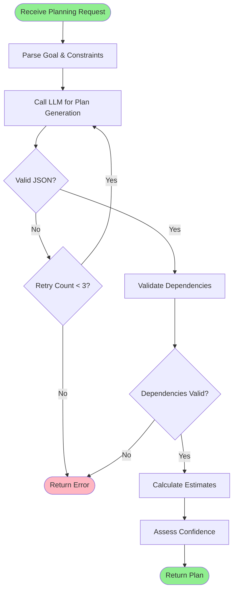
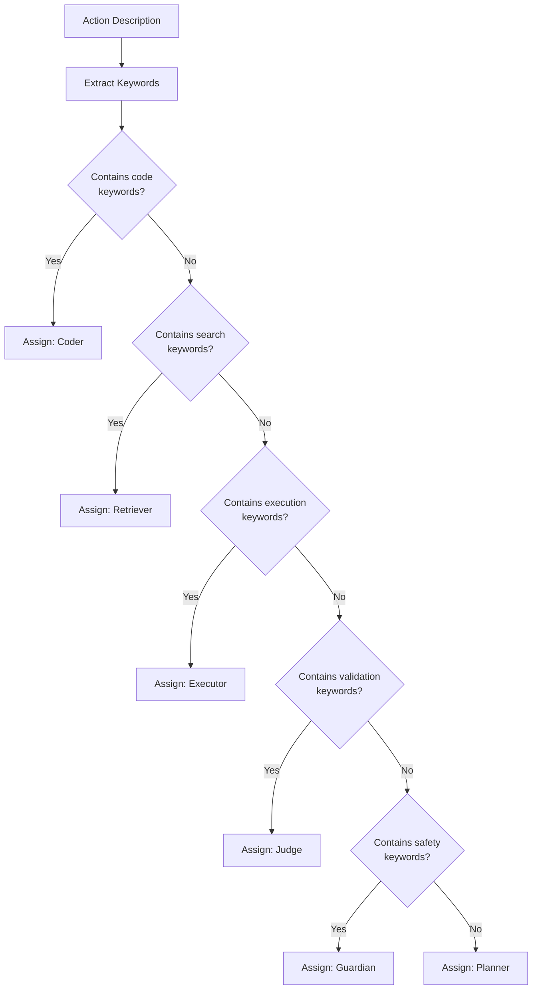
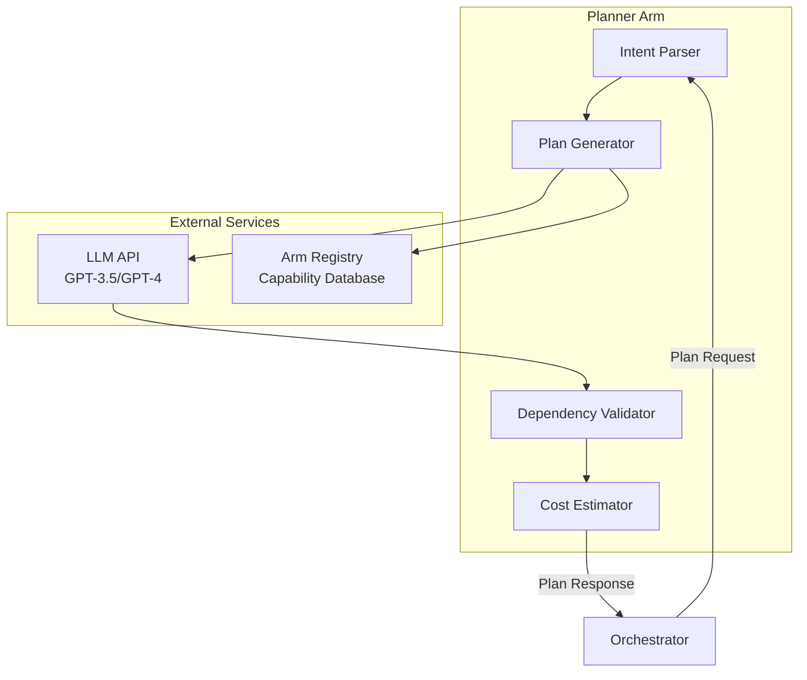

# Planner Arm: Task Decomposition and Planning

**Components** > **Arms** > Planner Arm

**Component**: Planner Arm (Task Decomposition Specialist)
**Version**: 1.0
**Last Updated**: 2025-11-10
**Technology**: Python 3.11+ / FastAPI
**Cost Tier**: 2 (Medium)
**Average Latency**: 1-2 seconds

## Table of Contents

- [Overview](#overview)
- [Core Functionality](#core-functionality)
- [Architecture](#architecture)
- [Implementation Details](#implementation-details)
- [API Specification](#api-specification)
- [Data Structures](#data-structures)
- [Configuration](#configuration)
- [Performance Characteristics](#performance-characteristics)
- [Testing](#testing)
- [Error Handling](#error-handling)
- [Deployment](#deployment)
- [See Also](#see-also)

## Overview

The Planner Arm is a specialized component responsible for decomposing complex tasks into sequential subtasks with clear acceptance criteria, dependencies, and arm assignments. It serves as the strategic thinking component that bridges high-level goals with executable action plans.

### Design Goals

- **Intelligent Decomposition**: Break complex goals into manageable, executable steps
- **Dependency Awareness**: Identify and track prerequisite relationships between steps
- **Arm Selection**: Match subtasks to the most appropriate specialized arms
- **Quality Planning**: Generate plans that maximize success probability
- **Cost Awareness**: Balance thoroughness with resource efficiency

### Key Capabilities

1. **Goal Parsing**: Extract intent and requirements from natural language
2. **Subtask Generation**: Create 3-7 well-defined execution steps
3. **Dependency Resolution**: Establish correct execution order
4. **Arm Selection**: Match capabilities to subtasks
5. **Acceptance Criteria**: Define clear success conditions
6. **Cost Estimation**: Predict resource requirements

## Core Functionality

### Task Decomposition Algorithm

The Planner Arm uses an LLM-based approach with structured prompting to generate execution plans:

```python
from typing import List, Dict, Any, Optional
from pydantic import BaseModel, Field
import openai
import json

class SubTask(BaseModel):
    """A single step in the execution plan."""
    step: int
    action: str = Field(..., description="What to do")
    required_arm: str = Field(..., description="Which arm executes this")
    acceptance_criteria: List[str] = Field(..., description="Success conditions")
    depends_on: List[int] = Field(default_factory=list, description="Prerequisite steps")
    estimated_cost_tier: int = Field(1, ge=1, le=5)
    estimated_duration_seconds: int = Field(30, ge=1)

class PlanResponse(BaseModel):
    """Complete execution plan."""
    plan: List[SubTask]
    rationale: str = Field(..., description="Why this approach")
    confidence: float = Field(..., ge=0.0, le=1.0)
    total_estimated_duration: int
    complexity_score: float = Field(..., ge=0.0, le=1.0)

class PlannerArm:
    """Task decomposition specialist."""

    def __init__(self, llm_model: str = "gpt-3.5-turbo"):
        self.model = llm_model
        self.system_prompt = self._build_system_prompt()

    def _build_system_prompt(self) -> str:
        return """You are an expert task planner for a distributed AI system.

Available arms and their capabilities:
- planner: Task decomposition, dependency resolution
- retriever: Search knowledge bases, documentation, web
- coder: Write/debug/refactor code, static analysis
- executor: Run shell commands, API calls, web scraping
- judge: Validate outputs, fact-check, quality assurance
- guardian: PII detection, safety checks, policy enforcement

Your task: Break down complex goals into 3-7 clear, executable steps.

For each step specify:
1. **action**: Clear, imperative description ("Search for...", "Generate...")
2. **required_arm**: Which arm should execute (match capabilities)
3. **acceptance_criteria**: 2-3 verifiable success conditions
4. **depends_on**: List of prerequisite step numbers (empty for first step)
5. **estimated_cost_tier**: 1=cheap, 5=expensive
6. **estimated_duration_seconds**: Realistic time estimate

Rules:
- Steps must be sequential and logically ordered
- Each step must have clear acceptance criteria
- Dependencies must reference earlier steps only
- Prefer specialized arms over generalists
- Include validation steps for critical outputs
- Always end with a verification/quality check step

Output valid JSON matching the PlanResponse schema."""

    async def generate_plan(
        self,
        goal: str,
        constraints: List[str],
        context: Dict[str, Any]
    ) -> PlanResponse:
        """Generate execution plan for goal."""

        user_prompt = f"""Goal: {goal}

Constraints:
{chr(10).join(f"- {c}" for c in constraints) if constraints else "None"}

Context:
{context if context else "None"}

Generate a detailed execution plan with 3-7 steps."""

        try:
            response = await openai.ChatCompletion.acreate(
                model=self.model,
                messages=[
                    {"role": "system", "content": self.system_prompt},
                    {"role": "user", "content": user_prompt}
                ],
                temperature=0.3,  # Lower for consistency
                max_tokens=2000,
                response_format={"type": "json_object"}
            )

            plan_data = json.loads(response.choices[0].message.content)

            # Calculate total duration
            total_duration = sum(
                step.get("estimated_duration_seconds", 30)
                for step in plan_data["plan"]
            )
            plan_data["total_estimated_duration"] = total_duration

            # Validate dependencies
            self._validate_dependencies(plan_data["plan"])

            return PlanResponse(**plan_data)

        except json.JSONDecodeError as e:
            raise ValueError(f"Failed to parse plan JSON: {e}")
        except Exception as e:
            raise RuntimeError(f"Planning failed: {e}")

    def _validate_dependencies(self, steps: List[Dict]) -> None:
        """Ensure dependencies reference valid steps."""
        step_numbers = {step["step"] for step in steps}

        for step in steps:
            for dep in step.get("depends_on", []):
                if dep not in step_numbers:
                    raise ValueError(
                        f"Step {step['step']} depends on non-existent step {dep}"
                    )
                if dep >= step["step"]:
                    raise ValueError(
                        f"Step {step['step']} cannot depend on later step {dep}"
                    )
```

### Planning Flow



### Decision Tree for Arm Selection



## Architecture

### Component Integration



## Implementation Details

### Complete FastAPI Implementation

```python
from fastapi import FastAPI, HTTPException, BackgroundTasks
from fastapi.responses import JSONResponse
import structlog
from datetime import datetime
import uuid

logger = structlog.get_logger()

app = FastAPI(title="Planner Arm", version="1.0.0")

# Global planner instance
planner = PlannerArm(llm_model="gpt-3.5-turbo")

class PlanRequest(BaseModel):
    """Incoming planning request."""
    goal: str = Field(..., description="What to accomplish")
    constraints: List[str] = Field(default_factory=list)
    context: Dict[str, Any] = Field(default_factory=dict)
    request_id: Optional[str] = Field(default_factory=lambda: str(uuid.uuid4()))

@app.post("/plan", response_model=PlanResponse)
async def create_plan(request: PlanRequest):
    """Generate execution plan for given goal."""

    logger.info(
        "planner.plan.request",
        request_id=request.request_id,
        goal=request.goal[:100]
    )

    start_time = datetime.utcnow()

    try:
        plan = await planner.generate_plan(
            goal=request.goal,
            constraints=request.constraints,
            context=request.context
        )

        duration_ms = int((datetime.utcnow() - start_time).total_seconds() * 1000)

        logger.info(
            "planner.plan.success",
            request_id=request.request_id,
            steps=len(plan.plan),
            duration_ms=duration_ms,
            confidence=plan.confidence
        )

        return plan

    except ValueError as e:
        logger.error(
            "planner.plan.validation_error",
            request_id=request.request_id,
            error=str(e)
        )
        raise HTTPException(status_code=400, detail=str(e))

    except RuntimeError as e:
        logger.error(
            "planner.plan.runtime_error",
            request_id=request.request_id,
            error=str(e)
        )
        raise HTTPException(status_code=500, detail=str(e))

@app.get("/health")
async def health_check():
    """Health check endpoint."""
    return {
        "status": "healthy",
        "version": "1.0.0",
        "model": planner.model,
        "timestamp": datetime.utcnow().isoformat()
    }

@app.get("/capabilities")
async def get_capabilities():
    """Return arm capabilities."""
    return {
        "arm_id": "planner",
        "capabilities": [
            "planning",
            "task_decomposition",
            "dependency_resolution",
            "arm_selection"
        ],
        "cost_tier": 2,
        "average_latency_ms": 1500,
        "success_rate": 0.92
    }

@app.get("/metrics")
async def get_metrics():
    """Prometheus metrics endpoint."""
    # Implement metrics collection
    return {"metrics": "not implemented"}
```

## API Specification

### POST /plan

Generate an execution plan for a given goal.

**Request Body:**

```json
{
  "goal": "Fix authentication bug and add tests",
  "constraints": [
    "Don't modify database schema",
    "Complete in <5 minutes",
    "Maintain backward compatibility"
  ],
  "context": {
    "repository": "https://github.com/example/repo",
    "affected_files": ["auth/login.py"]
  }
}
```

**Response (200 OK):**

```json
{
  "plan": [
    {
      "step": 1,
      "action": "Search codebase for authentication logic and recent bug reports",
      "required_arm": "retriever",
      "acceptance_criteria": [
        "Found auth/login.py implementation",
        "Identified related test files",
        "Located bug reports or issue references"
      ],
      "depends_on": [],
      "estimated_cost_tier": 1,
      "estimated_duration_seconds": 20
    },
    {
      "step": 2,
      "action": "Analyze authentication code to identify the bug",
      "required_arm": "coder",
      "acceptance_criteria": [
        "Root cause identified with line number",
        "Explanation of why bug occurs",
        "Proposed fix approach validated"
      ],
      "depends_on": [1],
      "estimated_cost_tier": 3,
      "estimated_duration_seconds": 60
    },
    {
      "step": 3,
      "action": "Generate code patch to fix authentication bug",
      "required_arm": "coder",
      "acceptance_criteria": [
        "Patch addresses root cause",
        "No breaking changes to API",
        "Code follows project style guide"
      ],
      "depends_on": [2],
      "estimated_cost_tier": 4,
      "estimated_duration_seconds": 45
    },
    {
      "step": 4,
      "action": "Generate test case that reproduces the bug scenario",
      "required_arm": "coder",
      "acceptance_criteria": [
        "Test fails on old code",
        "Test passes on patched code",
        "Test covers edge cases"
      ],
      "depends_on": [3],
      "estimated_cost_tier": 3,
      "estimated_duration_seconds": 40
    },
    {
      "step": 5,
      "action": "Run full test suite to verify no regressions",
      "required_arm": "executor",
      "acceptance_criteria": [
        "All existing tests pass",
        "New test passes",
        "No test timeouts or errors"
      ],
      "depends_on": [4],
      "estimated_cost_tier": 2,
      "estimated_duration_seconds": 90
    },
    {
      "step": 6,
      "action": "Validate fix meets acceptance criteria and constraints",
      "required_arm": "judge",
      "acceptance_criteria": [
        "All original acceptance criteria met",
        "No database schema changes",
        "Backward compatibility maintained"
      ],
      "depends_on": [5],
      "estimated_cost_tier": 2,
      "estimated_duration_seconds": 30
    }
  ],
  "rationale": "This plan follows a systematic debugging workflow: locate code, identify bug, fix it, test thoroughly, and validate. Each step has clear outputs that feed into the next, ensuring quality and meeting all constraints.",
  "confidence": 0.88,
  "total_estimated_duration": 285,
  "complexity_score": 0.65
}
```

**Error Responses:**

- **400 Bad Request**: Invalid dependencies or malformed plan
- **500 Internal Server Error**: LLM API failure or planning error
- **503 Service Unavailable**: LLM service temporarily unavailable

## Data Structures

All data structures use Pydantic models for validation and serialization:

```python
class SubTask(BaseModel):
    """A single step in the execution plan."""
    step: int
    action: str = Field(..., description="What to do")
    required_arm: str = Field(..., description="Which arm executes this")
    acceptance_criteria: List[str] = Field(..., description="Success conditions")
    depends_on: List[int] = Field(default_factory=list, description="Prerequisite steps")
    estimated_cost_tier: int = Field(1, ge=1, le=5)
    estimated_duration_seconds: int = Field(30, ge=1)

class PlanResponse(BaseModel):
    """Complete execution plan."""
    plan: List[SubTask]
    rationale: str = Field(..., description="Why this approach")
    confidence: float = Field(..., ge=0.0, le=1.0)
    total_estimated_duration: int
    complexity_score: float = Field(..., ge=0.0, le=1.0)

class PlanRequest(BaseModel):
    """Incoming planning request."""
    goal: str = Field(..., description="What to accomplish")
    constraints: List[str] = Field(default_factory=list)
    context: Dict[str, Any] = Field(default_factory=dict)
    request_id: Optional[str] = Field(default_factory=lambda: str(uuid.uuid4()))
```

## Configuration

### Environment Variables

| Variable | Required | Default | Description |
|----------|----------|---------|-------------|
| `OPENAI_API_KEY` | Yes | - | OpenAI API key |
| `LLM_MODEL` | No | `gpt-3.5-turbo` | Model to use for planning |
| `MAX_PLAN_STEPS` | No | `7` | Maximum steps in plan |
| `MIN_PLAN_STEPS` | No | `3` | Minimum steps in plan |
| `PLANNING_TEMPERATURE` | No | `0.3` | LLM temperature (0.0-1.0) |
| `MAX_TOKENS` | No | `2000` | Max tokens for LLM response |
| `TIMEOUT_SECONDS` | No | `10` | Planning timeout |
| `LOG_LEVEL` | No | `INFO` | Logging level |

### Configuration File

```yaml
# planner-config.yaml
model:
  provider: "openai"
  name: "gpt-3.5-turbo"
  temperature: 0.3
  max_tokens: 2000

planning:
  min_steps: 3
  max_steps: 7
  require_validation_step: true
  require_dependency_check: true

arms:
  - id: "retriever"
    capabilities: ["search", "knowledge_retrieval"]
  - id: "coder"
    capabilities: ["code_generation", "debugging"]
  - id: "executor"
    capabilities: ["shell", "api_calls"]
  - id: "judge"
    capabilities: ["validation", "fact_checking"]
  - id: "guardian"
    capabilities: ["pii_detection", "safety_check"]
```

## Performance Characteristics

### Latency Breakdown

| Operation | Target Latency | Notes |
|-----------|---------------|-------|
| Parse Intent | <50ms | Local processing |
| LLM Call | 1-2s | Dominates latency |
| Dependency Validation | <20ms | Deterministic checks |
| Cost Estimation | <10ms | Simple arithmetic |
| Total (P50) | 1.2s | Average case |
| Total (P95) | 2.5s | Complex plans |

### Resource Requirements

**Per Instance:**
- CPU: 200m (0.2 cores) baseline, 500m under load
- Memory: 256Mi baseline, 512Mi under load
- Disk: Negligible (<100Mi)

### Success Rate Metrics

- **Overall Success Rate**: >92%
- **Valid JSON Rate**: >98%
- **Dependency Validation Pass Rate**: >95%
- **Plan Execution Success Rate**: >88% (downstream)

### Cost Analysis

- **Cost Tier**: 2 (Medium)
- **LLM Cost per Plan**: $0.002-0.005 (GPT-3.5)
- **Requests per Dollar**: 200-500
- **Monthly Cost (1000 plans)**: $2-5

## Testing

### Unit Tests

```python
import pytest
from unittest.mock import AsyncMock, patch

@pytest.mark.asyncio
async def test_plan_generation():
    """Test basic plan generation."""
    planner = PlannerArm()

    plan = await planner.generate_plan(
        goal="Write a function to sort a list",
        constraints=["Use Python", "Include doctests"],
        context={}
    )

    assert len(plan.plan) >= 3
    assert len(plan.plan) <= 7
    assert all(step.step == idx + 1 for idx, step in enumerate(plan.plan))
    assert plan.confidence > 0.5

    # Validate dependencies
    for step in plan.plan:
        for dep in step.depends_on:
            assert dep < step.step

@pytest.mark.asyncio
async def test_complex_plan_with_dependencies():
    """Test complex plan with multiple dependencies."""
    planner = PlannerArm()

    plan = await planner.generate_plan(
        goal="Build and deploy a REST API",
        constraints=["Use FastAPI", "Include tests", "Deploy to Kubernetes"],
        context={"language": "Python"}
    )

    # Should have multiple dependent steps
    dependent_steps = [s for s in plan.plan if s.depends_on]
    assert len(dependent_steps) > 0

    # Should include different arms
    arms_used = {s.required_arm for s in plan.plan}
    assert "coder" in arms_used
    assert "executor" in arms_used or "judge" in arms_used

@pytest.mark.asyncio
async def test_dependency_validation():
    """Test dependency validation catches errors."""
    planner = PlannerArm()

    invalid_steps = [
        {"step": 1, "action": "Do A", "depends_on": []},
        {"step": 2, "action": "Do B", "depends_on": [3]},  # Invalid: depends on future
        {"step": 3, "action": "Do C", "depends_on": [1]}
    ]

    with pytest.raises(ValueError, match="cannot depend on later step"):
        planner._validate_dependencies(invalid_steps)

@pytest.mark.asyncio
async def test_invalid_json_handling():
    """Test handling of invalid JSON from LLM."""
    planner = PlannerArm()

    with patch.object(openai.ChatCompletion, 'acreate') as mock_create:
        mock_create.return_value = AsyncMock(
            choices=[AsyncMock(message=AsyncMock(content="Invalid JSON {"))]
        )

        with pytest.raises(ValueError, match="Failed to parse plan JSON"):
            await planner.generate_plan("Test goal", [], {})
```

### Integration Tests

```python
@pytest.mark.asyncio
@pytest.mark.integration
async def test_end_to_end_planning():
    """Test complete planning workflow with real LLM."""
    planner = PlannerArm(llm_model="gpt-3.5-turbo")

    plan = await planner.generate_plan(
        goal="Create a Python script to analyze CSV data",
        constraints=[
            "Use pandas library",
            "Include error handling",
            "Output results to JSON"
        ],
        context={
            "experience_level": "intermediate",
            "data_source": "sales_data.csv"
        }
    )

    # Verify plan structure
    assert isinstance(plan, PlanResponse)
    assert 3 <= len(plan.plan) <= 7
    assert plan.confidence > 0.6

    # Verify steps are properly ordered
    for idx, step in enumerate(plan.plan):
        assert step.step == idx + 1

    # Verify all dependencies are valid
    for step in plan.plan:
        for dep in step.depends_on:
            assert dep < step.step

    # Verify arms are assigned
    for step in plan.plan:
        assert step.required_arm in [
            "retriever", "coder", "executor", "judge", "guardian", "planner"
        ]
```

## Error Handling

### Error Types

```python
class PlanningError(Exception):
    """Base exception for planning errors."""
    pass

class InvalidDependencyError(PlanningError):
    """Raised when dependencies are invalid."""
    pass

class PlanningTimeoutError(PlanningError):
    """Raised when planning exceeds timeout."""
    pass

class LLMError(PlanningError):
    """Raised when LLM API fails."""
    pass
```

### Error Recovery Strategies

| Error Type | Strategy | Max Retries |
|-----------|----------|-------------|
| LLM Timeout | Retry with exponential backoff | 3 |
| Invalid JSON | Parse with lenient mode, retry | 2 |
| Invalid Dependencies | Auto-fix if possible, else fail | 1 |
| LLM Rate Limit | Wait and retry | 5 |
| Malformed Plan | Simplify goal, retry | 1 |

## Deployment

### Dockerfile

```dockerfile
FROM python:3.11-slim

WORKDIR /app

# Install dependencies
COPY requirements.txt .
RUN pip install --no-cache-dir -r requirements.txt

# Copy application
COPY . .

# Set environment
ENV PYTHONUNBUFFERED=1
ENV LOG_LEVEL=INFO

EXPOSE 8080

# Health check
HEALTHCHECK --interval=10s --timeout=3s --start-period=5s --retries=3 \
    CMD curl -f http://localhost:8080/health || exit 1

CMD ["uvicorn", "main:app", "--host", "0.0.0.0", "--port", "8080"]
```

### Kubernetes Manifest

```yaml
apiVersion: apps/v1
kind: Deployment
metadata:
  name: planner-arm
  namespace: octollm
spec:
  replicas: 2
  selector:
    matchLabels:
      app: planner-arm
  template:
    metadata:
      labels:
        app: planner-arm
        component: arm
    spec:
      containers:
        - name: planner
          image: octollm/planner-arm:1.0.0
          ports:
            - containerPort: 8080
              name: http
          env:
            - name: OPENAI_API_KEY
              valueFrom:
                secretKeyRef:
                  name: llm-credentials
                  key: openai-api-key
            - name: LLM_MODEL
              value: "gpt-3.5-turbo"
            - name: LOG_LEVEL
              value: "INFO"
          resources:
            requests:
              cpu: 200m
              memory: 256Mi
            limits:
              cpu: 500m
              memory: 512Mi
          livenessProbe:
            httpGet:
              path: /health
              port: 8080
            initialDelaySeconds: 10
            periodSeconds: 5
          readinessProbe:
            httpGet:
              path: /health
              port: 8080
            initialDelaySeconds: 5
            periodSeconds: 3
---
apiVersion: v1
kind: Service
metadata:
  name: planner-arm
  namespace: octollm
spec:
  selector:
    app: planner-arm
  ports:
    - protocol: TCP
      port: 8080
      targetPort: 8080
  type: ClusterIP
```

## See Also

- [Orchestrator Specification](../orchestrator.md) - For task coordination
- [Arm API Contracts](../../api/component-contracts.md) - Standard message formats
- [Memory Systems](../../implementation/memory-systems.md) - Knowledge storage
- [Testing Strategy](../../testing/strategy.md) - Testing approaches

---

**Document Version**: 1.0
**Last Updated**: 2025-11-10
**Maintainer**: OctoLLM Core Team
