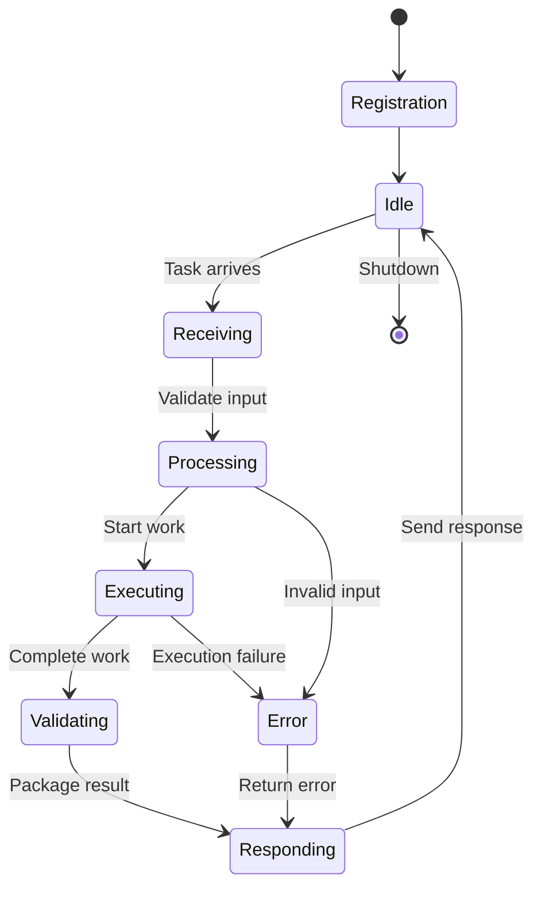
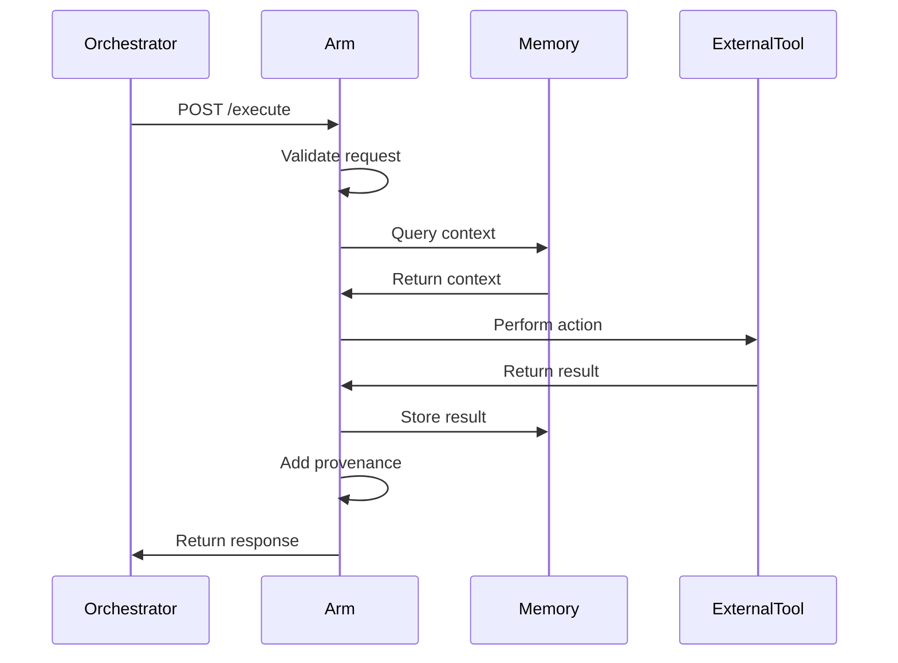

# Creating Custom Arms: Developer Guide

**Estimated Time**: 1-2 hours
**Difficulty**: Intermediate
**Prerequisites**: Basic Python or Rust knowledge, OctoLLM running locally

## Overview

This comprehensive guide walks you through creating a custom arm for OctoLLM, from concept to deployment. You'll learn the arm architecture, implementation patterns, testing strategies, and deployment procedures.

By the end, you'll have built a fully functional custom arm that integrates seamlessly with the OctoLLM ecosystem.

---

## Table of Contents

1. [Understanding Arm Architecture](#understanding-arm-architecture)
2. [Design Your Arm](#design-your-arm)
3. [Python Arm Implementation](#python-arm-implementation)
4. [Rust Arm Implementation (Optional)](#rust-arm-implementation-optional)
5. [Memory Integration](#memory-integration)
6. [Testing Your Arm](#testing-your-arm)
7. [Deployment](#deployment)
8. [Complete Example: Research Arm](#complete-example-research-arm)

---

## Understanding Arm Architecture

### Core Principles

Every arm in OctoLLM follows these principles:

1. **Single Responsibility**: One domain, one expertise
2. **Self-Contained**: Minimal external dependencies
3. **Stateless**: Use memory systems for persistence
4. **Observable**: Comprehensive logging and metrics
5. **Resilient**: Graceful degradation and error handling

### Arm Lifecycle



### Standard Arm Interface

All arms implement:

```python
# Common interface across all arms
class BaseArm:
    def execute(self, request: ArmRequest) -> ArmResponse:
        """Main execution method called by orchestrator."""
        pass

    def health_check(self) -> HealthStatus:
        """Return current health status."""
        pass

    def capabilities(self) -> CapabilityManifest:
        """Describe what this arm can do."""
        pass
```

### Communication Flow



---

## Design Your Arm

### Step 1: Define the Domain

Ask yourself:

1. **What problem does this arm solve?**
   - Example: "Research scientific papers and summarize findings"

2. **What inputs does it need?**
   - Example: "Query string, number of papers, date range"

3. **What outputs does it produce?**
   - Example: "Summary, citations, confidence score"

4. **What capabilities/tools does it need?**
   - Example: "Access to arXiv API, PDF parsing, summarization LLM"

### Step 2: Choose Your Technology

**Python** - Choose if:
- Heavy LLM integration
- Need rapid prototyping
- Complex data processing
- Extensive library ecosystem needed

**Rust** - Choose if:
- Performance critical (<10ms latency)
- Heavy computation (parsing, analysis)
- Memory safety paramount
- External API calls with strict timeouts

### Step 3: Design the API Contract

```python
from pydantic import BaseModel, Field
from typing import List, Optional

class ResearchArmRequest(BaseModel):
    """Input schema for research arm."""
    query: str = Field(..., description="Research query")
    max_papers: int = Field(5, ge=1, le=20, description="Number of papers")
    start_date: Optional[str] = Field(None, description="YYYY-MM-DD")
    end_date: Optional[str] = Field(None, description="YYYY-MM-DD")
    include_summaries: bool = Field(True, description="Generate summaries")

class Paper(BaseModel):
    """Single paper result."""
    title: str
    authors: List[str]
    abstract: str
    url: str
    published_date: str
    summary: Optional[str] = None
    relevance_score: float = Field(..., ge=0.0, le=1.0)

class ResearchArmResponse(BaseModel):
    """Output schema for research arm."""
    papers: List[Paper]
    total_found: int
    query_used: str
    confidence: float = Field(..., ge=0.0, le=1.0)
    provenance: ProvenanceMetadata
```

---

## Python Arm Implementation

### Step 1: Project Structure

```bash
# Create arm directory
mkdir -p arms/research
cd arms/research

# Create structure
mkdir -p src/research tests

# Create files
touch src/research/__init__.py
touch src/research/main.py
touch src/research/core.py
touch src/research/models.py
touch tests/test_research.py
touch Dockerfile
touch pyproject.toml
```

**Directory structure**:
```
arms/research/
├── src/
│   └── research/
│       ├── __init__.py
│       ├── main.py         # FastAPI app
│       ├── core.py         # Core logic
│       ├── models.py       # Pydantic models
│       └── memory.py       # Memory integration
├── tests/
│   ├── __init__.py
│   └── test_research.py
├── Dockerfile
├── pyproject.toml
└── README.md
```

### Step 2: Define Models

**File**: `src/research/models.py`

```python
"""Pydantic models for Research Arm."""

from datetime import datetime
from typing import List, Optional
from pydantic import BaseModel, Field, HttpUrl

class ProvenanceMetadata(BaseModel):
    """Provenance tracking for outputs."""
    arm_id: str = "research"
    timestamp: datetime = Field(default_factory=datetime.utcnow)
    sources: List[str] = Field(default_factory=list)
    confidence: float = Field(..., ge=0.0, le=1.0)
    method: str = Field(..., description="Method used (API, scraping, etc)")

class ResearchRequest(BaseModel):
    """Input schema."""
    query: str = Field(..., min_length=3, max_length=500)
    max_papers: int = Field(5, ge=1, le=20)
    start_date: Optional[str] = Field(None, pattern=r"^\d{4}-\d{2}-\d{2}$")
    end_date: Optional[str] = Field(None, pattern=r"^\d{4}-\d{2}-\d{2}$")
    include_summaries: bool = True

    class Config:
        json_schema_extra = {
            "example": {
                "query": "machine learning transformers",
                "max_papers": 5,
                "start_date": "2023-01-01",
                "include_summaries": True
            }
        }

class Paper(BaseModel):
    """Single paper result."""
    title: str
    authors: List[str]
    abstract: str
    url: HttpUrl
    published_date: str
    summary: Optional[str] = None
    relevance_score: float = Field(..., ge=0.0, le=1.0)
    citation: str  # Formatted citation

class ResearchResponse(BaseModel):
    """Output schema."""
    papers: List[Paper]
    total_found: int
    query_used: str
    search_time_ms: int
    confidence: float = Field(..., ge=0.0, le=1.0)
    provenance: ProvenanceMetadata

class HealthStatus(BaseModel):
    """Health check response."""
    status: str = "healthy"
    arm_id: str = "research"
    version: str = "1.0.0"
    api_accessible: bool = True

class CapabilityManifest(BaseModel):
    """Arm capabilities."""
    arm_id: str = "research"
    name: str = "Research Arm"
    description: str = "Scientific paper search and summarization"
    version: str = "1.0.0"
    capabilities: List[str] = ["paper_search", "summarization", "citation_formatting"]
    input_schema: dict
    output_schema: dict
    cost_tier: int = Field(3, ge=1, le=5, description="1=cheap, 5=expensive")
    average_latency_ms: int = 2000
```

### Step 3: Implement Core Logic

**File**: `src/research/core.py`

```python
"""Core research functionality."""

import asyncio
import httpx
from typing import List, Optional
from datetime import datetime
from .models import Paper, ResearchRequest, ProvenanceMetadata
import openai
import structlog

logger = structlog.get_logger()

class ResearchEngine:
    """Main research engine using arXiv API."""

    def __init__(self, openai_api_key: str):
        self.api_base = "http://export.arxiv.org/api/query"
        self.openai_client = openai.AsyncOpenAI(api_key=openai_api_key)
        self.http_client = httpx.AsyncClient(timeout=30.0)

    async def search_papers(self, request: ResearchRequest) -> List[Paper]:
        """Search arXiv for papers matching query."""

        logger.info("research.search_papers.start", query=request.query)

        # Build arXiv query
        query_params = {
            "search_query": f"all:{request.query}",
            "start": 0,
            "max_results": request.max_papers * 2,  # Get extras for filtering
            "sortBy": "relevance",
            "sortOrder": "descending"
        }

        try:
            response = await self.http_client.get(self.api_base, params=query_params)
            response.raise_for_status()

            # Parse arXiv XML response (simplified)
            papers_raw = self._parse_arxiv_xml(response.text)

            # Score relevance
            papers = []
            for paper_data in papers_raw[:request.max_papers]:
                relevance = await self._calculate_relevance(
                    request.query,
                    paper_data["title"],
                    paper_data["abstract"]
                )

                paper = Paper(
                    title=paper_data["title"],
                    authors=paper_data["authors"],
                    abstract=paper_data["abstract"],
                    url=paper_data["url"],
                    published_date=paper_data["published"],
                    relevance_score=relevance,
                    citation=self._format_citation(paper_data),
                    summary=None  # Will be filled if requested
                )

                if request.include_summaries:
                    paper.summary = await self._generate_summary(paper)

                papers.append(paper)

            logger.info("research.search_papers.complete", count=len(papers))
            return papers

        except Exception as e:
            logger.error("research.search_papers.failed", error=str(e))
            raise

    def _parse_arxiv_xml(self, xml_text: str) -> List[dict]:
        """Parse arXiv API XML response."""
        import xml.etree.ElementTree as ET

        root = ET.fromstring(xml_text)
        namespace = {"atom": "http://www.w3.org/2005/Atom"}

        papers = []
        for entry in root.findall("atom:entry", namespace):
            paper = {
                "title": entry.find("atom:title", namespace).text.strip(),
                "abstract": entry.find("atom:summary", namespace).text.strip(),
                "url": entry.find("atom:id", namespace).text,
                "published": entry.find("atom:published", namespace).text[:10],
                "authors": [
                    author.find("atom:name", namespace).text
                    for author in entry.findall("atom:author", namespace)
                ]
            }
            papers.append(paper)

        return papers

    async def _calculate_relevance(
        self,
        query: str,
        title: str,
        abstract: str
    ) -> float:
        """Calculate relevance score using simple keyword matching."""

        # Simple implementation - can be enhanced with embeddings
        query_terms = set(query.lower().split())
        text = (title + " " + abstract).lower()

        matches = sum(1 for term in query_terms if term in text)
        score = min(1.0, matches / len(query_terms))

        return score

    async def _generate_summary(self, paper: Paper) -> str:
        """Generate summary using LLM."""

        prompt = f"""Summarize this research paper in 2-3 sentences:

Title: {paper.title}

Abstract: {paper.abstract}

Summary:"""

        try:
            response = await self.openai_client.chat.completions.create(
                model="gpt-3.5-turbo",
                messages=[
                    {"role": "system", "content": "You are a research assistant."},
                    {"role": "user", "content": prompt}
                ],
                max_tokens=150,
                temperature=0.3
            )

            return response.choices[0].message.content.strip()

        except Exception as e:
            logger.warning("research.summary.failed", error=str(e))
            return "Summary generation failed."

    def _format_citation(self, paper_data: dict) -> str:
        """Format paper citation in APA style."""

        authors = paper_data["authors"]
        if len(authors) > 3:
            author_str = f"{authors[0]} et al."
        else:
            author_str = ", ".join(authors)

        year = paper_data["published"][:4]
        title = paper_data["title"]

        return f"{author_str} ({year}). {title}. arXiv."

    async def close(self):
        """Cleanup resources."""
        await self.http_client.aclose()
```

### Step 4: Create FastAPI Application

**File**: `src/research/main.py`

```python
"""FastAPI application for Research Arm."""

import os
from contextlib import asynccontextmanager
from fastapi import FastAPI, HTTPException
from fastapi.responses import JSONResponse
import structlog
from .models import (
    ResearchRequest,
    ResearchResponse,
    HealthStatus,
    CapabilityManifest,
    ProvenanceMetadata
)
from .core import ResearchEngine
from datetime import datetime

# Configure structured logging
structlog.configure(
    processors=[
        structlog.stdlib.filter_by_level,
        structlog.stdlib.add_logger_name,
        structlog.stdlib.add_log_level,
        structlog.stdlib.PositionalArgumentsFormatter(),
        structlog.processors.TimeStamper(fmt="iso"),
        structlog.processors.StackInfoRenderer(),
        structlog.processors.format_exc_info,
        structlog.processors.JSONRenderer()
    ],
    logger_factory=structlog.stdlib.LoggerFactory(),
)

logger = structlog.get_logger()

# Global state
research_engine = None

@asynccontextmanager
async def lifespan(app: FastAPI):
    """Startup and shutdown events."""
    global research_engine

    # Startup
    openai_key = os.getenv("OPENAI_API_KEY")
    if not openai_key:
        raise ValueError("OPENAI_API_KEY environment variable required")

    research_engine = ResearchEngine(openai_key)
    logger.info("research_arm.startup.complete")

    yield

    # Shutdown
    await research_engine.close()
    logger.info("research_arm.shutdown.complete")

# Create app
app = FastAPI(
    title="Research Arm",
    description="Scientific paper search and summarization",
    version="1.0.0",
    lifespan=lifespan
)

@app.post("/execute", response_model=ResearchResponse)
async def execute_research(request: ResearchRequest) -> ResearchResponse:
    """Main execution endpoint called by orchestrator."""

    start_time = datetime.utcnow()
    logger.info("research.execute.start", query=request.query)

    try:
        # Search papers
        papers = await research_engine.search_papers(request)

        # Calculate overall confidence
        if papers:
            avg_relevance = sum(p.relevance_score for p in papers) / len(papers)
            confidence = avg_relevance
        else:
            confidence = 0.0

        # Build response
        elapsed_ms = int((datetime.utcnow() - start_time).total_seconds() * 1000)

        response = ResearchResponse(
            papers=papers,
            total_found=len(papers),
            query_used=request.query,
            search_time_ms=elapsed_ms,
            confidence=confidence,
            provenance=ProvenanceMetadata(
                arm_id="research",
                timestamp=datetime.utcnow(),
                sources=["arXiv API", "OpenAI GPT-3.5"],
                confidence=confidence,
                method="api_search"
            )
        )

        logger.info("research.execute.complete", count=len(papers), confidence=confidence)
        return response

    except Exception as e:
        logger.error("research.execute.failed", error=str(e), query=request.query)
        raise HTTPException(status_code=500, detail=str(e))

@app.get("/health", response_model=HealthStatus)
async def health_check() -> HealthStatus:
    """Health check endpoint."""

    # Test arXiv API accessibility
    try:
        import httpx
        async with httpx.AsyncClient(timeout=5.0) as client:
            response = await client.get("http://export.arxiv.org/api/query?search_query=test&max_results=1")
            api_accessible = response.status_code == 200
    except:
        api_accessible = False

    return HealthStatus(
        status="healthy" if api_accessible else "degraded",
        arm_id="research",
        version="1.0.0",
        api_accessible=api_accessible
    )

@app.get("/capabilities", response_model=CapabilityManifest)
async def get_capabilities() -> CapabilityManifest:
    """Return arm capabilities."""

    return CapabilityManifest(
        arm_id="research",
        name="Research Arm",
        description="Search and summarize scientific papers from arXiv",
        version="1.0.0",
        capabilities=["paper_search", "summarization", "citation_formatting"],
        input_schema=ResearchRequest.model_json_schema(),
        output_schema=ResearchResponse.model_json_schema(),
        cost_tier=3,
        average_latency_ms=2000
    )

if __name__ == "__main__":
    import uvicorn
    uvicorn.run(app, host="0.0.0.0", port=8080)
```

### Step 5: Add Dependencies

**File**: `pyproject.toml`

```toml
[tool.poetry]
name = "research-arm"
version = "1.0.0"
description = "Research Arm for OctoLLM"
authors = ["Your Name <you@example.com>"]

[tool.poetry.dependencies]
python = "^3.11"
fastapi = "^0.104.0"
uvicorn = {extras = ["standard"], version = "^0.24.0"}
pydantic = "^2.4.0"
httpx = "^0.25.0"
openai = "^1.3.0"
structlog = "^23.2.0"

[tool.poetry.group.dev.dependencies]
pytest = "^7.4.0"
pytest-asyncio = "^0.21.0"
pytest-cov = "^4.1.0"
black = "^23.10.0"
ruff = "^0.1.3"
mypy = "^1.6.0"

[build-system]
requires = ["poetry-core"]
build-backend = "poetry.core.masonry.api"
```

### Step 6: Create Dockerfile

**File**: `Dockerfile`

```dockerfile
FROM python:3.11-slim

WORKDIR /app

# Install system dependencies
RUN apt-get update && apt-get install -y \
    gcc \
    && rm -rf /var/lib/apt/lists/*

# Install poetry
RUN pip install poetry==1.6.1

# Copy dependency files
COPY pyproject.toml poetry.lock* ./

# Install dependencies
RUN poetry config virtualenvs.create false \
    && poetry install --no-interaction --no-ansi --no-root

# Copy application code
COPY src/ ./src/

# Install application
RUN poetry install --no-interaction --no-ansi

# Set environment
ENV PYTHONUNBUFFERED=1
ENV LOG_LEVEL=INFO

# Health check
HEALTHCHECK --interval=30s --timeout=5s --start-period=30s --retries=3 \
    CMD python -c "import httpx; httpx.get('http://localhost:8080/health')"

# Expose port
EXPOSE 8080

# Run application
CMD ["python", "-m", "uvicorn", "research.main:app", "--host", "0.0.0.0", "--port", "8080"]
```

---

## Memory Integration

### Add Local Memory (Qdrant)

**File**: `src/research/memory.py`

```python
"""Memory integration for Research Arm."""

from qdrant_client import QdrantClient
from qdrant_client.models import Distance, VectorParams, PointStruct
from sentence_transformers import SentenceTransformer
import uuid
from typing import List, Optional
from .models import Paper

class ResearchMemory:
    """Local episodic memory for Research Arm using Qdrant."""

    def __init__(self, qdrant_url: str, collection_name: str = "research_papers"):
        self.client = QdrantClient(url=qdrant_url)
        self.collection = collection_name
        self.encoder = SentenceTransformer('all-MiniLM-L6-v2')
        self._init_collection()

    def _init_collection(self):
        """Initialize Qdrant collection."""
        collections = [c.name for c in self.client.get_collections().collections]

        if self.collection not in collections:
            self.client.create_collection(
                collection_name=self.collection,
                vectors_config=VectorParams(
                    size=384,  # all-MiniLM-L6-v2 dimension
                    distance=Distance.COSINE
                )
            )

    def store_paper(self, paper: Paper, query: str) -> str:
        """Store paper in memory with embedding."""

        # Create embedding from title + abstract
        text = f"{paper.title}\n\n{paper.abstract}"
        embedding = self.encoder.encode(text).tolist()

        point_id = str(uuid.uuid4())

        self.client.upsert(
            collection_name=self.collection,
            points=[
                PointStruct(
                    id=point_id,
                    vector=embedding,
                    payload={
                        "title": paper.title,
                        "authors": paper.authors,
                        "abstract": paper.abstract,
                        "url": str(paper.url),
                        "published_date": paper.published_date,
                        "summary": paper.summary,
                        "relevance_score": paper.relevance_score,
                        "citation": paper.citation,
                        "query": query,
                        "stored_at": datetime.utcnow().isoformat()
                    }
                )
            ]
        )

        return point_id

    def search_similar(self, query: str, limit: int = 5) -> List[Paper]:
        """Search for similar papers in memory."""

        query_vector = self.encoder.encode(query).tolist()

        results = self.client.search(
            collection_name=self.collection,
            query_vector=query_vector,
            limit=limit
        )

        papers = []
        for result in results:
            paper = Paper(
                title=result.payload["title"],
                authors=result.payload["authors"],
                abstract=result.payload["abstract"],
                url=result.payload["url"],
                published_date=result.payload["published_date"],
                summary=result.payload.get("summary"),
                relevance_score=result.score,
                citation=result.payload["citation"]
            )
            papers.append(paper)

        return papers
```

**Integrate memory in main.py**:

```python
# In main.py, add to lifespan:
from .memory import ResearchMemory

research_memory = None

@asynccontextmanager
async def lifespan(app: FastAPI):
    global research_engine, research_memory

    # Existing setup...
    research_engine = ResearchEngine(openai_key)

    # Add memory
    qdrant_url = os.getenv("QDRANT_URL", "http://qdrant:6333")
    research_memory = ResearchMemory(qdrant_url)

    logger.info("research_arm.startup.complete")
    yield
    # ...

# In execute_research, before returning:
@app.post("/execute", response_model=ResearchResponse)
async def execute_research(request: ResearchRequest) -> ResearchResponse:
    # ... existing code ...

    # Store papers in memory
    for paper in papers:
        try:
            research_memory.store_paper(paper, request.query)
        except Exception as e:
            logger.warning("research.memory.store_failed", error=str(e))

    return response
```

---

## Testing Your Arm

### Unit Tests

**File**: `tests/test_research.py`

```python
"""Unit tests for Research Arm."""

import pytest
from httpx import AsyncClient
from research.main import app

@pytest.mark.asyncio
async def test_health_check():
    """Test health check endpoint."""
    async with AsyncClient(app=app, base_url="http://test") as client:
        response = await client.get("/health")
        assert response.status_code == 200
        data = response.json()
        assert data["status"] in ["healthy", "degraded"]
        assert data["arm_id"] == "research"

@pytest.mark.asyncio
async def test_capabilities():
    """Test capabilities endpoint."""
    async with AsyncClient(app=app, base_url="http://test") as client:
        response = await client.get("/capabilities")
        assert response.status_code == 200
        data = response.json()
        assert data["arm_id"] == "research"
        assert "paper_search" in data["capabilities"]

@pytest.mark.asyncio
async def test_execute_research():
    """Test main execute endpoint."""
    async with AsyncClient(app=app, base_url="http://test") as client:
        payload = {
            "query": "machine learning",
            "max_papers": 3,
            "include_summaries": False
        }
        response = await client.post("/execute", json=payload)
        assert response.status_code == 200
        data = response.json()
        assert "papers" in data
        assert data["query_used"] == "machine learning"
        assert "provenance" in data

@pytest.mark.asyncio
async def test_invalid_request():
    """Test validation of invalid request."""
    async with AsyncClient(app=app, base_url="http://test") as client:
        payload = {
            "query": "",  # Too short
            "max_papers": 100  # Too many
        }
        response = await client.post("/execute", json=payload)
        assert response.status_code == 422  # Validation error
```

### Run Tests

```bash
cd arms/research

# Install dependencies
poetry install

# Run tests
poetry run pytest

# With coverage
poetry run pytest --cov=research --cov-report=html

# View coverage report
open htmlcov/index.html
```

---

## Deployment

### Step 1: Build Docker Image

```bash
cd arms/research

# Build image
docker build -t octollm/research-arm:latest .

# Test locally
docker run -p 8080:8080 \
  -e OPENAI_API_KEY=your-key \
  -e QDRANT_URL=http://host.docker.internal:6333 \
  octollm/research-arm:latest

# Test endpoints
curl http://localhost:8080/health
curl http://localhost:8080/capabilities
```

### Step 2: Add to Docker Compose

**In `docker-compose.yml`**:

```yaml
services:
  # ... existing services ...

  research-arm:
    build: ./arms/research
    image: octollm/research-arm:latest
    environment:
      OPENAI_API_KEY: ${OPENAI_API_KEY}
      QDRANT_URL: http://qdrant:6333
      LOG_LEVEL: INFO
    depends_on:
      - qdrant
    healthcheck:
      test: ["CMD", "curl", "-f", "http://localhost:8080/health"]
      interval: 30s
      timeout: 5s
      retries: 3
      start_period: 30s
    networks:
      - octollm-network
```

### Step 3: Register with Orchestrator

**Update `config/arm-registry.json`**:

```json
{
  "research": {
    "arm_id": "research",
    "endpoint": "http://research-arm:8080/execute",
    "capabilities": ["paper_search", "summarization", "citation_formatting"],
    "cost_tier": 3,
    "average_latency_ms": 2000,
    "description": "Scientific paper search and summarization"
  }
}
```

### Step 4: Deploy to Kubernetes

**Create `k8s/research-arm.yaml`**:

```yaml
apiVersion: apps/v1
kind: Deployment
metadata:
  name: research-arm
  namespace: octollm
spec:
  replicas: 2
  selector:
    matchLabels:
      app: research-arm
  template:
    metadata:
      labels:
        app: research-arm
        component: arm
    spec:
      containers:
        - name: research
          image: octollm/research-arm:latest
          ports:
            - containerPort: 8080
          env:
            - name: OPENAI_API_KEY
              valueFrom:
                secretKeyRef:
                  name: llm-api-keys
                  key: openai-key
            - name: QDRANT_URL
              value: "http://qdrant:6333"
            - name: LOG_LEVEL
              value: "INFO"
          resources:
            requests:
              memory: "256Mi"
              cpu: "200m"
            limits:
              memory: "1Gi"
              cpu: "1000m"
          livenessProbe:
            httpGet:
              path: /health
              port: 8080
            initialDelaySeconds: 30
            periodSeconds: 10
          readinessProbe:
            httpGet:
              path: /health
              port: 8080
            initialDelaySeconds: 10
            periodSeconds: 5
---
apiVersion: v1
kind: Service
metadata:
  name: research-arm
  namespace: octollm
spec:
  selector:
    app: research-arm
  ports:
    - protocol: TCP
      port: 8080
      targetPort: 8080
```

**Deploy**:

```bash
kubectl apply -f k8s/research-arm.yaml
kubectl get pods -n octollm | grep research
```

---

## Complete Example: Research Arm

See the files created above for a complete, production-ready Research Arm implementation that:

- ✅ Searches arXiv API for scientific papers
- ✅ Generates summaries using OpenAI
- ✅ Stores results in Qdrant vector database
- ✅ Formats citations in APA style
- ✅ Provides comprehensive API with validation
- ✅ Includes health checks and capabilities
- ✅ Fully tested with pytest
- ✅ Dockerized and Kubernetes-ready
- ✅ Integrated with OctoLLM orchestrator

### Using Your Custom Arm

```bash
# Submit task via orchestrator
curl -X POST http://localhost:8001/api/v1/tasks \
  -H "Content-Type: application/json" \
  -d '{
    "goal": "Research recent papers on transformer architectures in machine learning",
    "constraints": ["Papers from 2023-2024 only", "Include summaries"],
    "priority": "medium"
  }'

# The orchestrator will automatically route to your research arm!
```

---

## Best Practices

### 1. Error Handling

```python
try:
    result = await perform_action()
except SpecificError as e:
    logger.error("arm.action.failed", error=str(e), details=...)
    # Return graceful degradation
    return fallback_result()
except Exception as e:
    logger.exception("arm.unexpected_error")
    raise HTTPException(status_code=500, detail="Internal error")
```

### 2. Logging

```python
import structlog

logger = structlog.get_logger()

# Use structured logging
logger.info("arm.action.start", query=query, params=params)
logger.info("arm.action.complete", result_count=count, duration_ms=elapsed)
logger.error("arm.action.failed", error=str(e), traceback=...)
```

### 3. Metrics

```python
from prometheus_client import Counter, Histogram

REQUEST_COUNT = Counter('arm_requests_total', 'Total requests', ['arm_id', 'status'])
REQUEST_DURATION = Histogram('arm_request_duration_seconds', 'Request duration', ['arm_id'])

@app.post("/execute")
async def execute(request):
    with REQUEST_DURATION.labels(arm_id="research").time():
        try:
            result = await process(request)
            REQUEST_COUNT.labels(arm_id="research", status="success").inc()
            return result
        except:
            REQUEST_COUNT.labels(arm_id="research", status="failure").inc()
            raise
```

### 4. Validation

```python
from pydantic import BaseModel, Field, validator

class Request(BaseModel):
    query: str = Field(..., min_length=1, max_length=500)

    @validator('query')
    def query_must_not_be_malicious(cls, v):
        if any(bad in v.lower() for bad in ['<script>', 'drop table']):
            raise ValueError('Malicious query detected')
        return v
```

---

## Next Steps

1. **[Integration Patterns](./integration-patterns.md)** - Learn advanced integration patterns
2. **[Testing Guide](./testing-guide.md)** - Comprehensive testing strategies
3. **[Debugging](./debugging.md)** - Debug your custom arm
4. **[Memory Systems](./memory-systems.md)** - Deep dive into memory integration

---

**Document Version**: 1.0
**Last Updated**: 2025-11-10
**Maintained By**: OctoLLM Documentation Team
