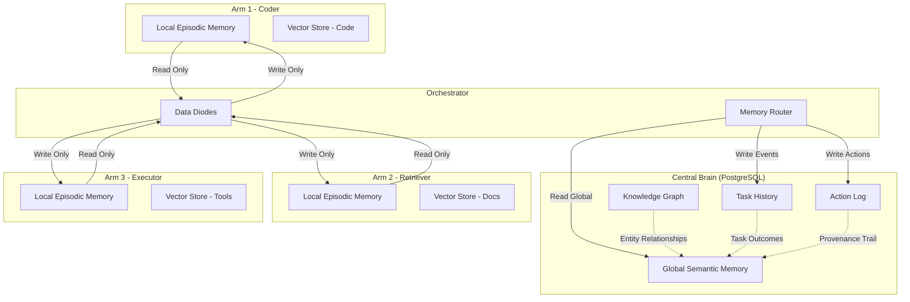
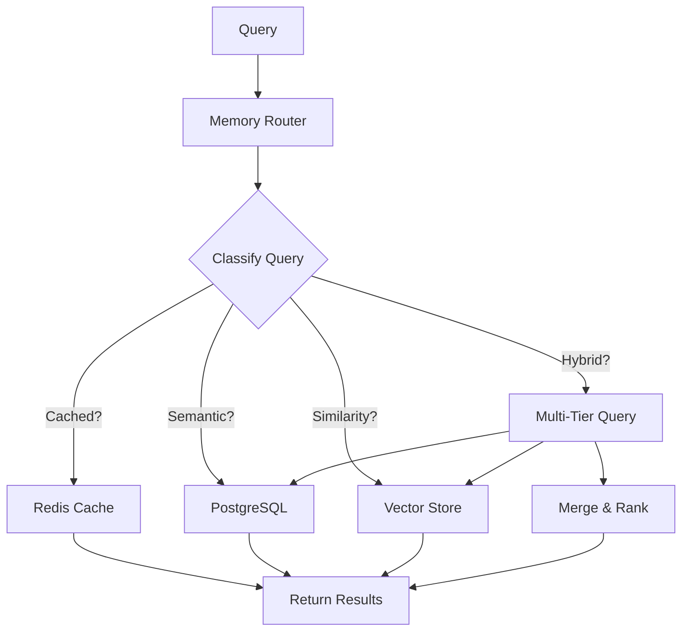
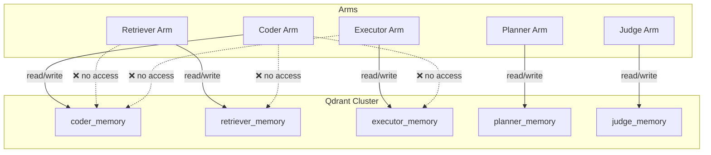
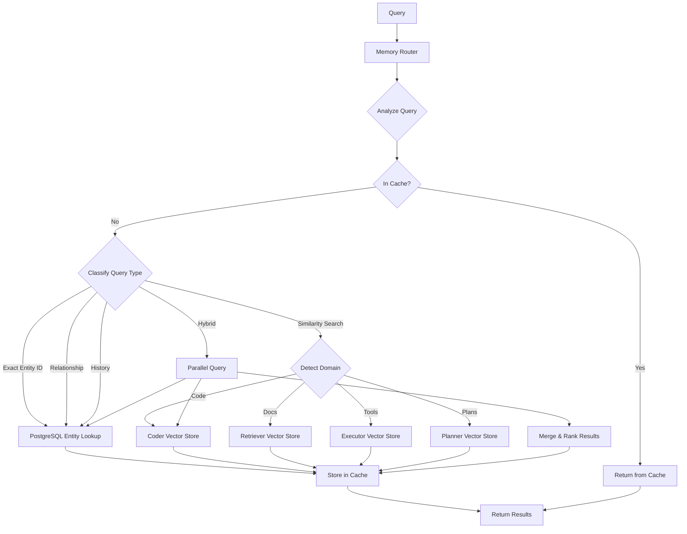
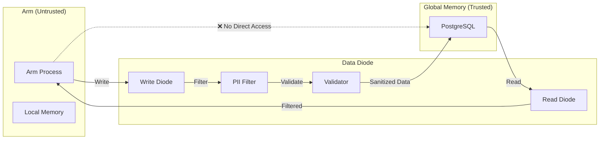

# Memory Systems Implementation Guide

**Component**: Memory Architecture
**Version**: 1.0
**Last Updated**: 2025-11-10
**Status**: Production Ready

[← Back to Documentation](../README.md) | [Implementation Guides](./README.md) | [Architecture Overview](../architecture/system-overview.md)

---

## Table of Contents

1. [Overview](#overview)
   - [Biological Inspiration](#biological-inspiration)
   - [Memory Hierarchy](#memory-hierarchy)
   - [Design Principles](#design-principles)
2. [Global Memory (PostgreSQL)](#global-memory-postgresql)
   - [Knowledge Graph Schema](#knowledge-graph-schema)
   - [Entities and Relationships](#entities-and-relationships)
   - [Task History](#task-history)
   - [Action Provenance Log](#action-provenance-log)
   - [Query Patterns](#query-patterns)
   - [Optimization Strategies](#optimization-strategies)
3. [Local Memory (Vector Stores)](#local-memory-vector-stores)
   - [Qdrant Implementation](#qdrant-implementation)
   - [Per-Arm Memory Design](#per-arm-memory-design)
   - [Embedding Generation](#embedding-generation)
   - [Storage and Retrieval](#storage-and-retrieval)
   - [Memory Isolation](#memory-isolation)
4. [Memory Routing](#memory-routing)
   - [Routing Decision Logic](#routing-decision-logic)
   - [Classifier Implementation](#classifier-implementation)
   - [Query Analysis](#query-analysis)
   - [Hybrid Queries](#hybrid-queries)
5. [Data Diodes](#data-diodes)
   - [Unidirectional Information Flow](#unidirectional-information-flow)
   - [Write-Only Channels](#write-only-channels)
   - [Read-Only Channels](#read-only-channels)
   - [Security Enforcement](#security-enforcement)
6. [Implementation Guide](#implementation-guide)
   - [PostgreSQL Setup](#postgresql-setup)
   - [Qdrant Setup](#qdrant-setup)
   - [Memory Client Implementation](#memory-client-implementation)
   - [Integration with Orchestrator](#integration-with-orchestrator)
   - [Integration with Arms](#integration-with-arms)
7. [Performance Optimization](#performance-optimization)
   - [Database Indexing](#database-indexing)
   - [Connection Pooling](#connection-pooling)
   - [Caching Strategies](#caching-strategies)
   - [Query Optimization](#query-optimization)
   - [Vector Search Tuning](#vector-search-tuning)
8. [Testing Strategies](#testing-strategies)
   - [Unit Tests](#unit-tests)
   - [Integration Tests](#integration-tests)
   - [Performance Tests](#performance-tests)
   - [Data Integrity Tests](#data-integrity-tests)
9. [Monitoring and Observability](#monitoring-and-observability)
   - [Metrics Collection](#metrics-collection)
   - [Health Checks](#health-checks)
   - [Alerting](#alerting)
10. [Operational Considerations](#operational-considerations)
    - [Backup and Recovery](#backup-and-recovery)
    - [Scaling Strategies](#scaling-strategies)
    - [Data Retention Policies](#data-retention-policies)
    - [Disaster Recovery](#disaster-recovery)

---

## Overview

OctoLLM's memory architecture implements a hybrid distributed memory system inspired by the octopus nervous system, where knowledge is distributed between centralized semantic memory (the brain) and specialized local memory (the arms). This design enables efficient information storage, rapid retrieval, and secure isolation while maintaining global coherence.

### Biological Inspiration

The octopus nervous system provides a compelling model for distributed AI architectures:

- **Central Brain (40% of neurons)**: Stores high-level semantic knowledge, strategic information, and cross-domain facts accessible to all components
- **Arm Ganglia (60% of neurons)**: Maintain specialized episodic memories optimized for domain-specific tasks (code snippets, exploit patterns, API interactions)
- **Selective Synchronization**: Only relevant information flows between central and peripheral memory systems
- **Autonomous Decision-Making**: Arms can operate on local memory without constant communication with the brain

This biological pattern translates directly to OctoLLM's memory architecture:



### Memory Hierarchy

OctoLLM implements a three-tier memory hierarchy:

#### Tier 1: Global Semantic Memory (PostgreSQL)

**Purpose**: Long-term storage of structured knowledge shared across all components

**Characteristics**:
- Persistent, ACID-compliant relational storage
- Knowledge graph structure (entities + relationships)
- Full-text search capabilities
- Complex query support (joins, aggregations)
- Authoritative source of truth

**Use Cases**:
- Entity definitions (tools, users, concepts)
- Cross-domain relationships (dependencies, usages)
- Task execution history
- Audit trails and provenance
- Strategic planning information

**Performance Profile**:
- Read latency: 5-20ms (indexed queries)
- Write latency: 10-50ms (with replication)
- Throughput: 10,000+ queries/second (optimized)
- Storage: TB-scale with proper indexing

#### Tier 2: Local Episodic Memory (Vector Stores)

**Purpose**: Fast retrieval of domain-specific examples and patterns

**Characteristics**:
- Per-arm isolation (separate collections)
- Vector similarity search
- Ephemeral or semi-persistent
- Domain-specialized embeddings
- Horizontal scalability

**Use Cases**:
- Code snippet retrieval (Coder Arm)
- Similar exploit pattern matching (Executor Arm)
- Documentation context (Retriever Arm)
- Previous plan templates (Planner Arm)
- Validation rule patterns (Judge Arm)

**Performance Profile**:
- Read latency: 1-5ms (HNSW index)
- Write latency: 2-10ms (batch inserts)
- Throughput: 100,000+ queries/second (per node)
- Storage: GB to TB scale per collection

#### Tier 3: Cache Layer (Redis)

**Purpose**: Sub-millisecond access to frequently accessed data

**Characteristics**:
- In-memory key-value store
- TTL-based expiration
- Pub/sub for invalidation
- LRU eviction policy
- Cluster mode for distribution

**Use Cases**:
- Task state caching
- Recent query results
- Session data
- Rate limiting counters
- Metrics aggregation

**Performance Profile**:
- Read latency: <1ms
- Write latency: <1ms
- Throughput: 1,000,000+ ops/second
- Storage: Limited by RAM (typically GB-scale)

### Design Principles

The OctoLLM memory architecture adheres to these core principles:

#### 1. Separation of Concerns

**Global Memory**: Stores facts, relationships, and history that benefit the entire system
**Local Memory**: Stores domain-specific patterns and examples relevant to individual arms
**Cache Layer**: Stores transient data for performance optimization

This separation enables:
- Independent scaling of each tier
- Optimized data structures for each use case
- Clear ownership and access patterns
- Simplified testing and debugging

#### 2. Data Diode Enforcement

All information flow between memory tiers and components passes through data diodes that enforce:
- Unidirectional information flow
- Write-only channels (arms → global memory)
- Read-only channels (global memory → arms)
- PII filtering and sanitization
- Access control and auditing

Example data flow:

```
Coder Arm → [WRITE DIODE] → Global Memory
            ↓ (PII filtering)
            ↓ (schema validation)
            ↓ (access control)

Global Memory → [READ DIODE] → Retriever Arm
                ↓ (scope filtering)
                ↓ (rate limiting)
                ↓ (audit logging)
```

#### 3. Capability-Based Security

Memory access is governed by capability tokens that specify:
- Allowed operations (read, write, delete)
- Scope restrictions (entity types, collections)
- Time constraints (expiration, usage limits)
- Audit requirements (logging, notifications)

Each arm receives limited capabilities appropriate to its role:

```python
# Coder Arm capabilities
coder_capabilities = {
    "global_memory": {
        "read": ["entities:tool", "entities:library"],
        "write": ["action_log:code_generation"]
    },
    "local_memory": {
        "read": ["coder_memory:*"],
        "write": ["coder_memory:*"]
    }
}

# Executor Arm capabilities
executor_capabilities = {
    "global_memory": {
        "read": ["entities:tool", "task_history:execution"],
        "write": ["action_log:tool_execution"]
    },
    "local_memory": {
        "read": ["executor_memory:*"],
        "write": ["executor_memory:*"]
    }
}
```

#### 4. Hierarchical Query Routing

The Memory Router intelligently directs queries to the appropriate tier:



Classification criteria:
- **Cache**: Exact match on recent query hash
- **Global**: Entity lookups, relationship queries, history queries
- **Local**: Similarity search, example retrieval, pattern matching
- **Hybrid**: Queries requiring both structured and semantic results

#### 5. Active Memory Management

The system actively manages memory through:
- **Prioritization**: Frequently accessed data promoted to cache
- **Eviction**: Stale local memories expired based on TTL
- **Consolidation**: Valuable local patterns promoted to global memory
- **Garbage Collection**: Orphaned entities and relationships cleaned up

---

## Global Memory (PostgreSQL)

Global memory in OctoLLM uses PostgreSQL as the authoritative source of truth for structured knowledge. This section covers the complete schema, usage patterns, and optimization strategies.

### Knowledge Graph Schema

The global memory implements a knowledge graph structure with four primary tables:

#### Complete SQL Schema

```sql
-- Global semantic memory: knowledge graph
CREATE TABLE entities (
    id UUID PRIMARY KEY DEFAULT gen_random_uuid(),
    entity_type VARCHAR(50) NOT NULL,  -- 'person', 'tool', 'concept', etc.
    name VARCHAR(255) NOT NULL,
    properties JSONB NOT NULL DEFAULT '{}',
    created_at TIMESTAMP NOT NULL DEFAULT NOW(),
    updated_at TIMESTAMP NOT NULL DEFAULT NOW()
);

CREATE INDEX idx_entities_type ON entities(entity_type);
CREATE INDEX idx_entities_name ON entities USING gin(to_tsvector('english', name));
CREATE INDEX idx_entities_properties ON entities USING gin(properties);

-- Relationships between entities
CREATE TABLE relationships (
    id UUID PRIMARY KEY DEFAULT gen_random_uuid(),
    from_entity_id UUID NOT NULL REFERENCES entities(id) ON DELETE CASCADE,
    to_entity_id UUID NOT NULL REFERENCES entities(id) ON DELETE CASCADE,
    relationship_type VARCHAR(50) NOT NULL,  -- 'uses', 'depends_on', 'created_by', etc.
    properties JSONB NOT NULL DEFAULT '{}',
    created_at TIMESTAMP NOT NULL DEFAULT NOW()
);

CREATE INDEX idx_relationships_from ON relationships(from_entity_id);
CREATE INDEX idx_relationships_to ON relationships(to_entity_id);
CREATE INDEX idx_relationships_type ON relationships(relationship_type);

-- Task execution history
CREATE TABLE task_history (
    id UUID PRIMARY KEY DEFAULT gen_random_uuid(),
    task_id VARCHAR(255) NOT NULL,
    goal TEXT NOT NULL,
    plan JSONB NOT NULL,
    results JSONB NOT NULL,
    success BOOLEAN NOT NULL,
    duration_ms INTEGER NOT NULL,
    cost_tokens INTEGER,
    created_at TIMESTAMP NOT NULL DEFAULT NOW()
);

CREATE INDEX idx_task_history_task_id ON task_history(task_id);
CREATE INDEX idx_task_history_created_at ON task_history(created_at DESC);

-- Action provenance log
CREATE TABLE action_log (
    id UUID PRIMARY KEY DEFAULT gen_random_uuid(),
    task_id VARCHAR(255) NOT NULL,
    arm_id VARCHAR(50) NOT NULL,
    action_type VARCHAR(50) NOT NULL,
    action_details JSONB NOT NULL,
    result JSONB NOT NULL,
    timestamp TIMESTAMP NOT NULL DEFAULT NOW()
);

CREATE INDEX idx_action_log_task_id ON action_log(task_id);
CREATE INDEX idx_action_log_arm_id ON action_log(arm_id);
CREATE INDEX idx_action_log_timestamp ON action_log(timestamp DESC);
```

### Entities and Relationships

#### Entity Types

The `entities` table stores typed objects with flexible JSONB properties:

**Supported Entity Types**:
- `person`: Users, administrators, team members
- `tool`: External tools, APIs, services
- `concept`: Abstract concepts, methodologies, patterns
- `vulnerability`: Security vulnerabilities, CVEs
- `library`: Software libraries, packages
- `endpoint`: API endpoints, URLs
- `task`: Task definitions, templates
- `file`: Files, documents, code artifacts
- `environment`: Deployment environments, configurations

**Example Entities**:

```sql
-- Tool entity
INSERT INTO entities (entity_type, name, properties) VALUES (
    'tool',
    'nmap',
    '{
        "description": "Network scanning and discovery tool",
        "version": "7.94",
        "capabilities": ["port_scan", "service_detection", "os_detection"],
        "dangerous": true,
        "requires_capability": "network_scan"
    }'::jsonb
);

-- Vulnerability entity
INSERT INTO entities (entity_type, name, properties) VALUES (
    'vulnerability',
    'CVE-2024-1234',
    '{
        "description": "Remote code execution in example-lib",
        "severity": "critical",
        "cvss_score": 9.8,
        "affected_versions": ["1.0.0", "1.0.1"],
        "patched_version": "1.0.2"
    }'::jsonb
);

-- Library entity
INSERT INTO entities (entity_type, name, properties) VALUES (
    'library',
    'numpy',
    '{
        "language": "python",
        "version": "1.26.0",
        "purpose": "numerical computing",
        "documentation_url": "https://numpy.org/doc/"
    }'::jsonb
);
```

#### Relationship Types

The `relationships` table captures connections between entities:

**Supported Relationship Types**:
- `uses`: Entity A uses Entity B
- `depends_on`: Entity A depends on Entity B
- `created_by`: Entity A was created by Entity B
- `exploits`: Entity A exploits Entity B (vulnerability)
- `fixes`: Entity A fixes Entity B (patch)
- `requires`: Entity A requires Entity B (prerequisite)
- `implements`: Entity A implements Entity B (interface)
- `documented_in`: Entity A is documented in Entity B

**Example Relationships**:

```sql
-- nmap uses multiple libraries
INSERT INTO relationships (from_entity_id, to_entity_id, relationship_type, properties)
SELECT
    e1.id,
    e2.id,
    'depends_on',
    '{"required": true, "min_version": "2.0.0"}'::jsonb
FROM entities e1, entities e2
WHERE e1.name = 'nmap' AND e2.name = 'libpcap';

-- Exploit relationship
INSERT INTO relationships (from_entity_id, to_entity_id, relationship_type, properties)
SELECT
    e1.id,
    e2.id,
    'exploits',
    '{"technique": "buffer_overflow", "discovered_date": "2024-01-15"}'::jsonb
FROM entities e1, entities e2
WHERE e1.entity_type = 'tool' AND e1.name = 'exploit-cve-2024-1234'
  AND e2.entity_type = 'vulnerability' AND e2.name = 'CVE-2024-1234';
```

#### Querying the Knowledge Graph

**Find all tools that exploit a specific vulnerability**:

```sql
SELECT
    e1.name AS tool_name,
    e1.properties->>'description' AS tool_description,
    r.properties->>'technique' AS exploit_technique
FROM entities e1
JOIN relationships r ON e1.id = r.from_entity_id
JOIN entities e2 ON r.to_entity_id = e2.id
WHERE e2.name = 'CVE-2024-1234'
  AND r.relationship_type = 'exploits';
```

**Find all dependencies of a tool (recursive)**:

```sql
WITH RECURSIVE dependencies AS (
    -- Base case: direct dependencies
    SELECT
        e2.id,
        e2.name,
        e2.entity_type,
        1 AS depth
    FROM entities e1
    JOIN relationships r ON e1.id = r.from_entity_id
    JOIN entities e2 ON r.to_entity_id = e2.id
    WHERE e1.name = 'nmap' AND r.relationship_type = 'depends_on'

    UNION ALL

    -- Recursive case: transitive dependencies
    SELECT
        e2.id,
        e2.name,
        e2.entity_type,
        d.depth + 1
    FROM dependencies d
    JOIN relationships r ON d.id = r.from_entity_id
    JOIN entities e2 ON r.to_entity_id = e2.id
    WHERE r.relationship_type = 'depends_on' AND d.depth < 10
)
SELECT DISTINCT name, entity_type, depth
FROM dependencies
ORDER BY depth, name;
```

**Full-text search across entities**:

```sql
SELECT
    entity_type,
    name,
    properties,
    ts_rank(to_tsvector('english', name), query) AS rank
FROM entities,
     to_tsquery('english', 'network & scan') AS query
WHERE to_tsvector('english', name) @@ query
   OR to_tsvector('english', properties::text) @@ query
ORDER BY rank DESC
LIMIT 10;
```

### Task History

The `task_history` table records all task executions for learning and auditing:

**Schema Fields**:
- `task_id`: Unique identifier for the task
- `goal`: Natural language description of the task
- `plan`: JSONB representation of the execution plan
- `results`: JSONB representation of task outcomes
- `success`: Boolean indicating success/failure
- `duration_ms`: Task execution time in milliseconds
- `cost_tokens`: Token consumption for LLM calls
- `created_at`: Task creation timestamp

**Example Task History Entry**:

```sql
INSERT INTO task_history (task_id, goal, plan, results, success, duration_ms, cost_tokens)
VALUES (
    'task-abc123',
    'Scan example.com for open ports and identify services',
    '{
        "steps": [
            {"arm": "planner", "action": "decompose_task"},
            {"arm": "executor", "action": "run_nmap", "args": {"target": "example.com"}},
            {"arm": "judge", "action": "validate_results"}
        ]
    }'::jsonb,
    '{
        "open_ports": [80, 443, 22],
        "services": {
            "80": "nginx/1.18.0",
            "443": "nginx/1.18.0 (TLS)",
            "22": "OpenSSH 8.2p1"
        },
        "validation": {"passed": true, "confidence": 0.95}
    }'::jsonb,
    true,
    2450,
    1250
);
```

**Query Patterns**:

```sql
-- Find similar successful tasks (for plan reuse)
SELECT
    task_id,
    goal,
    plan,
    duration_ms,
    similarity(goal, 'Scan domain for vulnerabilities') AS similarity_score
FROM task_history
WHERE success = true
  AND goal % 'Scan domain for vulnerabilities'  -- trigram similarity
ORDER BY similarity_score DESC
LIMIT 5;

-- Aggregate performance metrics by task type
SELECT
    plan->>'steps'->0->>'arm' AS primary_arm,
    COUNT(*) AS total_tasks,
    AVG(duration_ms) AS avg_duration_ms,
    SUM(cost_tokens) AS total_tokens,
    SUM(CASE WHEN success THEN 1 ELSE 0 END)::float / COUNT(*) AS success_rate
FROM task_history
WHERE created_at > NOW() - INTERVAL '7 days'
GROUP BY primary_arm
ORDER BY total_tasks DESC;

-- Find tasks that exceeded performance thresholds
SELECT
    task_id,
    goal,
    duration_ms,
    cost_tokens,
    created_at
FROM task_history
WHERE duration_ms > 5000 OR cost_tokens > 10000
ORDER BY created_at DESC
LIMIT 20;
```

### Action Provenance Log

The `action_log` table provides a complete audit trail of all arm actions:

**Schema Fields**:
- `task_id`: Associated task identifier
- `arm_id`: Identifier of the arm that performed the action
- `action_type`: Type of action performed
- `action_details`: JSONB details of the action
- `result`: JSONB representation of the action result
- `timestamp`: Action execution timestamp

**Example Action Log Entries**:

```sql
-- Executor arm running nmap
INSERT INTO action_log (task_id, arm_id, action_type, action_details, result)
VALUES (
    'task-abc123',
    'executor-001',
    'tool_execution',
    '{
        "tool": "nmap",
        "command": "nmap -sV -p- example.com",
        "sandbox": "gvisor-001"
    }'::jsonb,
    '{
        "stdout": "...",
        "stderr": "",
        "exit_code": 0,
        "duration_ms": 2200
    }'::jsonb
);

-- Coder arm generating code
INSERT INTO action_log (task_id, arm_id, action_type, action_details, result)
VALUES (
    'task-def456',
    'coder-001',
    'code_generation',
    '{
        "language": "python",
        "prompt": "Generate a function to parse nmap XML output",
        "model": "claude-sonnet-4"
    }'::jsonb,
    '{
        "code": "def parse_nmap_xml(xml_path): ...",
        "tokens_used": 450,
        "confidence": 0.92
    }'::jsonb
);

-- Judge arm validation
INSERT INTO action_log (task_id, arm_id, action_type, action_details, result)
VALUES (
    'task-abc123',
    'judge-001',
    'result_validation',
    '{
        "validation_type": "scan_results",
        "criteria": ["port_count", "service_detection", "false_positives"]
    }'::jsonb,
    '{
        "passed": true,
        "score": 0.95,
        "issues": []
    }'::jsonb
);
```

**Query Patterns**:

```sql
-- Reconstruct complete task execution trace
SELECT
    al.timestamp,
    al.arm_id,
    al.action_type,
    al.action_details,
    al.result
FROM action_log al
WHERE al.task_id = 'task-abc123'
ORDER BY al.timestamp ASC;

-- Find all tool executions by arm
SELECT
    arm_id,
    action_details->>'tool' AS tool_name,
    COUNT(*) AS execution_count,
    AVG((result->>'duration_ms')::int) AS avg_duration_ms
FROM action_log
WHERE action_type = 'tool_execution'
GROUP BY arm_id, tool_name
ORDER BY execution_count DESC;

-- Detect anomalous behavior (failed actions)
SELECT
    arm_id,
    action_type,
    COUNT(*) AS failure_count,
    array_agg(DISTINCT result->>'error_type') AS error_types
FROM action_log
WHERE result->>'exit_code' != '0' OR result->>'error' IS NOT NULL
GROUP BY arm_id, action_type
HAVING COUNT(*) > 5
ORDER BY failure_count DESC;
```

### Query Patterns

Common query patterns for interacting with global memory:

#### Entity Lookup

```python
from typing import Optional, Dict, Any
import asyncpg

class GlobalMemory:
    def __init__(self, db_pool: asyncpg.Pool):
        self.pool = db_pool

    async def get_entity(self, entity_id: str) -> Optional[Dict[str, Any]]:
        """Retrieve entity by ID."""
        async with self.pool.acquire() as conn:
            row = await conn.fetchrow(
                """
                SELECT id, entity_type, name, properties, created_at, updated_at
                FROM entities
                WHERE id = $1
                """,
                entity_id
            )
            if row:
                return dict(row)
            return None

    async def find_entities_by_type(
        self,
        entity_type: str,
        limit: int = 100
    ) -> list[Dict[str, Any]]:
        """Find entities by type."""
        async with self.pool.acquire() as conn:
            rows = await conn.fetch(
                """
                SELECT id, entity_type, name, properties, created_at, updated_at
                FROM entities
                WHERE entity_type = $1
                ORDER BY updated_at DESC
                LIMIT $2
                """,
                entity_type,
                limit
            )
            return [dict(row) for row in rows]

    async def search_entities(
        self,
        query: str,
        limit: int = 10
    ) -> list[Dict[str, Any]]:
        """Full-text search for entities."""
        async with self.pool.acquire() as conn:
            rows = await conn.fetch(
                """
                SELECT
                    id,
                    entity_type,
                    name,
                    properties,
                    ts_rank(to_tsvector('english', name), to_tsquery('english', $1)) AS rank
                FROM entities
                WHERE to_tsvector('english', name) @@ to_tsquery('english', $1)
                   OR to_tsvector('english', properties::text) @@ to_tsquery('english', $1)
                ORDER BY rank DESC
                LIMIT $2
                """,
                query,
                limit
            )
            return [dict(row) for row in rows]
```

#### Relationship Traversal

```python
async def get_related_entities(
    self,
    entity_id: str,
    relationship_type: Optional[str] = None,
    direction: str = "outgoing"  # "outgoing", "incoming", "both"
) -> list[Dict[str, Any]]:
    """Get entities related to a given entity."""

    if direction == "outgoing":
        query = """
            SELECT
                e.id,
                e.entity_type,
                e.name,
                e.properties,
                r.relationship_type,
                r.properties AS relationship_properties
            FROM relationships r
            JOIN entities e ON r.to_entity_id = e.id
            WHERE r.from_entity_id = $1
        """
    elif direction == "incoming":
        query = """
            SELECT
                e.id,
                e.entity_type,
                e.name,
                e.properties,
                r.relationship_type,
                r.properties AS relationship_properties
            FROM relationships r
            JOIN entities e ON r.from_entity_id = e.id
            WHERE r.to_entity_id = $1
        """
    else:  # both
        query = """
            SELECT
                e.id,
                e.entity_type,
                e.name,
                e.properties,
                r.relationship_type,
                r.properties AS relationship_properties
            FROM relationships r
            JOIN entities e ON (
                CASE
                    WHEN r.from_entity_id = $1 THEN r.to_entity_id = e.id
                    WHEN r.to_entity_id = $1 THEN r.from_entity_id = e.id
                END
            )
            WHERE r.from_entity_id = $1 OR r.to_entity_id = $1
        """

    if relationship_type:
        query += " AND r.relationship_type = $2"
        params = [entity_id, relationship_type]
    else:
        params = [entity_id]

    async with self.pool.acquire() as conn:
        rows = await conn.fetch(query, *params)
        return [dict(row) for row in rows]
```

#### Task History Queries

```python
async def get_similar_tasks(
    self,
    goal: str,
    success_only: bool = True,
    limit: int = 5
) -> list[Dict[str, Any]]:
    """Find similar successful tasks for plan reuse."""

    query = """
        SELECT
            task_id,
            goal,
            plan,
            results,
            duration_ms,
            cost_tokens,
            similarity(goal, $1) AS similarity_score
        FROM task_history
        WHERE goal % $1  -- Trigram similarity
    """

    if success_only:
        query += " AND success = true"

    query += """
        ORDER BY similarity_score DESC
        LIMIT $2
    """

    async with self.pool.acquire() as conn:
        # Enable pg_trgm extension if not already enabled
        await conn.execute("CREATE EXTENSION IF NOT EXISTS pg_trgm")

        rows = await conn.fetch(query, goal, limit)
        return [dict(row) for row in rows]

async def get_task_performance_metrics(
    self,
    start_date: Optional[datetime] = None,
    end_date: Optional[datetime] = None
) -> Dict[str, Any]:
    """Aggregate task performance metrics."""

    query = """
        SELECT
            COUNT(*) AS total_tasks,
            SUM(CASE WHEN success THEN 1 ELSE 0 END)::float / COUNT(*) AS success_rate,
            AVG(duration_ms) AS avg_duration_ms,
            PERCENTILE_CONT(0.5) WITHIN GROUP (ORDER BY duration_ms) AS median_duration_ms,
            PERCENTILE_CONT(0.95) WITHIN GROUP (ORDER BY duration_ms) AS p95_duration_ms,
            SUM(cost_tokens) AS total_tokens,
            AVG(cost_tokens) AS avg_tokens_per_task
        FROM task_history
        WHERE created_at BETWEEN $1 AND $2
    """

    if start_date is None:
        start_date = datetime.now() - timedelta(days=7)
    if end_date is None:
        end_date = datetime.now()

    async with self.pool.acquire() as conn:
        row = await conn.fetchrow(query, start_date, end_date)
        return dict(row)
```

### Optimization Strategies

#### Indexing Best Practices

The schema includes strategic indexes for common query patterns:

1. **Type-based filtering**: `idx_entities_type` enables fast filtering by entity_type
2. **Full-text search**: GIN indexes on `name` and `properties` for text search
3. **Relationship traversal**: Indexes on both `from_entity_id` and `to_entity_id`
4. **Temporal queries**: DESC indexes on timestamps for recent-first ordering

**Additional recommended indexes for production**:

```sql
-- Composite index for type + name lookups
CREATE INDEX idx_entities_type_name ON entities(entity_type, name);

-- Partial index for active entities only
CREATE INDEX idx_entities_active ON entities(id) WHERE properties->>'active' = 'true';

-- Index for JSONB property queries
CREATE INDEX idx_entities_properties_specific ON entities((properties->>'language'));

-- Composite index for relationship traversal
CREATE INDEX idx_relationships_from_type ON relationships(from_entity_id, relationship_type);
CREATE INDEX idx_relationships_to_type ON relationships(to_entity_id, relationship_type);
```

#### Query Optimization

**Use EXPLAIN ANALYZE to identify slow queries**:

```sql
EXPLAIN ANALYZE
SELECT e.*, r.relationship_type
FROM entities e
JOIN relationships r ON e.id = r.to_entity_id
WHERE r.from_entity_id = 'some-uuid'
  AND e.entity_type = 'tool';
```

**Optimize with materialized views for frequent aggregations**:

```sql
CREATE MATERIALIZED VIEW task_metrics_daily AS
SELECT
    DATE(created_at) AS date,
    COUNT(*) AS total_tasks,
    AVG(duration_ms) AS avg_duration_ms,
    SUM(cost_tokens) AS total_tokens,
    SUM(CASE WHEN success THEN 1 ELSE 0 END)::float / COUNT(*) AS success_rate
FROM task_history
GROUP BY DATE(created_at);

CREATE INDEX idx_task_metrics_daily_date ON task_metrics_daily(date);

-- Refresh daily
REFRESH MATERIALIZED VIEW CONCURRENTLY task_metrics_daily;
```

#### Connection Pooling

Use `asyncpg` connection pooling for optimal performance:

```python
import asyncpg
from typing import Optional

class DatabasePool:
    def __init__(self):
        self._pool: Optional[asyncpg.Pool] = None

    async def connect(
        self,
        host: str,
        port: int,
        database: str,
        user: str,
        password: str,
        min_size: int = 10,
        max_size: int = 50
    ):
        """Initialize connection pool."""
        self._pool = await asyncpg.create_pool(
            host=host,
            port=port,
            database=database,
            user=user,
            password=password,
            min_size=min_size,
            max_size=max_size,
            command_timeout=60,
            max_queries=50000,
            max_inactive_connection_lifetime=300
        )

    async def close(self):
        """Close connection pool."""
        if self._pool:
            await self._pool.close()

    @property
    def pool(self) -> asyncpg.Pool:
        if self._pool is None:
            raise RuntimeError("Database pool not initialized")
        return self._pool
```

---

## Local Memory (Vector Stores)

Local memory in OctoLLM uses vector stores for fast similarity search over domain-specific knowledge. Each arm maintains its own isolated vector collection optimized for its specialized tasks.

### Qdrant Implementation

OctoLLM uses Qdrant as the primary vector store due to its performance, scalability, and rich filtering capabilities.

#### Complete CoderMemory Implementation

```python
# arms/coder/memory.py

from qdrant_client import QdrantClient
from qdrant_client.models import Distance, VectorParams, PointStruct
from sentence_transformers import SentenceTransformer
import uuid

class CoderMemory:
    """Local episodic memory for Coder arm."""

    def __init__(self, qdrant_url: str, collection_name: str = "coder_memory"):
        self.client = QdrantClient(url=qdrant_url)
        self.collection = collection_name
        self.encoder = SentenceTransformer('all-MiniLM-L6-v2')

        # Ensure collection exists
        self._init_collection()

    def _init_collection(self):
        """Initialize Qdrant collection if not exists."""
        collections = self.client.get_collections().collections
        if not any(c.name == self.collection for c in collections):
            self.client.create_collection(
                collection_name=self.collection,
                vectors_config=VectorParams(
                    size=384,  # Dimensionality of all-MiniLM-L6-v2
                    distance=Distance.COSINE
                )
            )

    def store_code_snippet(
        self,
        code: str,
        language: str,
        description: str,
        metadata: dict
    ) -> str:
        """Store a code snippet with embeddings."""

        # Create text for embedding (description + code sample)
        text_for_embedding = f"{description}\n\n{code[:200]}"  # First 200 chars
        embedding = self.encoder.encode(text_for_embedding).tolist()

        point_id = str(uuid.uuid4())

        self.client.upsert(
            collection_name=self.collection,
            points=[
                PointStruct(
                    id=point_id,
                    vector=embedding,
                    payload={
                        "code": code,
                        "language": language,
                        "description": description,
                        **metadata
                    }
                )
            ]
        )

        return point_id

    def search_similar_code(
        self,
        query: str,
        language: str = None,
        limit: int = 5
    ) -> list:
        """Find similar code snippets."""

        query_vector = self.encoder.encode(query).tolist()

        # Build filter if language specified
        search_filter = None
        if language:
            from qdrant_client.models import Filter, FieldCondition, MatchValue
            search_filter = Filter(
                must=[
                    FieldCondition(
                        key="language",
                        match=MatchValue(value=language)
                    )
                ]
            )

        results = self.client.search(
            collection_name=self.collection,
            query_vector=query_vector,
            query_filter=search_filter,
            limit=limit
        )

        return [
            {
                "code": r.payload["code"],
                "description": r.payload["description"],
                "language": r.payload["language"],
                "score": r.score
            }
            for r in results
        ]
```

**Usage Example**:

```python
# Initialize memory
memory = CoderMemory(qdrant_url="http://localhost:6333")

# Store code snippet
snippet_id = memory.store_code_snippet(
    code="""
def binary_search(arr, target):
    left, right = 0, len(arr) - 1
    while left <= right:
        mid = (left + right) // 2
        if arr[mid] == target:
            return mid
        elif arr[mid] < target:
            left = mid + 1
        else:
            right = mid - 1
    return -1
""",
    language="python",
    description="Binary search algorithm implementation",
    metadata={
        "author": "coder-arm",
        "created_at": "2025-11-10T10:00:00Z",
        "complexity": "O(log n)",
        "tags": ["algorithm", "search", "efficient"]
    }
)

# Search for similar code
results = memory.search_similar_code(
    query="efficient search algorithm for sorted array",
    language="python",
    limit=3
)

for result in results:
    print(f"Score: {result['score']:.3f}")
    print(f"Language: {result['language']}")
    print(f"Description: {result['description']}")
    print(f"Code:\n{result['code']}\n")
```

### Per-Arm Memory Design

Each arm maintains isolated vector collections optimized for its domain:

#### Coder Arm Memory

**Collection**: `coder_memory`

**Stored Items**:
- Code snippets (functions, classes, modules)
- API usage examples
- Error handling patterns
- Refactoring templates

**Metadata Fields**:
- `language`: Programming language
- `complexity`: Time/space complexity
- `tags`: Searchable tags (algorithm, pattern, etc.)
- `quality_score`: Code quality rating
- `tested`: Whether code includes tests

**Search Patterns**:
- "Find Python function for parsing JSON"
- "Show me error handling for network requests"
- "Get examples of async/await patterns"

#### Retriever Arm Memory

**Collection**: `retriever_memory`

**Stored Items**:
- Documentation chunks
- API specifications
- FAQ entries
- Troubleshooting guides

**Metadata Fields**:
- `source`: Documentation source URL
- `section`: Document section/chapter
- `authority`: Source authority score
- `last_updated`: Freshness timestamp
- `category`: Topic categorization

**Search Patterns**:
- "How to configure TLS in nginx"
- "Find OAuth2 flow documentation"
- "Show me Kubernetes scaling guides"

#### Executor Arm Memory

**Collection**: `executor_memory`

**Stored Items**:
- Tool invocation examples
- Command templates
- Exploit patterns
- Sandbox configurations

**Metadata Fields**:
- `tool`: Tool name
- `risk_level`: Danger rating (low/medium/high)
- `success_rate`: Historical success rate
- `avg_duration_ms`: Average execution time
- `capabilities_required`: Required capability tokens

**Search Patterns**:
- "Find nmap commands for service detection"
- "Show me safe SQL injection tests"
- "Get Docker sandbox configurations"

#### Planner Arm Memory

**Collection**: `planner_memory`

**Stored Items**:
- Plan templates
- Task decomposition examples
- Workflow patterns
- Decision trees

**Metadata Fields**:
- `task_type`: Type of task (scan, exploit, analyze)
- `complexity`: Plan complexity rating
- `success_rate`: Historical success rate
- `avg_steps`: Average number of steps
- `dependencies`: Required arm types

**Search Patterns**:
- "Find plans for vulnerability assessment"
- "Show me multi-stage exploitation workflows"
- "Get templates for code analysis tasks"

#### Judge Arm Memory

**Collection**: `judge_memory`

**Stored Items**:
- Validation rules
- Quality criteria
- Test cases
- Known failure patterns

**Metadata Fields**:
- `validation_type`: Type of validation
- `strictness`: Strictness level (lenient/moderate/strict)
- `false_positive_rate`: Historical FP rate
- `domain`: Application domain
- `regulatory_compliance`: Compliance requirements

**Search Patterns**:
- "Find validation rules for scan results"
- "Show me code quality criteria"
- "Get test cases for authentication flows"

### Embedding Generation

OctoLLM uses `sentence-transformers` for generating embeddings:

#### Embedding Model Selection

**Default Model**: `all-MiniLM-L6-v2`

**Characteristics**:
- Dimensionality: 384
- Performance: ~30ms per encoding on CPU
- Quality: Good balance between speed and accuracy
- Size: 90MB

**Alternative Models**:

```python
# High-quality (slower, larger)
from sentence_transformers import SentenceTransformer

encoder_high_quality = SentenceTransformer('all-mpnet-base-v2')
# Dimensionality: 768, Size: 420MB

# Multilingual
encoder_multilingual = SentenceTransformer('paraphrase-multilingual-MiniLM-L12-v2')
# Dimensionality: 384, Size: 470MB, Languages: 50+

# Code-specific
encoder_code = SentenceTransformer('microsoft/codebert-base')
# Dimensionality: 768, Size: 500MB, Optimized for code
```

#### Embedding Strategies

**Strategy 1: Description + Code Prefix** (Current)

```python
text = f"{description}\n\n{code[:200]}"
embedding = encoder.encode(text)
```

**Advantages**: Fast, captures intent
**Disadvantages**: May miss important code details

**Strategy 2: Full Content Embedding**

```python
text = f"{description}\n\n{code}"
embedding = encoder.encode(text)
```

**Advantages**: Complete representation
**Disadvantages**: Slower, may dilute semantic meaning

**Strategy 3: Hybrid Embeddings**

```python
# Separate embeddings for description and code
desc_embedding = encoder.encode(description)
code_embedding = encoder.encode(code)

# Weighted combination
combined_embedding = 0.7 * desc_embedding + 0.3 * code_embedding
```

**Advantages**: Balanced representation
**Disadvantages**: More complex, requires tuning

#### Embedding Optimization

**Batch Encoding for Performance**:

```python
def store_multiple_snippets(self, snippets: list[dict]) -> list[str]:
    """Store multiple snippets efficiently using batch encoding."""

    # Prepare texts for batch encoding
    texts = [
        f"{s['description']}\n\n{s['code'][:200]}"
        for s in snippets
    ]

    # Batch encode (much faster than sequential)
    embeddings = self.encoder.encode(texts, batch_size=32, show_progress_bar=True)

    # Prepare points
    points = []
    point_ids = []
    for i, snippet in enumerate(snippets):
        point_id = str(uuid.uuid4())
        point_ids.append(point_id)

        points.append(
            PointStruct(
                id=point_id,
                vector=embeddings[i].tolist(),
                payload={
                    "code": snippet["code"],
                    "language": snippet["language"],
                    "description": snippet["description"],
                    **snippet.get("metadata", {})
                }
            )
        )

    # Batch upsert
    self.client.upsert(
        collection_name=self.collection,
        points=points
    )

    return point_ids
```

**Caching Embeddings**:

```python
import hashlib
from functools import lru_cache

class CoderMemoryWithCache(CoderMemory):
    def __init__(self, *args, **kwargs):
        super().__init__(*args, **kwargs)
        self._embedding_cache = {}

    def _get_embedding(self, text: str) -> list[float]:
        """Get embedding with caching."""
        # Hash text for cache key
        text_hash = hashlib.sha256(text.encode()).hexdigest()

        if text_hash not in self._embedding_cache:
            embedding = self.encoder.encode(text).tolist()
            self._embedding_cache[text_hash] = embedding

        return self._embedding_cache[text_hash]
```

### Storage and Retrieval

#### Collection Configuration

**Optimal Qdrant Configuration**:

```python
from qdrant_client.models import (
    Distance,
    VectorParams,
    OptimizersConfigDiff,
    HnswConfigDiff
)

# Create collection with optimized parameters
self.client.create_collection(
    collection_name=self.collection,
    vectors_config=VectorParams(
        size=384,
        distance=Distance.COSINE
    ),
    optimizers_config=OptimizersConfigDiff(
        indexing_threshold=20000,  # Start indexing after 20k vectors
        memmap_threshold=50000     # Move to disk after 50k vectors
    ),
    hnsw_config=HnswConfigDiff(
        m=16,                      # Number of connections per layer
        ef_construct=100,          # Construction time/accuracy tradeoff
        full_scan_threshold=10000  # Use full scan below this size
    )
)
```

#### Advanced Filtering

**Complex Filter Queries**:

```python
from qdrant_client.models import Filter, FieldCondition, Range, MatchValue

def search_code_advanced(
    self,
    query: str,
    language: str = None,
    min_quality: float = 0.0,
    tags: list[str] = None,
    tested: bool = None,
    limit: int = 5
) -> list:
    """Advanced search with multiple filters."""

    query_vector = self.encoder.encode(query).tolist()

    # Build filter conditions
    conditions = []

    if language:
        conditions.append(
            FieldCondition(
                key="language",
                match=MatchValue(value=language)
            )
        )

    if min_quality > 0:
        conditions.append(
            FieldCondition(
                key="quality_score",
                range=Range(gte=min_quality)
            )
        )

    if tags:
        for tag in tags:
            conditions.append(
                FieldCondition(
                    key="tags",
                    match=MatchValue(value=tag)
                )
            )

    if tested is not None:
        conditions.append(
            FieldCondition(
                key="tested",
                match=MatchValue(value=tested)
            )
        )

    search_filter = Filter(must=conditions) if conditions else None

    results = self.client.search(
        collection_name=self.collection,
        query_vector=query_vector,
        query_filter=search_filter,
        limit=limit
    )

    return [
        {
            "code": r.payload["code"],
            "description": r.payload["description"],
            "language": r.payload["language"],
            "quality_score": r.payload.get("quality_score", 0.0),
            "tags": r.payload.get("tags", []),
            "score": r.score
        }
        for r in results
    ]
```

#### Pagination and Scrolling

**Large Result Set Handling**:

```python
def scroll_all_snippets(self, batch_size: int = 100):
    """Scroll through all code snippets."""

    offset = None
    while True:
        results, offset = self.client.scroll(
            collection_name=self.collection,
            limit=batch_size,
            offset=offset,
            with_payload=True,
            with_vectors=False
        )

        if not results:
            break

        for point in results:
            yield {
                "id": point.id,
                "code": point.payload["code"],
                "language": point.payload["language"],
                "description": point.payload["description"]
            }

        if offset is None:
            break
```

### Memory Isolation

Each arm's memory is strictly isolated to prevent information leakage and maintain security:

#### Collection-Level Isolation



#### API Key-Based Access Control

```python
class ArmMemory:
    """Base class for arm-specific memory with access control."""

    def __init__(
        self,
        qdrant_url: str,
        collection_name: str,
        api_key: str
    ):
        self.client = QdrantClient(
            url=qdrant_url,
            api_key=api_key,  # Unique per arm
            timeout=30
        )
        self.collection = collection_name

        # Verify collection access
        self._verify_access()

    def _verify_access(self):
        """Verify arm has access to its collection."""
        try:
            self.client.get_collection(self.collection)
        except Exception as e:
            raise PermissionError(
                f"Arm does not have access to collection {self.collection}: {e}"
            )
```

#### Network-Level Isolation

Production deployments use network policies to enforce isolation:

```yaml
# Kubernetes NetworkPolicy for arm memory isolation
apiVersion: networking.k8s.io/v1
kind: NetworkPolicy
metadata:
  name: coder-arm-memory-policy
  namespace: octollm
spec:
  podSelector:
    matchLabels:
      app: coder-arm
  policyTypes:
  - Egress
  egress:
  # Allow access to coder_memory collection only
  - to:
    - podSelector:
        matchLabels:
          app: qdrant
    ports:
    - protocol: TCP
      port: 6333
    # Restrict to specific collection via API key
```

---

## Memory Routing

The Memory Router intelligently directs queries to the appropriate memory tier based on query characteristics, access patterns, and performance requirements.

### Routing Decision Logic



### Classifier Implementation

```python
from enum import Enum
from typing import Optional, Dict, Any
import re

class QueryType(Enum):
    ENTITY_LOOKUP = "entity_lookup"
    RELATIONSHIP = "relationship"
    HISTORY = "history"
    SIMILARITY = "similarity"
    HYBRID = "hybrid"

class MemoryDomain(Enum):
    CODE = "code"
    DOCUMENTATION = "documentation"
    TOOLS = "tools"
    PLANS = "plans"
    VALIDATION = "validation"

class MemoryRouter:
    """Routes queries to appropriate memory tier."""

    def __init__(
        self,
        global_memory: GlobalMemory,
        local_memories: Dict[str, ArmMemory],
        cache_client: redis.Redis
    ):
        self.global_memory = global_memory
        self.local_memories = local_memories
        self.cache = cache_client

    def classify_query(self, query: str) -> tuple[QueryType, Optional[MemoryDomain]]:
        """Classify query type and domain."""

        # Entity ID pattern (UUID)
        uuid_pattern = r'[0-9a-f]{8}-[0-9a-f]{4}-[0-9a-f]{4}-[0-9a-f]{4}-[0-9a-f]{12}'
        if re.search(uuid_pattern, query, re.IGNORECASE):
            return QueryType.ENTITY_LOOKUP, None

        # Relationship keywords
        relationship_keywords = [
            "related to", "depends on", "uses", "connected to",
            "relationships", "dependencies"
        ]
        if any(kw in query.lower() for kw in relationship_keywords):
            return QueryType.RELATIONSHIP, None

        # History keywords
        history_keywords = [
            "previous tasks", "task history", "past executions",
            "similar tasks", "has been done"
        ]
        if any(kw in query.lower() for kw in history_keywords):
            return QueryType.HISTORY, None

        # Detect domain for similarity search
        domain = self._detect_domain(query)

        # Check if hybrid (needs both structured and semantic)
        hybrid_indicators = [
            "and", "with", "including", "along with",
            "dependencies and examples", "tools and documentation"
        ]
        if any(ind in query.lower() for ind in hybrid_indicators):
            return QueryType.HYBRID, domain

        return QueryType.SIMILARITY, domain

    def _detect_domain(self, query: str) -> MemoryDomain:
        """Detect memory domain from query."""

        query_lower = query.lower()

        # Code-related keywords
        code_keywords = [
            "code", "function", "class", "implementation", "algorithm",
            "python", "javascript", "rust", "snippet"
        ]
        if any(kw in query_lower for kw in code_keywords):
            return MemoryDomain.CODE

        # Documentation keywords
        doc_keywords = [
            "documentation", "docs", "guide", "tutorial", "how to",
            "api reference", "manual"
        ]
        if any(kw in query_lower for kw in doc_keywords):
            return MemoryDomain.DOCUMENTATION

        # Tool keywords
        tool_keywords = [
            "tool", "command", "nmap", "exploit", "scanner",
            "execute", "run"
        ]
        if any(kw in query_lower for kw in tool_keywords):
            return MemoryDomain.TOOLS

        # Plan keywords
        plan_keywords = [
            "plan", "workflow", "strategy", "approach", "steps",
            "decompose", "break down"
        ]
        if any(kw in query_lower for kw in plan_keywords):
            return MemoryDomain.PLANS

        # Default to code
        return MemoryDomain.CODE

    async def route_query(
        self,
        query: str,
        limit: int = 10
    ) -> Dict[str, Any]:
        """Route query to appropriate memory tier."""

        # Check cache first
        cache_key = f"query:{hashlib.sha256(query.encode()).hexdigest()}"
        cached = self.cache.get(cache_key)
        if cached:
            return json.loads(cached)

        # Classify query
        query_type, domain = self.classify_query(query)

        # Route based on type
        if query_type == QueryType.ENTITY_LOOKUP:
            results = await self._route_to_global(query)

        elif query_type == QueryType.RELATIONSHIP:
            results = await self._route_to_global(query)

        elif query_type == QueryType.HISTORY:
            results = await self._route_to_global(query)

        elif query_type == QueryType.SIMILARITY:
            results = await self._route_to_local(query, domain, limit)

        elif query_type == QueryType.HYBRID:
            results = await self._route_hybrid(query, domain, limit)

        # Cache results (TTL: 5 minutes)
        self.cache.setex(cache_key, 300, json.dumps(results))

        return results
```

### Query Analysis

The router analyzes queries to extract key information:

```python
from dataclasses import dataclass
from typing import List, Optional

@dataclass
class QueryAnalysis:
    """Structured query analysis."""
    query_type: QueryType
    domain: Optional[MemoryDomain]
    entities: List[str]
    keywords: List[str]
    filters: Dict[str, Any]
    requires_global: bool
    requires_local: bool

class QueryAnalyzer:
    """Analyze queries for optimal routing."""

    def analyze(self, query: str) -> QueryAnalysis:
        """Perform comprehensive query analysis."""

        # Extract entities (nouns, proper nouns)
        entities = self._extract_entities(query)

        # Extract keywords
        keywords = self._extract_keywords(query)

        # Extract filters (language, date, quality, etc.)
        filters = self._extract_filters(query)

        # Determine memory requirements
        requires_global = self._requires_global_memory(query)
        requires_local = self._requires_local_memory(query)

        # Classify
        query_type, domain = MemoryRouter.classify_query(query)

        return QueryAnalysis(
            query_type=query_type,
            domain=domain,
            entities=entities,
            keywords=keywords,
            filters=filters,
            requires_global=requires_global,
            requires_local=requires_local
        )

    def _extract_entities(self, query: str) -> List[str]:
        """Extract named entities from query."""
        # Simplified extraction (use NER in production)
        words = query.split()
        entities = [w for w in words if w[0].isupper() and len(w) > 2]
        return entities

    def _extract_keywords(self, query: str) -> List[str]:
        """Extract important keywords."""
        # Remove stop words and extract keywords
        stop_words = {"the", "a", "an", "in", "on", "at", "to", "for"}
        words = [w.lower() for w in query.split() if w.lower() not in stop_words]
        return words

    def _extract_filters(self, query: str) -> Dict[str, Any]:
        """Extract filter criteria from query."""
        filters = {}

        # Language filter
        languages = ["python", "javascript", "rust", "go", "java"]
        for lang in languages:
            if lang in query.lower():
                filters["language"] = lang

        # Quality filter
        if "high quality" in query.lower():
            filters["min_quality"] = 0.8
        elif "tested" in query.lower():
            filters["tested"] = True

        # Recency filter
        if "recent" in query.lower() or "latest" in query.lower():
            filters["recent"] = True

        return filters

    def _requires_global_memory(self, query: str) -> bool:
        """Check if query requires global memory."""
        global_keywords = [
            "entity", "relationship", "history", "task",
            "all", "system", "global"
        ]
        return any(kw in query.lower() for kw in global_keywords)

    def _requires_local_memory(self, query: str) -> bool:
        """Check if query requires local memory."""
        local_keywords = [
            "example", "similar", "like", "pattern",
            "code", "snippet", "documentation"
        ]
        return any(kw in query.lower() for kw in local_keywords)
```

### Hybrid Queries

Hybrid queries combine results from multiple memory tiers:

```python
async def _route_hybrid(
    self,
    query: str,
    domain: MemoryDomain,
    limit: int
) -> Dict[str, Any]:
    """Handle hybrid queries (global + local)."""

    # Execute queries in parallel
    global_task = asyncio.create_task(
        self.global_memory.search_entities(query, limit=limit)
    )

    local_task = asyncio.create_task(
        self._route_to_local(query, domain, limit)
    )

    # Wait for both
    global_results, local_results = await asyncio.gather(
        global_task,
        local_task
    )

    # Merge and rank results
    merged = self._merge_results(
        global_results=global_results,
        local_results=local_results,
        query=query
    )

    return {
        "query": query,
        "type": "hybrid",
        "global_count": len(global_results),
        "local_count": len(local_results.get("results", [])),
        "results": merged[:limit]
    }

def _merge_results(
    self,
    global_results: List[Dict],
    local_results: Dict[str, Any],
    query: str
) -> List[Dict]:
    """Merge and rank results from multiple sources."""

    merged = []

    # Add global results with source tag
    for result in global_results:
        merged.append({
            **result,
            "source": "global",
            "rank_score": result.get("rank", 0.5)
        })

    # Add local results with source tag
    for result in local_results.get("results", []):
        merged.append({
            **result,
            "source": "local",
            "rank_score": result.get("score", 0.5)
        })

    # Re-rank by relevance score
    merged.sort(key=lambda x: x["rank_score"], reverse=True)

    return merged
```

---

## Data Diodes

Data diodes enforce unidirectional information flow to prevent information leakage and maintain security isolation between components.

### Unidirectional Information Flow



### Write-Only Channels

Write diodes allow arms to store information in global memory but prevent reading:

```python
from typing import Optional, Dict, Any
import hashlib
import re

class WriteDataDiode:
    """Enforces write-only access with sanitization."""

    def __init__(
        self,
        global_memory: GlobalMemory,
        pii_detector: PIIDetector,
        validator: SchemaValidator
    ):
        self.global_memory = global_memory
        self.pii_detector = pii_detector
        self.validator = validator
        self.audit_log = []

    async def write_entity(
        self,
        arm_id: str,
        entity_type: str,
        name: str,
        properties: Dict[str, Any],
        capability_token: str
    ) -> str:
        """Write entity through data diode."""

        # 1. Verify capability
        if not self._verify_capability(arm_id, capability_token, "write_entity"):
            raise PermissionError(f"Arm {arm_id} lacks write_entity capability")

        # 2. Detect and redact PII
        sanitized_name = self.pii_detector.redact(name)
        sanitized_properties = self._sanitize_properties(properties)

        # 3. Validate schema
        if not self.validator.validate_entity(entity_type, sanitized_properties):
            raise ValueError("Entity schema validation failed")

        # 4. Write to global memory
        entity_id = await self.global_memory.create_entity(
            entity_type=entity_type,
            name=sanitized_name,
            properties=sanitized_properties
        )

        # 5. Audit log
        self._log_write(arm_id, "entity", entity_id)

        return entity_id

    async def write_action_log(
        self,
        arm_id: str,
        task_id: str,
        action_type: str,
        action_details: Dict[str, Any],
        result: Dict[str, Any],
        capability_token: str
    ) -> str:
        """Write action log through data diode."""

        # Verify capability
        if not self._verify_capability(arm_id, capability_token, "write_action_log"):
            raise PermissionError(f"Arm {arm_id} lacks write_action_log capability")

        # Sanitize data
        sanitized_details = self._sanitize_properties(action_details)
        sanitized_result = self._sanitize_properties(result)

        # Write to global memory
        log_id = await self.global_memory.log_action(
            task_id=task_id,
            arm_id=arm_id,
            action_type=action_type,
            action_details=sanitized_details,
            result=sanitized_result
        )

        # Audit
        self._log_write(arm_id, "action_log", log_id)

        return log_id

    def _sanitize_properties(self, properties: Dict[str, Any]) -> Dict[str, Any]:
        """Recursively sanitize properties for PII."""
        sanitized = {}

        for key, value in properties.items():
            if isinstance(value, str):
                sanitized[key] = self.pii_detector.redact(value)
            elif isinstance(value, dict):
                sanitized[key] = self._sanitize_properties(value)
            elif isinstance(value, list):
                sanitized[key] = [
                    self.pii_detector.redact(v) if isinstance(v, str) else v
                    for v in value
                ]
            else:
                sanitized[key] = value

        return sanitized

    def _verify_capability(
        self,
        arm_id: str,
        token: str,
        required_capability: str
    ) -> bool:
        """Verify arm has required capability."""
        # Simplified capability verification
        # In production, use cryptographic tokens with expiration
        token_hash = hashlib.sha256(f"{arm_id}:{required_capability}".encode()).hexdigest()
        return token == token_hash

    def _log_write(self, arm_id: str, data_type: str, record_id: str):
        """Log write operation for audit trail."""
        self.audit_log.append({
            "timestamp": datetime.now().isoformat(),
            "arm_id": arm_id,
            "operation": "write",
            "data_type": data_type,
            "record_id": record_id
        })
```

### Read-Only Channels

Read diodes allow arms to query global memory with restrictions:

```python
class ReadDataDiode:
    """Enforces read-only access with filtering."""

    def __init__(
        self,
        global_memory: GlobalMemory,
        rate_limiter: RateLimiter
    ):
        self.global_memory = global_memory
        self.rate_limiter = rate_limiter
        self.audit_log = []

    async def read_entity(
        self,
        arm_id: str,
        entity_id: str,
        capability_token: str
    ) -> Optional[Dict[str, Any]]:
        """Read entity through data diode."""

        # 1. Verify capability
        if not self._verify_capability(arm_id, capability_token, "read_entity"):
            raise PermissionError(f"Arm {arm_id} lacks read_entity capability")

        # 2. Rate limiting
        if not self.rate_limiter.allow(arm_id, "read_entity"):
            raise RateLimitError(f"Rate limit exceeded for arm {arm_id}")

        # 3. Read from global memory
        entity = await self.global_memory.get_entity(entity_id)

        if not entity:
            return None

        # 4. Filter based on arm scope
        filtered_entity = self._filter_entity(entity, arm_id)

        # 5. Audit log
        self._log_read(arm_id, "entity", entity_id)

        return filtered_entity

    async def search_entities(
        self,
        arm_id: str,
        query: str,
        entity_types: List[str],
        limit: int,
        capability_token: str
    ) -> List[Dict[str, Any]]:
        """Search entities through data diode."""

        # Verify capability
        if not self._verify_capability(arm_id, capability_token, "search_entities"):
            raise PermissionError(f"Arm {arm_id} lacks search_entities capability")

        # Rate limiting
        if not self.rate_limiter.allow(arm_id, "search_entities"):
            raise RateLimitError(f"Rate limit exceeded for arm {arm_id}")

        # Enforce entity type restrictions
        allowed_types = self._get_allowed_entity_types(arm_id)
        restricted_types = [t for t in entity_types if t in allowed_types]

        if not restricted_types:
            return []

        # Search global memory
        results = await self.global_memory.search_entities(
            query=query,
            entity_types=restricted_types,
            limit=limit
        )

        # Filter results
        filtered_results = [
            self._filter_entity(entity, arm_id)
            for entity in results
        ]

        # Audit
        self._log_read(arm_id, "search_entities", f"query:{query}")

        return filtered_results

    def _filter_entity(
        self,
        entity: Dict[str, Any],
        arm_id: str
    ) -> Dict[str, Any]:
        """Filter entity properties based on arm scope."""

        # Get allowed properties for this arm
        allowed_properties = self._get_allowed_properties(arm_id, entity["entity_type"])

        # Filter properties
        filtered_properties = {
            k: v for k, v in entity["properties"].items()
            if k in allowed_properties
        }

        return {
            "id": entity["id"],
            "entity_type": entity["entity_type"],
            "name": entity["name"],
            "properties": filtered_properties
        }

    def _get_allowed_entity_types(self, arm_id: str) -> List[str]:
        """Get entity types this arm can access."""
        # Arm-specific access control
        access_control = {
            "coder-001": ["tool", "library", "concept"],
            "executor-001": ["tool", "vulnerability"],
            "retriever-001": ["tool", "library", "concept", "endpoint"],
            "planner-001": ["task", "tool", "concept"],
            "judge-001": ["task", "tool", "vulnerability"]
        }
        return access_control.get(arm_id, [])

    def _get_allowed_properties(
        self,
        arm_id: str,
        entity_type: str
    ) -> List[str]:
        """Get properties this arm can see for entity type."""
        # Property-level access control
        # Always allowed: name, description
        base_properties = ["name", "description"]

        # Arm-specific additional properties
        if arm_id.startswith("executor"):
            if entity_type == "tool":
                base_properties.extend(["command", "capabilities", "dangerous"])

        return base_properties

    def _verify_capability(
        self,
        arm_id: str,
        token: str,
        required_capability: str
    ) -> bool:
        """Verify arm has required capability."""
        token_hash = hashlib.sha256(f"{arm_id}:{required_capability}".encode()).hexdigest()
        return token == token_hash

    def _log_read(self, arm_id: str, data_type: str, record_id: str):
        """Log read operation for audit trail."""
        self.audit_log.append({
            "timestamp": datetime.now().isoformat(),
            "arm_id": arm_id,
            "operation": "read",
            "data_type": data_type,
            "record_id": record_id
        })
```

### Security Enforcement

Data diodes enforce multiple security layers:

#### 1. PII Detection and Redaction

```python
import re
from typing import Set

class PIIDetector:
    """Detect and redact personally identifiable information."""

    def __init__(self):
        # Regex patterns for common PII
        self.patterns = {
            "email": r'\b[A-Za-z0-9._%+-]+@[A-Za-z0-9.-]+\.[A-Z|a-z]{2,}\b',
            "ssn": r'\b\d{3}-\d{2}-\d{4}\b',
            "phone": r'\b\d{3}-\d{3}-\d{4}\b',
            "credit_card": r'\b\d{4}[-\s]?\d{4}[-\s]?\d{4}[-\s]?\d{4}\b',
            "ip_address": r'\b\d{1,3}\.\d{1,3}\.\d{1,3}\.\d{1,3}\b',
            "api_key": r'\b[A-Za-z0-9]{32,}\b'
        }

    def detect(self, text: str) -> Set[str]:
        """Detect PII types in text."""
        detected = set()

        for pii_type, pattern in self.patterns.items():
            if re.search(pattern, text):
                detected.add(pii_type)

        return detected

    def redact(self, text: str) -> str:
        """Redact PII from text."""
        redacted = text

        for pii_type, pattern in self.patterns.items():
            redacted = re.sub(pattern, f"[REDACTED_{pii_type.upper()}]", redacted)

        return redacted
```

#### 2. Schema Validation

```python
from pydantic import BaseModel, Field, validator
from typing import Dict, Any

class EntitySchema(BaseModel):
    """Base schema for entities."""
    entity_type: str = Field(..., regex=r'^[a-z_]+$')
    name: str = Field(..., min_length=1, max_length=255)
    properties: Dict[str, Any] = Field(default_factory=dict)

    @validator('properties')
    def validate_properties(cls, v, values):
        """Validate properties based on entity type."""
        entity_type = values.get('entity_type')

        if entity_type == 'tool':
            required = ['description', 'capabilities']
            if not all(k in v for k in required):
                raise ValueError(f"Tool entity missing required properties: {required}")

        return v

class SchemaValidator:
    """Validate data against schemas."""

    def validate_entity(
        self,
        entity_type: str,
        properties: Dict[str, Any]
    ) -> bool:
        """Validate entity schema."""
        try:
            EntitySchema(
                entity_type=entity_type,
                name="validation",
                properties=properties
            )
            return True
        except Exception as e:
            print(f"Validation error: {e}")
            return False
```

#### 3. Rate Limiting

```python
import time
from collections import defaultdict, deque

class RateLimiter:
    """Token bucket rate limiter."""

    def __init__(
        self,
        rate_per_second: int = 10,
        burst_size: int = 20
    ):
        self.rate = rate_per_second
        self.burst = burst_size
        self.buckets = defaultdict(lambda: {
            "tokens": burst_size,
            "last_update": time.time()
        })

    def allow(self, arm_id: str, operation: str) -> bool:
        """Check if operation is allowed."""
        key = f"{arm_id}:{operation}"
        bucket = self.buckets[key]

        now = time.time()
        elapsed = now - bucket["last_update"]

        # Add tokens based on elapsed time
        bucket["tokens"] = min(
            self.burst,
            bucket["tokens"] + (elapsed * self.rate)
        )
        bucket["last_update"] = now

        # Check if tokens available
        if bucket["tokens"] >= 1:
            bucket["tokens"] -= 1
            return True

        return False
```

---

## Implementation Guide

This section provides step-by-step instructions for implementing OctoLLM's memory systems.

### PostgreSQL Setup

#### Installation

```bash
# Ubuntu/Debian
sudo apt-get update
sudo apt-get install postgresql-14 postgresql-contrib-14

# macOS
brew install postgresql@14

# Docker
docker run --name octollm-postgres \
  -e POSTGRES_PASSWORD=your_password \
  -e POSTGRES_DB=octollm \
  -p 5432:5432 \
  -d postgres:14
```

#### Database Initialization

```sql
-- Create database and user
CREATE DATABASE octollm;
CREATE USER octollm_user WITH ENCRYPTED PASSWORD 'secure_password';
GRANT ALL PRIVILEGES ON DATABASE octollm TO octollm_user;

-- Connect to database
\c octollm

-- Enable required extensions
CREATE EXTENSION IF NOT EXISTS "uuid-ossp";
CREATE EXTENSION IF NOT EXISTS "pg_trgm";  -- Trigram similarity
CREATE EXTENSION IF NOT EXISTS "btree_gin"; -- GIN indexes

-- Create schema (copy from earlier section)
-- ... (entities, relationships, task_history, action_log tables)
```

#### Connection Configuration

```python
# config/database.py

import os
from typing import Optional
import asyncpg

class DatabaseConfig:
    """PostgreSQL configuration."""

    def __init__(self):
        self.host = os.getenv("POSTGRES_HOST", "localhost")
        self.port = int(os.getenv("POSTGRES_PORT", "5432"))
        self.database = os.getenv("POSTGRES_DB", "octollm")
        self.user = os.getenv("POSTGRES_USER", "octollm_user")
        self.password = os.getenv("POSTGRES_PASSWORD")

        if not self.password:
            raise ValueError("POSTGRES_PASSWORD environment variable required")

    async def create_pool(
        self,
        min_size: int = 10,
        max_size: int = 50
    ) -> asyncpg.Pool:
        """Create connection pool."""
        return await asyncpg.create_pool(
            host=self.host,
            port=self.port,
            database=self.database,
            user=self.user,
            password=self.password,
            min_size=min_size,
            max_size=max_size,
            command_timeout=60,
            max_queries=50000,
            max_inactive_connection_lifetime=300
        )
```

### Qdrant Setup

#### Installation

```bash
# Docker (recommended)
docker run --name octollm-qdrant \
  -p 6333:6333 \
  -v $(pwd)/qdrant_storage:/qdrant/storage \
  -d qdrant/qdrant:latest

# From source
git clone https://github.com/qdrant/qdrant.git
cd qdrant
cargo build --release
./target/release/qdrant
```

#### Collection Initialization

```python
# memory/vector_store.py

from qdrant_client import QdrantClient
from qdrant_client.models import Distance, VectorParams, OptimizersConfigDiff, HnswConfigDiff

def initialize_collections(qdrant_url: str):
    """Initialize all arm memory collections."""

    client = QdrantClient(url=qdrant_url)

    collections = [
        ("coder_memory", "Code snippets and examples"),
        ("retriever_memory", "Documentation and guides"),
        ("executor_memory", "Tool invocations and exploits"),
        ("planner_memory", "Plans and workflows"),
        ("judge_memory", "Validation rules and criteria")
    ]

    for collection_name, description in collections:
        # Check if exists
        existing = client.get_collections().collections
        if any(c.name == collection_name for c in existing):
            print(f"Collection {collection_name} already exists")
            continue

        # Create collection
        client.create_collection(
            collection_name=collection_name,
            vectors_config=VectorParams(
                size=384,  # all-MiniLM-L6-v2 dimensionality
                distance=Distance.COSINE
            ),
            optimizers_config=OptimizersConfigDiff(
                indexing_threshold=20000,
                memmap_threshold=50000
            ),
            hnsw_config=HnswConfigDiff(
                m=16,
                ef_construct=100,
                full_scan_threshold=10000
            )
        )

        print(f"Created collection {collection_name}: {description}")

# Usage
if __name__ == "__main__":
    initialize_collections("http://localhost:6333")
```

### Memory Client Implementation

#### Global Memory Client

```python
# memory/global_memory.py

import asyncpg
from typing import Optional, List, Dict, Any
from datetime import datetime
import json

class GlobalMemoryClient:
    """Client for global memory (PostgreSQL)."""

    def __init__(self, pool: asyncpg.Pool):
        self.pool = pool

    # Entity operations
    async def create_entity(
        self,
        entity_type: str,
        name: str,
        properties: Dict[str, Any]
    ) -> str:
        """Create new entity."""
        async with self.pool.acquire() as conn:
            row = await conn.fetchrow(
                """
                INSERT INTO entities (entity_type, name, properties)
                VALUES ($1, $2, $3)
                RETURNING id
                """,
                entity_type,
                name,
                json.dumps(properties)
            )
            return str(row["id"])

    async def get_entity(self, entity_id: str) -> Optional[Dict[str, Any]]:
        """Get entity by ID."""
        async with self.pool.acquire() as conn:
            row = await conn.fetchrow(
                """
                SELECT id, entity_type, name, properties, created_at, updated_at
                FROM entities
                WHERE id = $1
                """,
                entity_id
            )
            if row:
                return {
                    "id": str(row["id"]),
                    "entity_type": row["entity_type"],
                    "name": row["name"],
                    "properties": json.loads(row["properties"]),
                    "created_at": row["created_at"].isoformat(),
                    "updated_at": row["updated_at"].isoformat()
                }
            return None

    # Relationship operations
    async def create_relationship(
        self,
        from_entity_id: str,
        to_entity_id: str,
        relationship_type: str,
        properties: Dict[str, Any] = None
    ) -> str:
        """Create relationship between entities."""
        async with self.pool.acquire() as conn:
            row = await conn.fetchrow(
                """
                INSERT INTO relationships (from_entity_id, to_entity_id, relationship_type, properties)
                VALUES ($1, $2, $3, $4)
                RETURNING id
                """,
                from_entity_id,
                to_entity_id,
                relationship_type,
                json.dumps(properties or {})
            )
            return str(row["id"])

    # Task history operations
    async def log_task(
        self,
        task_id: str,
        goal: str,
        plan: Dict[str, Any],
        results: Dict[str, Any],
        success: bool,
        duration_ms: int,
        cost_tokens: int
    ) -> str:
        """Log task execution."""
        async with self.pool.acquire() as conn:
            row = await conn.fetchrow(
                """
                INSERT INTO task_history (task_id, goal, plan, results, success, duration_ms, cost_tokens)
                VALUES ($1, $2, $3, $4, $5, $6, $7)
                RETURNING id
                """,
                task_id,
                goal,
                json.dumps(plan),
                json.dumps(results),
                success,
                duration_ms,
                cost_tokens
            )
            return str(row["id"])

    # Action log operations
    async def log_action(
        self,
        task_id: str,
        arm_id: str,
        action_type: str,
        action_details: Dict[str, Any],
        result: Dict[str, Any]
    ) -> str:
        """Log arm action."""
        async with self.pool.acquire() as conn:
            row = await conn.fetchrow(
                """
                INSERT INTO action_log (task_id, arm_id, action_type, action_details, result)
                VALUES ($1, $2, $3, $4, $5)
                RETURNING id
                """,
                task_id,
                arm_id,
                action_type,
                json.dumps(action_details),
                json.dumps(result)
            )
            return str(row["id"])
```

#### Local Memory Client

```python
# memory/local_memory.py

from qdrant_client import QdrantClient
from qdrant_client.models import PointStruct, Filter, FieldCondition, MatchValue
from sentence_transformers import SentenceTransformer
from typing import List, Dict, Any, Optional
import uuid

class LocalMemoryClient:
    """Base client for arm-specific local memory."""

    def __init__(
        self,
        qdrant_url: str,
        collection_name: str,
        embedding_model: str = "all-MiniLM-L6-v2"
    ):
        self.client = QdrantClient(url=qdrant_url)
        self.collection = collection_name
        self.encoder = SentenceTransformer(embedding_model)

    def store(
        self,
        text: str,
        payload: Dict[str, Any]
    ) -> str:
        """Store item in local memory."""
        embedding = self.encoder.encode(text).tolist()
        point_id = str(uuid.uuid4())

        self.client.upsert(
            collection_name=self.collection,
            points=[
                PointStruct(
                    id=point_id,
                    vector=embedding,
                    payload=payload
                )
            ]
        )

        return point_id

    def search(
        self,
        query: str,
        filters: Dict[str, Any] = None,
        limit: int = 5
    ) -> List[Dict[str, Any]]:
        """Search local memory."""
        query_vector = self.encoder.encode(query).tolist()

        # Build filter
        search_filter = None
        if filters:
            conditions = [
                FieldCondition(
                    key=key,
                    match=MatchValue(value=value)
                )
                for key, value in filters.items()
            ]
            search_filter = Filter(must=conditions)

        results = self.client.search(
            collection_name=self.collection,
            query_vector=query_vector,
            query_filter=search_filter,
            limit=limit
        )

        return [
            {
                **r.payload,
                "score": r.score
            }
            for r in results
        ]
```

### Integration with Orchestrator

```python
# orchestrator/memory_integration.py

from memory.global_memory import GlobalMemoryClient
from memory.local_memory import LocalMemoryClient
from memory.router import MemoryRouter
from typing import Dict, Any

class OrchestratorMemory:
    """Memory integration for orchestrator."""

    def __init__(
        self,
        db_pool: asyncpg.Pool,
        qdrant_url: str,
        redis_url: str
    ):
        # Initialize clients
        self.global_memory = GlobalMemoryClient(db_pool)

        self.local_memories = {
            "coder": LocalMemoryClient(qdrant_url, "coder_memory"),
            "retriever": LocalMemoryClient(qdrant_url, "retriever_memory"),
            "executor": LocalMemoryClient(qdrant_url, "executor_memory"),
            "planner": LocalMemoryClient(qdrant_url, "planner_memory"),
            "judge": LocalMemoryClient(qdrant_url, "judge_memory")
        }

        # Initialize router
        import redis
        cache_client = redis.from_url(redis_url)
        self.router = MemoryRouter(
            global_memory=self.global_memory,
            local_memories=self.local_memories,
            cache_client=cache_client
        )

    async def query(self, query: str, limit: int = 10) -> Dict[str, Any]:
        """Route query through memory system."""
        return await self.router.route_query(query, limit)

    async def store_task_result(
        self,
        task_id: str,
        goal: str,
        plan: Dict[str, Any],
        results: Dict[str, Any],
        success: bool,
        duration_ms: int,
        cost_tokens: int
    ):
        """Store task execution in history."""
        await self.global_memory.log_task(
            task_id=task_id,
            goal=goal,
            plan=plan,
            results=results,
            success=success,
            duration_ms=duration_ms,
            cost_tokens=cost_tokens
        )
```

### Integration with Arms

```python
# arms/base_arm.py

from memory.local_memory import LocalMemoryClient
from memory.data_diodes import WriteDataDiode, ReadDataDiode
from typing import Dict, Any

class BaseArm:
    """Base class for all arms with memory integration."""

    def __init__(
        self,
        arm_id: str,
        local_memory: LocalMemoryClient,
        write_diode: WriteDataDiode,
        read_diode: ReadDataDiode,
        capability_token: str
    ):
        self.arm_id = arm_id
        self.local_memory = local_memory
        self.write_diode = write_diode
        self.read_diode = read_diode
        self.capability_token = capability_token

    async def store_local(self, text: str, payload: Dict[str, Any]) -> str:
        """Store item in local memory."""
        return self.local_memory.store(text, payload)

    async def search_local(
        self,
        query: str,
        filters: Dict[str, Any] = None,
        limit: int = 5
    ) -> list:
        """Search local memory."""
        return self.local_memory.search(query, filters, limit)

    async def write_global(
        self,
        entity_type: str,
        name: str,
        properties: Dict[str, Any]
    ) -> str:
        """Write to global memory through data diode."""
        return await self.write_diode.write_entity(
            arm_id=self.arm_id,
            entity_type=entity_type,
            name=name,
            properties=properties,
            capability_token=self.capability_token
        )

    async def read_global(self, entity_id: str) -> Dict[str, Any]:
        """Read from global memory through data diode."""
        return await self.read_diode.read_entity(
            arm_id=self.arm_id,
            entity_id=entity_id,
            capability_token=self.capability_token
        )
```

---

## Performance Optimization

This section covers strategies for optimizing memory system performance.

### Database Indexing

#### Index Strategy

```sql
-- Composite indexes for common query patterns
CREATE INDEX idx_entities_type_updated ON entities(entity_type, updated_at DESC);
CREATE INDEX idx_relationships_from_type ON relationships(from_entity_id, relationship_type);
CREATE INDEX idx_task_history_success_created ON task_history(success, created_at DESC);

-- Partial indexes for frequently queried subsets
CREATE INDEX idx_entities_active_tools ON entities(id)
WHERE entity_type = 'tool' AND properties->>'active' = 'true';

CREATE INDEX idx_recent_tasks ON task_history(created_at DESC)
WHERE created_at > NOW() - INTERVAL '30 days';

-- Expression indexes for JSON queries
CREATE INDEX idx_entities_language ON entities((properties->>'language'))
WHERE entity_type = 'library';
```

#### Index Maintenance

```python
async def maintain_indexes(db_pool: asyncpg.Pool):
    """Periodic index maintenance."""
    async with db_pool.acquire() as conn:
        # Analyze tables
        await conn.execute("ANALYZE entities")
        await conn.execute("ANALYZE relationships")
        await conn.execute("ANALYZE task_history")
        await conn.execute("ANALYZE action_log")

        # Reindex if necessary
        await conn.execute("REINDEX TABLE CONCURRENTLY entities")
```

### Connection Pooling

```python
# Optimal pool configuration
pool = await asyncpg.create_pool(
    host=config.host,
    port=config.port,
    database=config.database,
    user=config.user,
    password=config.password,
    min_size=10,              # Minimum connections
    max_size=50,              # Maximum connections
    max_queries=50000,        # Recycle after 50k queries
    max_inactive_connection_lifetime=300,  # 5 minutes
    command_timeout=60,       # Query timeout
    server_settings={
        'application_name': 'octollm',
        'jit': 'off'          # Disable JIT for predictable performance
    }
)
```

### Caching Strategies

#### Redis Configuration

```python
import redis
from redis import ConnectionPool

# Create connection pool
redis_pool = ConnectionPool(
    host='localhost',
    port=6379,
    db=0,
    max_connections=100,
    socket_timeout=5,
    socket_connect_timeout=5,
    socket_keepalive=True,
    socket_keepalive_options={
        1: 1,  # TCP_KEEPIDLE
        2: 1,  # TCP_KEEPINTVL
        3: 3   # TCP_KEEPCNT
    }
)

cache_client = redis.Redis(connection_pool=redis_pool)
```

#### Multi-Tier Caching

```python
from functools import lru_cache
import hashlib
import json

class MultiTierCache:
    """Three-tier caching: memory → Redis → database."""

    def __init__(self, redis_client: redis.Redis, db_pool: asyncpg.Pool):
        self.redis = redis_client
        self.db = db_pool
        self._memory_cache = {}  # In-process cache

    async def get_entity(self, entity_id: str) -> Optional[Dict[str, Any]]:
        """Get entity with multi-tier caching."""

        # Tier 1: Memory cache
        if entity_id in self._memory_cache:
            return self._memory_cache[entity_id]

        # Tier 2: Redis cache
        cached = self.redis.get(f"entity:{entity_id}")
        if cached:
            entity = json.loads(cached)
            self._memory_cache[entity_id] = entity  # Promote to memory
            return entity

        # Tier 3: Database
        async with self.db.acquire() as conn:
            row = await conn.fetchrow(
                "SELECT * FROM entities WHERE id = $1",
                entity_id
            )
            if row:
                entity = dict(row)

                # Cache in Redis (TTL: 5 minutes)
                self.redis.setex(
                    f"entity:{entity_id}",
                    300,
                    json.dumps(entity)
                )

                # Cache in memory
                self._memory_cache[entity_id] = entity

                return entity

        return None
```

### Query Optimization

#### Query Planning

```python
async def analyze_query_performance(db_pool: asyncpg.Pool, query: str):
    """Analyze query performance with EXPLAIN ANALYZE."""
    async with db_pool.acquire() as conn:
        result = await conn.fetch(f"EXPLAIN ANALYZE {query}")
        for row in result:
            print(row["QUERY PLAN"])
```

#### Prepared Statements

```python
class OptimizedGlobalMemory:
    """Global memory with prepared statements."""

    def __init__(self, pool: asyncpg.Pool):
        self.pool = pool
        self._prepared = {}

    async def prepare_statements(self):
        """Prepare frequently used statements."""
        async with self.pool.acquire() as conn:
            self._prepared["get_entity"] = await conn.prepare(
                "SELECT * FROM entities WHERE id = $1"
            )
            self._prepared["search_entities"] = await conn.prepare(
                """
                SELECT * FROM entities
                WHERE entity_type = $1
                ORDER BY updated_at DESC
                LIMIT $2
                """
            )

    async def get_entity_fast(self, entity_id: str) -> Optional[Dict]:
        """Get entity using prepared statement."""
        async with self.pool.acquire() as conn:
            row = await self._prepared["get_entity"].fetchrow(entity_id)
            return dict(row) if row else None
```

### Vector Search Tuning

#### HNSW Parameters

```python
# Tuning for accuracy
client.update_collection(
    collection_name="coder_memory",
    hnsw_config=HnswConfigDiff(
        m=32,              # More connections = higher accuracy, more memory
        ef_construct=200   # Higher = better index quality, slower indexing
    )
)

# Tuning for speed
client.update_collection(
    collection_name="executor_memory",
    hnsw_config=HnswConfigDiff(
        m=8,               # Fewer connections = faster, less accurate
        ef_construct=50    # Lower = faster indexing, lower quality
    )
)
```

#### Search Parameters

```python
def search_optimized(
    self,
    query: str,
    limit: int = 5,
    accuracy_priority: bool = False
) -> List[Dict]:
    """Search with tunable accuracy/speed tradeoff."""

    query_vector = self.encoder.encode(query).tolist()

    # Adjust ef parameter for search
    search_params = {
        "ef": 128 if accuracy_priority else 32,
        "exact": accuracy_priority
    }

    results = self.client.search(
        collection_name=self.collection,
        query_vector=query_vector,
        limit=limit,
        search_params=search_params
    )

    return [{"payload": r.payload, "score": r.score} for r in results]
```

---

## Testing Strategies

Comprehensive testing ensures memory system reliability and correctness.

### Unit Tests

```python
import pytest
import asyncio
from memory.global_memory import GlobalMemoryClient

@pytest.fixture
async def db_pool():
    """Create test database pool."""
    pool = await asyncpg.create_pool(
        host="localhost",
        database="octollm_test",
        user="test_user",
        password="test_password",
        min_size=1,
        max_size=5
    )
    yield pool
    await pool.close()

@pytest.mark.asyncio
async def test_create_entity(db_pool):
    """Test entity creation."""
    client = GlobalMemoryClient(db_pool)

    entity_id = await client.create_entity(
        entity_type="tool",
        name="test_tool",
        properties={"description": "Test tool"}
    )

    assert entity_id is not None
    assert len(entity_id) == 36  # UUID length

@pytest.mark.asyncio
async def test_get_entity(db_pool):
    """Test entity retrieval."""
    client = GlobalMemoryClient(db_pool)

    # Create entity
    entity_id = await client.create_entity(
        entity_type="tool",
        name="test_tool",
        properties={"description": "Test tool"}
    )

    # Retrieve entity
    entity = await client.get_entity(entity_id)

    assert entity is not None
    assert entity["name"] == "test_tool"
    assert entity["entity_type"] == "tool"
```

### Integration Tests

```python
@pytest.mark.integration
async def test_memory_routing():
    """Test end-to-end memory routing."""

    # Setup
    db_pool = await create_test_pool()
    qdrant_client = QdrantClient(url="http://localhost:6333")
    redis_client = redis.from_url("redis://localhost:6379/1")

    # Initialize router
    router = MemoryRouter(
        global_memory=GlobalMemoryClient(db_pool),
        local_memories={
            "coder": LocalMemoryClient("http://localhost:6333", "test_coder_memory")
        },
        cache_client=redis_client
    )

    # Test similarity query routing
    result = await router.route_query(
        "find python function for sorting",
        limit=5
    )

    assert result["type"] == "similarity"
    assert "results" in result

    # Cleanup
    await db_pool.close()
```

### Performance Tests

```python
import time
import statistics

@pytest.mark.performance
async def test_query_performance():
    """Test query performance under load."""

    client = GlobalMemoryClient(db_pool)

    # Warmup
    for _ in range(10):
        await client.search_entities("test", limit=10)

    # Benchmark
    latencies = []
    for _ in range(100):
        start = time.perf_counter()
        await client.search_entities("test", limit=10)
        latencies.append((time.perf_counter() - start) * 1000)  # ms

    # Assert performance targets
    assert statistics.mean(latencies) < 20  # <20ms average
    assert statistics.median(latencies) < 15  # <15ms median
    assert max(latencies) < 100  # <100ms p100
```

### Data Integrity Tests

```python
@pytest.mark.integrity
async def test_relationship_cascade():
    """Test cascading deletes preserve integrity."""

    client = GlobalMemoryClient(db_pool)

    # Create entities
    entity1_id = await client.create_entity("tool", "tool1", {})
    entity2_id = await client.create_entity("tool", "tool2", {})

    # Create relationship
    rel_id = await client.create_relationship(
        from_entity_id=entity1_id,
        to_entity_id=entity2_id,
        relationship_type="depends_on"
    )

    # Delete entity1 (should cascade to relationship)
    async with db_pool.acquire() as conn:
        await conn.execute("DELETE FROM entities WHERE id = $1", entity1_id)

    # Verify relationship deleted
    async with db_pool.acquire() as conn:
        row = await conn.fetchrow("SELECT * FROM relationships WHERE id = $1", rel_id)
        assert row is None
```

---

## Monitoring and Observability

Comprehensive monitoring ensures memory system health and performance.

### Metrics Collection

```python
from prometheus_client import Counter, Histogram, Gauge
import time

# Define metrics
memory_queries_total = Counter(
    "octollm_memory_queries_total",
    "Total memory queries",
    ["tier", "operation"]
)

memory_query_duration_seconds = Histogram(
    "octollm_memory_query_duration_seconds",
    "Memory query duration",
    ["tier", "operation"],
    buckets=[0.001, 0.005, 0.01, 0.05, 0.1, 0.5, 1.0, 5.0]
)

memory_cache_hits_total = Counter(
    "octollm_memory_cache_hits_total",
    "Cache hits",
    ["tier"]
)

memory_cache_misses_total = Counter(
    "octollm_memory_cache_misses_total",
    "Cache misses",
    ["tier"]
)

memory_pool_connections = Gauge(
    "octollm_memory_pool_connections",
    "Active database connections"
)

class InstrumentedMemoryClient:
    """Memory client with metrics instrumentation."""

    def __init__(self, client: GlobalMemoryClient):
        self.client = client

    async def get_entity(self, entity_id: str):
        """Instrumented entity retrieval."""
        memory_queries_total.labels(tier="global", operation="get_entity").inc()

        start = time.perf_counter()
        try:
            result = await self.client.get_entity(entity_id)
            return result
        finally:
            duration = time.perf_counter() - start
            memory_query_duration_seconds.labels(
                tier="global",
                operation="get_entity"
            ).observe(duration)
```

### Health Checks

```python
from fastapi import FastAPI, Response
from typing import Dict, Any

app = FastAPI()

@app.get("/health/memory")
async def memory_health_check() -> Dict[str, Any]:
    """Comprehensive memory health check."""

    health = {
        "status": "healthy",
        "checks": {}
    }

    # Check PostgreSQL
    try:
        async with db_pool.acquire() as conn:
            await conn.fetchval("SELECT 1")
        health["checks"]["postgresql"] = {"status": "up"}
    except Exception as e:
        health["status"] = "unhealthy"
        health["checks"]["postgresql"] = {"status": "down", "error": str(e)}

    # Check Qdrant
    try:
        qdrant_client.get_collections()
        health["checks"]["qdrant"] = {"status": "up"}
    except Exception as e:
        health["status"] = "unhealthy"
        health["checks"]["qdrant"] = {"status": "down", "error": str(e)}

    # Check Redis
    try:
        redis_client.ping()
        health["checks"]["redis"] = {"status": "up"}
    except Exception as e:
        health["status"] = "unhealthy"
        health["checks"]["redis"] = {"status": "down", "error": str(e)}

    return health
```

### Alerting

```yaml
# Prometheus alerting rules
groups:
  - name: memory_alerts
    rules:
      - alert: HighMemoryQueryLatency
        expr: histogram_quantile(0.95, memory_query_duration_seconds) > 0.1
        for: 5m
        labels:
          severity: warning
        annotations:
          summary: "High memory query latency"
          description: "P95 latency {{ $value }}s for {{ $labels.tier }}/{{ $labels.operation }}"

      - alert: LowCacheHitRate
        expr: rate(memory_cache_hits_total[5m]) / (rate(memory_cache_hits_total[5m]) + rate(memory_cache_misses_total[5m])) < 0.5
        for: 10m
        labels:
          severity: warning
        annotations:
          summary: "Low cache hit rate"
          description: "Cache hit rate {{ $value | humanizePercentage }} for {{ $labels.tier }}"

      - alert: DatabaseConnectionPoolExhausted
        expr: memory_pool_connections > 45
        for: 5m
        labels:
          severity: critical
        annotations:
          summary: "Database connection pool nearly exhausted"
          description: "{{ $value }} connections active (limit: 50)"
```

---

## Operational Considerations

### Backup and Recovery

```bash
#!/bin/bash
# Backup script for OctoLLM memory systems

# PostgreSQL backup
pg_dump -h localhost -U octollm_user -d octollm \
    --format=custom \
    --compress=9 \
    --file=/backups/octollm_$(date +%Y%m%d_%H%M%S).dump

# Qdrant backup
curl -X POST "http://localhost:6333/collections/coder_memory/snapshots"
curl -X POST "http://localhost:6333/collections/retriever_memory/snapshots"
curl -X POST "http://localhost:6333/collections/executor_memory/snapshots"

# Redis backup (AOF)
redis-cli BGSAVE
```

### Scaling Strategies

#### Horizontal Scaling

```yaml
# Kubernetes HPA for Qdrant
apiVersion: autoscaling/v2
kind: HorizontalPodAutoscaler
metadata:
  name: qdrant-hpa
spec:
  scaleTargetRef:
    apiVersion: apps/v1
    kind: Deployment
    name: qdrant
  minReplicas: 3
  maxReplicas: 10
  metrics:
  - type: Resource
    resource:
      name: cpu
      target:
        type: Utilization
        averageUtilization: 70
  - type: Resource
    resource:
      name: memory
      target:
        type: Utilization
        averageUtilization: 80
```

#### Vertical Scaling

```yaml
# PostgreSQL resource limits
resources:
  requests:
    memory: "4Gi"
    cpu: "2000m"
  limits:
    memory: "8Gi"
    cpu: "4000m"
```

### Data Retention Policies

```python
async def apply_retention_policies(db_pool: asyncpg.Pool):
    """Apply data retention policies."""

    async with db_pool.acquire() as conn:
        # Delete old task history (>90 days)
        await conn.execute(
            """
            DELETE FROM task_history
            WHERE created_at < NOW() - INTERVAL '90 days'
            """
        )

        # Delete old action logs (>30 days)
        await conn.execute(
            """
            DELETE FROM action_log
            WHERE timestamp < NOW() - INTERVAL '30 days'
            """
        )

        # Archive old entities (mark as archived)
        await conn.execute(
            """
            UPDATE entities
            SET properties = properties || '{"archived": true}'::jsonb
            WHERE updated_at < NOW() - INTERVAL '180 days'
              AND properties->>'archived' IS NULL
            """
        )
```

### Disaster Recovery

```python
async def restore_from_backup(backup_path: str):
    """Restore database from backup."""

    # Restore PostgreSQL
    os.system(f"pg_restore -d octollm -c {backup_path}")

    # Restore Qdrant snapshots
    for collection in ["coder_memory", "retriever_memory", "executor_memory"]:
        snapshot_path = f"/backups/{collection}_latest.snapshot"
        # Upload snapshot via API
        # ...
```

---

**Document Maintainer**: OctoLLM Core Team
**Last Review**: 2025-11-10
**Next Review**: 2025-12-10

---

[← Back to Documentation](../README.md) | [Implementation Guides](./README.md) | [Component Contracts](../api/component-contracts.md)
