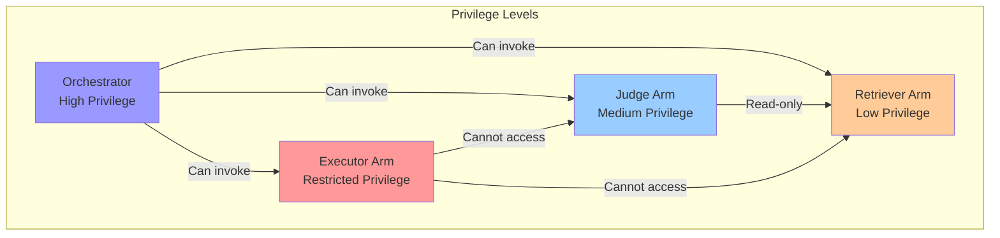
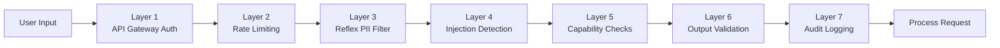
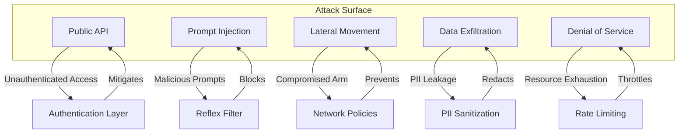
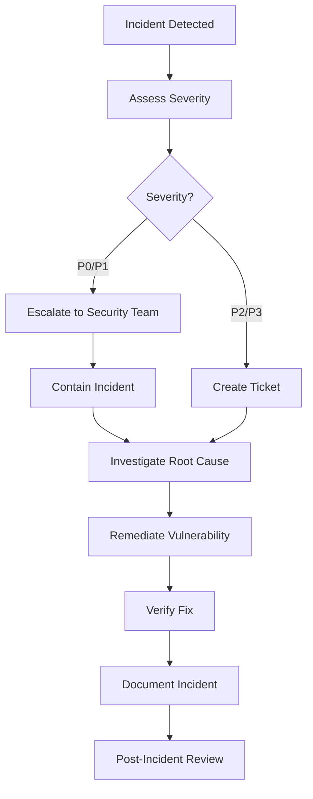

# OctoLLM Security Architecture Overview

**Version**: 1.0
**Last Updated**: 2025-11-10
**Classification**: Internal Use

## Table of Contents

- [Executive Summary](#executive-summary)
- [Security Principles](#security-principles)
- [Threat Model](#threat-model)
- [Defense Layers](#defense-layers)
- [Security Controls](#security-controls)
- [Compliance](#compliance)

## Executive Summary

OctoLLM implements defense-in-depth security through capability-based isolation, PII protection, adversarial hardening, and comprehensive audit logging. The architecture treats security as a first-class concern, with multiple overlapping protection layers preventing unauthorized access, data leakage, and system compromise.

### Security Posture

- **Capability-Based Access Control**: Arms operate with minimal necessary privileges
- **Network Segmentation**: Components isolated in separate network zones
- **Data Protection**: PII detection and sanitization at all boundaries
- **Adversarial Testing**: Continuous red-team validation
- **Audit Logging**: Complete provenance for all actions
- **Encryption**: TLS for all network communication, at-rest encryption for sensitive data

## Security Principles

### 1. Principle of Least Privilege

**Every component operates with the minimum permissions required for its function.**



**Implementation**:
- Executor arm: Allowlisted commands only, no network access to internal services
- Retriever arm: Read-only access to knowledge bases
- Judge arm: No external network access
- Orchestrator: Full coordination privileges, but no direct tool execution

### 2. Defense in Depth

**Multiple independent security layers protect critical assets.**



**Layers**:
1. **API Gateway**: Authentication, TLS termination
2. **Rate Limiting**: Prevent abuse
3. **PII Detection**: Sanitize sensitive data
4. **Injection Detection**: Block adversarial inputs
5. **Capability Isolation**: Enforce privilege boundaries
6. **Output Validation**: Prevent data leakage
7. **Audit Logging**: Complete traceability

### 3. Zero Trust Architecture

**Never trust, always verify - even internal components.**

- All inter-component communication requires authentication
- No implicit trust between arms
- Orchestrator validates all arm responses
- Cryptographic signatures on critical artifacts

## Threat Model

### Threat Actors

#### External Attackers

**Motivation**: Data theft, service disruption, unauthorized access

**Capabilities**:
- Network-level attacks (DDoS, port scanning)
- Application-level attacks (injection, XSS)
- Social engineering

**Mitigations**:
- WAF (Web Application Firewall)
- Rate limiting
- Input validation
- Security monitoring

#### Malicious Insiders

**Motivation**: Data exfiltration, privilege escalation

**Capabilities**:
- Legitimate API access
- Knowledge of system internals
- Potential access to credentials

**Mitigations**:
- Capability isolation
- Comprehensive audit logging
- Anomaly detection
- Regular access reviews

#### Compromised Arms

**Motivation**: Lateral movement, privilege escalation

**Capabilities**:
- Full control of compromised component
- Ability to manipulate outputs
- Potential network access

**Mitigations**:
- Network segmentation
- Capability tokens
- Output validation
- Anomaly detection

### Attack Vectors



## Defense Layers

### Layer 1: Network Perimeter

```yaml
# Kubernetes NetworkPolicy
apiVersion: networking.k8s.io/v1
kind: NetworkPolicy
metadata:
  name: default-deny-all
  namespace: octollm
spec:
  podSelector: {}
  policyTypes:
    - Ingress
    - Egress
  # Deny all by default
```

**Controls**:
- Default deny all traffic
- Explicit allow rules only
- Separate zones: Public, DMZ, Application, Data
- TLS for all inter-zone communication

### Layer 2: Application Authentication

```python
from fastapi import Security, HTTPException
from fastapi.security import HTTPBearer, HTTPAuthorizationCredentials

security = HTTPBearer()

async def verify_token(credentials: HTTPAuthorizationCredentials = Security(security)):
    """Verify JWT token."""
    token = credentials.credentials

    try:
        payload = jwt.decode(token, SECRET_KEY, algorithms=["HS256"])
        user_id = payload.get("sub")

        if not user_id:
            raise HTTPException(status_code=401, detail="Invalid token")

        return user_id

    except jwt.JWTError:
        raise HTTPException(status_code=401, detail="Invalid token")
```

**Controls**:
- JWT tokens with short expiration (1 hour)
- Refresh tokens (7 days)
- Token revocation list
- API key authentication for service-to-service

### Layer 3: Reflex Layer Security

```rust
impl ReflexProcessor {
    fn detect_threats(&self, input: &str) -> Vec<ThreatIndicator> {
        let mut threats = Vec::new();

        // 1. Prompt injection
        if self.detect_injection(input).is_some() {
            threats.push(ThreatIndicator::PromptInjection);
        }

        // 2. PII leakage
        if self.contains_pii(input) {
            threats.push(ThreatIndicator::PIIDetected);
        }

        // 3. Malicious patterns
        if self.detect_malicious_patterns(input) {
            threats.push(ThreatIndicator::MaliciousPattern);
        }

        // 4. Excessive size
        if input.len() > MAX_INPUT_SIZE {
            threats.push(ThreatIndicator::ExcessiveSize);
        }

        threats
    }
}
```

**Controls**:
- Regex-based injection detection
- ML-based anomaly detection
- PII pattern matching
- Input size limits

### Layer 4: Capability-Based Isolation

```python
class CapabilityToken:
    """Time-limited, non-transferable capability."""

    def __init__(
        self,
        arm_id: str,
        capabilities: List[str],
        valid_until: datetime,
        nonce: str
    ):
        self.arm_id = arm_id
        self.capabilities = capabilities
        self.valid_until = valid_until
        self.nonce = nonce
        self.signature = self._sign()

    def _sign(self) -> str:
        """Cryptographically sign token."""
        message = f"{self.arm_id}:{','.join(self.capabilities)}:{self.valid_until}:{self.nonce}"
        return hmac.new(SECRET_KEY, message.encode(), hashlib.sha256).hexdigest()

    def verify(self) -> bool:
        """Verify token validity."""
        # Check expiration
        if datetime.utcnow() > self.valid_until:
            return False

        # Verify signature
        expected_sig = self._sign()
        return hmac.compare_digest(self.signature, expected_sig)
```

**Capabilities per Arm**:

| Arm | Capabilities | Restrictions |
|-----|-------------|--------------|
| Executor | `shell:read`, `http:get` | Allowlist commands, specific hosts only |
| Coder | `code:generate`, `code:analyze` | No file write, no command execution |
| Retriever | `db:read`, `vector:search` | Read-only, rate limited |
| Judge | `validate`, `fact_check` | No external network |
| Guardian | `pii:detect`, `safety:check` | All inputs, minimal latency |

### Layer 5: Data Protection

#### PII Detection

```python
class PIIDetector:
    """Detect and sanitize PII."""

    PATTERNS = {
        "ssn": r"\b\d{3}-\d{2}-\d{4}\b",
        "credit_card": r"\b\d{4}[-\s]?\d{4}[-\s]?\d{4}[-\s]?\d{4}\b",
        "email": r"\b[A-Za-z0-9._%+-]+@[A-Za-z0-9.-]+\.[A-Z|a-z]{2,}\b",
        "phone": r"\b\+?1?\s*\(?[0-9]{3}\)?[-.\s]?[0-9]{3}[-.\s]?[0-9]{4}\b",
        "ip_address": r"\b(?:[0-9]{1,3}\.){3}[0-9]{1,3}\b",
    }

    def detect(self, text: str) -> List[PIIMatch]:
        """Detect PII in text."""
        matches = []

        for pii_type, pattern in self.PATTERNS.items():
            for match in re.finditer(pattern, text):
                matches.append(PIIMatch(
                    type=pii_type,
                    value=match.group(),
                    start=match.start(),
                    end=match.end()
                ))

        return matches

    def sanitize(self, text: str, method="redact") -> str:
        """Sanitize PII."""
        matches = self.detect(text)

        if method == "redact":
            # Replace with placeholder
            for match in sorted(matches, key=lambda m: m.start, reverse=True):
                text = text[:match.start] + f"[{match.type.upper()}-REDACTED]" + text[match.end:]

        elif method == "encrypt":
            # Encrypt PII values
            for match in sorted(matches, key=lambda m: m.start, reverse=True):
                encrypted = encrypt_pii(match.value)
                text = text[:match.start] + encrypted + text[match.end:]

        return text
```

#### Data Classification

| Classification | Storage | Transit | Processing | Retention |
|---------------|---------|---------|------------|-----------|
| **Public** | Unencrypted | TLS | No restrictions | Unlimited |
| **Internal** | Encrypted at rest | TLS | Audit logged | 90 days |
| **Confidential** | Encrypted + access control | TLS 1.3 | Audit + approval | 30 days |
| **Secret** | HSM/Vault | TLS 1.3 + mutual auth | Encrypted processing | 7 days |

### Layer 6: Output Validation

```python
class OutputValidator:
    """Validate arm outputs before returning to user."""

    def validate(self, output: Dict[str, Any], task: TaskContract) -> ValidationResult:
        """Multi-stage validation."""

        # 1. Schema validation
        if not self._validate_schema(output):
            return ValidationResult(valid=False, reason="Invalid schema")

        # 2. PII check
        if self._contains_pii(output):
            return ValidationResult(valid=False, reason="PII detected in output")

        # 3. Injection check
        if self._contains_injection(output):
            return ValidationResult(valid=False, reason="Potential injection in output")

        # 4. Acceptance criteria
        if not self._meets_criteria(output, task.acceptance_criteria):
            return ValidationResult(valid=False, reason="Acceptance criteria not met")

        # 5. Hallucination check
        confidence = self._check_hallucination(output)
        if confidence < 0.7:
            return ValidationResult(valid=False, reason="Low confidence, possible hallucination")

        return ValidationResult(valid=True)
```

### Layer 7: Audit Logging

```python
import structlog

logger = structlog.get_logger()

class AuditLogger:
    """Comprehensive audit trail."""

    def log_action(
        self,
        action_type: str,
        actor: str,
        resource: str,
        result: str,
        metadata: Dict[str, Any]
    ):
        """Log security-relevant action."""

        logger.info(
            "security.audit",
            action_type=action_type,
            actor=actor,
            resource=resource,
            result=result,
            timestamp=datetime.utcnow().isoformat(),
            trace_id=get_trace_id(),
            **metadata
        )

        # Also write to tamper-proof audit store
        self._write_to_audit_store({
            "action_type": action_type,
            "actor": actor,
            "resource": resource,
            "result": result,
            "timestamp": datetime.utcnow(),
            "metadata": metadata
        })

# Usage
audit = AuditLogger()

audit.log_action(
    action_type="task.execute",
    actor="user-123",
    resource="task-abc",
    result="success",
    metadata={
        "task_type": "code_generation",
        "duration_ms": 2500,
        "tokens_used": 350
    }
)
```

**Audit Events**:
- Authentication attempts (success/failure)
- Task submissions and completions
- Arm invocations
- Capability grant/revoke
- Data access (read/write)
- Configuration changes
- Security policy violations

## Security Controls

### Authentication

| Method | Use Case | Strength | Limitations |
|--------|----------|----------|-------------|
| JWT | User API access | High | Requires secure storage |
| API Key | Service-to-service | Medium | No user context |
| Mutual TLS | Internal components | Very High | Complex setup |
| OIDC/OAuth2 | Enterprise SSO | High | External dependency |

### Authorization

```python
from enum import Enum

class Permission(str, Enum):
    TASK_SUBMIT = "task:submit"
    TASK_READ = "task:read"
    TASK_CANCEL = "task:cancel"
    ARM_INVOKE = "arm:invoke"
    CONFIG_READ = "config:read"
    CONFIG_WRITE = "config:write"
    ADMIN = "admin:*"

class Role:
    USER = [
        Permission.TASK_SUBMIT,
        Permission.TASK_READ,
        Permission.TASK_CANCEL
    ]

    OPERATOR = USER + [
        Permission.CONFIG_READ
    ]

    ADMIN = OPERATOR + [
        Permission.ARM_INVOKE,
        Permission.CONFIG_WRITE,
        Permission.ADMIN
    ]
```

### Encryption

**In Transit**:
- TLS 1.3 minimum
- Strong cipher suites only (AES-256-GCM)
- Perfect forward secrecy (ECDHE)
- Mutual TLS for internal services

**At Rest**:
- AES-256 encryption for PostgreSQL
- Redis encryption via disk encryption
- Secrets in HashiCorp Vault or Kubernetes Secrets

### Secrets Management

```yaml
# Kubernetes Secret (encrypted at rest)
apiVersion: v1
kind: Secret
metadata:
  name: llm-api-keys
  namespace: octollm
type: Opaque
data:
  openai-key: <base64-encoded-key>
  anthropic-key: <base64-encoded-key>
```

**Best Practices**:
- Never commit secrets to version control
- Rotate secrets every 90 days
- Use separate secrets per environment
- Audit secret access
- Use workload identity when possible

## Compliance

### SOC 2 Type II

**Required Controls**:
- [x] Access control and authentication
- [x] Encryption in transit and at rest
- [x] Audit logging (immutable)
- [x] Change management process
- [x] Incident response plan
- [x] Backup and recovery procedures
- [x] Security monitoring and alerting

### ISO 27001

**Information Security Management**:
- Risk assessment (quarterly)
- Security policies and procedures
- Access control policy
- Cryptography policy
- Incident management
- Business continuity plan

### GDPR Compliance

**Data Protection Measures**:
- PII detection and redaction
- Data minimization (30-day retention)
- Right to erasure (delete API)
- Data portability (export API)
- Consent management
- Data breach notification (< 72 hours)

### HIPAA (if applicable)

**Protected Health Information**:
- Additional PII patterns for PHI
- Access controls and audit logs
- Encryption requirements
- Business associate agreements

## Incident Response

### Severity Levels

| Level | Description | Response Time | Examples |
|-------|-------------|---------------|----------|
| P0 - Critical | Data breach, system compromise | < 15 min | PII leaked, unauthorized access |
| P1 - High | Service disruption, vulnerability | < 1 hour | DDoS attack, injection bypass |
| P2 - Medium | Degraded service, minor vulnerability | < 4 hours | Performance issues, config error |
| P3 - Low | Minor issues, questions | < 24 hours | Documentation, feature request |

### Incident Response Plan



## Security Testing

### Penetration Testing

**Frequency**: Quarterly

**Scope**:
- External API endpoints
- Authentication/authorization
- Injection attacks
- Privilege escalation
- Data leakage

**Tools**:
- OWASP ZAP
- Burp Suite
- Nuclei
- Custom scripts

### Vulnerability Scanning

**Frequency**: Weekly

**Tools**:
- Snyk (dependency scanning)
- Trivy (container scanning)
- SonarQube (static analysis)
- Bandit (Python security linter)

## See Also

- [Threat Model](./threat-model.md)
- [Capability Isolation](./capability-isolation.md)
- [PII Protection](./pii-protection.md)
- [Security Testing](./security-testing.md)
- [Compliance Guide](./compliance.md)
- [Incident Response Runbook](./incident-response.md)
